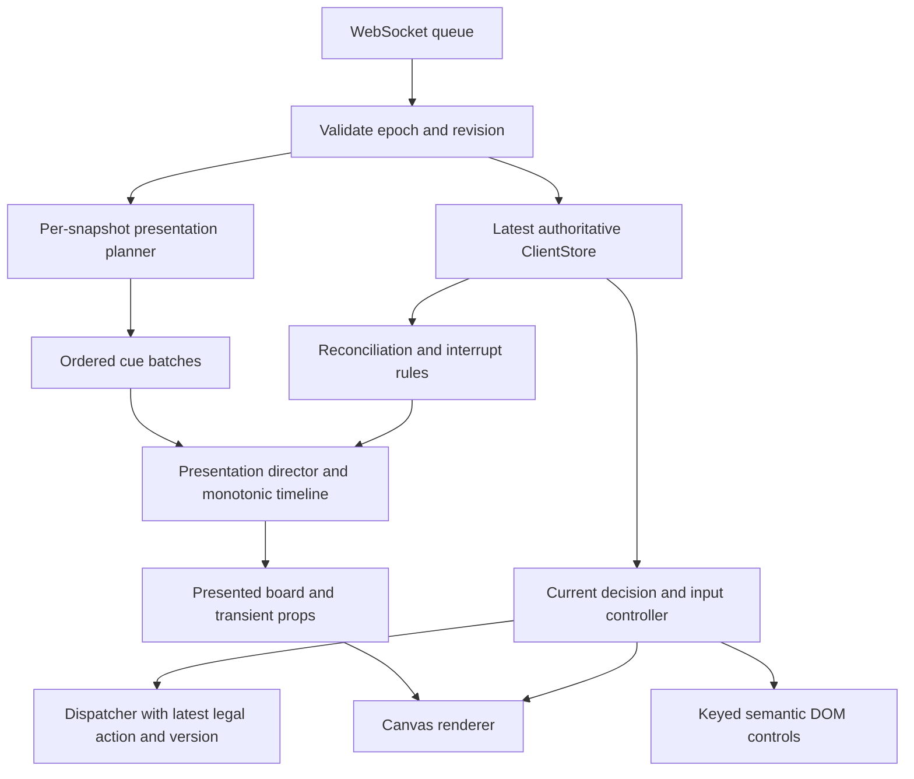

# Insidia — Premium card-game UX and motion specification

**Status:** Adopted for client implementation on 4 September 2026. See [implementation and QA record](premium-card-game-ux-implementation.md) for delivered behavior, verification, and remaining measured acceptance work. Server gameplay rules and protocol v1 remain unchanged.

**Reviewed:** 4 September 2026, repository commit `6dc5372`.

**Scope:** Interface, interaction, visual feedback, animation, pacing, accessibility, and the client architecture needed to support them. Sound design, music, and audio implementation are excluded.

## 1. Recommendation

Build a presentation layer between the server projection and the board renderer. Pair it with a more readable table layout and a unified interaction controller. This is the highest-value route to a premium feel: players should see who initiated an action, who must respond, what changed, and why.

Insidia already has distinctive gothic artwork, a coherent palette, and a working rules engine. Preserve that identity. Use the physical clarity and responsiveness of Hearthstone and MTG Arena as references, while putting Insidia's dramatic emphasis on **declaration → suspicion → challenge → revelation → consequence**.

The core product rules are:

1. Every input receives immediate visual acknowledgment.
2. Consequences follow their causes in a readable spatial sequence.
3. A live decision always takes priority over decorative animation.
4. Motion never implies knowledge that the viewer is not entitled to have.
5. Routine actions are quick; significant public revelations receive emphasis.
6. The board remains understandable with motion reduced and sound absent.

All numeric timings below are **proposed Insidia targets**, to be tuned in playtests. They are not measurements of Hearthstone or Arena.

## 2. Implementation assessment

### 2.1 What is worth keeping

- The server owns rules, random choices, legal actions, deadlines, and outcomes.
- The client receives a personalized hand and sanitized public information.
- A single long-lived Theseus game owns networking and rendering.
- Player seats preserve clockwise order and rotate around the local viewer.
- Sin and Conspiracy artwork has distinct, correctly preserved aspect ratios.
- Ordered card selection, explicit confirmation, illustrated reveal fallback, and equivalent DOM buttons already exist.
- A revealed Conspiracy stays visible for at least 1.5 seconds and while its resolution remains active.
- Sound is already disabled in `public/games/insidia/main.js:5`.

### 2.2 Gaps and their practical effect

Client source locations below are relative to `public/games/insidia/`; paths beginning with `server/` are relative to the repository root. Line numbers identify the reviewed implementation.

| Priority | Current implementation | UX consequence | Required response |
|---|---|---|---|
| P0 | `state/client-store.js:23–34` replaces the projection; `game/insidia-game.js:41–46` drains all queued snapshots before drawing. | An action can resolve through several meaningful states without any of them being visible. | Ingest every accepted projection into an independent presentation director. |
| P0 | `ui/board-renderer.js:362–405` finds only the latest Conspiracy reveal and gives it a timed hold. | There is no general sequencing, interruption, or movement system; rapid reveals can replace each other. | A deduplicated cue queue with causal ordering and reconciliation. |
| P0 | `server/domain/engine.ts:46–69,219–267` retains 60 summary effects, but drawing, refill, cleanup movements, and turn advancement are not complete movement events. | Snapshot differences cannot reconstruct every physical card trajectory. | Use semantic, anonymous animation where identity is unavailable; never infer missing hidden transitions. |
| P0 | `ui/board-renderer.js:1100–1118` recreates semantic controls on store changes. | Routine updates can lose keyboard focus; selected/disabled states are poorly exposed. | Keyed DOM controls sharing the visual interaction model. |
| P0 | Fixed 1600×900 layout, 3840×2160 backing canvas, and viewport fitting in `resolution.js:1–23`. | At 844×390, a 46-unit button becomes about 20 CSS pixels tall; 11-unit text becomes about 4.8 pixels. | Responsive composition and minimum CSS-pixel sizes. |
| P1 | Transparent DOM buttons intercept pointers (`style.css:148–158`) while canvas input owns pointer movement; overlays only forward clicks. | Static inspection indicates a risk of stale hover and inconsistent pointer/keyboard feedback. This needs a dedicated browser regression check. | One pointer/focus/selection state controller. |
| P1 | Declaration uses two shaded modal screens; player selection uses a separate name list (`ui/board-renderer.js:904–1022`). | The player loses table context during the most important decisions. | Anchored declaration tray, direct seat targeting, contextual confirmation. |
| P1 | Hand-card clicks either inspect or select (`ui/board-renderer.js:690–722`). | Inspection is unavailable through that gesture during prompts; cards feel static. | Independent inspection and selection affordances. |
| P1 | Status and countdown are small text; public consequences primarily enter an eight-entry log (`ui/board-renderer.js:603–667`). | It is easy to miss who must act, what was paid, or why a card was exposed. | Persistent decision lane, visible responder handoff, source-to-destination feedback. |
| P1 | Four-player seat placement can overlap the history column (`ui/board-renderer.js:550–555,603–614`). | Added effects would amplify an existing layout collision. | Reserved zones and separate 3/4/5/6-seat layout fixtures. |
| P1 | Disconnect clears `view` and routes back to the home scene (`client-store.js:50–53`, `insidia-game.js:66–82`). | A transient network problem feels like leaving the match. | A frozen public table under a reconnect overlay, with commits disabled. |
| P2 | Results immediately cover the board (`ui/board-renderer.js:1025–1082`); the canvas repaints at fixed 4K/60Hz. | The decisive action lacks closure, and adding VFX may become expensive. | Outcome choreography, board inspection after results, rendering budgets. |

### 2.3 Review evidence and limits

Reviewed the client, command dispatcher, WebSocket flow, projection, rules engine, timers, existing specification, and tests. Exercised a fresh local in-memory table with one human and two bots: home, lobby, match entry, declaration picker/confirmation, response states, Envidia's expanded hand, ordered selection, and turn handoff.

`npm test` passed: **56 project tests and 43 upstream tests**. Existing tests establish rules and selected renderer behavior; they do not measure animation quality, frame pacing, or complete accessibility. Compact-device dimensions and the four-seat collision above are derived from the code, not claims of a completed device usability study.

## 3. Visual hierarchy and table layout

### 3.1 A table with persistent places

Keep a restrained, material table: dark textured surface, warm gold for active affordances, legible light text, and existing Sin colors as secondary accents. Use shallow shadows and small elevations to distinguish resting, hovered, selected, and moving cards. Do not add constant camera movement, animated flames, or particle noise around ordinary decisions.

Reserve these regions before placing seats:

| Region | Contents and behavior |
|---|---|
| Top utility strip | Match identity, turn number, connection state, rules, motion settings. Low visual priority. |
| Seat ring | Opponents in immutable clockwise order. Name, Souls, hand count, exposed Sins, active/responder labels. Elimination does not reorder seats. |
| Central resolution stage | Current claim, public proof, Conspiracy, effect connections. Large emphasis briefly; compact persistent context while decisions remain. |
| Resource anchors | Sin deck, Conspiracy deck, bank. Keep totals visible during reveals; these are stable movement origins/destinations. |
| Decision lane | Actor, action, relevant target, current responder, instruction, timer, and contextual action buttons. It remains readable during effects and inspection. |
| Local hand | Bottom center, usually two cards, expanding to four without overlapping controls. Own exposures are separate public cards. |
| History drawer | Compact latest outcome by default; expandable public history with inspectable reveals. Never underneath a seat. |

Use real public card thumbnails for exposed Sins instead of only name badges. Pair each with its owner and exposure count. At two exposures, show “Eliminación pendiente” until the server's cleanup actually eliminates the player.

### 3.2 Responsive requirements

Desktop remains the primary presentation. Support compact landscape as a deliberate layout, not a scaled desktop screenshot.

- **Wide landscape:** approximately 1200+ CSS pixels wide with sufficient height. Full seat ring, optional open history, side action area.
- **Compact landscape:** below that width or below 650 CSS pixels high. Collapse history, compact seat panels, move actions into a fixed bottom/side rail, and let inspection open a readable sheet.
- **Portrait:** retain the existing rotate guidance for the table. Home, lobby, reconnect information, and settings remain usable; show connection state during the orientation prompt. Full portrait gameplay is a later feature.
- Critical text is at least 14 CSS pixels; instructions and controls target 16 pixels. Supporting labels are at least 12 pixels. Tiny artwork decoration is not the only source of any rule or resource information.
- Primary touch controls target at least 44×44 CSS pixels, with at least 8 pixels between neighboring hit regions. Enlarge card hit areas without covering another selectable object.
- Layout respects safe-area insets. Test 3–6 seats, long Spanish names, a four-card hand, public exposures, active Conspiracy, and open inspection together.

Changing responsive composition or adaptive backing resolution requires an explicit amendment to the original specification's §18.3 fixed-layout/rendering requirement. Preserve uniform pointer mapping and aspect ratios; do not simply CSS-transform the existing canvas.

## 4. Interaction contract

### 4.1 Shared states

Every interactive object uses the same states across mouse, touch, and keyboard: `idle`, `hovered/focused`, `pressed`, `selected`, `pending`, `disabled`, and `invalid`. A controller owns those states; renderers and semantic DOM controls consume them.

- Pointer-down shows a small compression or border response immediately; activation happens once on the completed gesture.
- Hover/focus lifts a card slightly and strengthens its edge/shadow. No spring oscillation on every pointer movement.
- Selection persists visibly and exposes its state to assistive technology.
- Disabled actions explain their public reason, such as “Necesitas 8 almas.” They remain inspectable without pretending to be actionable.
- Pending commands show “Enviando…” on the action just committed. The existing one-command-in-flight rule remains; read-only inspection remains available.
- Decorative sprites never capture pointer events. A moving, selectable object and its hit region share the same layout/transform; a departing card becomes noninteractive immediately.

### 4.2 Hand inspection and manipulation

Use a shallow hand arrangement: two cards may sit nearly straight; three/four cards spread slightly. Preserve card order unless the server changes the hand. Inspection should reveal the full art, title, cost, and rule text without covering the current timer or response buttons.

| Input | Inspect | Select during a prompt | Commit |
|---|---|---|---|
| Mouse | Hover for 250 ms; click an explicit inspect affordance to pin | Click card body | Contextual confirm button |
| Touch | Tap a visible inspect affordance; optional 350 ms long-press | Tap card body | Contextual confirm button |
| Keyboard | Focus card, then explicit inspect action | Space/Enter on selection control | Focus and activate confirm |

Inspection remains available during every card-choice prompt. Escape closes inspection or cancels an uncommitted selection mode; it never submits a pass. Opening rules does not stop the server clock; retain a visible current-decision/timer strip. While a local decision is active, use a nonmodal rules/inspection drawer so its controls remain usable. If a new local decision arrives while a modal is open, suspend that modal, retain its reading position, and deliberately focus the new decision; resume reading only at the user's request.

Optional drag is a later convenience for moving selected cards into return slots. Start after an 8 CSS-pixel movement threshold, show a valid destination, and snap back on cancellation in 160 ms. A drop stages the choice; the explicit confirm button commits it. Always provide tap and keyboard equivalents.

### 4.3 Declaring a Sin

“Pecar” declares a Sin type; it does not consume or play a hand card. All affordable Sins must remain equally available whether or not they are held. No truthful/bluff badge, distinct timing, different animation origin, or public hand-card highlight is allowed.

Replace the two-modal flow with one anchored declaration tray:

1. Open the eight-Sin reference tray with costs and affordable states.
2. Selecting a Sin shows its description and counter conditions in the same tray.
3. One clear button commits: “Declarar Rabia · 4 almas.” Back/Escape cancels before submission.
4. Immediate pending feedback appears locally.
5. After authoritative acceptance, a **claim emblem/reference illustration** moves from the actor's seat to the resolution stage, labeled “Declara Rabia.” No card leaves the actor's hand.

Do not ask for Rabia, Avaricia, or Lujuria targets during declaration. The rules open those choices only after the challenge sequence succeeds.

### 4.4 Targeting, payment, and private choices

- SelectPlayer prompts directly highlight eligible seats. Selecting one previews a connection and an explicit consequence, then enables confirmation. Escape cancels the local preview. A keyboard-accessible target list mirrors the same selection.
- Force discard previews “Pagar 8 almas · [name] revela un pecado al azar.” Never let the user select the random card.
- Envidia uses two numbered return slots. “1” goes above “2” at the bottom of the deck. Support replacing/reordering choices and show the complete order before confirmation.
- Lujuria labels the two decisions distinctly: “Entregar” and “Devolver.” The newly received card is a legal return if the server includes it. Reset local choices on prompt identity change.
- Indigencia shows the two consequences side by side. Present only the server-authorized choice flow; if the choice is forced, explain the result without inventing a decision.
- Herejía previews left/right using arrows between the actual neighboring active seats in the viewer-relative layout. The stored seat direction, not screen-left alone, determines recipients.
- A submitted Herejía choice reads “Tu elección está sellada.” Show no other player's submission indicator, count, order, or timing.

## 5. Timing and motion system

### 5.1 Motion tokens

Use shared tokens rather than durations scattered through render code. Durations use a monotonic clock and remain independent of frame rate and server clock correction.

| Token / event | Proposed duration | Treatment |
|---|---:|---|
| Input acknowledgment | Next frame; ≤50 ms p95 on reference hardware | Press, selection, or pending visual. No network wait. |
| Button hover/focus | 80–120 ms | Color/edge/elevation. |
| Card lift/settle | 140–180 ms | ≤12 CSS-pixel lift; scale ≤1.04. |
| Inspector entrance | 160 ms after 250 ms hover dwell | Small fade/translation; immediate via explicit input. |
| Tray/panel transition | 180–220 ms | Short fade and limited translation. |
| Card/token travel | 280–420 ms | Clear source and destination; restrained arc. |
| Consecutive deal stagger | 60–80 ms | Overlap journeys, do not multiply full travel duration. |
| Resource impact/value update | 120–180 ms | One arrival highlight and signed delta. |
| Claim arrival | 240 ms | Claim emblem plus persistent title. |
| Pass/responder handoff | 120–180 ms | Seat marker and compact “Pasa.” |
| Public flip/proof | 300 ms | Anonymous back → permitted public face. |
| Proof/exposure readable emphasis | 700–1000 ms | Nonblocking; public history remains inspectable. |
| Conspiracy reveal | 350 ms entrance; ≥1500 ms readable visibility in normal foreground play | Then compact if still resolving; interruption/overload rules in §6.3 apply. |
| Ordinary action sequence | 450–800 ms total | Overlap independent travel and counters. |
| Complex shuffle/rotation/cleanup | 800–1200 ms total | Group players on shared beats. |
| Elimination group | 700–1000 ms | Public exposures settle; seats become inactive together. |
| Result emphasis | 1200–1800 ms | Decisive consequence, outcome title, then result panel. Skippable. |

Use cubic ease-out for arrivals (`0.16, 1, 0.3, 1`), ease-in for departures (`0.4, 0, 1, 1`), and ease-in-out for travel (`0.4, 0, 0.2, 1`). Timers remain linear. Reserve a single restrained overshoot for a major reveal; routine controls should settle without wobble.

### 5.2 Causal structure

A typical action follows **acknowledge → establish cause → travel/reveal → consequence → settle**. Independent consequences may overlap. Dependent consequences cannot overtake their source.

Example: taking two Souls after the authoritative result arrives:

```mermaid
sequenceDiagram
    participant P as Player
    participant I as Input and current authority
    participant V as Presentation
    P->>I: Take Souls
    I-->>P: Pending feedback within 50 ms
    Note over I: Wait for server result; do not invent balances
    I->>V: Accepted snapshot plus soulsGained amount
    V->>V: Establish bank as source, 0–100 ms
    V->>V: Travel and arrival, 100–450 ms
    V->>V: Update shown values, signed delta, settle by 650 ms
    Note over I,V: If a current decision needs these values, reconcile immediately
```

Numeric totals change at the corresponding impact beat when safely presenting a short historical transition. Show a labeled signed delta; do not count through invented fractional Souls. If the next live decision already depends on the new total, display the current total immediately and animate only a ghost trail/delta.

### 5.3 Decision clocks and presentation backlog

Current defaults are **60 s for a turn, 15 s per challenge/counter responder, and 30 s for ordinary/Herejía choices** (`server/domain/model.ts:225–237`). Retain these in the initial UX release. No client animation starts, pauses, resets, or extends an authoritative deadline.

1. Ingest a new local decision immediately. Its actor, prompt, legal choices, relevant card faces and resource totals must be current before accepting input. Target ≤100 ms p95 from accepted projection to usable decision UI.
2. This decision fast path skips/compresses prior blocking motion; it does not wait for a long reveal. Keep the cause as a compact nonblocking claim/reveal label.
3. Normal spectator presentation should trail the latest received projection by no more than about 1000 ms. This budget includes queued work, not just the current animation. Nonblocking readable holds may last longer.
4. Above that backlog, merge routine passes and repeated resource trails. Preserve the ordered public outcomes in history. Above 2000 ms, or after a detected history gap, reconcile directly and show a concise “Mesa actualizada” cue.
5. Below 5 seconds remaining, suppress nonessential travel, lift, and result-like emphasis near the decision area. At 10 seconds use a labeled urgency color; at 5 seconds use a stable high-contrast timer. No continuous flashing.
6. At displayed zero, show “Resolviendo…” and prevent fresh commits while awaiting the server result. The client does not choose a timeout outcome. Late accepted/rejected receipts reconcile normally.
7. A new interaction ID gets its own deadline. Repeated snapshots for the same interaction never restart the countdown or entrance animation.
8. Initial match dealing is skippable and subject to the same fast path if the local player begins. Do not consume several seconds of the first turn for an opening cinematic.

For clock display, accept samples only from validated, current messages. Anchor countdown progression to monotonic time; use a short bounded correction for small offset changes. A material correction should update accurately and visibly rather than inventing time. Animation timing uses `performance.now()` exclusively. Consider a lightweight protocol clock probe for measured latency compensation later; the present single arrival-time offset is approximate.

Bots currently wait a random 400–1200 ms per decision. First make presentation tolerate that existing cadence. Do not wait for browser animation acknowledgments. If playtests still show unreadable bot chains, introduce a versioned bot-pacing policy for new matches: approximately 700–1100 ms for top-level actions and 450–750 ms for responses, with delays independent of hidden truth. This is a subsequent measured adjustment, not a prerequisite or a change to existing matches.

## 6. Gameplay choreography

These are visual sequences over accepted server outcomes. A sequence must never manufacture a new game phase. The decision fast path in §5.3 overrides decorative timing in every row.

### 6.1 Core actions, challenges, and cleanup

| Event | Required presentation | Key constraint |
|---|---|---|
| Match start | Table arrives, seat names establish clockwise order, anonymous cards deal, own hand becomes readable, first actor marker appears. Total decorative setup target 1200 ms. | First decision is usable immediately; no opponent faces. |
| Take Souls | Bank highlights, up to two tokens travel to actor, actual amount appears as `+N`, balances settle. | Use emitted amount, including 0/1 when the bank is short. Button says “hasta 2” or the current available amount. |
| Force random discard | Confirm target/cost, then accepted payment travels to bank; one anonymous card at target reveals the authoritative Sin into its exposure area. | No cursor-selectable random card and no fake shuffle revealing which card was chosen. |
| Declare Sin | Actor emits a claim emblem with Sin name and cost; decision lane shows who responds next. | Identical appearance for truthful and false claims. |
| Pass challenge | Compact pass marker, response focus travels clockwise; declaration remains visible. | Only the current server responder gets controls. No automatic pass-all feature in this scope. |
| Challenge submitted | Challenger-to-claim connection, restrained emphasis, “Desafío” label. | Outcome remains unknown until authoritative proof/exposure arrives. |
| Truthful challenge | Public proof appears; challenger penalty is shown; accepted cost/effect follows. Keep “Demostrado” visible in the outcome record. | Proof is a temporary public prop if no live `resolvingSin` exists; do not invent a persistent card instance. |
| Bluff caught | Actor's authoritative random exposure appears, claim breaks/fades, “Declaración falsa · efecto cancelado.” | Actor pays no base cost; claimed effect is never previewed as successful. |
| Counter opportunity | Claim, target if any, current payer, and block price share one lane. Public seats show response order. | Ineligible players are skipped without empty pauses. |
| Counter accepted | Payment reaches bank, a visible block interrupts the claim/effect connection, “Bloqueado.” | Both already-paid costs remain spent; no refund animation. |
| Cleanup | Qualifying eliminations happen as a group; public exposures move to center, anonymous hands return, Souls return, survivors refill, actor advances. | Do not create an intermediate winner or preserve hidden identities through the shuffle. |
| Finished | Complete the decisive visible consequence, announce winner/draw/reason, then result panel. | Reconnect to a finished match shows the result directly. An abandoned game freezes; never finish its unresolved effect cosmetically. |

Challenge examples, excluding time spent making decisions:

- **Truthful Gula:** 0–150 ms establish challenge → 150–450 ms proof → 450–750 ms challenger exposure → 650–1050 ms Soul gain and anonymous cleanup overlap → settle by 1200 ms. If the next human decision is already live, show current board/controls within 100 ms and retain proof, penalty, and gain as compact outcome context.
- **Caught bluff:** 0–150 ms establish challenge → 150–450 ms actor's exposure → 450–750 ms claim cancellation → cleanup by 1000 ms. An exposure is a public face; an unexposed returned hand remains backs.
- **Several rapid passes:** show a short ordered progression of seat markers, then the current responder. Do not queue five separate large banners.

### 6.2 Sin-specific requirements

| Sin | Presentation and decision sequence |
|---|---|
| **Orgullo** | After the claim survives the challenge step, pay 9; establish a restrained crown/claim focus and explicit “Victoria si nadie bloquea.” Each eligible counter costs 8. Unblocked outcome receives the strongest result emphasis. A blocked claim settles with both payments retained. |
| **Rabia** | After the claim survives the challenge step, pay 4 → actor selects target → offer 3-Soul counters → if unblocked, target selects a hand card → expose it. Do not visually remove a card before the target's choice. |
| **Gula** | Up to three Soul tokens move bank→actor. Use actual transferred amount and one concise impact. |
| **Envidia** | Two anonymous draws arrive; reveal only the viewer's authorized new hand. Bring the expanded hand and two numbered return slots into focus. Confirm order → send two backs to deck bottom → settle. Other viewers see an exchange gesture and public count, never faces/order. |
| **Avaricia** | Actor selects another seat; accepted transfer travels target→actor with paired `−N` and `+N`. No bank detour. Source shortage uses actual amount. |
| **Vanidad** | Keep a compact “Vanidad” parent label while the Conspiracy occupies the resolution stage. Show no 1-Soul entry charge. After its complete resolution, return its prop and conclude the parent action once. |
| **Lujuria** | Target selection → target's private gift decision → anonymous travel → actor's current hand and return decision → anonymous return travel. Clearly distinguish who is choosing. The received card may be returned. |
| **Pereza** | Offer 2-Soul counters. If unblocked, collect all active hands in parallel as backs, shuffle anonymously, refill in overlapping paths. A proven held-out Pereza stays separate until its permitted return. Never expose trajectories that link pre-shuffle and post-shuffle cards. |

### 6.3 Conspiracy-specific requirements

Each Conspiracy uses the illustrated landscape card. In normal foreground play, reveal into the focus stage, retain readable art/name/effect for **at least 1500 ms**, and keep a compact version visible while its server-managed resolution remains active. Count the hold from when the card becomes readable, not from the beginning of its entrance. If a decision needs the center, move the card into a readable side slot without blocking the controls. History remains available after it leaves.

A second reveal uses a separate readable slot, keyed by effect sequence; the first completes its hold, labeled as a resolved event if appropriate. The currently resolving Conspiracy always retains distinct current-state labeling. A live decision alone does not cancel either hold.

Explicit exceptions: reconnect, a history gap, hidden-tab return, lifecycle interruption, or presentation overload may abbreviate historical reveals. Overload means more than two competing reveal holds or more than 2000 ms of queued causal presentation. Reconcile to current truth, retain every received public reveal in history, and make skipped entries inspectable; never queue a long chain of obsolete full-screen reveals. In reduced motion, the same policy uses static cards. Leaving the room or an integrity fault cancels all holds immediately.

This changes the original requirement that a reveal replace the central bank/deck cluster: resource totals stay visible. It also explicitly amends the unconditional minimum for the interruption/overload cases above. Normal foreground reveals retain the 1500 ms minimum, and controls are never blocked.

| Conspiracy | Required visual handling |
|---|---|
| **Supremacía** | Identify the eligible lowest-Soul players from the current authorized prompt; tied selection uses direct seats. Actual reward travels bank→selected player. If automatic, show the recipient and outcome without a fake tie prompt. |
| **Agonía** | Corresponding highest-Soul target/tie handling; actual payment travels player→bank. |
| **Indigencia** | Focus the payer and payment/exposure alternatives. Payment or random public exposure follows the accepted outcome. |
| **Herejía** | Direction preview → private selection → one shared rotation beat. All cards depart/arrive together, skipping eliminated seats. Keep unaffected hand slots stable when references allow. No submission-progress graphics for other players. |
| **Perfidia** | Public exposure moves toward deck and becomes an anonymous back before mixing; clear its tracking identity. If no exposure exists, show the actual Soul reward instead. |
| **Apostasía** | Own selection moves as a back to deck bottom, then an anonymous draw arrives and becomes visible only in the authorized owner's current hand. Do not imply that the returned card was redrawn. |

For Herejía, all-singleton/forced cases can resolve without a lasting choice phase. Animate the authoritative rotation directly. For any other automatically resolved choice, a small explanatory label is enough; no artificial modal or additional click.

## 7. Presentation architecture

### 7.1 Ownership of state

Keep Theseus/Canvas 2D. An engine replacement or a 3D table is unnecessary for the proposed first release. Split the large board renderer into layout, visual components, interaction, and presentation orchestration.



`ClientStore.view` always holds the newest accepted authority. `presentedState` contains only visual positions, temporary displayed values, public reveal props, and the permitted snapshot endpoint being presented. It cannot choose random results, change legal actions, or advance a turn.

Proposed files under `public/games/insidia/`:

| Module | Responsibility |
|---|---|
| `presentation/presentation-director.js` | Scheduling, priorities, interruption, catch-up, lifecycle reset. |
| `presentation/effect-planner.js` | Converts consecutive safe projections and unseen public effects into cues. |
| `presentation/timeline.js` | Monotonic tween sampling, parallel tracks, dependencies, cancel/finish. No gameplay timers. |
| `presentation/motion-tokens.js` | Shared durations, easing, motion presets. |
| `state/presented-state.js` | Permitted visual entities and explicit endpoint reconciliation. |
| `ui/board-layout.js` | Reserved zones, seat-count layouts, CSS/design transforms, animation anchors. |
| `ui/interaction-controller.js` | Pointer/focus/press/selection, gesture thresholds, current prompt validation. |
| `ui/accessibility-layer.js` | Keyed buttons, selection state, dialogs, summaries, announcements. |
| `ui/hand-renderer.js`, `ui/player-panel-renderer.js` | Card/seat drawing from layout and presentation state. |

Keep networking, dispatch retries, and the existing server-authoritative rules separate from all of these modules. Move view mutations such as reveal expiration and selection reset out of `draw()`; drawing should sample already-established state.

### 7.2 Ingestion and cue identity

On **each accepted snapshot**, before processing the next queued message:

1. Validate room, projection epoch/revision, and state ordering. Rejected messages cannot update the clock sample.
2. Install the new authoritative view immediately.
3. Update current decision state, including equal-`stateVersion` snapshots with newer projection revisions. Herejía's owner-only submission acknowledgment depends on this.
4. Collect unseen public effects in numeric `BigInt(effectSeq)` order. Duplicate snapshot/receipt delivery must not produce duplicate cues.
5. Plan permitted cues using the previous accepted projection, new effects, and current endpoint. Retain intermediate accepted endpoints long enough to plan the next message; do not diff only the last frame's view.
6. Enqueue immutable batches. Group public resolution effects by their state version; keep projection-only decision updates separate. A state version is not a command identity or a complete animation identity.
7. On normal batch completion reconcile to that batch's endpoint. On interruption/catch-up reconcile to the newest accepted projection; discard older batches so they can never overwrite a newer presented state.

Only actually received projections are reconciliation checkpoints. If new retained effects span several state versions but only one fresh snapshot is available, use one catch-up batch ending at that snapshot, or reconcile directly. Do not fabricate an endpoint for each version or attach the newest endpoint to earlier groups.

A client-only batch can use this shape; it is not a wire-protocol change:

```ts
type PresentationBatch = {
  roomId: string;
  projectionEpoch: string;
  revision: string;
  stateVersion: number;
  endpoint: AuthorizedProjection;
  cues: PresentationCue[];
};

type PresentationCue = {
  id: string;              // public effect sequence or scoped derived cue key
  kind: CueKind;           // closed client enum; see cue families below
  after: string[];         // visual dependencies within a validated batch
  priority: "decision" | "consequence" | "ambient";
  source?: ZoneAnchor;
  destination?: ZoneAnchor;
  permittedVisual: SafeVisualDescriptor;
};
```

Use cue families such as `declareClaim`, `showChallenge`, `showProof`, `exposeSin`, `transferSouls`, `exchangeAnonymousCards`, `rotateCards`, `eliminateGroup`, and `advanceDecision`. These identifiers describe visual work, not additional server phases. Cue handlers must have an idempotent finish/cancel path and no command dispatch side effects.

### 7.3 What the current protocol can and cannot support

| Available evidence | Safe initial animation | Unsupported inference |
|---|---|---|
| `sinDeclared`, `claimChallenged`, `claimProven`, `sinExposed` | Claim emblems, challenge emphasis, temporary public proof and exposure props. | Which opponent hand slot supplied a revealed Sin. |
| `soulsGained`, `soulsPaid`, `soulsStolen` and endpoint totals | Actual signed amounts and directional transfers. | Invented reward amounts or payment on an unaccepted command. |
| Consecutive own-hand projections | Animate visible arrivals/removals when unambiguous; otherwise crossfade to current hand with an exchange cue. | Tracking a rotated reference through hidden zones by matching its Sin definition. |
| `handsShuffled`, `cardsRotated`, `cardsExchanged`, public counts | Anonymous group collection, rotation, exchange. | Complete intermediate hidden card order or stable card identity. |
| Final cleanup endpoint and public elimination effects | Group elimination, anonymous cleanup/refill, correct final totals. | Replaying a precise transaction-local movement trace that was never sent. |
| Current interaction and new interaction ID | Current responder, pass progression when observed, new prompt. | Reconstructing unobserved counter passes as explicit player choices. |

The first polished release should use these safe representations without database changes. When intermediate information is unavailable, make an abstract but accurate gesture and settle to the endpoint. A public proof that resolved inside one transaction can be shown from its public definition; this does not require reconstructing its physical identity.

If later work requires exact private intermediate movement or richer causal grouping, define a **separate versioned protocol enhancement** first. Specify a closed discriminated cue schema, capability/version negotiation, per-viewer projection, ordering, bounded retention, gap/reset behavior, and recovery authority. Generate the browser validators through the existing protocol build. Do not serialize raw domain events or add ad hoc fields to v1.

Such a schema should identify public reveal occurrences, not persistent physical cards. Any private move descriptor may contain only references/faces legitimately visible to that recipient at that step and must end correlation at an unknown hidden destination or shuffle.

`self.privateEffects` remains exactly `[]` in protocol v1. The original specification §14.4 explicitly requires a new closed schema and persisted recovery design for nonempty private history. This proposal does not implicitly authorize or depend on that extension.

### 7.4 Privacy rules for visual entities

- Opponent hands contain anonymous visual slots, not card instances. Slots must not create a durable cross-zone identity.
- Hand/public references are scoped to visibility epochs. When a card becomes hidden, transferred out of scope, or shuffled, destroy its tracking link. Never match equal Sin definitions to recover that link.
- An opponent's revealed proof may exist as a temporary **public definition prop**. If it returns to a hidden deck, its public prop ends there. No later draw inherits its identity.
- Show only viewer-authorized faces. Own outgoing cards turn to backs before hidden movement; incoming faces appear only when present in the current permitted hand/prompt.
- Never place unauthorized card identities or other participants' Herejía submission facts in sprites, DOM, history, logs, telemetry, or animation payloads. The viewer's permitted own hand and own `submitted` state may drive their local UI; do not record them in public history or diagnostic telemetry.
- Reconnect authority is the current personalized hand. Do not reconstruct private historical transfers from retained public events.
- Declaration motion, delays, and bot presentation must not vary with whether the actor holds the claimed Sin.

### 7.5 Interruptions and error handling

| Condition | Required behavior |
|---|---|
| New current local decision | Reconcile relevant board immediately, replace obsolete controls, enable latest legal action; keep only nonblocking prior outcome context. |
| Rejection | Remove pending styling, show reason beside the originating action, settle to latest authority. Restore selection only if prompt identity and references are still valid. |
| Lost receipt / retry | Keep the original command ID and one pending intent. Existing 5-second retry behavior may remain; show “Confirmando tu decisión…” after a longer wait. No repeated flights or clicks. |
| Network disconnect | Freeze and dim the last public board, obscure private hand faces, disable commits, show “Reconectando con la mesa…”. Public history may remain readable. |
| Reconnect / new epoch | Cancel old cues; install current projection; seed effect watermark from current history so old effects do not replay. Show active reveal/current decision immediately. |
| Hidden tab | Pause cosmetic work. On return, ingest/reconcile current authority and discard accumulated stale choreography. No animation backlog playback. |
| Room/membership change | Destroy selections, pending visual props, history scope, and animation identity from the previous room. |
| Integrity fault / superseded session | Immediately clear private caches, effects, and actionable controls; show the established fault/takeover message. |
| Abandoned game | Display its frozen public board and reason. Hide private hand in the result view; do not animate pending choices as if completed. |
| Missing art / canceled tween / resize | Use readable fallback, run a safe finish/cancel path, re-anchor ongoing movement or reconcile. No stuck modal, missing input region, or stalled queue. |

Never wait for an animation-completion callback to discover that a prompt is obsolete. Revalidate at activation against current legal actions and prompt/opportunity/interaction identity. The dispatcher must continue using the newest authoritative state version.

## 8. Interface transitions, history, and results

- **Boot:** branded static loading surface with truthful progress where measurable. Wait for required art and fonts; display fallback assets on failure. Do not add an artificial minimum loading delay.
- **Home → lobby:** 200–250 ms panel transition; retain the user's name and form input through directory updates. Creating/joining a table gets an inline pending state.
- **Lobby:** readiness changes receive a 160 ms seat/checkmark acknowledgment. Explain why Start is unavailable. Keep connection and readiness visually distinct. Configuration updates must not reset focused controls unnecessarily.
- **Lobby → match:** one coherent transition into the same table identity, followed by the bounded/skippable setup sequence. No repeated engine/network initialization.
- **Public history:** group entries by turn/action only where that association was observed, with actor, target, relevant amount, and public reveal. Recovered effects without reliable turn/action grouping appear as chronological “Actividad reciente”; v1 does not provide complete grouping metadata. Open an inspector from a reveal entry. Retain up to 200 already-observed public entries in memory per room; on reconnect, show the available server ring and label unavailable earlier history. Do not promise full replay or private hand history.
- **Result:** winner/reason is visually and semantically clear without sound. After the short emphasis, show “Ver mesa” and “Volver al inicio.” “Ver mesa” reveals a read-only public board/history and persistent result badge. Retain the current room-expiry notice. A rematch feature is outside this proposal.
- **Errors:** routine invalid-selection and affordability feedback stays near the action. Use the existing global toast for room/connection-wide failures. No screen shake for an ordinary rejected click.

Keep Spanish UI labels and current Sin names, including **Rabia** regardless of the asset filename. Prefer specific copy: “Esperando a La Sombra,” “Elige 2 cartas, en orden,” “Bloquear · 3 almas,” and “Tu elección está sellada.” A generic waiting sentence may supplement, but never replace, the identity of the current decision owner.

## 9. Accessibility and motion preferences

Provide an in-match **Movimiento: Sistema / Completo / Reducido** preference, persisted locally. System mode follows `prefers-reduced-motion`. Apply a changed preference immediately by safely finishing/canceling current cosmetic movement.

Reduced motion:

- Replaces travel, flipping, large scaling, shake, tilt, and parallax with an immediate state change or a 100–150 ms opacity/outline change.
- Keeps the same causal text, legal choices, public reveal readability, and result information.
- Preserves normal 1500 ms Conspiracy visibility using a static readable card, with the same §6.3 exceptions; visibility remains nonblocking.
- Uses no repeating pulses. Retains a linear countdown and stable urgency indicator.
- Never changes server timers, bot policy, or command availability.

Keyboard and assistive-technology requirements:

- Preserve focus using stable semantic elements keyed to action or current scoped card reference. On a prompt change, move focus only when the focused control disappears or the user needs a new decision context.
- Expose selection (`aria-pressed` or appropriate option semantics), order, cost, disabled reason, and submitted state. Do not present an unaffordable declaration as an enabled button that silently does nothing.
- Modal dialogs have accessible titles, deliberate focus entry/trapping, Escape behavior, and focus restoration. Suspend an existing modal on a new local decision and focus the decision. Rules/inspection opened during that decision use a nonmodal drawer; background actions must not become inert.
- Provide a readable board summary: player order, Souls, hand counts, exposed public Sins, claim, responder, and timer. Include only the local user's permitted hand.
- Announce new local decisions, public challenge outcomes, elimination, result, and connectivity changes. Avoid announcements on every second, every snapshot, or every decorative cue.
- Use text/icons as well as color for turn, responder, target, selected, pending, and eliminated states. Target WCAG AA contrast for actionable text and controls.

## 10. Rendering and asset budget

Add effects only after baseline profiling. The current full 4K redraw is a risk to measure, not evidence of an observed performance failure.

Proposed release targets on a documented desktop reference device and a documented midrange mobile reference device:

| Measure | Target |
|---|---|
| Desktop active play | 60 fps target; frame interval p95 ≤20 ms and p99 ≤33 ms in a 60-second stress scene. |
| Per-frame scripting/render submission | p95 ≤8 ms on the desktop reference profile, leaving budget for browser/compositing. |
| Compact mobile | 60 fps where supported; stable 30 fps fallback rather than sustained stutter. Input acknowledgment remains ≤100 ms p95. |
| Long tasks | No >50 ms main-thread task attributable to ordinary card animation after assets are warm. |
| Decision accessibility | Current decision usable ≤100 ms p95 after projection acceptance; no intentional cinematic gating. |
| Memory | Presentation queue is bounded; no retained per-turn sprites or listeners after repeated room changes. |

Implementation requirements:

- Cache the static table surface, reusable card frames, and measured/wrapped text. Separate changing values and transient effects from static drawing.
- Preload existing atlased art; no per-action image decode or network fetch. Preserve readable fallbacks.
- Pool tokens/particles. Initial cap: 24 simultaneous moving card/token sprites and 80 small decorative particles across the table. Use a single stream plus `+N/−N` for large Soul changes.
- Keep ambient table/card motion off in the first pass. Add it only when causality, latency, and performance targets pass.
- Prefer local transforms and opacity for DOM panel animations; avoid layout thrash. The canvas and overlay coordinate mapping must stay consistent—never CSS-scale the canvas in a way Theseus cannot measure.
- Introduce adaptive backing resolution only with the §18.3 amendment: render near the physical display need, cap DPR around 2 initially, and lower quality before reducing decision responsiveness. Maintain uniform coordinate mapping; keep existing 4K mode until the replacement passes pointer tests.
- Cosmetic randomness uses an independent bounded presentation source; it cannot influence rules or encode hidden state. Reduced quality reduces particles/shadows, not legal information or reveal text.

Required first-pass visual assets are modest: selection/target edges, claim medallions based on existing Sin motifs, a Soul token, public exposure frame, response marker, block impact, and result treatment. Reuse the existing fronts/backs and typography. No audio assets or audio-engine work belongs in this delivery.

## 11. Implementation sequence and release gates

Implement one representative sequence end-to-end before spreading animation code across every card.

| Stage | Deliverable | Exit gate |
|---|---|---|
| **A — Foundations** | Keyed controls, shared input state, responsive reserved zones, monotonic motion tokens, per-snapshot ingestion, director/reconciliation, debug fixture runner. | No focus loss on equivalent snapshots; no 3–6-seat collisions; no obsolete prompt activation; viewport pointer tests pass. |
| **B — Representative gameplay** | Take Souls, declaration tray, truthful/false challenge, exposed-card inspector, current-decision fast path, public history. | A newcomer can explain actor, claim, challenge result, cost, and next decision without consulting a raw log. Every sequence ends at authority. |
| **C — Full rules coverage** | All eight Sins/six Conspiracies, private selection, simultaneous rotation, cleanup/elimination, setup and results. | The scenario matrix below passes in full and reduced motion, including instant/nested effects. |
| **D — Polish and hardening** | Reconnect/hidden-tab behavior, clock correction, performance tuning, stable asset fallback, final device QA. | Latency/performance/privacy gates pass; user testing validates clarity and cumulative pacing. |

The debug fixture runner is local/development-only. It should feed sanitized projection sequences into the real director, with a controllable monotonic clock and optional burst delivery. It must not rely on production hidden-card dumps.

Start Stage B with two fixtures: **Take Souls → cleanup → next decision**, and **declare Gula → truthful challenge → penalty → gain → cleanup → next decision**. They are separate top-level actions, on separate turns. These sequences exercise input, claim-vs-card semantics, ordering, private boundaries, and atomic server resolution. Add **Vanidad → Herejía** before calling the system complete; it exercises nested context and simultaneous private decisions.

No delivery estimate is assigned here: measure Stage B and the responsive layout work before estimating the remaining effort.

## 12. Acceptance matrix

These are proposed tests and playtests, not claims that the current implementation already passes them.

| Scenario | Required observable result |
|---|---|
| Equivalent snapshots plus retried receipt | Exactly one consequence animation and one public-history entry per effect. |
| Several accepted snapshots in one render frame | All necessary public proof/exposure facts are preserved; current decision wins over queued flourish. |
| Two same-definition Conspiracies | Each new effect sequence is processed once; no conflation by card name. Each gets its normal readable hold in separate slots; §6.3 overload/reset exceptions preserve both in history. |
| Initial/reconnected snapshot with old effects | No historical animation replay; current reveal and decision appear immediately. |
| Effect ring gap / hidden-tab return | Immediate accurate endpoint and brief update context; no invented missing events. |
| Equal state version, newer Herejía projection | Owner sees sealed state and loses submit control immediately; other players learn nothing about submission. |
| Truthful instant Gula or Vanidad | Proof and challenger penalty are understandable even if neither remains as an intermediate server phase. |
| Unchallenged bluff / truthful declaration | Public declaration animation is identical; no hand card is consumed or revealed. |
| Bluff caught | Random authoritative actor exposure, no base payment, no successful Sin effect. |
| Rabia and blocked Orgullo | Target/counter phases occur in legal order; spent Souls remain spent. |
| Envidia with four cards | Inspection remains available; order slots match submitted order; selection survives unrelated projection updates. |
| Lujuria returning the received card | Both distinct decisions work; no stale reference or selection crosses the prompt boundary. |
| Herejía with an eliminated neighbor | All transfers share one beat and use the correct next active neighbor. No individual submission progress. |
| Pereza, including proven held-out card | Anonymous gather/shuffle/refill; held-out public proof is not incorrectly included in the first gather. |
| Multiple eliminations in one cleanup | Seats become eliminated as one group; no intermediate winner is displayed. |
| Deadline expires while tray/inspector is open | Old commit controls stop immediately; no client timeout choice is fabricated. |
| New live decision during long reveal | Correct relevant state and usable controls within the latency target; reveal remains readable elsewhere. |
| New live decision while a modal owns focus | Modal is suspended, focus reaches the current decision, and no inert overlay prevents keyboard response. |
| Disconnect, takeover, room change, integrity fault | Correct reset policy; no stale actionable board or leaked private props. |
| Abandonment during an unresolved effect | Frozen public board and abandoned result; no hypothetical completion animation. |
| Missing art / interrupted tween / resize | Fallback and endpoint remain correct, controls usable, no permanent queue stall. |
| Keyboard, touch, reduced motion | Same rule choices and consequences without hover or motion dependence. |
| 3/4/5/6 seats at 1440×900, 1280×720, 1024×768, 844×390 | No overlap; readable decision lane; minimum CSS control sizes; hand/overlay hit alignment. |
| Stress sequence and 20 room-entry/exit cycles | Performance meets the chosen device budgets; queue, sprite count, and listener count return to baseline. |

Automate endpoint equality for counts, balances, exposures, public center, local permitted hand, and active player after every fixture. Add privacy assertions on the renderer/DOM/cue payloads as well as server projection tests. Use visual checkpoints at start, impact, and settled state rather than relying only on the final screenshot.

For initial usability validation, run 5–8 moderated players through a three-player table, a six-player table, a challenge, and a private exchange. Target at least 80% correctly identifying the actor, responder, and consequence without opening history. Record missed decisions and unnecessary clicks. Tune durations based on repeated-turn fatigue as well as first-time drama.

Collect development metrics such as `inputToFeedbackMs`, `projectionToDecisionReadyMs`, `presentationBacklogMs`, `frameIntervalMs`, canceled cues, and reconciliation counts. Keep metrics aggregate; exclude card identities, decision content, and sealed submission timing. No telemetry service is required by this proposal.

## 13. Relationship to the existing specification

This proposal is an additive UX design, not a claim that all persistence requirements in the main specification are implemented. The following amendments are adopted in the main specification §§18.2–18.3 as part of the authorized client implementation:

| Existing area | Proposed amendment |
|---|---|
| §18.2: drawing directly from the current projection | Retain immediate authoritative ingestion; add a bounded visual presentation layer, with current-authority decisions and strict reconciliation. |
| §18.3: fixed 1600×900 composition/3840×2160 backing | Permit responsive layout and measured adaptive backing resolution with equivalent pointer mapping and aspect ratios. |
| §18.3: Conspiracy replaces central bank/decks | Use focal/compact reveal slots and visible resources; retain ≥1500 ms in normal foreground play, explicitly allow §6.3 reset/overload exceptions, and keep controls nonblocking. |
| §14.4: closed public effects/privateEffects v1 | Preserve unchanged for the initial implementation. Any richer private history is a separately specified, versioned protocol feature. |
| §16–17: authoritative timers and pinned bot policy | Preserve current defaults for the first pass. Any measured bot-pacing adjustment applies through a new policy/configuration for new matches. |

## 14. Reference rationale

These sources support design principles, not the numeric timings in this proposal:

- Blizzard describes animated card art as an enhancement that should not dominate or resemble unrelated game-state effects, and discusses testing effects against a busy board. Apply that restraint to ambient motion and keep status cues unambiguous. [Hearthside Chat — Golden Cards with Jon Briggs](https://hearthstone.blizzard.com/en-gb/news/18053404).
- Blizzard's 11.1 update accelerated specific repeated Battlecry animations. The implication for Insidia is to budget cumulative resolution time and compress repetition. [Hearthstone Update 11.1](https://hearthstone.blizzard.com/en-us/news/21738246).
- Wizards describes revising Arena's Battle presentation after playtesting, including inspected orientation and the surrounding interaction/VFX work. The implication is to adapt card presentation to context and screen size while keeping its rules legible. [We Put Battles on MTG Arena — What Was That Like?](https://magic.wizards.com/en/news/mtg-arena/we-put-battles-on-mtg-arena-what-was-that-like).
- W3C explains disabling nonessential interaction-triggered motion and respecting reduced-motion preferences. [Understanding Animation from Interactions](https://www.w3.org/WAI/WCAG22/Understanding/animation-from-interactions.html).
- Chrome's rendering guidance favors transform/opacity for efficient DOM animation and profiling expensive work. This applies to panels and overlays; Canvas 2D still needs its own measured draw budget. [How to Create High-Performance CSS Animations](https://web.dev/articles/animations-guide).
