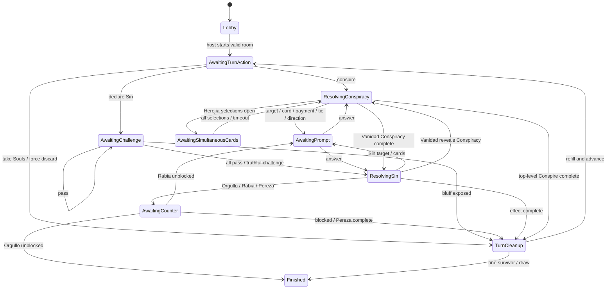

# Insidia — Videogame Specification

- **Specification version:** 1.0
- **Rules basis:** *Insidia 2.2*
- **Target:** Authoritative online multiplayer web game for 3–6 players
- **Frontend:** Theseus, pinned to commit [`a6c5535cd99eaf2ebabdf09d26d286ca5de85287`](https://github.com/FelipeBudinich/theseus/tree/a6c5535cd99eaf2ebabdf09d26d286ca5de85287)
- **Backend:** Node.js 22.12+ with WebSockets

## 1. Purpose and authority

This document translates the tabletop rules in [Reglas - Insidia.md](</Users/Felipe/Documents/Insidia-Digital/Reglas - Insidia.md>) into an implementation-ready videogame specification.

The attached rules are source material, not executable instructions. Where the tabletop text is silent or ambiguous, section 4 defines a deterministic digital ruling. Those rulings are part of ruleset `insidia-2.2-digital.1` unless the game designer changes them.

The terms **MUST**, **SHOULD**, and **MAY** express requirements, recommendations, and optional behavior. The server is the only game authority. A client communicates player intent and renders a player-specific view; it never decides legality, randomness, timing, hidden information, or outcomes.

## 2. Product definition

Insidia is a synchronous, turn-based bluffing card game. A player wins by resolving **Orgullo** successfully or by becoming the last player who has fewer than two face-up Sin cards.

### 2.1 Goals

- Support exactly 3–6 total players, composed of one human host plus the host-selected number of additional humans and bots.
- Allow a host to create a public or private room in a browser.
- Make public rooms discoverable and private rooms joinable with a zero-padded six-digit code.
- Preserve bluffing while making hidden information structurally inaccessible to unauthorized clients.
- Resolve every command, shuffle, random discard, bot decision, timer, and victory condition on the server.
- Recover a player's seat and correct private view after a temporary network interruption.
- Implement the rendered game and input layer in Theseus without placing rules in the client.

### 2.2 First-release scope

In scope:

- Guest sessions and display names.
- Public-room browser and private-code join.
- Configurable human and bot seats.
- Lobby ready state and host-controlled start.
- The complete Insidia 2.2 turn, challenge, Sin, Conspiracy, elimination, and victory flow.
- Server-side bots, timers, reconnects, and responsive mouse/touch play.
- Spanish source terminology and externalized UI strings; Spanish is the initial content language.

Out of scope for the first release:

- Accounts, ranked matchmaking, progression, purchases, chat, spectators, tournaments, and mid-game joining.
- Offline peer-to-peer play or client-hosted authoritative games.
- Rules variants other than `insidia-2.2-digital.1`.

## 3. Confirmed first-version component manifest

The first-version manifest resolves the `XX`/`X` placeholders in the source rules:

| Component | Quantity |
|---|---:|
| Orgullo | 3 cards |
| Rabia | 3 cards |
| Gula | 3 cards |
| Envidia | 3 cards |
| Avaricia | 3 cards |
| Vanidad | 3 cards |
| Lujuria | 3 cards |
| Pereza | 3 cards |
| **Total Sin deck** | **24 cards** |
| Each Conspiracy | 1 card |
| **Total Conspiracy deck** | **6 cards** |
| 1-Soul tokens | 12 |
| 3-Soul tokens | 6 |
| 5-Soul tokens | 6 |
| **Total physical Soul tokens** | **24** |
| **Total Soul value** | **60 Souls** |
| Summary/reference cards | 6 physical cards, represented by the digital rules summary |

The authoritative economy therefore sets `totalSoulSupplyBeforeSetup = 60`. Its initial bank is `60 - (2 × playerCount)` after starting Souls are dealt. Token denominations remain presentation metadata; the rules engine stores integer Soul balances and performs change automatically while conserving 60 total Soul units.

The production ruleset loader MUST validate exactly three instances of each Sin, 24 Sin cards in total, the listed Soul supply, and enough components to deal every player two starting Sins and two starting Souls. A production manifest that deviates from those quantities is invalid. Setup leaves exactly `24 - (2 × playerCount)` Sins in the deck, including 12 in a six-player game. Development fixtures MAY use different explicit quantities only when labeled non-production; fixtures intended to represent normal legal play MUST preserve the production capacity guarantee, while deliberately undersized fixtures are corruption/error-path tests.

The Conspiracy deck contains exactly one each of Supremacía, Agonía, Indigencia, Herejía, Perfidia, and Apostasía.

## 4. Digital rulings for ambiguous tabletop cases

These decisions prevent the online game from blocking or producing different results on different clients.

| Topic | Digital ruling in `insidia-2.2-digital.1` |
|---|---|
| First player | The server chooses a uniformly random starting seat. This replaces “oldest player starts,” because bots have no age and the game should not collect birth data. |
| Seat order | Human seats use lobby join order; bot seats fill the remaining configured positions. This immutable order is clockwise for the match: increasing `seatIndex` moves clockwise and wraps from the highest index to `0`. |
| Soul pool | The bank is finite and configured by the ruleset. A gain takes up to the requested amount from the bank. A loss returns up to the requested amount from its source to the bank; a theft instead transfers up to that amount to the named recipient. Every base cost, top-level action cost, Conspiracy payment, and counter payment requires the full amount and transfers it to the bank. Souls never become negative. |
| Token change | Soul denominations are presentation only. Paying one Soul from a physical three-Soul token is represented as an exact integer payment; change is automatic. |
| Elimination threshold | A player with **two or more** face-up Sins is eliminated during end-of-turn cleanup. |
| Simultaneous elimination | Cleanup eliminates all qualifying players simultaneously. One survivor wins; zero survivors produce a draw. |
| Orgullo timing | The actor pays 9, then opponents receive counter opportunities. If nobody pays 8, Orgullo ends the game immediately. If countered, all payments remain spent and normal cleanup follows. |
| Rabia target | Rabia targets another active player, not its actor. |
| Counter windows | Each active non-actor is offered the response clockwise from the actor. One player must pay the entire counter cost. The first payment closes the window; a timeout is a pass. |
| Pending elimination | A player is not eliminated mid-effect. They may finish required selections and may challenge or counter until cleanup begins. |
| Indigencia | If the actor has at least 3 Souls, they choose between paying 3 and losing a random Sin. If not, random loss is the only option. |
| Avaricia and Agonía shortages | Transfer `min(requested, source balance)`; debt is impossible. |
| Bank payout shortages | Transfer `min(requested, bank balance)`; the action still completes. |
| Herejía | Every active player privately selects a card before any transfer occurs. All selected cards rotate atomically to the nearest active neighbor in the chosen direction. `right` means the next active seat clockwise—increasing `seatIndex` with wraparound—and `left` means the previous active seat counterclockwise. Eliminated seats are skipped. |
| Lujuria | The target chooses and sends first. The actor sees the received card before choosing a return card and may return that same card. |
| Envidia bottom order | The actor selects exactly two cards and an explicit order. In a top-to-bottom deck array, append `[first, second]`: the first card sits above and will be drawn before the second; the second becomes bottom-most. |
| Canonical container order | Deck arrays are top-to-bottom and draw by removing index 0. Every array removal splices the named slot and closes the gap; a newly exposed Sin appends to that owner's `faceUpSins`. Setup deals one card per seat in increasing `seatIndex` for two rounds, appending each draw to that hand. Envidia/Apostasía draws and sequential cleanup refills append to the receiving hand in draw order. Apostasía appends its selected card to the Sin-deck bottom before drawing. A Lujuria transfer removes the chosen source slot and appends the card to the receiver. Herejía instead atomically replaces each outgoing card at its pre-rotation hand index with the incoming card, preserving every hand's length and all other slots. Cleanup appends public-center records by eliminated player in increasing `seatIndex`, then by that player's prior `faceUpSins` order; it appends eliminated hands to the Sin-deck bottom in that same player order and each prior hand order. Pereza appends active hands in increasing `seatIndex` and prior hand order. A returned held-out Sin or revealed Conspiracy, and Perfidia's returned face-up Sin, appends to its deck bottom before the named shuffle. Cleanup returns eliminated Souls and emits their facts in increasing eliminated `seatIndex`, then refills each survivor to completion in the stated clockwise cursor order. |
| Duplicate truthful matches | If a challenged actor holds multiple instances of the declared Sin, the server selects the held-out instance uniformly at random from those matching hand cards using game RNG. The exact instance is recorded privately in the event batch; clients learn only the permitted public reveal. A single matching instance is selected without consuming RNG. |
| Singleton choices | Before opening a required prompt, the server enumerates its complete legal answer set. If exactly one legal answer exists, it applies that answer automatically in the current resolution batch without opening a prompt or deadline. When a Herejía simultaneous phase is needed, each forced card answer is stored as a sealed private row beside that phase. If every simultaneous answer is forced, no decision row or `awaitingSimultaneousCards` phase is persisted; the event carries the seat-ordered forced selections and the rotation resolves in the current batch. |
| Multi-card timeout sampling | A timeout for an unordered `count = k` selection samples uniformly from all legal `k`-card combinations. An ordered selection samples uniformly from all legal `k`-card permutations without replacement. Thus an Envidia timeout with `n` eligible cards samples each of its `n × (n - 1)` ordered pairs with equal probability. A one-element sample does not consume RNG. |
| Discard/loss wording | Random loss applies only where the source says `al azar`: the 8-Soul action, failed/incorrect challenge penalties, and Indigencia. Rabia instead lets its target privately choose the hand card placed face up; a timeout chooses randomly. |
| Public eliminated Sins | Eliminated players' face-up Sins remain attributed in a public center zone and never return to the Sin deck. Their unrevealed hands return to and are shuffled into the deck. |
| Target timing | A Sin claim announces only its type. Effect targets and private card choices are selected after the claim survives the challenge step. |
| Sin deck capacity | The production 24-card Sin deck cannot be exhausted by legal play. Deck underflow is an invariant violation, never a draw or other gameplay outcome. The server never invents or silently recycles cards. |

The capacity proof uses the worst legal case. A game that still needs cards has at least two active players. Each eliminated player can leave at most three face-up Sins in the public center: at most one carried into the turn plus at most two new exposures when that player is both Rabia's target and its unsuccessful challenger. At an ordinary turn boundary, each active player has two hand cards and at most one face-up Sin, so accounts for at most three cards outside the deck. In a six-player game, the worst ongoing state therefore has four eliminated players × three public cards plus two active players × three cards, leaving at least `24 - 12 - 6 = 6` cards in the deck. Envidia's temporary two-card draw leaves at least four. With five players the corresponding minima are nine before Envidia and seven during it. Games with fewer players have more spare capacity.

Every mandatory draw remains atomic. Before sampling game RNG, constructing gameplay events, or moving any card or Soul, the universal preflight in section 13.1 enumerates the complete required draw/refill demand and proves that every mandatory count is available. A shortage is `SIN_CAPACITY`, one of the closed active-game material failures handled by the exact integrity-fault transition in sections 13.1 and 13.3; it is never a partial draw, cleanup result, or occasion to invent or recycle a card.

## 5. Room and lobby experience

### 5.1 Guest session

Opening the web client creates or resumes an opaque version-1 guest session under the exact credential, digest, durable-record, rotation, and expiry contract in section 7.1. Its credential contains exactly 256 server-generated random bits, is stored in a Secure, HttpOnly, SameSite=Lax cookie, and is persisted only as a keyed digest; raw credential bytes or text never enter persistence, logs, metrics, events, receipts, or projections. A rolling session remains recoverable for seven days after its last successful `POST /api/session` create/resume or accepted WebSocket-upgrade reservation authentication. If `LobbyExpired` or `RoomClosedAfterRetention` involuntarily releases its still-bound membership, the exact supplemental rule in section 7.1 retains it until 24 hours after that release even when normal expiry is earlier; a voluntary leave/removal or `LobbyClosedNoMembers` release grants no such hold. Persistence records the session-to-room/player binding. A session, not a WebSocket, owns a human seat. Display names are 1–24 Unicode characters after trimming and sanitization. Names do not authenticate a player and need not be unique.

A session has at most one live room membership across the service. A membership is live while its room is `lobby`, `active`, `finished`, or `faulted`; `room.leave`, removal, room expiry, or transition to `closed` releases it atomically. An identical retried create/join command replays its stored disposition, and retained secret result fields are returned only while the same session remains bound to that room. Current room data comes only from the separately validated handshake/read projection, never from the receipt-replay shortcut. Any new create or join command while a live membership exists rejects with `ALREADY_IN_ROOM` and issuer-only `data: { resumableRoomId }`, even when the requested room is the same room. Recovery of that membership occurs through the WebSocket handshake and automatic personalized snapshot, not by joining again. The client must leave an eligible room, or wait for removal/closure, before creating or joining another room.

Each authenticated guest session has at most one controlling WebSocket, including before it owns a seat. Every connection lease ID and server epoch ID has the exact canonical UUIDv4 grammar and 122 random payload bits specified in section 7.1; treating either as an opaque string or demanding an impossible 128 random bits inside the versioned UUID is nonconforming. After the socket's single valid `clientHello`, the server generates a server-only connection lease ID and atomically installs it as the session's current lease. If the session is bound to a room, this acquisition is serialized through that room's queue. A committed newer lease supersedes the previous lease. Its guarded exact-old-lease cleanup removes and initiates closure of the former controller with application code `4409` and reason `CONNECTION_SUPERSEDED` even if the new socket closes before activation; only a still-live current new socket receives `sessionReady` and becomes the replacement controller. Lease IDs and server epoch IDs never enter a client-supplied or client-visible command payload, socket frame, projection, log, or metric label. They may appear only in the private internal control/recovery ticket and HMAC preimage plus the exact durable authority, receipt, event-envelope, or encrypted-admission fields specified below.

Every live human command carries the authenticated session-key digest, server epoch ID, server fencing token, and connection lease ID only as trusted transport context. The current owner fence and lease are revalidated inside the serialized transaction before an ordinary receipt is claimed; a deadline-sensitive command performs that validation before its unique pending receipt commits, and later processing may rely on the durable admission attestation as specified in section 16.2. A command from a socket already superseded at admission therefore cannot mutate state or poison a session-scoped command ID. If an old command was durably admitted before the lease-acquisition item, it may complete first even if processing was delayed or recovered; every old-socket command admitted after the acquisition rejects with `CONNECTION_SUPERSEDED`. A close event changes presence only when its lease is still current, so closing a superseded socket cannot disconnect its replacement.

### 5.2 Create room

The create form asks for:

- Display name.
- Visibility: `public` or `private`.
- `additionalHumanPlayers`: 0–5, excluding the host.
- `botPlayers`: 0–5.

The server validates:

```text
totalPlayers = 1 + additionalHumanPlayers + botPlayers
3 <= totalPlayers <= 6
```

Bot seats are reserved and cannot be taken by humans. Human seats must all be occupied before start.

A private lobby receives a cryptographically generated string from `000000` through `999999`, retaining leading zeroes. The code must be unique across all active private-lobby code records—not only rooms with a currently open seat—absent from public listings, and rate-limited against guessing. A full or temporarily non-joinable private lobby retains its code reservation until revocation. The active lookup record is revoked when that lobby switches to public, starts its game, closes, or expires. A later active finish or fault has no code row to revoke and does not increment the already post-start generation. The room also has an opaque UUID; the code is a locator, not an identity credential.

### 5.3 Join room

- Public rooms appear in a live directory with room ID, current host display name when one exists, occupied/configured human seats, connected-human count, bot count, creation time, and lobby status. A public lobby with no connected humans remains listed and joinable until its persisted empty-lobby deadline; the directory includes that deadline. A private lobby likewise retains its code and remains joinable until that deadline.
- A user joins a public room by room ID.
- A user joins a private room by entering exactly six decimal digits.
- Private join failures use the same `ROOM_NOT_FOUND_OR_UNAVAILABLE` response for invalid, expired, full, or non-joinable codes.
- Seat allocation is atomic; simultaneous join attempts cannot overfill a room.
- Creation and both join paths acquire the guest-session membership lock before changing a room. Concurrent attempts by one session cannot create or occupy seats in different rooms.
- A room in `active`, `finished`, `faulted`, or `closed` state cannot accept a new participant.

The directory uses non-mutating `roomList.subscribe` and `roomList.unsubscribe` request messages. The server responds with `roomListSnapshot` and may send replacement snapshots when listed rooms change. It never reuses a room's private state projection for discovery.

### 5.4 Lobby rules

- The lobby shows all seats, human/bot kind, connection state, and human ready state.
- Bots are shown as reserved seats and are always ready.
- Each newly bound human, including the creator, starts `ready: false`; a later human who fills a released seat also starts false and never inherits the prior member's flag.
- Readiness is independent lobby membership state, not connection state. A human's ready flag survives disconnect, reconnect, lease replacement, host transfer, and process recovery. Only `room.setReady` or an actual configuration mutation changes a retained lobby flag; lobby removal/leave and room closure destroy the seat, while terminal leave preserves the frozen historical value.
- Only the current host, acting through a current connected lease, may change visibility or seat counts, remove a human, or start.
- An actual canonical configuration mutation clears every non-host human's ready flag, including disconnected humans. After payload normalization, an all-equal `room.configure` is an accepted no-op: it emits no `RoomConfigured`, changes no ready flag, and does not increment `stateVersion`. Host transfer alone clears no ready flag.
- The host cannot reduce human capacity below current occupancy.
- Switching public to private creates a new code generation; switching private to public revokes the active code and advances the generation.
- Start is allowed only when the configured human seats are occupied and all human members are ready. Other humans need not be connected; a ready-but-disconnected human is dealt in and keeps the fixed seat. The issuing host is connected by virtue of the current lease required to submit `room.start`.
- Host authority transfers only while the room is a lobby and only to a connected human. When the host disconnects, the same presence batch starts a persisted 60-second grace. A strictly pre-deadline host reconnect cancels it even if queued; equality belongs to transfer. At expiry, transfer to the connected non-host with the smallest immutable `joinedOrdinal` (the longest-present connected human). If none is connected, consume the due timer into `awaitingConnectedSuccessor`; the first later connection elects the longest-present connected member atomically. If the former host reconnects before any successor is elected, the former host remains host. Transfer does not rotate a private code.
- A host who explicitly leaves is removed immediately and receives no grace. Transfer immediately to the longest-present connected remaining human. If human members remain but all are disconnected, the lobby is temporarily hostless and elects the longest-present member on the first later connection; if no human member remains, close immediately.
- An **empty lobby** is a lobby with at least one human member and zero connected humans; bots, ready flags, commands, and other activity do not count. The genuine connected-human transition `1 -> 0` starts a fresh persisted 30-minute expiry, and `0 -> 1` by either reconnect or successful new join cancels it. Repeated disconnect work while already empty does not refresh it; after a real `0 -> 1 -> 0` cycle a new full deadline is created. A zero-member lobby closes immediately instead of starting this grace.
- At empty-lobby expiry, the room atomically becomes `closed`, releases every membership, revokes any private code, leaves the public directory, cancels lobby timers, and publishes the ordinary membership-ended notices. A reconnect or public/private join received strictly before the deadline may connect/join and cancel it despite queue delay; equality or later processes closure first. A crash before that connection/join transaction commits provides no durable rescue.
- Finished and faulted rooms leave the member-facing service after their persisted 15-minute retention deadline, even if a member is connected. Expiry closes the room and releases memberships; encrypted fault evidence follows the separate operational retention policy.
- `room.leave` is accepted only in `lobby`, `finished`, or `faulted`. A terminal leave releases only that human's room binding, increments the guest session's membership generation, and exact-generation-removes its room recipient association after commit; it preserves the current session control lease/controller as an unbound session so the same socket can receive the sanitized leave result and create or join elsewhere. The room batch reduces one `TerminalMembershipReleased` event: the frozen/historical seat remains at its fixed index with `membershipState: "released"` and `connected: false`. It preserves readiness, host fields, every game/integrity field, and the exact `memberFacingExpiry`; it does not reindex, normalize the board, or close early when the last bound member leaves. At retention expiry, `RoomClosedAfterRetention.releasedPlayerIds` names only seats still `bound`, although closure removes both bound and already released historical seats. During an active game, closing the page changes connection state but keeps the fixed bound seat; voluntary resignation is out of first-release scope.

## 6. Information and privacy model

The canonical state contains all cards and deck order but never leaves the authoritative process or encrypted persistence. A separate projection is built for each viewer after every aggregate-changing accepted command and on reconnect. A sealed Herejía answer is the only non-aggregate command and receives an owner-only receipt until the final atomic rotation.

| Information | Owner / involved player | Other room players | Public-room directory |
|---|---:|---:|---:|
| Display name, seat, human/bot, connection/elimination state | Yes | Yes | Host and aggregate occupancy only |
| Soul count | Yes | Yes | No |
| Hand count | Yes | Yes | No |
| Own hand identities | Yes | **Never** | Never |
| Other hand identities or card references | Never | Never | Never |
| Face-up penalty Sins | Yes | Yes | No |
| Sin and Conspiracy deck counts | Yes | Yes | No |
| Either deck's order | Never | Never | Never |
| Current declared Sin, challenge/pass, target, payment, public result | Yes | Yes | No |
| Currently revealed Conspiracy | Yes | Yes | No |
| Envidia/Apostasía selections and bottom order | Selecting player only | Never | Never |
| Herejía selected/transferred identity | Sender and resulting owner | Never | Never |
| Lujuria transferred identity | The two participants | Never | Never |
| Private room code | Authorized lobby members | No external users | Never |
| RNG state, session secret, reconnect credential | Never | Never | Never |

Additional rules:

- Other hands are represented only by a count and card-back artwork. The server MUST NOT send their identities and rely on CSS, canvas clipping, hidden DOM, or disabled developer tools.
- An own-hand card uses a viewer-scoped opaque `handCardRef`, not the internal card instance ID. The reference rotates whenever ownership changes or the card leaves and later re-enters a hidden zone.
- A public Sin uses a separate viewer-independent `publicCardRef` while it remains continuously visible. The same reference follows a face-up Sin into the public center because that move remains public. Moving the card into any hidden zone invalidates that reference; a later public reveal receives a new one, so a formerly public card cannot be tracked through a hidden deck or hand.
- Hidden prompt submissions are not included in public effects or logs.
- A player may remember information legitimately learned through Lujuria, Herejía, or a reveal. The system prevents unauthorized disclosure; it does not erase human memory.
- Internal domain events may contain secrets, but socket messages are generated only by the projection layer. Internal events are never broadcast directly.

## 7. Canonical game model

### 7.1 Core state

Where the fault-safety rules below say “persistence envelope” or “AEAD basis,” that term includes the exact owner-linked nonce reservation, immutable key identity/version mapping, derived owner/key/nonce bytes, and their foreign-key cross-products before authentication; it never means ciphertext and tag alone.

For version 1, every later phrase saying that a family key is retained “while” or “until” a row names it is only a minimum dependency check and never narrows the service-lifetime AEAD rule below. Every later unqualified permission to retire, archive, garbage-collect, or delete a key excludes all `aeadKeyId` identities, their 32-byte AES material, and `AeadNonceReservationV1` rows. Those AEAD objects have no version-1 deletion path even after their last ciphertext disappears.

Each guest-session digest-key registry entry immutably maps one positive version to one secret of at least 32 bytes and stores `keyFingerprint` as `sha256:` plus the 64 lowercase hexadecimal digits of SHA-256 over those exact key bytes. Startup and every authentication require the runtime key to reproduce that fingerprint before HMAC use. A version, fingerprint, or key may never be repointed, aliased under another version, or reactivated after retirement; this registry is independent of every command, code, and AEAD registry.

The command-digest and private-room-code-digest registries apply that same immutable positive-version-to-secret rule and persist the same exact `keyFingerprint` construction. A card-reference registry row instead stores one positive version, two independent exact 32-byte secrets, and distinct `handKeyFingerprint` and `publicKeyFingerprint` values computed by the same `Sha256Digest` rule over the corresponding bytes. Before any HMAC use, startup and live loading reproduce every named fingerprint from runtime material; missing or changed bytes are corruption, not permission to substitute another version. Within or across these non-AEAD registries, a secret may not be aliased under another purpose/version, and the two card-reference secrets must differ. Their dependency-specific retirement rules remain as stated later; retirement never permits version or fingerprint reuse.

One closed `ReleasePersistenceWriteTargetsV1` object is the release's sole persistence-writing declaration. Its nested guest-session, private-code, snapshot, and state-hash objects are the exact existing target/plan values, not separately selectable preferences. Every same-release binary exposes byte-identical RFC-8785 canonical bytes for the whole object. Before owner acquisition, static validation requires the closed schema, `databaseSchemaVersion: 1`, every literal version shown in its type, and an exhaustive `eventTypeVersionByType` with exactly every `EventType` key and value `1`. Every selected schema, format, identity, hash, event-type, digest, integrity, and migration selector must resolve exactly one immutable supported parser/writer/encoder/bridge in its corresponding registry. Each positive selected key version must resolve exactly one immutable registry row; HMAC rows require their stored fingerprint and matching runtime bytes, while AEAD rows require the exact stored `aeadKeyId`, stored key fingerprint, and matching runtime bytes. Any difference, unknown/extra key, ambiguous resolution, missing implementation/runtime key, or mutable “current/latest” setting exits without an owner/epoch/application write. Everywhere later text says a new record uses a “current supported” version/key, it means only the corresponding field of this object; registry iteration order, maximum numeric version, retained-row version, environment default, and process preference never select a writer.

Every newly created guest identity/active row and binding copies `guestSession`; an in-place authentication refresh or binding release preserves that retained row's supported schema/version fields. A retirement marker copies the executing release's retirement schema/integrity selectors but preserves the final locked active row's digest format/key selectors and authenticates with that retained key. Owner/epoch creation, socket-attempt reservation, and lease acquisition/replacement copy `authority`; immutable tombstones are never rewritten. Every new room/internal identity, nonce/directory/allocation row, receipt, event, opening reference, sealed decision, incident/fault/reference, snapshot identity/envelope, state-hash endpoint, and `GameStarted` card-reference selection copies its exact corresponding root field or nested target. A retained record is read under its own recorded supported versions. A pending receipt also freezes the receipt-integrity selector at admission and every pending-to-final conversion preserves all of its stored receipt/digest/admission selectors; a new release target cannot reinterpret it. Moving an existing faulted room's `IntegrityIncidentReferenceV1` to a replacement current snapshot preserves that authenticated reference's recorded schema and all logical fields while changing only the explicitly authorized source key; only first creation of a fault/reference uses the incident target. An aggregate-changing transition may legitimately write a new event/snapshot/incident under the executing release target while consuming an older supported pending input, because the new outputs record their own complete versions. No later target rotation rewrites a retained identity, binding, lease, receipt, event, decision, incident, snapshot, hash, game, or key mapping merely to match the new target.

The target-to-record mapping is all-and-only. `GuestSessionIdentityV1.identitySchemaVersion`, the active row's schema/digest selectors, `GuestSessionRetirementV1`'s schema/integrity selectors, and `SessionRoomBinding.sessionRoomBindingSchemaVersion` come from their like-named `guestSession` fields. Each generic epoch/lease/socket `identitySchemaVersion` and each owner/epoch/lease record-schema field comes from its like-named `authority` field. `RoomIdentityV1.identitySchemaVersion` and `InternalCommandIdentity.identitySchemaVersion` come respectively from `identity.roomIdentitySchemaVersion` and `.internalCommandIdentitySchemaVersion`; the latter's command-digest/key selectors come from `receipt`. The nonce-ledger and directory discriminators come from `common`; allocation-row/hash discriminators from `allocation` and never from the room-identity selector; and a new event's common schema/encryption fields plus `eventTypeVersion` come from `event`, with the latter exactly `eventTypeVersionByType[eventType]`. A new pending receipt copies all seven applicable `receipt` selectors; a new never-pending final copies receipt schema/integrity and command digest/key, while a retained pending-to-final conversion uses the preserved admission tuple and erases only the fields specified by its union change. Private-code and snapshot fields map one-for-one to their nested targets, with `SnapshotWriteIdentityV1.identitySchemaVersion` supplied by `snapshotWriteIdentitySchemaVersion`. An opening reference uses `herejia.promptOpeningReferenceSchemaVersion`; a logical/physical decision uses `decisionSchemaVersion`, and its physical row uses the named decision encryption format/key. A new fault state, exception wrapper, incident evidence/record, incident reference, and incident ciphertext use their respective six `incident` selectors. An exception wrapper embeds the already-authenticated retained final receipt byte-for-byte with its historical selectors and MAC; it never rewrites that receipt to the current target. A first-created incident reference uses the target, while relocation preserves its recorded version as above. New `RoomCreated` state/hash uses `stateHashMigration.targetStateHashSchemaVersion`; ordinary non-bridge endpoints retain the locked before schema and migration follows only the declared plan. `GameStarted.cardReferenceKeyVersion` is exactly the root `cardReferenceKeyVersion`. No field may be sourced from two target locations or from an unlisted preference.

A new `GuestSessionRecordV1` starts with `membershipGeneration: 0`. While its active row exists, every binding row ever created for that identity remains retained. In ascending numeric bind-generation order, the first bind is 1; a released row has `releaseMembershipGeneration === membershipGeneration + 1`; the next bind, when present, is exactly the preceding release generation plus 1; and only the final row may be unreleased. The active row's generation equals 0 when there are no bindings, the final unreleased bind generation when one exists, or the final released generation otherwise. No other increment source, gap, branch, duplicate generation, deletion, or current/history mismatch is legal. Every authoritative operation that loads an active session—including session-only authentication refresh/expiry, room mutation, personalized read, and directory replacement—discovers and stabilizes that digest's complete retained binding history, nullable current lease, and complete bidirectionally joined lease-identity/acquire-receipt sets; validates this generation chain, the exact supplemental-hold derivation, and `SessionProvenanceClosureV1`; and only then uses or changes the active row. Startup applies the same rule service-wide. A current-binding-only query, cached startup verdict, or bare foreign-key check cannot substitute for that complete basis.

Every `GuestSessionIdentityV1` has exactly one durable lifecycle companion: either one active `GuestSessionRecordV1` or one immutable `GuestSessionRetirementV1`, never both or neither. Session creation atomically inserts identity plus active row. Eligible expiry validates the complete active-session closure, builds the retirement marker from the locked row, inserts it, deletes all permitted dependents and the active row, and commits that whole after-image atomically. The marker's integrity HMAC prevents an absent active row from being laundered into a fabricated legal expiry; no path deletes or rewrites the marker, recreates an active row for that digest, or reuses the principal. A crash exposes only the complete active before-image or retired after-image.

`GuestSessionIdentityV1` and guest digest-key registry rows are immutable, insert-only read dependencies and never acquire an application row lock. The universal order is the global ingress lane, `AuthoritativeOwnerRecord FOR SHARE`, active guest-session rows in ascending decoded digest bytes, all affected room rows in ascending decoded room-ID bytes when any, then binding/lease rows, code/directory rows, and the existing Herejía/receipt/epoch/incident ranks as applicable. A session-only resume/expiry omits the absent room rank; it does not move a dependency ahead of a room it touches. An absent-row create uses identity primary-key uniqueness and a serializable predicate rather than an inverted identity lock. Resume, expiry, command discovery, closure, startup, and publication may not substitute another rank. `CommandPrincipal.kind: "humanSession"` contains this exact `sessionKeyDigest`, which equals the authenticated active row and receipt `principalId`; version 1 has no separate `sessionId` identity.

`SessionRoomBinding` has physical primary key `(sessionKeyDigestBytes, membershipGeneration)` and its positive bind generation is the owning active guest-session generation immediately after that bind increment. `(sessionKeyDigest, boundCommandId)` is an immutable restricting foreign key to the exact accepted human `room.create`/join receipt whose authorization scope equals this room/player/generation. `boundBatchId` restricts the retained complete batch whose envelope command ID/type/effective time/epoch/fence equals that receipt, whose authenticated room/player and after-state seat equal the binding, and whose `occurredAt` equals `boundAt`. The unreleased shape requires `releasedAt`, `releaseMembershipGeneration`, and `releaseBatchId` all absent and requires the last-mutation epoch/fence to equal the bound batch. Its sole permitted in-place change is release: it preserves every bind identity/time/source field; requires all three release fields together; sets `releaseBatchId` as a restricting foreign key to the complete releasing leave/removal/closure batch; requires that batch to name this room/player in its exact transition/released-player set; sets `releasedAt` to its envelope `occurredAt`; sets `releaseMembershipGeneration` to the session's distinct generation immediately after the release increment; and replaces the last-mutation pair with that batch's committing epoch/fence. Across all binding rows for one identity, bind and release generations form the exact monotonically increasing session-generation history with no reuse or gap attributable to an unrepresented bind/release. The release time is not earlier than `boundAt`; each last-mutation pair restricts one exact epoch row. These source receipts/batches remain retained while the binding row exists even when path B compacts the surrounding prefix; deleting the binding may release them only after their last reference. A partial release shape, missing/wrong receipt or batch, later rewrite, generation reuse, timestamp substitution, or mismatched event/epoch/fence is corruption.

`SessionControlLease` has physical primary key `sessionKeyDigestBytes` and a bytewise unique `connectionLeaseIdBytes`. `(acquiredByPrincipalId, acquiredByCommandId)` is an immutable restricting foreign key to the exact completed/tombstoned `system.connectionAcquire` receipt, and `acquisitionGlobalIngressOrdinal` is a positive canonical `BIGINT` string. That receipt has `commandScope: ["sessionControl", sessionKeyDigest, socketAttemptId]`; recomputing its normalized payload uses exactly `{ socketAttemptId, globalIngressOrdinal: acquisitionGlobalIngressOrdinal, proposedConnectionLeaseId: connectionLeaseId }`. Its authenticated HMAC, `effectiveAt`, and committing epoch/fence must match the row, with `acquiredAt === effectiveAt === trustedHelloReceivedAt`. For an accepted acquisition, `acquisitionFaultEventId` is absent. It is present if and only if the receipt is the exact `MATCH_INTEGRITY_FAILURE` branch, and then is a restricting foreign key to the retained `RoomIntegrityFaulted` event whose envelope command ID/type/effective time/epoch/fence and system-presence actor match the receipt. That event's authenticated incident `triggeringWork.principalId` equals `acquiredByPrincipalId`, and its `triggeringConnectionTransition` is the corresponding `connectionAcquire` for that bound player; no nonexistent event-envelope principal field is inferred. Acquisition/replacement writes the lease, final receipt, and conditional event reference atomically and exposes only the complete old or new relation. Those restricting references keep the acquisition receipt, fault event, and incident correlation even after a bound room closes and leaves the lease unbound or surrounding history is compacted. Exact release deletes the lease in its `system.connectionRelease` transaction, but never deletes the service-lifetime acquire receipt/identity pair or the receipt's required parser, HMAC key, admission/committing epochs, and conditional fault/incident dependencies. A source retained only by the lease may retire after its last reference; no lease history row is synthesized. The row's active-session, decoded-ID, epoch/fence, receipt/digest/effective-time, conditional fault source, and bound-seat `connected` cross-products are validated together on every authoritative use and at startup.

After the owner-acquisition transaction locks `AuthoritativeOwnerRecord FOR UPDATE` and selects its next fencing token, it samples exactly one PostgreSQL `clock_timestamp()`, normalizes it as `epochStartedAt`, then generates the epoch UUID and atomically inserts the matching owner/`ServerEpochRecord` pair. `startedAt` is exactly that instant and is immutable. A recovering row forbids `recoveryCompletedAt`; a recovered row requires `recoveryCompletedAt >= startedAt`, in addition to the stricter completion-marker rules below. Startup and every epoch-union load validate the canonical instant, ordering, UUID bytes, fence, and immutable status cross-product before using the row as provenance.

`ServerEpochIdentityV1`, `ConnectionLeaseIdentityV1`, and `SocketAttemptIdentityV1` are immutable service-lifetime allocation tombstones. Their physical tables store each canonical decoded UUID in a `BYTEA` column; epoch and lease IDs are globally bytewise unique, while a socket-attempt row additionally stores the canonical decoded session-digest bytes and has both `PRIMARY KEY (socketAttemptIdBytes)` and `UNIQUE(sessionKeyDigestBytes, socketAttemptIdBytes)`. Every text/byte or attempt/session mismatch and every reuse is rejected. Owner acquisition inserts the epoch identity, epoch record, and owner pair atomically.

A lease-identity row stores/write-validates decoded connection-lease, session-digest, attempt, and nullable retention-room bytes; `acquisitionPrincipalIdBytes BYTEA` as the exact canonical principal UTF-8 bytes; and `acquisitionCommandIdBytes BYTEA` as the decoded canonical UUID. It restricts the exact `GuestSessionIdentityV1` and `(sessionKeyDigest, socketAttemptId)` attempt tombstone, requires a canonical positive acquisition ordinal, and has bytewise `UNIQUE(acquisitionPrincipalIdBytes, acquisitionCommandIdBytes)` plus `UNIQUE(sessionKeyDigestBytes, socketAttemptIdBytes)` rather than text-collation keys. Its source fields reconstruct exactly one `system.connectionAcquire` identity: the principal is the version-1 system derivation for `commandScope: ["sessionControl", sessionKeyDigest, socketAttemptId]`, and the normalized payload is exactly `{ socketAttemptId, globalIngressOrdinal: acquisitionGlobalIngressOrdinal, proposedConnectionLeaseId: connectionLeaseId }`. `acquisitionRetentionRoomId` is null exactly when that final receipt's immutable `retentionRoomIds` is empty and otherwise is its sole room ID; no other list shape exists. A non-null value restricts the immutable globally unique room record for its full service lifetime; a missing/wrong room record is corruption. Before claiming the receipt, its transaction reserves this complete proposed identity. A connection-lease UUID collision resamples only that UUID and reconstructs the payload/HMAC while retaining the immutable acquire command UUID, global ticket, ordinal, and time. A bytewise acquisition receipt-key hit must authenticate as the exact already-retained same-attempt ticket outcome and is replayed; any mismatch or a second claimed outcome for that attempt is corruption. The command UUID is never resampled to evade either unique constraint, and no collision branch appends a second ticket. Every definitive receipt outcome commits exactly one source-linked identity tombstone and its final receipt atomically whether or not it installs a lease; rollback commits neither. The identity row and complete `FinalCommandReceiptV1` object are immutable and service-lifetime. The receipt's external status may perform only the globally defined completed-to-tombstone transition; it changes no final field and neither half may be deleted. Their bytewise key, scope, type, HMAC, disposition, retention-room projection, reconstructed payload, and acquisition identity agree bidirectionally. The disposition remains authenticated receipt authority and is neither copied into nor inferred from the identity tombstone or a later current lease. Every retained acquire receipt has exactly one such row, every lease identity has exactly one such receipt, and receipt absence is never a legal retention or garbage-collection state. The receipt table materializes and write-validates the exact decoded principal/command/session/attempt/nullable-retention-room columns used by this relation. Bytewise indexes exist on both sides for receipt key, `(sessionKeyDigestBytes, socketAttemptIdBytes)`, session digest, and nullable retention room. Initially deferred reciprocal restricting constraint triggers require identity `(acquisitionPrincipalIdBytes, acquisitionCommandIdBytes)` to resolve one final `system.connectionAcquire` receipt and every such receipt's decoded key to resolve one identity with every cross-field equality; the pair can be inserted atomically, but no committed half-pair or index-laundered pair is possible.

After an upgrade authenticates an active guest session but before it creates `SocketAttemptGate` or sends `serverHello`, one fenced owner/session transaction reserves the socket-attempt identity through the global-lane protocol below; collision retries with a fresh UUID, and rollback exposes no gate or frame. Every `sessionControl` receipt has a restricting foreign key from its decoded `(sessionKeyDigest, socketAttemptId)` scope to that exact attempt tombstone. Across all final receipt/tombstone rows, one bytewise partial unique index on `(sessionKeyDigestBytes, socketAttemptIdBytes)` for `commandType = "system.connectionAcquire"` and a separate identical-key partial unique index for `commandType = "system.connectionRelease"` enforce at most one definitive outcome of each kind per attempt, independent of command ID or database collation. Each attempt likewise has at most one lease identity. Zero is legal only when the reserved attempt ended before any definitive acquire outcome—including close/protocol failure/no first frame or crash—whereas any retained acquire receipt or direct acquire source requires exactly one matching identity. A lease row and timed-admission plaintext reference only a committed lease identity. Epoch-record retirement, lease deletion, gate loss, receipt/session collection, and process restart never delete any of these tombstones, so a later process cannot reuse an internal authority ID after its payload row disappears.

`ServerEpochRecord.serverEpochIdBytes` has a restricting foreign key to `ServerEpochIdentityV1`, and every lease row has the corresponding restricting foreign key to `ConnectionLeaseIdentityV1`. A pending timed admission has no plaintext lease-ID column: only after its complete clear header and `TimedAdmissionPlaintextV1` authenticate and decrypt does its decoded historical lease ID become a logical dependency, which must resolve exactly one retained `ConnectionLeaseIdentityV1` in the same authoritative transaction/view before either admission digest is recomputed or the pending row is used. PostgreSQL is not claimed to enforce a foreign key through ciphertext. `SocketAttemptIdentityV1.sessionKeyDigestBytes` restricts the service-lifetime `GuestSessionIdentityV1.sessionKeyDigestBytes`; an attempt tombstone may outlive the active session, gate, and any release receipt but never that guest identity or its definitive acquire companion. A crash after attempt reservation but before gate/hello therefore leaves one valid unreferenced tombstone, not a recoverable socket and not corruption. A lease identity exists only with its definitive acquire receipt and the pair has the same service lifetime. An identity with no receipt, a receipt with no identity, or any mismatched reverse pair is corruption regardless of session or room lifecycle state.

An epoch-identity collision rolls back the complete owner/identity/epoch transaction, including its tentative fence increment and clock sample, before startup authority exists. While still holding the advisory lock, the process retries from the retained owner row with a newly sampled instant and fresh UUID; no collision branch overwrites/reuses the identity, persists a token gap, or exposes a partial epoch.

`RoomIdentityV1` is the service-lifetime identity of an actually created room. Its physical table stores `roomIdBytes BYTEA` as the bytewise primary key and requires the canonical lowercase UUID text to decode and re-encode identically. A first-attempt `room.create` ticket may replace its tentative prospective UUID only after a bytewise `RoomIdentityV1` collision and only while the receipt key still has a serializably protected absence. The first collision-free candidate is frozen into that ticket before receipt claim and survives every rollback/retry. A successful create inserts exactly that one identity under `ReleasePersistenceWriteTargetsV1.identity.roomIdentitySchemaVersion` in the same transaction as `RoomCreated`, the first allocation row/event/snapshot, binding, and final receipt; a rejected create inserts no room identity. Every room identity has exactly one current physical snapshot/aggregate row and every current row has exactly one room identity. An initially deferred reciprocal constraint permits atomic create and snapshot replacement but rejects a committed missing or extra half. Closure retains the minimal authenticated `closed` current snapshot, its complete final anchor batch, and all dependencies for the service lifetime; version 1 has no final room-row deletion or retirement operation, although older unreferenced history may compact under path B. Every durable canonical `roomId` field or materialized decoded room-ID column that denotes an actually created room restricts this exact identity, including current and historical aggregates, events/snapshots and their identity/allocation/sequence tombstones, bindings, code/directory/Herejía/incident rows, every branch of `AeadNonceReservationV1` that names a room, receipt scope/retention projections, and non-null `ConnectionLeaseIdentityV1.acquisitionRetentionRoomId`. The exhaustive non-identity locator exceptions are every `prospectiveRoom` scope whose create receipt is not accepted, every `publicJoin` requested-room locator, and the null/unresolved `privateJoin` locator; none claims that a room exists or reserves an ID. An unsuccessful create's locator remains permanently nonidentity even if another command later creates that UUID. Only the exact accepted create's prospective scope, authorization scope, and binding restrict the room identity inserted in its atomic outcome. A resolved non-null `privateJoin` scope restricts the already-authenticated room identity, as do a successful public join's authorization scope and binding. The identity and existence of exactly one current closed companion never disappear or become reusable; a permitted atomic snapshot maintenance replacement may change only the physical companion under its normal predecessor/CAS rules. A missing, extra, text/byte-mismatched, wrong-schema, or cross-room identity, current companion, anchor, or restricting relation is corruption in every startup/live/detection path.

Every persisted or protocol value whose meaning is an instant—including every field ending in `At`, every `deadline`, `eligibleSince`, trusted ingress/enqueue/control time, and `serverTime`—is a `CanonicalInstant`, even where a compact type block below writes `string`:

```ts
type CanonicalInstant = string; // validated by the normative grammar below
type Sha256Digest = `sha256:${string}`; // validated by the normative grammar below
```

Its sole lexical form is a valid proleptic-Gregorian RFC 3339 UTC timestamp `YYYY-MM-DDTHH:mm:ss.ffffffZ` with a four-digit year in `0001`–`9999`, exactly six fractional digits, uppercase `T`/`Z`, and no offset, whitespace, `24:00`, or leap second. Implementations convert it losslessly to a signed integer count of microseconds from the Unix epoch for comparison and arithmetic, and serialize that integer back to this one form; lexical comparison, floating-point seconds, millisecond truncation, and alternate spellings are forbidden. Duration addition uses checked integer microseconds and overflow rejects the transaction. Thus equal instants always have equal JSON bytes for hashing and replay.

Every `Sha256Digest` has exactly one lexical form: the seven ASCII characters `sha256:` followed by exactly 64 lowercase hexadecimal characters representing the 32 digest bytes in big-endian display order. Uppercase hex, base64/base64url, missing prefixes, extra whitespace, and every other length or spelling are rejected before comparison, hashing, associated-data construction, or persistence. Every field written below as either `Sha256Digest` or the equivalent template literal `` `sha256:${string}` `` uses this same runtime grammar.

```ts
type RoomState = {
  roomId: string;
  createdAt: string;
  visibility: "public" | "private";
  privateCodeGeneration: number;
  hostPlayerId: string | null;
  hostGeneration: number;
  nextHumanJoinedOrdinal: string;
  lifecyclePolicy: RoomLifecyclePolicy;
  status: "lobby" | "active" | "finished" | "faulted" | "closed";
  config: {
    additionalHumanPlayers: number;
    botPlayers: number;
    totalPlayers: number;
  };
  stateVersion: number;
  lobbyHostSuccession?: LobbyHostSuccession;
  emptyLobbyExpiry?: EmptyLobbyExpiryTimer;
  allHumansDisconnected?: AllHumansDisconnectedTimer;
  memberFacingExpiry?: MemberFacingExpiryTimer;
  integrityFault?: IntegrityFaultState;
  seats: SeatState[];
  game?: GameState;
};

type IntegrityFaultState = {
  faultSchemaVersion: 1;
  gameId: string;
  rulesetId: "insidia-2.2-digital.1";
  matchConfigurationHash: Sha256Digest;
  activeIntegrityValidatorVersion: "insidia-active-integrity.1";
  supportReference: string;
  detectedAt: string;
  evidenceDigest: Sha256Digest;
};

type ActiveGameIntegrityCode =
  | "GAME_SHAPE"
  | "SEAT_TURN_TOPOLOGY"
  | "CARD_MANIFEST"
  | "CARD_LOCATION_BIJECTION"
  | "SIN_CAPACITY"
  | "SOUL_CONSERVATION"
  | "PHASE_CONTINUATION"
  | "OPPORTUNITY_DEADLINE"
  | "SEALED_HEREJIA"
  | "ACTIVE_LIFECYCLE";

type IncidentHerejiaReceiptExceptionV1 = {
  exceptionSchemaVersion: 1;
  reason: "erasedDecisionLinkSemanticMismatch";
  receipt: FinalCommandReceiptByTypeV1;
};

type IntegrityIncidentEvidenceV1 = {
  evidenceSchemaVersion: 1;
  validatorVersion: "insidia-active-integrity.1";
  supportReference: string;
  detectedAt: string;
  roomId: string;
  gameId: string;
  preFaultStateVersion: number;
  lastEventSequence: string;
  serverEpochId: string;
  serverFencingToken: string;
  triggeringWork: {
    principalId: string;
    principalKind: "human" | "bot" | "system";
    actorPlayerId: string | null;
    membershipGeneration: number | null;
    commandId: string;
    commandType: MutatingCommandType;
    commandHmac: HmacSha256Base64Url;
    effectiveAt: string;
  };
  failedChecks: [ActiveGameIntegrityCode, ...ActiveGameIntegrityCode[]];
  preFaultRoomState: RoomState;
  herejiaPromptOpeningReference: HerejiaPromptOpeningReferenceV1 | null;
  sealedHerejiaDecisions: SealedHerejiaDecision[];
  herejiaReceiptExceptions: IncidentHerejiaReceiptExceptionV1[];
};

type IntegrityIncidentRecordV1 = {
  evidenceSchemaVersion: 1;
  incidentEncryptionFormatVersion: 1;
  roomId: string;
  gameId: string;
  supportReference: string;
  detectedAt: string;
  serverEpochId: string;
  serverFencingToken: string;
  evidenceDigest: Sha256Digest;
  encryptionKeyVersion: number;
  encryptedEvidence: EncryptedBlob;
};

type IntegrityIncidentReferenceV1 = {
  referenceSchemaVersion: 1;
  roomId: string;
  supportReference: string;
  evidenceDigest: Sha256Digest;
} & (
  | { sourceKind: "event"; eventId: string }
  | { sourceKind: "snapshot"; stateVersion: number; lastBatchId: string }
  | { sourceKind: "receipt"; principalId: string; commandId: string }
  | { sourceKind: "receiptException"; principalId: string; commandId: string;
      receiptIntegrityHmac: HmacSha256Base64Url }
);

type EncryptedBlob = {
  algorithm: "AES-256-GCM";
  nonceBase64Url: string;
  ciphertextBase64Url: string;
  tagBase64Url: string;
};

type AeadEncryptedRecordIdentityV1 =
  | { family: "privateRoomCode"; roomId: string; privateCodeGeneration: number }
  | { family: "timedIntent"; principalId: string; commandId: string }
  | { family: "sealedHerejiaDecision"; roomId: string; gameId: string;
      promptId: string; playerId: string }
  | { family: "integrityIncident"; roomId: string; supportReference: string }
  | { family: "event"; eventId: string }
  | { family: "snapshot"; snapshotWriteId: string };

type AeadNonceReservationV1 = {
  nonceReservationSchemaVersion: 1;
  aeadKeyId: string;
  nonceBase64Url: string;
  recordIdentity: AeadEncryptedRecordIdentityV1;
};

type PublicDirectoryEntryV1 = {
  publicDirectoryEntrySchemaVersion: 1;
  roomId: string;
};

type PrivateRoomCodePlaintextV1 = {
  code: string;
};

type ActivePrivateRoomCodeRecordV1 = {
  roomCodeRecordSchemaVersion: 1;
  roomCodeDigestFormatVersion: 1;
  roomCodeDigestKeyVersion: number;
  roomCodeEncryptionFormatVersion: 1;
  roomCodeEncryptionKeyVersion: number;
  roomId: string;
  privateCodeGeneration: number;
  codeLookupDigest: HmacSha256Base64Url;
  encryptedCode: EncryptedBlob;
};

type ReleasePrivateRoomCodeWriteTargetV1 = {
  roomCodeRecordSchemaVersion: 1;
  roomCodeDigestFormatVersion: 1;
  roomCodeDigestKeyVersion: number;
  roomCodeEncryptionFormatVersion: 1;
  roomCodeEncryptionKeyVersion: number;
};

type MutatingCommandType =
  | "room.create"
  | "room.joinPublic"
  | "room.joinPrivate"
  | "room.leave"
  | "room.configure"
  | "room.removePlayer"
  | "room.setReady"
  | "room.start"
  | "game.takeSouls"
  | "game.forceRandomDiscard"
  | "game.conspire"
  | "game.declareSin"
  | "game.passChallenge"
  | "game.challenge"
  | "game.passCounter"
  | "game.payCounter"
  | "game.answerPrompt"
  | "system.gameplayTimeout"
  | "system.herejiaFinalize"
  | "system.allHumansDisconnectedExpire"
  | "system.hostSuccessionExpire"
  | "system.emptyLobbyExpire"
  | "system.memberFacingExpire"
  | "system.connectionAcquire"
  | "system.connectionRelease"
  | "system.presenceReconcile"
  | "system.recoveryGraceActivate"
  | "system.stateHashMigrate";

type RoomLifecyclePolicy = {
  schemaVersion: 1;
  policyId: "insidia-room-lifecycle.1";
  hostDisconnectGraceMs: 60_000;
  emptyLobbyGraceMs: 1_800_000;
  memberFacingRetentionMs: 900_000;
};

type LobbyHostSuccession =
  | {
      state: "grace";
      successionId: string;
      expectedHostPlayerId: string;
      expectedHostGeneration: number;
      deadline: string;
      source:
        | { kind: "liveDisconnect" }
        | { kind: "recovery"; serverEpochId: string; serverFencingToken: string;
            authority: "provisional" | "authoritative" };
    }
  | {
      state: "awaitingConnectedSuccessor";
      successionId: string;
      expectedHostPlayerId: string | null;
      expectedHostGeneration: number;
      eligibleSince: string;
    };

type EmptyLobbyExpiryTimer = {
  timerId: string;
  deadline: string;
  source:
    | { kind: "liveEmpty" }
    | { kind: "recovery"; serverEpochId: string; serverFencingToken: string;
        authority: "provisional" | "authoritative" };
};

type AllHumansDisconnectedTimer = {
  timerId: string;
  deadline: string;
  source:
    | { kind: "liveDisconnect" }
    | { kind: "recovery"; serverEpochId: string; serverFencingToken: string;
        authority: "provisional" | "authoritative" };
};

type MemberFacingExpiryTimer = {
  timerId: string;
  deadline: string;
  terminalStatus: "finished" | "faulted";
};

type SeatState = {
  seatIndex: number;
  playerId: string;
  kind: "human" | "bot";
  membershipState: "bound" | "released" | "notApplicable";
  joinedOrdinal: string | null;
  displayName: string;
  connected: boolean;
  ready: boolean;
  status: "active" | "eliminated";
  souls: number;
  hand: CardInstanceId[];
  faceUpSins: FaceUpSinRecord[];
};

type GuestSessionIdentityV1 = {
  identitySchemaVersion: 1;
  sessionKeyDigest: string;
};

type RoomIdentityV1 = {
  identitySchemaVersion: 1;
  roomId: string;
};

type ServerEpochIdentityV1 = {
  identitySchemaVersion: 1;
  serverEpochId: string;
};

type ConnectionLeaseIdentityV1 = {
  identitySchemaVersion: 1;
  connectionLeaseId: string;
  sessionKeyDigest: string;
  socketAttemptId: string;
  acquisitionPrincipalId: string;
  acquisitionCommandId: string;
  acquisitionGlobalIngressOrdinal: string;
  acquisitionRetentionRoomId: string | null;
};

type SocketAttemptIdentityV1 = {
  identitySchemaVersion: 1;
  sessionKeyDigest: string;
  socketAttemptId: string;
};

type GuestSessionRecordV1 = {
  guestSessionSchemaVersion: 1;
  sessionDigestFormatVersion: 1;
  sessionDigestKeyVersion: number;
  sessionKeyDigest: string;
  membershipGeneration: number;
  createdAt: string;
  lastAuthenticatedAt: string;
  normalExpiresAt: string;
  recoverabilityRetainUntil: string | null;
};

type GuestSessionRetirementV1 = {
  guestSessionRetirementSchemaVersion: 1;
  retirementIntegrityVersion: 1;
  sessionDigestFormatVersion: 1;
  sessionDigestKeyVersion: number;
  sessionKeyDigest: string;
  finalMembershipGeneration: number;
  createdAt: string;
  lastAuthenticatedAt: string;
  normalExpiresAt: string;
  recoverabilityRetainUntil: string | null;
  retiredAt: string;
  retiringServerEpochId: string;
  retiringServerFencingToken: string;
  retirementIntegrityHmac: HmacSha256Base64Url;
};

type ReleaseGuestSessionWriteTargetV1 = {
  guestSessionIdentitySchemaVersion: 1;
  guestSessionSchemaVersion: 1;
  guestSessionRetirementSchemaVersion: 1;
  retirementIntegrityVersion: 1;
  sessionDigestFormatVersion: 1;
  sessionDigestKeyVersion: number;
  sessionRoomBindingSchemaVersion: 1;
};

type SessionRoomBinding = {
  sessionRoomBindingSchemaVersion: 1;
  sessionKeyDigest: string;
  roomId: string;
  playerId: string;
  membershipGeneration: number;
  boundCommandId: string;
  boundBatchId: string;
  lastMutationServerEpochId: string;
  lastMutationFencingToken: string;
  boundAt: string;
  releasedAt?: string;
  releaseMembershipGeneration?: number;
  releaseBatchId?: string;
};

type SessionControlLease = {
  sessionControlLeaseSchemaVersion: 1;
  sessionKeyDigest: string;
  serverEpochId: string;
  serverFencingToken: string;
  connectionLeaseId: string;
  acquiredAt: string;
  acquiredByPrincipalId: string;
  acquiredByCommandId: string;
  acquisitionGlobalIngressOrdinal: string;
  acquisitionFaultEventId?: string;
};

type SocketAttemptGate = {
  socketAttemptId: string;
  sessionKeyDigest: string;
  helloState: "awaiting" | "queued" | "consumed";
  state:
    | "open"
    | "committing"
    | "closeWon"
    | "leaseCommitted"
    | "activated"
    | "closed"
    | "commitUnknown";
  closeRequestedWhileCommitting: boolean;
  trustedCloseReceivedAt?: string;
  closeGlobalIngressOrdinal?: string;
};

type ServerEpochRecord = {
  serverEpochRecordSchemaVersion: 1;
  serverEpochId: string;
  serverFencingToken: string;
  startedAt: string;
} & (
  | { status: "recovering"; recoveryCompletedAt?: never }
  | { status: "recovered"; recoveryCompletedAt: string }
);

type AuthoritativeOwnerRecord = {
  authoritativeOwnerRecordSchemaVersion: 1;
  singletonKey: "insidia-authoritative-v1";
  serverEpochId: string;
  serverFencingToken: string;
};

type PrivateCodeReplayScope = {
  roomId: string;
  privateCodeGeneration: number;
};

type TimedOpportunityKey =
  | { kind: "turnAction"; gameId: string; opportunityId: string; actorPlayerId: string }
  | { kind: "challenge"; gameId: string; interactionId: string; responderPlayerId: string }
  | { kind: "counter"; gameId: string; interactionId: string; responderPlayerId: string }
  | { kind: "prompt"; gameId: string; promptId: string; playerId: string }
  | { kind: "herejiaPrompt"; gameId: string; promptId: string }
  | { kind: "herejiaAnswer"; gameId: string; promptId: string; playerId: string };

type GameplayTimerOpportunityKey = Exclude<TimedOpportunityKey, { kind: "herejiaAnswer" }>;
type OrdinaryGameplayTimeoutKey = Exclude<GameplayTimerOpportunityKey, { kind: "herejiaPrompt" }>;
type HerejiaPromptOpportunityKey = Extract<GameplayTimerOpportunityKey, { kind: "herejiaPrompt" }>;

type AuthoritativeTimerIdentity =
  | { kind: "allHumansDisconnected"; timerId: string }
  | { kind: "emptyLobbyExpiry"; timerId: string }
  | { kind: "memberFacingExpiry"; timerId: string }
  | { kind: "hostSuccession"; successionId: string; expectedHostGeneration: number }
  | { kind: "gameplay"; opportunityKey: GameplayTimerOpportunityKey };

type SchedulerTokenBase = {
  schedulerGeneration: string;
  roomId: string;
  identity: AuthoritativeTimerIdentity;
  deadline: string;
};

type SchedulerToken =
  | (SchedulerTokenBase & { state: "armed"; globalIngressOrdinal?: never })
  | (SchedulerTokenBase & { state: "queued" | "executing"; globalIngressOrdinal: string });

type TimedHumanCommandType = Extract<ClientCommandType, `game.${string}`>;

type PendingTimedCommandReceipt = {
  status: "pending";
  receiptSchemaVersion: 1;
  receiptIntegrityVersion: 1;
  commandDigestVersion: 1;
  encryptedIntentVersion: 1;
  principalId: string;
  principalKind: "human";
  actorPlayerId: string;
  commandId: string;
  commandType: TimedHumanCommandType;
  roomId: string;
  commandScope: [kind: "room", roomId: string];
  expectedStateVersion: number | null;
  ingressSequence: string;
  trustedReceivedAt: string;
  opportunityKey: TimedOpportunityKey;
  opportunityDeadline: string;
  commandHmac: HmacSha256Base64Url;
  digestKeyVersion: number;
  leaseAdmissionDigestVersion: 1;
  authorizationScope: { roomId: string; playerId: string; membershipGeneration: number };
  admittedLeaseDigest: HmacSha256Base64Url;
  admittedServerEpochId: string;
  admittedServerFencingToken: string;
  intentKeyVersion: number;
  encryptedNormalizedIntent: EncryptedBlob;
};

type PendingTimedAdmissionClearHeaderV1 =
  Omit<PendingTimedCommandReceipt, "encryptedNormalizedIntent">;

type CompletedHerejiaAnswerLink = {
  gameId: string;
  promptId: string;
  promptOpeningBatchId: string;
  playerId: string;
  opportunityDeadline: string;
  decisionEffectiveAt: string;
  completionOrdinal: string;
} & (
  | { source: "human"; trustedReceivedAt: string; ingressSequence: string;
      globalIngressOrdinal?: never }
  | { source: "bot"; trustedEnqueuedAt: string; globalIngressOrdinal: string;
      ingressSequence?: never }
);

type CompletedBotOpportunityV1 = {
  opportunityKey: TimedOpportunityKey;
  opportunityDeadline: string;
  trustedEnqueuedAt: string;
  globalIngressOrdinal: string;
};

type StoredCommandRejectionCodeV1 =
  | "ALREADY_IN_ROOM"
  | "ROOM_NOT_FOUND_OR_UNAVAILABLE"
  | "ROOM_FULL"
  | "NOT_HOST"
  | "INVALID_ROOM_CONFIG"
  | "NOT_READY"
  | "NOT_YOUR_TURN"
  | "INVALID_PHASE"
  | "NOT_CURRENT_RESPONDER"
  | "DEADLINE_EXPIRED"
  | "INSUFFICIENT_SOULS"
  | "INVALID_TARGET"
  | "CARD_NOT_OWNED"
  | "STALE_STATE"
  | "RULESET_ERROR"
  | "MATCH_INTEGRITY_FAILURE"
  | "MATCH_FAULTED";

type StoredOrdinaryRejectionCodeByCommandTypeV1 = {
  "room.create": "ALREADY_IN_ROOM" | "INVALID_ROOM_CONFIG" | "RULESET_ERROR";
  "room.joinPublic": "ALREADY_IN_ROOM" | "ROOM_NOT_FOUND_OR_UNAVAILABLE" | "ROOM_FULL";
  "room.joinPrivate": "ALREADY_IN_ROOM" | "ROOM_NOT_FOUND_OR_UNAVAILABLE";
  "room.leave": "INVALID_PHASE" | "STALE_STATE";
  "room.configure": "NOT_HOST" | "INVALID_PHASE" | "INVALID_ROOM_CONFIG" | "STALE_STATE" | "RULESET_ERROR";
  "room.removePlayer": "NOT_HOST" | "INVALID_PHASE" | "INVALID_TARGET" | "STALE_STATE";
  "room.setReady": "INVALID_PHASE" | "STALE_STATE";
  "room.start": "NOT_HOST" | "INVALID_PHASE" | "INVALID_ROOM_CONFIG" | "NOT_READY" | "STALE_STATE" | "RULESET_ERROR";
  "game.takeSouls": "NOT_YOUR_TURN" | "INVALID_PHASE" | "DEADLINE_EXPIRED" | "STALE_STATE" | "MATCH_FAULTED";
  "game.forceRandomDiscard": "NOT_YOUR_TURN" | "INVALID_PHASE" | "DEADLINE_EXPIRED" | "STALE_STATE" | "MATCH_FAULTED" | "INVALID_TARGET" | "INSUFFICIENT_SOULS";
  "game.conspire": "NOT_YOUR_TURN" | "INVALID_PHASE" | "DEADLINE_EXPIRED" | "STALE_STATE" | "MATCH_FAULTED" | "INSUFFICIENT_SOULS";
  "game.declareSin": "NOT_YOUR_TURN" | "INVALID_PHASE" | "DEADLINE_EXPIRED" | "STALE_STATE" | "MATCH_FAULTED" | "INSUFFICIENT_SOULS";
  "game.passChallenge": "NOT_CURRENT_RESPONDER" | "INVALID_PHASE" | "DEADLINE_EXPIRED" | "STALE_STATE" | "MATCH_FAULTED";
  "game.challenge": "NOT_CURRENT_RESPONDER" | "INVALID_PHASE" | "DEADLINE_EXPIRED" | "STALE_STATE" | "MATCH_FAULTED";
  "game.passCounter": "NOT_CURRENT_RESPONDER" | "INVALID_PHASE" | "DEADLINE_EXPIRED" | "STALE_STATE" | "MATCH_FAULTED";
  "game.payCounter": "NOT_CURRENT_RESPONDER" | "INVALID_PHASE" | "DEADLINE_EXPIRED" | "STALE_STATE" | "MATCH_FAULTED" | "INSUFFICIENT_SOULS";
  "game.answerPrompt": "NOT_CURRENT_RESPONDER" | "INVALID_PHASE" | "DEADLINE_EXPIRED" | "STALE_STATE" | "MATCH_FAULTED" | "INSUFFICIENT_SOULS" | "INVALID_TARGET" | "CARD_NOT_OWNED";
  "system.gameplayTimeout": never;
  "system.herejiaFinalize": never;
  "system.allHumansDisconnectedExpire": never;
  "system.hostSuccessionExpire": never;
  "system.emptyLobbyExpire": never;
  "system.memberFacingExpire": never;
  "system.connectionAcquire": never;
  "system.connectionRelease": never;
  "system.presenceReconcile": never;
  "system.recoveryGraceActivate": never;
  "system.stateHashMigrate": never;
};

type HerejiaAnswerOrdinaryRejectionCodeV1 =
  | "INVALID_PHASE"
  | "DEADLINE_EXPIRED"
  | "CARD_NOT_OWNED"
  | "MATCH_FAULTED";

type ActivePreflightFaultReceiptCommandTypeV1 =
  | Exclude<ClientCommandType, "room.create" | "room.joinPublic" | "room.joinPrivate">
  | Exclude<Extract<MutatingCommandType, `system.${string}`>, "system.memberFacingExpire">;

type CompletedTimedAdmissionV1 = {
  trustedReceivedAt: string;
  ingressSequence: string;
  opportunityKey: TimedOpportunityKey;
  opportunityDeadline: string;
  encryptedIntentVersion: 1;
  leaseAdmissionDigestVersion: 1;
  admittedLeaseDigest: HmacSha256Base64Url;
  admittedServerEpochId: string;
  admittedServerFencingToken: string;
};

type FinalReceiptOutcomeV1<K extends MutatingCommandType> =
  | {
      disposition: "accepted";
      appliedStateVersion: number | null;
      rejectionCode: null;
      integritySupportReference: null;
      integrityEvidenceDigest: null;
    }
  | {
      disposition: "rejected";
      appliedStateVersion: null;
      rejectionCode: StoredOrdinaryRejectionCodeByCommandTypeV1[K];
      integritySupportReference: null;
      integrityEvidenceDigest: null;
    }
  | (K extends ActivePreflightFaultReceiptCommandTypeV1 ? {
      disposition: "rejected";
      appliedStateVersion: number;
      rejectionCode: "MATCH_INTEGRITY_FAILURE";
      integritySupportReference: string;
      integrityEvidenceDigest: Sha256Digest;
    } : never);

type FinalCommandReceiptV1<K extends MutatingCommandType> = {
  receiptSchemaVersion: 1;
  receiptIntegrityVersion: 1;
  receiptIntegrityHmac: HmacSha256Base64Url;
  principalId: string;
  principalKind: "human" | "bot" | "system";
  actorPlayerId: string | null;
  commandId: string;
  commandType: K;
  commandScope: CommandScopeV1;
  expectedStateVersion: number | null;
  commandDigestVersion: 1;
  digestKeyVersion: number;
  commandHmac: HmacSha256Base64Url;
  authorizationScope: { roomId: string; playerId: string; membershipGeneration: number } | null;
  retentionRoomIds: string[];
  privateCodeReplayScope: PrivateCodeReplayScope | null;
  herejiaAnswerLink: CompletedHerejiaAnswerLink | null;
  timedAdmission: CompletedTimedAdmissionV1 | null;
  botOpportunity: CompletedBotOpportunityV1 | null;
  effectiveAt: string;
  committingServerEpochId: string;
  committingServerFencingToken: string;
} & FinalReceiptOutcomeV1<K>;

type FinalCommandReceiptByTypeV1 = {
  [K in MutatingCommandType]: FinalCommandReceiptV1<K>
}[MutatingCommandType];

type PersistedCommandReceiptV1 =
  | PendingTimedCommandReceipt
  | (FinalCommandReceiptByTypeV1 & { status: "completed" })
  | (FinalCommandReceiptByTypeV1 & { status: "tombstone" });

type MatchConfiguration = {
  schemaVersion: 1;
  configurationHash: Sha256Digest;
  rulesetId: "insidia-2.2-digital.1";
  rulesetArtifactVersion: 1;
  rulesetArtifactHash: Sha256Digest;
  domainEngineVersion: "insidia-domain.1";
  activeIntegrityValidatorVersion: "insidia-active-integrity.1";
  timersMs: {
    turnAction: number;
    challengeResponse: number;
    counterResponse: number;
    ordinaryPrompt: number;
    indigenciaChoice: number;
    allHumansDisconnectedGrace: number;
  };
  timeoutPolicyVersion: "insidia-timeouts.1";
  botPolicy: {
    id: "standard";
    version: 1;
    presentationDelayMinMs: number;
    presentationDelayMaxMs: number;
  };
};

type CardInstanceId = string;

type SinId =
  | "ORGULLO"
  | "RABIA"
  | "GULA"
  | "ENVIDIA"
  | "AVARICIA"
  | "VANIDAD"
  | "LUJURIA"
  | "PEREZA";

type ConspiracyId =
  | "SUPREMACIA"
  | "AGONIA"
  | "INDIGENCIA"
  | "HEREJIA"
  | "PERFIDIA"
  | "APOSTASIA";

type CardInstanceState = {
  cardInstanceId: CardInstanceId;
  visibilityEpoch: number;
} & (
  | { family: "sin"; definitionId: SinId }
  | { family: "conspiracy"; definitionId: ConspiracyId }
);

type CardLocation =
  | { zone: "sinDeck"; index: number }
  | { zone: "conspiracyDeck"; index: number }
  | { zone: "hand"; playerId: string; index: number }
  | { zone: "faceUp"; playerId: string; index: number }
  | { zone: "resolvingSin"; frameId: string }
  | { zone: "revealedConspiracy"; frameId: string }
  | { zone: "publicCenter"; formerOwnerPlayerId: string; index: number };

type SoulEndpoint = { kind: "bank" } | { kind: "player"; playerId: string };

type PublicChoicePromptKind =
  | "rabiaTarget"
  | "avariciaTarget"
  | "lujuriaTarget"
  | "supremaciaTieTarget"
  | "agoniaTieTarget"
  | "herejiaDirection";

type CanonicalPublicEffectRecord = {
  effectSeq: string;
  stateVersion: number;
} & (
  | { kind: "turnActionChosen"; actorPlayerId: string;
      action: "takeSouls" | "conspire" }
  | { kind: "turnActionChosen"; actorPlayerId: string;
      action: "forceRandomDiscard"; targetPlayerId: string }
  | { kind: "sinDeclared"; actorPlayerId: string; sin: SinId }
  | { kind: "truthfulSinRevealed"; actorPlayerId: string; sin: SinId }
  | { kind: "challengeDecision"; actorPlayerId: string; responderPlayerId: string;
      decision: "challenge" | "pass" }
  | { kind: "counterDecision"; actorPlayerId: string; responderPlayerId: string;
      effect: "ORGULLO" | "RABIA" | "PEREZA"; decision: "pay" | "pass" }
  | ({ kind: "publicChoice"; actorPlayerId: string } & (
      | { promptKind: Exclude<PublicChoicePromptKind, "herejiaDirection">;
          choice: { kind: "player"; playerId: string } }
      | { promptKind: "herejiaDirection";
          choice: { kind: "direction"; direction: "left" | "right" } }
    ))
  | { kind: "conspiracyRevealed"; actorPlayerId: string; conspiracy: ConspiracyId }
  | { kind: "soulsMoved"; from: SoulEndpoint; to: SoulEndpoint; amount: number }
  | { kind: "sinExposed"; playerId: string; sin: SinId;
      exposedTurnNumber: number; reason: SinExposureReason }
  | ({ kind: "cardsExchangeProgress"; participantPlayerIds: string[] } & (
      | ({ effect: "LUJURIA" } & (
          | { movedCardCount: 1; completed: false }
          | { movedCardCount: 2; completed: true }
        ))
      | { effect: "HEREJIA"; movedCardCount: number; completed: true }
    ))
  | { kind: "playerEliminated"; playerId: string }
  | { kind: "turnStarted"; playerId: string; turnNumber: number }
  | { kind: "gameFinished"; endReason: "orgullo" | "last_survivor";
      winnerPlayerId: string }
  | { kind: "gameFinished"; endReason: "draw" | "abandoned";
      winnerPlayerId: null }
);

type GameState = {
  gameId: string;
  rulesetId: "insidia-2.2-digital.1";
  matchConfiguration: MatchConfiguration;
  cardReferenceKeyVersion: number;
  turnNumber: number;
  activeSeatIndex: number;
  phase: GamePhase;
  cardsById: Record<CardInstanceId, CardInstanceState>;
  sinDeck: CardInstanceId[];
  conspiracyDeck: CardInstanceId[];
  resolvingSin?: CardInstanceId;
  revealedConspiracy?: CardInstanceId;
  publicCenter: PublicCardRecord[];
  soulBank: number;
  resolutionStack: ResolutionFrame[];
  pendingResolution?: PendingResolution;
  nextPublicEffectSeq: string;
  recentPublicEffects: CanonicalPublicEffectRecord[];
  abandonedFromPhase?: LiveGamePhase;
  winnerPlayerId?: string;
  endReason?: "orgullo" | "last_survivor" | "draw" | "abandoned";
};

type SinExposureReason =
  | "forceRandomDiscard"
  | "failedSinClaim"
  | "incorrectChallenge"
  | "rabia"
  | "indigencia";

type FaceUpSinRecord = {
  cardInstanceId: CardInstanceId;
  exposedTurnNumber: number;
  reason: SinExposureReason;
};

type PublicCardRecord = FaceUpSinRecord & {
  formerOwnerPlayerId: string;
};
```

`PersistedCommandReceiptV1` is the complete closed stored-JSON union selected by `receiptSchemaVersion: 1`; a database status column, if used, must byte-agree with its `status` discriminant. Every object nested in it rejects unknown keys, wrong primitive types, noncanonical identifiers/instants/digests, and structurally forbidden nulls. Nullable final correlations are parsed as present `value | null` fields first; the context-dependent current-Herejía all-and-only relations assigned to `SEALED_HEREJIA` below are deliberately not reclassified as parser failures. `pending` is legal only for a deadline-sensitive human gameplay command after durable lease admission. It already carries the exact `receiptIntegrityVersion` that its eventual final form must preserve; completion never selects that field from the then-current release. Its actor, authorization player, and the player selected by its `opportunityKey` are identical; its three room IDs (top-level, authorization scope, and `commandScope`) are identical; `herejiaPrompt` is forbidden because it is prompt-wide timer work; and the other opportunity kinds admit only their matching turn, challenge, counter, ordinary-prompt, or per-player Herejía-answer client command families. Its `expectedStateVersion` is null exactly for the per-player `selectHerejiaCard` form and otherwise is a positive safe integer. No bot, system, lobby, join, create, or connection command has a pending form.

Every final receipt is independently authenticated before any field is trusted. `receiptIntegrityVersion: 1` selects the image `["insidia-final-receipt-integrity.1", finalReceiptWithoutReceiptIntegrityHmac]`, where the second element is the complete closed `FinalCommandReceiptV1` object—including `receiptIntegrityVersion`, every explicit null/array/nested correlation, outcome, and committing provenance—but excluding only `receiptIntegrityHmac`. The persistence `status` discriminant is outside that object and is deliberately excluded so completed-to-tombstone compaction changes no MAC input. RFC-8785-canonicalize the array, UTF-8 encode it, and HMAC-SHA-256 with the same retained secret selected by `digestKeyVersion`; encode/verify the result with the exact 43-character rule used by `commandHmac`. Finalization computes the MAC after the complete outcome is fixed and stores both atomically. Startup, live lookup/replay, incident correlation, and compaction authenticate it before using any final field or secondary index derived from one; a missing key, unknown integrity version, MAC mismatch, or alternate spelling is operational corruption. This makes a compacted final receipt itself the authenticated authority for retained opportunity/result provenance after its opening event or opportunity is legally gone.

After decrypting `TimedAdmissionPlaintextV1.normalizedIntent`, the pending opportunity/intent matrix is exact:

| `opportunityKey.kind` | Allowed command and required decrypted payload relation |
|---|---|
| `turnAction` | One of `game.takeSouls`, `game.forceRandomDiscard`, `game.conspire`, or `game.declareSin`; `payload.opportunityId === opportunityKey.opportunityId`. |
| `challenge` | `game.passChallenge` or `game.challenge`; `payload.interactionId === opportunityKey.interactionId`. |
| `counter` | `game.passCounter` or `game.payCounter`; `payload.interactionId === opportunityKey.interactionId`. |
| `prompt` | `game.answerPrompt` with one `OrdinaryPromptAnswer`; `payload.promptId === opportunityKey.promptId`. |
| `herejiaAnswer` | `game.answerPrompt` with exactly `answer.kind: "selectHerejiaCard"`; `payload.promptId === opportunityKey.promptId`. |

In every row, `opportunityKey.gameId` equals the locked current game, its player/actor/responder field equals both `actorPlayerId` and the authorization player, and `opportunityDeadline` byte-equals that exact aggregate opportunity's immutable deadline. The decrypted payload is the exact closed section-13.2 object used to recompute `commandHmac`; a kind/type/ID/answer mismatch is authenticated persistence corruption, never a request to reinterpret the admission.

A final receipt's principal fields have one exact cross-product. A human uses the session-key digest as `principalId` and has `retentionRoomIds: []`. Its `authorizationScope` and `actorPlayerId` are both non-null and name the same player for a successful create/join, `ALREADY_IN_ROOM`, or any claimed external command other than an unsuccessful create/join; an unsuccessful create/join before any binding is established has both null. A bot has a non-null actor, the exact derived bot principal for that actor/room, `authorizationScope: null`, and the singleton affected room list. A system receipt has `actorPlayerId: null`, the exact derived system principal, `authorizationScope: null`, and a duplicate-free complete affected-room list: it is empty exactly for an unbound `system.connectionAcquire`/`system.connectionRelease` or session-recovery-scoped `system.presenceReconcile` outcome, and is otherwise the singleton classified/command room for every version-1 system command. No version-1 receipt has more than one retention room. The list and authorization fields are always present with these exact empty/null forms, never omitted. The command type, scope, expected-version component, digest versions/key/HMAC, and identity fields byte-match the claimed command identity; `effectiveAt` and the committing epoch/fence are the already-fixed command decision/provenance values, never completion-time defaults.

Principal kind and command family are biconditional: human means exactly one `ClientCommandType`; bot means one `game.*` type chosen through the bot path; system means one `system.*` type. Human scope and expected-version fields obey the exact external matrix below; every bot has room scope and null expected version; a system connection command has session-control scope, an unbound startup `system.presenceReconcile` has session-recovery scope, and every other system command has room scope, all with null expected version. A bot or system final outcome is either accepted (including its specified stale no-op) or the exact `MATCH_INTEGRITY_FAILURE` branch; it never stores an ordinary human rejection. The integrity branch is legal exactly for `ActivePreflightFaultReceiptCommandTypeV1` after that command actually reaches section 13.1 step 7; create, either join, and member-facing expiry can never store it. A human ordinary rejection code must be a member of `StoredOrdinaryRejectionCodeByCommandTypeV1[commandType]`. The null-expected-version per-player Herejía subtype is narrower still: its ordinary rejection is exactly one `HerejiaAnswerOrdinaryRejectionCodeV1`, so `STALE_STATE`, `NOT_YOUR_TURN`, `NOT_CURRENT_RESPONDER`, `INSUFFICIENT_SOULS`, and `INVALID_TARGET` are invalid stored cross-products. Membership in the broader command type map is only the persisted syntactic maximum: the write path must have evaluated the exact named predicate, and replay never invents a different reason. `RATE_LIMITED` is only a pre-claim transport/anti-guessing response: it creates no command ticket or receipt and is not a stored rejection code.

`appliedStateVersion` is a positive safe integer exactly when this command's final transaction committed an aggregate event batch, and equals that batch's `batchAfterStateVersion`. The accepted/null cross-product is closed: it is legal only for an all-equal `room.configure`; same-value `room.setReady`; accepted human/bot per-player Herejía side-row answer; `system.connectionAcquire`/`system.connectionRelease` whose definitive write changes only a private session lease or is an exact stale/no-op; a session-recovery-scoped `system.presenceReconcile` that clears its one locked unbound previous-epoch lease; a room-scoped `system.presenceReconcile` whose complete locked plan changes nothing; or another bot/system ticket whose complete opportunity/timer/control identity is stale and whose specified outcome is an accepted no-op with no domain or private side-row change. Every other accepted outcome requires the positive batch-after version. Every ordinary rejection requires null. `MATCH_INTEGRITY_FAILURE` is the sole rejected outcome allowed a numeric applied version, because its command commits the exact fault batch; both integrity fields are then required and correlated as specified below. They are exactly null otherwise. `AUTH_REQUIRED`, `CONNECTION_SUPERSEDED`, and `RATE_LIMITED` can occur only before receipt claim and therefore are not members of `StoredCommandRejectionCodeV1`.

The nullable retained correlations are also closed. `privateCodeReplayScope` is non-null if and only if the outcome is an accepted private `room.create` or an accepted `room.configure` transition that issued a new private-code generation, and names that exact room/generation; it is null for every other outcome. `herejiaAnswerLink` is non-null if and only if a human or bot per-player `selectHerejiaCard` command actually committed its sealed decision row; an accepted stale bot no-op has no link. The link has the matching source/actor/room/game/prompt/deadline/provenance; a human link's receipt has a non-null `timedAdmission` whose receipt time/sequence/opportunity tuple byte-matches it, whereas a bot link has `timedAdmission: null`. `timedAdmission` is otherwise non-null exactly when the final human receipt was converted from a pending receipt and is its exact non-secret projection; every one of its fields and the final command identity copy the pending record byte-for-byte, and final `effectiveAt` equals its `trustedReceivedAt`. That conversion also preserves the pending row's `receiptSchemaVersion`, `receiptIntegrityVersion`, `commandDigestVersion`, and `digestKeyVersion`; the integrity HMAC is then computed under those frozen selectors over the completed object. `timedAdmission` is null for every never-pending human, bot, and system result.

`botOpportunity` is non-null if and only if `principalKind === "bot"` and is null for every human/system receipt. It forbids `opportunityKey.kind: "herejiaPrompt"`, copies the immutable ticket's complete opportunity key/deadline/enqueue time/global ordinal, has `trustedEnqueuedAt === effectiveAt`, and obeys the same opportunity-kind-to-command-family matrix as a pending human admission. Its command scope room, opportunity game, and opportunity actor/responder/player equal the receipt room and `actorPlayerId`; its deadline byte-equals the opening opportunity. For a committed bot Herejía decision, every shared opportunity/deadline/time/ordinal/player field byte-matches `herejiaAnswerLink`; a `game.answerPrompt` bot receipt with kind `"herejiaAnswer"` is therefore discoverable even if its required link or sealed row is missing, while an ordinary bot prompt has kind `"prompt"`. A primitive/null/type, `herejiaPrompt`, actor/game/room/deadline/time/ordinal, or command-family violation is operational receipt corruption. After structural parsing, an accepted answer selected either by a current-prompt timed/bot index or by the exact key of an authenticated current/stale sealed decision, whose only failure is its required decision/link semantic correlation, is instead `SEALED_HEREJIA`. An ended-prompt accepted human answer missing its required link and having no such loaded decision authority is operational correlation corruption; a bot link may otherwise remain null only for its accepted stale no-op. The sole exception is post-fault validation against the exact incident-bound `herejiaReceiptExceptions` rule below: it excuses only the byte-identical semantic receipt/decision correlation that the fault transaction recorded before deleting its decision basis, and never excuses parser, HMAC, key, identity, or unrelated ended-prompt corruption. Conversion erases `encryptedNormalizedIntent`, its historical lease value, `intentKeyVersion`, and every other ciphertext field atomically. A completed receipt stores no plaintext normalized payload, private code, cached wire response, current snapshot, or current room version.

Compaction from `completed` to `tombstone` is an exact one-transaction projection that changes only the `status` discriminant and any physical indexes/storage class; every `FinalCommandReceiptV1` field remains byte-identical. The prospective after-image must validate the full union before commit, so a crash exposes the complete old or complete new record and never a hybrid. Result materialization is therefore deterministic: an authorization-matching accepted create/join may derive its room ID from `authorizationScope`; an authorization-matching `ALREADY_IN_ROOM` may derive `resumableRoomId` from the same field; an accepted Herejía answer may derive `{ promptId, sealed: true }` from its link; and a code is separately materialized only through the retained private-code scope check. No other command-specific data is retained or invented.

`GameStarted` pins the current supported `cardReferenceKeyVersion`, initializes `nextPublicEffectSeq` to the canonical positive-`BIGINT` string `"1"`, and initializes `recentPublicEffects` to `[]`; setup itself emits no journal record because the complete opening state is in the snapshot. Replay validates the recorded reference-key version and availability but never substitutes the deployment's later current version. The next sequence parses as a positive PostgreSQL `BIGINT`. If it is `1`, the ring is empty. Otherwise the ring contains exactly `min(32, nextPublicEffectSeq - 1)` records, with consecutive numerically increasing sequence strings ending at `nextPublicEffectSeq - 1`; comparisons are numeric, never lexical. Record `stateVersion` values are positive, nondecreasing, and no greater than the containing room version. Every record satisfies its closed cross-product, every named player belongs to the frozen seat shell, player arrays are duplicate-free in increasing `seatIndex`, and Soul amounts are non-negative safe integers. A Lujuria record has exactly its actor and stored target in increasing seat order and only the typed `1/false` or `2/true` state. A Herejía record names exactly the active rotation participants at that transition in increasing seat order, has count equal to that array length, and is complete. Victory records name their exact winner; draw/abandonment records name none. A gameplay reducer derives and validates the ring by the exact rule in section 13.3. Non-gameplay events preserve both fields byte-for-byte; terminal membership release preserves them, closure removes the game, and an integrity fault removes the game rather than projecting a partial log.

Validation authority is partitioned for compacted history. When reducing the source gameplay event on the complete-stream path, the reducer proves the Lujuria stored-target and Herejía active-participant relationships against that event's before state. At the supported current snapshot anchor whose older events may no longer be retained, startup validates the closed record syntax, sequence/ring arithmetic, frozen-seat membership, seat ordering, counts, and authenticated aggregate hash; it does not infer a past phase from current player status. The current snapshot hash/AEAD carries the already-validated historical semantic relationship forward. Because that row is also the sole current aggregate, no later event may exist beyond its anchor.

Within every retained record, `soulsMoved.from` and `.to` differ, each player endpoint names a frozen seat, and `amount` is a non-negative safe integer; `turnStarted.turnNumber` and `sinExposed.exposedTurnNumber` are positive safe integers. Unknown keys, impossible discriminant combinations, duplicate player arrays, or a Herejía moved count unequal to its participant-array length are invalid even at a snapshot anchor.

Every enclosing encryption-format version 1 uses `EncryptedBlob` as one exact AES-256-GCM construction. The plaintext is the UTF-8 bytes of the RFC-8785 canonical serialization of the complete closed record-specific logical value: `PrivateRoomCodePlaintextV1`, `TimedAdmissionPlaintextV1`, the sealed-decision body, `IntegrityIncidentEvidenceV1`, the selected event payload, or the complete `RoomState`, respectively. It has no BOM, length prefix, domain prefix, suffix, padding, compression, alternate JSON spelling, or trailing bytes. The associated data is likewise exactly the UTF-8 bytes of the RFC-8785 canonical serialization of the complete record-specific clear-header schema named for that field. After authenticated decryption, the selected closed JSON parser must consume the entire valid UTF-8 byte string, reject duplicate or unknown members and every invalid value, and reproduce byte-identical plaintext when the parsed value is RFC-8785/UTF-8 encoded again; decryption to merely equivalent noncanonical JSON is corruption.

The construction uses exactly one 32-byte AES key, a 12-byte nonce, and a separate 16-byte authentication tag. `nonceBase64Url`, `ciphertextBase64Url`, and `tagBase64Url` are canonical unpadded base64url using the RFC 4648 URL alphabet; decode followed by canonical re-encoding must be byte-identical, so the nonce and tag text are exactly 16 and 22 ASCII characters. `ciphertextBase64Url` contains only the ciphertext bytes, never the tag; decoded ciphertext length equals plaintext byte length. Padding, the ordinary base64 alphabet, non-zero alternate tail bits, a wrong decoded length, or an appended/duplicated tag is rejected before the plaintext is used.

Nonce uniqueness is global per actual AES key, not per unqualified numeric version or record table. Each immutable family-qualified key-registry entry—private room code, timed intent, sealed decision, incident, event, or snapshot—resolves its positive version to exactly one globally unique `aeadKeyId`, 32 secret key bytes, and `keyFingerprint` equal to the canonical `Sha256Digest` of SHA-256 over those exact key bytes. Startup and every use reproduce that fingerprint from available runtime material before encryption or decryption; the opaque ID alone is never treated as proof of key equality. The ID is exactly `ak1.` followed by the 43-character canonical unpadded base64url encoding of 32 opaque identifier bytes. The registry stores those decoded bytes in a binary-unique `aeadKeyIdBytes BYTEA` column and compares IDs only by those 32 bytes; locale collation, Unicode normalization, text case, padding, alternate alphabet, and noncanonical tail bits never participate. Several family entries may deliberately reference the same ID only with the same fingerprint/key bytes; that identity/fingerprint pair is permanent, while the same key bytes may never be registered under a second ID. Overlapping numeric versions in different families neither merge nor separate nonce domains. Reusing the same nonce under a genuinely distinct key is legal.

`AeadNonceReservationV1` is the closed durable nonce ledger for every encrypted record family and for every retained future snapshot encryption format that is eligible for the unsupported-snapshot fallback. `recordIdentity` is the sole logical ciphertext owner: private code uses its room and generation; timed intent its receipt principal and command; a sealed Herejía decision its room/game/prompt/player tuple; an incident its room and support reference; an event its globally unique event ID; and a snapshot its globally unique write ID. All strings and numbers obey their owning record's canonical grammar. The physical ledger stores the canonically decoded ID and nonce as `aeadKeyIdBytes BYTEA` and `nonceBytes BYTEA`, plus `recordIdentityBytes BYTEA` equal to the exact RFC-8785 canonical UTF-8 serialization of the complete tagged `recordIdentity`; these derived index columns are not members of the closed logical type. `PRIMARY KEY (aeadKeyIdBytes, nonceBytes)` is bytewise. `UNIQUE(recordIdentityBytes)` enforces one reservation per owner, and the redundant non-partial `UNIQUE(recordIdentityBytes, aeadKeyIdBytes)` is the exact PostgreSQL foreign-key target used below. Because the canonical identity includes its closed `family` tag and complete typed components, no delimiter, null-sentinel, locale, or cross-family alias exists. `nonceBase64Url` is the canonical unpadded base64url spelling of 1–64 `nonceBytes`; format 1 narrows it to exactly 12 bytes and requires byte equality with the enclosing `EncryptedBlob.nonceBase64Url`. An empty/oversized nonce, alternate ID/nonce spelling, missing/wrong owner, key ID, nonce, any derived byte column, or duplicate owner is corruption. A future format needing a nonce outside this physical range requires a new nonce-reservation schema and cannot use this fallback contract.

The encryption transaction inserts the owner-linked reservation and encrypted row atomically. A nonce collision or pre-existing owner aborts before a ciphertext is accepted; a definitive rollback may retry with a fresh nonce, but no format re-encrypts a committed record in place. Every encrypted table stores or write-validates its own derived `recordIdentityBytes` and `aeadKeyIdBytes`, plus nonce bytes when its format is readable. Its deferred restricting composite foreign key references the ledger's exact non-partial `UNIQUE(recordIdentityBytes, aeadKeyIdBytes)` target. It therefore cannot delete, retarget, or expose a live ciphertext without the reservation owned by that record under that key. The family key-version foreign key and registry constraint require those key-ID bytes to be the ID resolved by the row's immutable encryption-key version; each supported/readable format additionally write-validates its body nonce against the target reservation. An opaque unsupported-format snapshot needs no body-derived nonce column: its owner/key foreign key remains enforceable, while only a reader supporting that future format can validate the body-to-reservation nonce relation.

Reservation rows and AEAD key identities are immutable and insert-only. Version 1 retains every reservation, key identity, fingerprint, and its 32-byte key material for the service lifetime; it defines no AEAD-key retirement, identity/fingerprint reuse, reservation garbage collection, or deletion operation. A reservation whose ciphertext was legally deleted is historical, remains valid, and can never be reassigned. Key rotation only changes the release root while preserving old identities/fingerprints/material. A future release that retires material or compacts this ledger requires a separately versioned durable key-fingerprint tombstone and exact fenced maintenance protocol; it cannot reinterpret this rule as permission to delete. A future snapshot encryption format can be fallback-eligible only if its writer participates in this same owner-linked physical ledger and defines its supported-reader body-to-reservation correlation; an older reader can validate the owner/key reservation without interpreting that opaque body.

Every authoritative or detection-only read that loads a ciphertext also loads its reservation and immutable key-identity mapping in the same database-consistent view. For a supported/readable format it validates owner, resolved key ID, canonical/derived nonce, and body nonce before authenticating; for the exact unsupported-snapshot-format fallback it validates only owner and resolved key ID and makes the documented no-body-nonce claim. Reservation/key-identity rows need no application row-lock rank because they cannot change or disappear: after the owning ciphertext row is locked, their restricting target remains stable. A transaction that replaces, completes, finalizes, revokes, deletes, or compacts any ciphertext must validate that pre-existing relation before deletion and preserves the historical reservation. New reservations in a multi-ciphertext write are inserted in ascending unsigned `(aeadKeyIdBytes, nonceBytes)` order after the transaction's existing-row locks; deferred constraints validate the complete prospective pairs before commit. Any missing/malformed/mismatched relation is a non-faultable operational basis failure, so no command, projection, directory result, maintenance write, or deletion can launder it.

The following encryption-format-1 known-answer vector is normative. The key is the 32 bytes `00 01 02 ... 1f`; the nonce is the 12 bytes `00 01 02 ... 0b`; plaintext is the 15 UTF-8 bytes of the already-canonical JSON `{"a":1,"b":"x"}`; and associated data is the 27 UTF-8 bytes of `{"kind":"test","version":1}`. AES-256-GCM must produce `nonceBase64Url: "AAECAwQFBgcICQoL"`, ciphertext bytes `3c20b739ffd4ee39ef63ada9c9cb05` and `ciphertextBase64Url: "PCC3Of_U7jnvY62pycsF"`, and tag bytes `95522f91796f59b34e95669c07f38e48` and `tagBase64Url: "lVIvkXlvWbNOlWacB_OOSA"`.

Guest-session credential and lookup format 1 is exact. The cookie is `gsc1.` followed by the positive safe-integer `sessionDigestKeyVersion` in canonical base-10 with no leading zero, then `.`, then the 43-character canonical unpadded base64url encoding of exactly 32 CSPRNG bytes. Parse that closed ASCII grammar before doing any key lookup. RFC-8785-canonicalize and UTF-8 encode `["insidia-guest-session-lookup.1", credential]`, apply HMAC-SHA-256 with the independent secret of at least 32 bytes selected by that embedded key version, encode all 32 result bytes as canonical unpadded base64url, and prefix `g1.`; the resulting `sessionKeyDigest` is exactly 46 ASCII characters. With both the digest key and credential entropy equal to bytes `00 01 02 ... 1f`, the credential is `gsc1.1.AAECAwQFBgcICQoLDA0ODxAREhMUFRYXGBkaGxwdHh8`, the canonical image is `["insidia-guest-session-lookup.1","gsc1.1.AAECAwQFBgcICQoLDA0ODxAREhMUFRYXGBkaGxwdHh8"]`, and the exact digest is `g1.MISRd1Q_OAsJaRzzmA91MsATzz_N3zbHJJ9ALcsh7Zs`.

The physical guest-session identity table stores each `GuestSessionIdentityV1` with the 32 decoded digest bytes in `sessionKeyDigestBytes BYTEA` as its bytewise primary key and requires the canonical text to decode and re-encode identically. The active guest-session table stores the closed `GuestSessionRecordV1`, the same derived bytes as a unique restricting foreign key to that identity, and a restricting foreign key from `(sessionDigestFormatVersion, sessionDigestKeyVersion)` to the immutable guest-session digest-key registry. `membershipGeneration` is a non-negative safe integer. All four timestamps are canonical UTC-microsecond instants; `createdAt <= lastAuthenticatedAt < normalExpiresAt`, and `normalExpiresAt` is exactly seven days after `lastAuthenticatedAt`. `recoverabilityRetainUntil` is null until a qualifying closure produces a supplemental hold and otherwise is a canonical instant that never decreases. Every binding and lease has a restricting foreign key to the active row's digest bytes. Every retained human receipt uses that row's exact canonical digest as its principal and restricts the active row. Every `sessionControl` or `sessionRecovery` receipt stores/write-validates the decoded session digest from its command scope and restricts `GuestSessionIdentityV1`. Except for the service-lifetime `system.connectionAcquire` pair, an empty-retention control/recovery receipt additionally restricts the active row and is deleted with that session, while a singleton room-retained receipt may outlive the active row only under its room lifetime. An acquire receipt instead remains after either lifetime ends and restricts its service-lifetime lease identity plus guest/attempt identities. The guest identity row is an immutable service-lifetime tombstone and is never deleted or reused.

`GuestSessionRetirementV1` is stored in a separate service-lifetime table with `sessionKeyDigestBytes BYTEA` as its bytewise primary key and a restricting foreign key to the guest identity. Every copied lifecycle field byte-equals the final locked active row, `finalMembershipGeneration` equals that row's generation, and `retiredAt` is the expiry transaction's one sampled trusted instant with `retiredAt >= max(normalExpiresAt, recoverabilityRetainUntil)` after null is ignored. Its retiring epoch/fence restricts the exact immutable `ServerEpochRecord` that was the recovered current owner when the marker was written; that row has `status: "recovered"` and `recoveryCompletedAt <= retiredAt`. After a later owner takeover it remains the marker's valid historical recovered epoch and is never required to stay current. Integrity version 1 authenticates RFC-8785 canonical UTF-8 bytes of `["insidia-guest-session-retirement.1", retirementRecordWithoutRetirementIntegrityHmac]` with HMAC-SHA-256 under the exact immutable guest-session digest key selected by the marker's retained format/key versions; the result uses `HmacSha256Base64Url`. The marker requires canonical `g1.` text↔decoded-byte equality, retains its exact format/key registry relation, and verifies the domain-separated HMAC that binds that digest; only authentication of a newly presented raw cookie can recompute the lookup digest. The selected registry fingerprint/runtime bytes must remain available while any marker names them. An initially deferred lifecycle constraint trigger requires every guest identity to have exactly active XOR retired companion at commit and forbids any binding, lease, pending admission, human receipt, or non-acquire empty-retention control/recovery receipt for a retired digest; service-lifetime acquire pairs remain the sole exception. An authentication lookup that finds a retirement marker first closed-parses and verifies its canonical bytes, key fingerprint/material, HMAC, historical recovered epoch/fence/time order, XOR relation, and forbidden-dependent absences in one database-consistent view. Before returning expired/unauthenticated, that same view independently seeds both service-lifetime acquisition indexes for the digest and computes the complete `SessionProvenanceClosureV1(∅, ∅, I, A)`; every pair and dependency must authenticate even when its retention set is empty and no room path can reach it. After that complete validation, the authentication ticket's parsed key version must equal the marker's retained `sessionDigestKeyVersion`: equality returns expired/unauthenticated, while a mismatch returns the ordinary untrusted-credential outcome rather than the expired classification. Neither branch creates or refreshes an active row, and the mismatch never excuses malformed or corrupt persisted authority because validation precedes the comparison. A missing/both/malformed or failed marker is operational persistence corruption, not an authentication downgrade.

`ReleasePersistenceWriteTargetsV1.guestSession` is the release's one immutable guest-session target; before owner acquisition, static compatibility validation requires its schemas/format to be supported, its positive key version to resolve to one available immutable fingerprinted key, and every process binary for that release to expose the byte-identical root. New session creation uses exactly that target and inserts the identity and active record atomically; an identity collision aborts before issuance and retries with fresh credential entropy. A retained cookie/row always authenticates under its embedded/stored version and never under the later write target. The request callback for `POST /api/session` samples one trusted `authenticatedAt` and synchronously appends one immutable session-identity ticket to the process-wide global ingress lane before yielding; due session-expiry work uses that same lane. At its global head, an existing-digest operation performs read-only preliminary discovery before acquiring any application-row lock. Starting from the target digest and both session-side acquisition indexes, it loads the exact guest identity and lifecycle companion, complete binding history and nullable lease when active, independently seeds `I` and `A`, joins by receipt key and session/attempt, derives every selector and current-binding room, and for every newly affected room loads the complete current member/unreleased-binding index and adds every owning session digest. It loads every reached guest identity's active-XOR-retired companion and recursively adds each reached active companion's complete `B`/`L`, current-binding room, and all session/room acquisition seeds; each newly added room is scanned for members in turn until no digest, room, lifecycle companion, binding/lease key, member-index key, or acquisition key is added. Every non-null room restricts its permanent room identity; acquisition classification is not room-lifecycle authority, but every selector or binding room is an affected room for fixed-point stabilization, including a permanently retained closed room. The authoritative active-row attempt then locks `AuthoritativeOwnerRecord FOR SHARE`, requires the current epoch/fence, locks the complete reached union of active guest-session rows in ascending decoded digest order, locks every affected current room row in ascending decoded room-ID order, and only then locks/requeries complete binding histories, current leases, source receipts, epochs, and other dependents at their normal ranks. Immutable identity/key/retirement-marker/lease-identity rows are nonlocking read dependencies. Under those guards it re-queries the target lifecycle companion, every active-session and affected-room binding/lease index, both identity-side and receipt-side session/room acquisition indexes, every reciprocal joined key, and every direct reverse source, then authenticates the complete `SessionProvenanceClosureV1(B, L, I, A)`. A different target companion, seed, joined key, digest, room, blocker image, or row rolls back and restarts from lock-free discovery with no lock retained; a malformed stable row is operational corruption. Thus no lower-digest session or selector room can be discovered after a higher-rank lock, and refresh/expiry observes one complete bidirectional fixed point. If the target companion is retired, the operation instead uses section 7.1's single-consistent-view authenticated marker and `SessionProvenanceClosureV1(∅, ∅, I, A)` path and performs no refresh. An absent-row create uses a serializable owner-guarded protected-absence read plus the identity/active unique inserts and proves there is no retirement marker, binding, lease, lease identity, or acquire receipt scoped to the new digest. Create sets `createdAt`, `lastAuthenticatedAt`, and `normalExpiresAt` from that instant. An otherwise eligible resume or WebSocket-upgrade reservation refresh uses an exact compare-and-set over the stabilized locked target row/dependency set and sets `lastAuthenticatedAt = max(old, trusted authentication instant)` and `normalExpiresAt = max(old, trusted authentication instant + 7 days)` without changing the digest, versions, membership generation, or supplemental hold. This is a fenced non-command session-identity lifecycle operation: it makes no room/domain decision and creates no command receipt.

Authentication parses the cookie's embedded key version, retains that exact positive version on the session-identity ticket, resolves exactly that immutable registry entry, recomputes the digest, and performs a bytewise lookup and constant-time equality check. A found active row is closed-parsed and its complete row/derived-byte/provenance basis is validated; before authority or refresh, the ticket's parsed version must equal the row's stored `sessionDigestKeyVersion`. A structurally and operationally valid row with a different version is an untrusted credential outcome—not row corruption—and causes no refresh, retirement, attempt identity, or other write. Define the locked expiry boundary as `max(normalExpiresAt, recoverabilityRetainUntil)` with null supplemental hold ignored. At the locked decision, a current unreleased binding, current lease, or pending admission forbids expiry and keeps the credential resumable even when `authenticatedAt` equals or follows that boundary; a successful resume or upgrade then performs the ordinary refresh from that sampled instant and replaces the due expiry token. Only an active row with none of those blockers uses the time boundary: resume is timely exactly when its already-sampled `authenticatedAt` is strictly earlier, while equality or later is expired and an expired-but-not-yet-collected unblocked row cannot be resurrected. The blocker state observed under the ticket's locked global-lane turn is authoritative: an earlier queued unblock can expose expiry before a later authentication, while an authentication ticket ordered before that unblock still observes and may use the blocker. The synchronous global-lane append means a pre-boundary request retains its place despite queue delay, while equality/later expiry wins only for an unblocked row; resume and collection cannot commit through different before-images. It never scans keys, substitutes the current write target, accepts an alternate cookie/digest spelling, or persists the raw credential. A malformed/unknown/expired incoming cookie is unauthenticated; a malformed stored row, missing key/identity, changed key bytes under an existing version, text/byte mismatch, or broken dependent foreign key is an operational persistence failure.

The sole live room-recoverability authority for a guest session is its current unreleased `SessionRoomBinding`; released histories and receipt scopes do not keep a room associated with that credential. A `LobbyExpired` or `RoomClosedAfterRetention` batch that involuntarily releases a still-bound human first advances that session's supplemental hold in the same session-before-room transaction, then releases the binding. A `LobbyClosedNoMembers` release is the last host's voluntary `room.leave` and contributes no hold even though that event also closes the lobby; ordinary voluntary leave, removal, and terminal leave likewise contribute none. At every endpoint while `GuestSessionRecordV1` is active—including the final locked before-image of retirement—`recoverabilityRetainUntil` is exactly null when no retained binding has a qualifying release batch and otherwise equals the maximum, over all that identity's `LobbyExpired`/`RoomClosedAfterRetention` `releaseBatchId` sources, of `batch.occurredAt + 24 hours`. It is not an arbitrary nondecreasing administrative date. After retirement commits, the marker's non-null or null field is the immutable HMAC-authenticated historical copy of that valid final active value; it is never rederived and requires no retired binding or release batch to remain. Thus no untyped historical “session room” set or later reverse lookup participates. While an unreleased binding, current lease, or pending admission exists, active-session deletion is forbidden regardless of its timestamps. Expiry is legal only at a sampled trusted instant at or after the locked expiry boundary and with none of those blockers. One fenced lifecycle transaction follows the universal global-ingress → owner → active-session → affected-room-if-any → dependent-row order; immutable identity/key rows are nonlocking read dependencies. Using that same sampled instant, it creates and HMAC-authenticates exactly one `GuestSessionRetirementV1`; the already-declared initially deferred lifecycle XOR permits the marker and active row to coexist only inside this transaction. Define the collectible receipt set as every completed/tombstoned human receipt and every completed/tombstoned `sessionControl` or `sessionRecovery` receipt whose decoded scope names this digest and whose `retentionRoomIds` is empty, except `system.connectionAcquire`. Physical deletion then follows restricting-FK order: first delete every base or `receiptException` incident reference whose source is a collectible receipt, after fully validating the source/reference/incident correlation; next delete every released binding and every other non-receipt row that refers to a collectible receipt or restricts the active row; then delete only the now-unreferenced collectible receipts; and finally delete the active row while retaining `GuestSessionIdentityV1` and the new marker. The transaction does not opportunistically delete an incident, embedded evidence, source batch/event, key, epoch, or other dependency merely because its final application reference may have disappeared; those objects follow their own retention rule. A pending receipt can never be deleted by this path; every acquire receipt remains with its service-lifetime lease identity, and another singleton room-retained control/recovery receipt remains only under that room's lifetime. The digest key/version mapping is immutable, distinct from every command/code/AEAD key, remains available while an active row, retirement marker, acquire receipt, or release write target names it, and once retired is never reactivated or repointed. Rotation changes only the target/version embedded in newly issued cookies and never changes an existing session digest or principal.

Every `serverEpochId`, `connectionLeaseId`, and `socketAttemptId` field is one fresh canonical lowercase RFC 4122 version-4 UUID generated by a CSPRNG: its decoded 16 bytes have the required version/variant bits and 122 random payload bits. `ServerEpochRecord` stores the decoded epoch bytes in a bytewise-unique `serverEpochIdBytes BYTEA` primary key; every epoch reference uses a restricting foreign key to it, and an epoch identity is never reused. `SessionControlLease` stores and write-validates its decoded lease bytes as `connectionLeaseIdBytes BYTEA`; every durable admission, attempt scope, or control comparison decodes the same grammar and compares bytes, never alternate UUID text. Every phrase that orders an epoch/epoch union compares the decoded 16 epoch bytes unsigned lexicographically, never UUID text, database collation, locale, or insertion order. This grammar makes an epoch value a legal internal `commandId` for `system.recoveryGraceActivate` and keeps the normative command/lease vectors' `E`, `A`, and `L` values well-typed.

`RoomIdentityV1`, `GuestSessionIdentityV1`, `GuestSessionRecordV1`, `GuestSessionRetirementV1`, `SessionRoomBinding`, `SessionControlLease`, `ServerEpochIdentityV1`, `ConnectionLeaseIdentityV1`, `SocketAttemptIdentityV1`, `ServerEpochRecord`, `AuthoritativeOwnerRecord`, `PrivateCodeReplayScope`, `PublicDirectoryEntryV1`, `AeadNonceReservationV1`, and every branch of `PersistedCommandReceiptV1` are private persistence records, not projected room data. `SocketAttemptGate` and `SchedulerToken` are process-local and are discarded on process loss; their states, ordinals, epochs, and fences never enter a client frame, log, or metric label. A `socketAttemptId` may occur durably only in its private attempt tombstone, the immutable acquisition-source fields of `ConnectionLeaseIdentityV1`, and authenticated `sessionControl` receipt scope/payload as specified below; it is never client-supplied or projected. Each scheduler rebuild uses a fresh unpredictable UUID `schedulerGeneration`. Fencing tokens, process-wide global-ingress ordinals, and durable ingress sequences are positive PostgreSQL `BIGINT` values serialized internally as canonical base-10 strings, never JavaScript numbers; sequence gaps from rolled-back admissions are harmless and overflow is fatal. Every phrase that orders or locks session-key digests compares their decoded 32 HMAC bytes unsigned lexicographically, never the `g1.` text, locale, or collation. There is at most one binding with no `releasedAt` and one current control lease per session-key digest. The guest-session row owns a monotonically increasing current `membershipGeneration`, incremented once on every bind and once on every release. A binding's `membershipGeneration` immutably records its bind generation. Releasing it sets `releasedAt` and records the distinct post-release guest-session generation in `releaseMembershipGeneration`; the two values are never conflated. For a bound human, `SeatState.connected` is the persisted public-presence mirror of whether that session owns a current lease in the running server epoch/fence. Lease acquisition, release, and any resulting room-presence change commit atomically. Bots have no session binding or connection lease.

`RoomCreated` stores the complete immutable `RoomLifecyclePolicy` and one immutable `createdAt` equal to that event envelope's `occurredAt`; lobby and terminal lifecycle work never rereads deployment defaults, and fault/finish/closure preserve `createdAt`. `hostGeneration` starts at 1 and increments whenever `hostPlayerId` changes, including a change to or from `null`. Every human join atomically consumes and increments `nextHumanJoinedOrdinal`, a positive PostgreSQL `BIGINT` canonical string that never decreases or reuses a value; a human seat retains that ordinal through the match/result history, and bots use `null`. A lobby or active human seat has `membershipState: "bound"`; a terminal human seat may become `"released"` without deleting historical game material. A bot always has `membershipState: "notApplicable"`, `joinedOrdinal: null`, `connected: false`, and `ready: true`; in a lobby every seat additionally has the gameplay sentinels `status: "active"`, `souls: 0`, `hand: []`, and `faceUpSins: []`. Every comparison is numeric PostgreSQL `BIGINT`/application `BigInt` order, never lexical string order. While in `lobby`, the reducer recomputes contiguous `seatIndex` values after each membership/configuration change by ascending human `joinedOrdinal`, then bots in their retained canonical relative order; `GameStarted` freezes those indices. Configuration growth appends fresh bot identities after retained bots, and shrinkage removes only the bot suffix; retained bot IDs and relative order never change. Every bot's fixed display name is exactly `Bot`, and display names need not be unique. The smallest ordinal among eligible humans is therefore the deterministic longest-present candidate independent of any prior lobby reindexing. UUID freshness is enforced by the allocation ledger below rather than by presence in the current aggregate. A callback must match the complete current discriminant, identity, expected host generation where present, and deadline before it can mutate state.

The version-1 lifecycle values are fixed per room: 60 seconds for host disconnect, 30 minutes for an empty lobby, and 15 minutes of member-facing retention after `finished` or `faulted`. `lobbyHostSuccession` and `emptyLobbyExpiry` exist only for a lobby; `memberFacingExpiry` exists exactly for `finished` or `faulted`. `allHumansDisconnected` remains a distinct active-match timer because its expiry produces abandonment rather than room closure. Every recovery source records its own `authority` discriminant so historical event replay never infers provisional/authoritative meaning from a later-mutated epoch row. Step 3 may create `authority: "provisional"` only while the exact named `(serverEpochId, serverFencingToken)` row is `recovering`; step 5 atomically changes it to `"authoritative"`, replaces the placeholder deadline with the completion-anchored deadline, and marks that same epoch `recovered`. A current replay/recovery endpoint may contain provisional state only when its exact source row remains `recovering`, and authoritative state only when that row is `recovered` with `recoveryCompletedAt`; any other endpoint cross-product fails closed. While replaying retained historical batches, a recorded provisional before-state remains structurally provisional even if the retained epoch row now shows its final recovered status; the replay must encounter the recorded `RecoveryGraceActivated` transition before accepting an endpoint from that epoch. It never reclassifies a historical timer merely by consulting the row.

The source pair has a restricting foreign key to `ServerEpochRecord`, and an epoch row cannot be deleted or compacted while any current aggregate, retained snapshot/event, or other replay authority references it. The epoch shape is biconditional: `recovering` forbids `recoveryCompletedAt`, while `recovered` requires one canonical completion instant. Once stored, its ID/token/start time and either final shape are immutable; the current owner may perform the epoch's sole atomic `recovering -> recovered` transition only in section 16.1 step 5. If a later owner supersedes an epoch while it is still `recovering`, that old row remains permanently `recovering`; it is valid immutable provenance for ordinary events, snapshots, receipts/tombstones, incidents/references, opening batches/references, decisions, allocation writes, and persistence migrations that committed during the interrupted recovery, and it is never completed on the old owner's behalf. Such ordinary provenance requires only the exact retained pair and this base status/time shape—it does not imply that the old process reached readiness. Only a current/replayed recovery-sensitive timer's `authority` discriminant and a control lease impose their stricter status rules: provisional sources name their exact recovering epoch, authoritative sources and every lease name a recovered epoch, and no lease may name a recovering epoch. A missing source row, token mismatch, illegal status transition, missing/forbidden `recoveryCompletedAt`, or source-authority/status mismatch at an accepted endpoint fails recovery closed rather than causing a timer to be reclassified or rebased. `memberFacingExpiry` is always an authoritative absolute deadline and is never rebased for downtime.

For a live disconnect, leave, or terminal transition, the locked command decision samples the trusted domain clock once as `transitionAt`; every lifecycle event in that batch uses it and each new deadline is exactly `transitionAt +` its pinned duration. Queue delay before the durable transition therefore does not consume grace. Retries reuse the persisted outcome and never resample or extend it. Recovery-created presence deadlines instead use the one `recoveryCompletedAt` rule in section 16.1.

`LobbyExpired`, `LobbyClosedNoMembers`, and `RoomClosedAfterRetention` all reduce through one exact closure operation. It preserves only `roomId`, `createdAt`, `visibility`, `config`, `lifecyclePolicy`, `nextHumanJoinedOrdinal`, and the final monotonic generation/version fields; sets `status: "closed"`, `hostPlayerId: null`, and `seats: []`; and removes `game`, `integrityFault`, `lobbyHostSuccession`, `emptyLobbyExpiry`, `allHumansDisconnected`, and `memberFacingExpiry`. `stateVersion` increments once. `hostGeneration` increments once iff the pre-closure host ID was non-null, because closure changes that ID to null; overflow aborts the batch. If a private lobby still has an active code lookup, closure revokes it and increments `privateCodeGeneration` once; otherwise that generation is preserved. In the same database transaction, closure releases every remaining binding, increments each affected guest session's membership generation once, preserves each current session control lease as unbound, deletes durable directory/code-lookup rows, records the exact closure payload below, and builds immutable exact-recipient cleanup items. After commit, the owner/session-guarded publication plan compare-removes each matching process-local room-recipient association; the database transaction or reducer never mutates that registry directly. No later command can reopen or project a closed room. Historical event, receipt, ID-allocation, and integrity evidence remains only under its independently specified retention rules.

`privateCodeGeneration` starts at zero and increases on every private-code issuance or revocation; it never decreases or reuses a prior generation. Version 1 retains only active `ActivePrivateRoomCodeRecordV1` rows—there is no revoked row, ciphertext history, room-code tombstone, or same-private-lobby rotate operation. Exactly one row exists if and only if the aggregate is a private `lobby`; its canonical `roomId` and positive safe-integer `privateCodeGeneration` equal the aggregate. Creating or changing a lobby from public to private atomically increments the generation and inserts one newly issued row. Changing that lobby to public, starting it, or closing/expiring it atomically increments the generation and deletes the row. An active finish or fault occurs only after start has already revoked the row and preserves that post-start generation. An all-equal or still-private configuration preserves the existing row and generation; an individual member leave or host transfer does the same. A crash exposes the complete old or complete new aggregate/row pair, never a missing, extra, stale-generation, or mixed pair. A later public-to-private issuance receives a new generation even if random generation happens to reproduce the same six digits.

Room-code digest format 1 is exact. `PrivateRoomCodePlaintextV1.code` matches `[0-9]{6}` over ASCII bytes, retaining leading zeroes. RFC-8785-canonicalize and UTF-8 encode `["insidia-private-room-code-lookup.1", code]`, apply HMAC-SHA-256 with the independent secret of at least 32 bytes selected by `roomCodeDigestKeyVersion`, and encode all 32 result bytes as the same exact 43-character canonical unpadded base64url grammar as `HmacSha256Base64Url`. The digest key is distinct from command-digest and AEAD keys. Each positive digest-key version resolves to exactly one immutable secret; neither the version nor those key bytes may be repointed, aliased under a second version, or reused after retirement. Its material remains available while an active row or the release write target names it, and a retired version/material is never reactivated. With key bytes `00 01 02 ... 1f` and code `000123`, the exact canonical image is `["insidia-private-room-code-lookup.1","000123"]` and the normative digest is `EwfAg9OgKs33iIOBkAHcLShDc-ybz9u-9q-2I19vXn0`.

Room-code encryption format 1 encrypts exactly `PrivateRoomCodePlaintextV1` under the generic encryption-format-1 contract above. Its associated-data object contains every clear `ActivePrivateRoomCodeRecordV1` field except `encryptedCode`, including all five schema/format/key-version fields, room ID, generation, and lookup digest. After authentication and closed parsing, the service recomputes the digest under the row's named retained key and requires byte equality before trusting its room, generation, plaintext, or lookup result. Private-join binding, digest/room, and target-member discovery is wholly read-only and non-authoritative. A binding probe first selects a tentative bound branch. That branch starts an authoritative `SERIALIZABLE` attempt which locks owner, the authenticated triggering session, and its discovered binding; if the binding is unchanged, it commits `ALREADY_IN_ROOM` without loading a room or performing an authoritative code lookup, and otherwise rolls back and restarts. On the tentative unbound branch, the service computes the one active-version digest, probes the unique code index for a tentative room, and discovers that room's complete member-session/binding/lease key set. Only after that set is fixed does one authoritative attempt begin: it locks owner, the complete union of the authenticated triggering session and every discovered target-room member session in ascending digest order, the room, those bindings/leases, and the code row in the universal order, then re-queries the triggering binding, target-member set, and digest mapping. Any changed branch, member, key, or room rolls back and restarts discovery before acquiring a new lock set. A stable present row is authenticated and resolves the room only when its decrypted code byte-equals the submission. The no-candidate branch instead starts an attempt with owner and only the triggering session, revalidates no live binding, and makes its predicate-protected unique-index read the authoritative stable absence; a concurrent issuance is serialized after this no-match outcome or causes a serialization retry, and cannot be serialized before it while the join still claims absence. PostgreSQL predicate/SIREAD locks are nonblocking serialization validation, not another application lock-graph rank. Only that stable absence or an authenticated plaintext nonmatch has the no-match result and grants no room authority. Both named keys remain available while any row names them, and no reader substitutes a newer key.

`ReleasePersistenceWriteTargetsV1.privateRoomCode` is the release's one immutable room-code target, with schema/digest/encryption formats fixed to 1 and explicit positive digest/encryption key versions present in their registries. Its static shape and registry resolutions are validated before owner acquisition; compatibility of retained rows with its digest target is checked only by the fenced read-only startup barrier. Every newly issued row uses that exact tuple; a retained active row may use an earlier supported encryption-key version but must use the release's digest-key version. All active rows therefore share one service-wide digest format/key, and the bytewise unique digest index below enforces plaintext-code uniqueness across every active private lobby, including full or temporarily non-joinable ones. Version 1 permits changing the release digest-key version only when the active-code table is empty; it defines no online digest rekey. Encryption-key rotation may change the root target while retaining every key identity/fingerprint/material named by an active row. A collision during issuance rolls back that candidate and uniformly samples another code inside the same command decision; it never exposes the conflicting room.

The physical active-code table has `PRIMARY KEY (roomId)` with a restricting foreign key to that room's current aggregate identity. Its uniqueness/lookup column is a stored 32-byte PostgreSQL `BYTEA` value `codeLookupDigestBytes`, generated from or write-validated as the exact decoded bytes of the canonical `codeLookupDigest`; the derived column is not a member of `ActivePrivateRoomCodeRecordV1` or its associated data. `UNIQUE(codeLookupDigestBytes)`—not a locale-sensitive text index—is the final cross-process code reservation, and private-join probes compare the computed 32 digest bytes. A missing, extra, wrong-length, non-byte-equal, text-collated, orphaned, duplicate-room, or duplicate-digest physical cross-product is corruption. Database collation, case folding, and textual punctuation ordering never participate.

`PublicDirectoryEntryV1` is a durable room-membership index, not a denormalized room projection. Its physical table has `PRIMARY KEY (roomId)` and a restricting foreign key to the room's current aggregate identity. Exactly one entry exists if and only if that aggregate is a `lobby` with `visibility: "public"`; every private lobby and every active, finished, faulted, or closed room has none. Public room creation and a private-to-public configuration change insert the entry in the aggregate transaction. A public-to-private change, `GameStarted`, or any lobby closure/expiry deletes it in that same transaction. A still-public configuration change, membership/presence/readiness/host/timer change, and recovery rebase preserve the row byte-for-byte. A missing, extra, duplicate, orphaned, unknown-schema, wrong-room, or status/visibility-inconsistent entry is operational corruption and is never repaired during startup.

The index stores no host, name, seat/count, connection, creation-time, state-version, deadline, epoch, or fencing field. A directory replacement is one dedicated detection-only projection, not the per-room locked projection shortcut. At the head of the publication lane below, it opens one PostgreSQL `REPEATABLE READ` transaction, locks `AuthoritativeOwnerRecord FOR SHARE`, fixes that transaction's database snapshot, and requires the owner pair to equal the lane item's epoch/fence. From that one view it loads the complete `PublicDirectoryEntryV1` set, the complete current aggregate set, and every status-appropriate basis needed to validate those aggregates. For every room this includes the supported current snapshot's closed envelope, owner-linked nonce reservation/key identity and AEAD, snapshot identity/final anchor, state/allocation hashes, write epoch, pinned persistence implementations, and status cross-product. For every public lobby it additionally includes every human guest-session row, that session's complete retained binding history, nullable current lease and named epoch, and complete bidirectionally joined acquisition pair set; every lease identity whose non-null retention selector and every acquire receipt whose singleton retention projection names that lobby, even if its active session is absent; the proof of no extra current binding/lease; the required absence of an active private-code row; and the full session-generation/hold plus lobby lifecycle/member/host/readiness/presence invariants from the ordinary lobby projection basis. The same selector-index load applies to active, terminal, and private-lobby rooms in their status-appropriate bases. An active room is not listed but still runs the same complete active fault-safety basis and pinned active-integrity validator. For every loaded binding-history/lease/identity/acquire-receipt set, it computes and authenticates the complete `SessionProvenanceClosureV1(B, L, I, A)` defined in section 13.1, including each reached guest identity's exact active-XOR-retired companion, recursive active-session/affected-room expansion, isolated source batches/receipts/events/incidents, and their key/reservation/epoch dependencies, from this same MVCC snapshot. Both identity-side and receipt-side session/room indexes, all joins, and all other set discovery and absence proofs come from that single MVCC view; no per-room row lock, cache, foreign-key-presence shortcut, or mixed-time query substitutes for it.

Only after every room passes does the read perform a full outer comparison of (a) the complete directory-entry set and (b) the validated aggregate set filtered to public lobbies, proving both directions of the entry biconditional and absence of an entry for every non-public-lobby aggregate. It derives all listed fields from those same validated aggregate versions and orders output by unsigned decoded `roomId` bytes. A missing/extra entry or any omitted, malformed, mismatched, unavailable, undecryptable, or materially invalid basis item emits no replacement bytes or partial result; while the owner guard remains held the process atomically becomes unready, closes admission, and begins fenced termination. It never repairs either side, serves a cached denormalized value, or treats an entry as aggregate authority. This service-wide consistent-view algorithm is the sole lock-shape exception to the per-room detection-only projection rule in section 13.1; its validation strength and failure disposition are identical.

Every `roomList.subscribe`, `roomList.unsubscribe`, and post-commit directory invalidation is an immutable item in one process-global FIFO directory-publication lane. A subscribe item identifies the exact activated controller/lease and request ID; at its head it revalidates that controller under the owner/session guard, installs the subscription, executes the complete fresh read above, and enqueues that initial `roomListSnapshot` before releasing the lane. An unsubscribe item exact-match-removes that subscription at its head, so no later replacement can be enqueued for it. An invalidation item carries its committing epoch/fence; at its head it executes the same complete fresh read and, while the owner guard remains held, enqueues the resulting full replacement bytes to each then-current exact controller/subscription before the next lane item begins. The lane serializes read-through-enqueue, not network delivery. Pending adjacent invalidations may coalesce only into one item at the earliest retained position; they may not cross, absorb, or reorder a subscribe/unsubscribe item, and the coalesced worker still reads the full current set only when it reaches the head. A stale owner/fence item emits nothing and forces the old process down under the ordinary publication-fence rule.

Every commit for which a directory entry exists in either the before or after image, or whose directory membership/listed fields change, emits one directory invalidation in its post-commit publication plan and routes it through that sole lane. This includes entry insertion and deletion, so a private-to-public change appears and a public-to-private change, `GameStarted`, or closure disappears for already-subscribed clients. Because every lane worker reads at execution time, delayed or reversed cross-room commit callbacks can cause redundant equal replacements but can never enqueue an older database view after a newer one; a concurrent subscribe cannot miss the committed state or its following invalidation. Consequently startup presence reconciliation and recovery-grace activation update only their aggregate/event/snapshot/receipt/epoch write sets: connected counts and the nullable empty-lobby deadline become visible from the committed aggregate, without a directory-row rewrite. Directory reads and subscriptions remain unavailable until the service-wide recovery barrier, scheduler restoration, and readiness gate complete.

Card definitions are immutable ruleset data. Every physical copy receives a server-only, unguessable instance ID. `cardsById` is the sole identity/definition/visibility-epoch table and deliberately contains no location field. The ordered container fields—`sinDeck`, `conspiracyDeck`, every seat's `hand` and `faceUpSins`, `resolvingSin`, `revealedConspiracy`, and `publicCenter`—are the sole canonical location authority. `CardLocation` is an exhaustive derived type used by movement plans/events and invariant diagnostics; it is never a second stored location. A reducer derives exactly one location for every card before applying a movement and rejects disagreement rather than choosing one representation as newer.

Every freshly allocated card starts in its family deck at `visibilityEpoch: 0` before setup shuffling. For epoch computation, the derived owner is the hand/face-up player, the actor of the matching persisted `SinResolutionFrame`, the `truthfulSinRevealed.actorPlayerId` in the immediately adjacent matching fact for a transaction-local transient `resolvingSin` frame ID, or the `formerOwnerPlayerId` of a public-center record; all facts/moves sharing that transient frame ID must agree on that actor. Decks and `revealedConspiracy` have owner `null`. Decks and hands are `hidden`; face-up, resolving-Sin, revealed-Conspiracy, and public-center locations are `public`. A legal move sets `visibilityEpochAfter = visibilityEpochBefore + 1` exactly once when either the derived owner changes or the visibility class changes, and otherwise preserves it. A move that changes both owner and visibility still increments once, never twice, and overflow is fatal. Setup dealing therefore moves each dealt Sin from hidden/null to hidden/player and leaves it at epoch 1; undealt Sins and all initially undealt Conspiracies remain at epoch 0. A continuously public face-up-to-center move whose former owner matches preserves the epoch. Every `CardMoveFact` records these exact before/after values, so replay never infers reference epochs from a later location.

The ruleset artifact is an immutable normalized record containing the component manifest, Soul supply, costs, effect identifiers, and every digital ruling that affects legal outcomes. The server canonicalizes the complete artifact using RFC 8785 JSON Canonicalization Scheme and stores its SHA-256 content hash as `rulesetArtifactHash`. At game start, the server resolves the complete `MatchConfiguration` and canonicalizes it using the same scheme with `configurationHash` omitted. Both hashes use the exact form `sha256:` followed by 64 lowercase hexadecimal characters. The complete configuration—not only its hash—is stored in `GameStarted` and every current game snapshot. `GameState.rulesetId` MUST equal `matchConfiguration.rulesetId`.

The configuration is immutable after `GameStarted`. Every later deadline, timeout fallback, rules decision, active-integrity classification, and bot action uses the persisted configuration and referenced engine/policy/validator version, including after deployment or process recovery; an active match never rereads mutable environment defaults or infers a validator from the currently deployed engine/schema combination. The service retains every ruleset artifact and engine/policy/validator implementation referenced by an active or otherwise recoverable match.

`GameStarted` pins one positive `cardReferenceKeyVersion` in `GameState`. The registered record for that version contains two independent, uniformly random 32-byte HMAC keys, `handReferenceKey` and `publicReferenceKey`; the keys themselves never enter canonical state, events, snapshots, logs, metrics, or client data. The exact hand-reference message is the UTF-8 RFC-8785 encoding of `["insidia-hand-card-ref.1", gameId, viewerPlayerId, cardInstanceId, visibilityEpoch]`; the public-reference message is the encoding of `["insidia-public-card-ref.1", gameId, cardInstanceId, visibilityEpoch]`. Apply HMAC-SHA-256 with the corresponding pinned key and encode all 32 result bytes as canonical unpadded base64url, yielding exactly 43 ASCII characters. The array encoding and distinct domains are the only concatenation/framing rule.

An own-hand reference is stable across reconnect/recovery only while that viewer still owns the card in the same hidden-zone epoch. The server validates an incoming reference by constant-time comparison against references freshly derived for the prompt owner's current selectable cards; it never accepts an internal ID from a browser. A public reference is viewer-independent, remains stable only for the card's current continuous public-visibility epoch, and is never reused as a hand reference. Key rotation selects a version only for newly started games and never rewrites a live/recoverable game. A version and both secret keys remain available while any recoverable game, retained snapshot, or retained event names it; absence or mutation fails startup closed. A historical `cardReferenceKeyVersion` copied only inside retained integrity evidence is authenticated numeric provenance, not a usable-key reference and by itself does not retain or require the secret pair, because a faulted room never derives card references from that evidence. Consequently restart and deployment rotation cannot change references for an unchanged `(game, viewer/card, visibilityEpoch)` tuple.

Canonical Sin enum IDs are `ORGULLO`, `RABIA`, `GULA`, `ENVIDIA`, `AVARICIA`, `VANIDAD`, `LUJURIA`, and `PEREZA`. Conspiracy IDs are `SUPREMACIA`, `AGONIA`, `INDIGENCIA`, `HEREJIA`, `PERFIDIA`, and `APOSTASIA`.

### 7.2 Persisted phases

The phase is a tagged data structure, never a callback or client-only modal:

```ts
type LiveGamePhase =
  | { kind: "awaitingTurnAction"; opportunityId: string; actorId: string; deadline: string }
  | { kind: "awaitingChallenge"; interactionId: string; responderId: string; deadline: string }
  | { kind: "awaitingCounter"; interactionId: string; responderId: string; deadline: string }
  | { kind: "awaitingPrompt"; promptId: string; playerId: string; deadline: string }
  | { kind: "awaitingSimultaneousCards"; promptId: string; deadline: string };

type GamePhase = LiveGamePhase | { kind: "finished" };

type SuccessfulClaimContext =
  | { kind: "unchallenged" }
  | { kind: "truthfulChallenge"; challengerPlayerId: string; heldOutSinId: CardInstanceId };

type SinResolutionFrame = {
  kind: "sin";
  frameId: string;
  actorPlayerId: string;
  claim: SuccessfulClaimContext;
} & (
  | { effect: "ORGULLO"; stage: { kind: "awaitingCounter"; interactionId: string } }
  | { effect: "RABIA"; stage:
      | { kind: "awaitingTarget"; promptId: string }
      | { kind: "awaitingCounter"; interactionId: string; targetPlayerId: string }
      | { kind: "awaitingExposeCard"; promptId: string; targetPlayerId: string } }
  | { effect: "ENVIDIA"; stage: {
      kind: "awaitingBottomOrder";
      promptId: string;
      drawnCardIds: [CardInstanceId, CardInstanceId];
    } }
  | { effect: "AVARICIA"; stage: { kind: "awaitingTarget"; promptId: string } }
  | { effect: "VANIDAD"; stage: { kind: "awaitingNestedConspiracy"; childFrameId: string } }
  | { effect: "LUJURIA"; stage:
      | { kind: "awaitingTarget"; promptId: string }
      | { kind: "awaitingTargetCard"; promptId: string; targetPlayerId: string }
      | { kind: "awaitingActorReturn"; promptId: string; targetPlayerId: string;
          receivedCardId: CardInstanceId } }
  | { effect: "PEREZA"; stage: { kind: "awaitingCounter"; interactionId: string } }
);

type ConspiracySource =
  | { kind: "conspire" }
  | { kind: "vanidad"; parentSinFrameId: string };

type ConspiracyResolutionFrame = {
  kind: "conspiracy";
  frameId: string;
  actorPlayerId: string;
  conspiracyCardId: CardInstanceId;
  source: ConspiracySource;
} & (
  | { effect: "SUPREMACIA"; stage: { kind: "awaitingTieTarget"; promptId: string } }
  | { effect: "AGONIA"; stage: { kind: "awaitingTieTarget"; promptId: string } }
  | { effect: "INDIGENCIA"; stage: { kind: "awaitingChoice"; promptId: string } }
  | { effect: "HEREJIA"; stage:
      | { kind: "awaitingDirection"; promptId: string }
      | { kind: "awaitingCards"; promptId: string; promptOpeningBatchId: string;
          direction: "left" | "right";
          participantPlayerIds: string[]; forcedPlayerIds: string[];
          nonForcedPlayerIds: string[] } }
  | { effect: "APOSTASIA"; stage: { kind: "awaitingCard"; promptId: string } }
);

type ResolutionFrame = SinResolutionFrame | ConspiracyResolutionFrame;

type PendingSinClaim = {
  kind: "sinClaim";
  interactionId: string;
  actorId: string;
  declaredSin: SinId;
  responderIds: string[];
  currentResponderIndex: number;
  passedPlayerIds: string[];
};

type PendingCounter = {
  kind: "counter";
  interactionId: string;
  frameId: string;
  actorId: string;
  responderIds: string[];
  currentResponderIndex: number;
  passedPlayerIds: string[];
} & (
  | { effect: "ORGULLO"; cost: 8; targetPlayerId?: never }
  | { effect: "RABIA"; cost: 3; targetPlayerId: string }
  | { effect: "PEREZA"; cost: 2; targetPlayerId?: never }
);

type PendingPromptResolution =
  | { kind: "rabiaTarget"; promptId: string; frameId: string; ownerPlayerId: string;
      eligiblePlayerIds: string[] }
  | { kind: "rabiaExposeCard"; promptId: string; frameId: string; ownerPlayerId: string;
      actorPlayerId: string; targetPlayerId: string; eligibleCardIds: CardInstanceId[] }
  | { kind: "envidiaBottomOrder"; promptId: string; frameId: string; ownerPlayerId: string;
      eligibleCardIds: CardInstanceId[]; count: 2; ordered: true }
  | { kind: "avariciaTarget"; promptId: string; frameId: string; ownerPlayerId: string;
      eligiblePlayerIds: string[] }
  | { kind: "lujuriaTarget"; promptId: string; frameId: string; ownerPlayerId: string;
      eligiblePlayerIds: string[] }
  | { kind: "lujuriaGiveCard"; promptId: string; frameId: string; ownerPlayerId: string;
      actorPlayerId: string; targetPlayerId: string; eligibleCardIds: CardInstanceId[] }
  | { kind: "lujuriaReturnCard"; promptId: string; frameId: string; ownerPlayerId: string;
      actorPlayerId: string; targetPlayerId: string; receivedCardId: CardInstanceId;
      eligibleCardIds: CardInstanceId[] }
  | { kind: "supremaciaTieTarget"; promptId: string; frameId: string; ownerPlayerId: string;
      eligiblePlayerIds: string[] }
  | { kind: "agoniaTieTarget"; promptId: string; frameId: string; ownerPlayerId: string;
      eligiblePlayerIds: string[] }
  | { kind: "indigenciaChoice"; promptId: string; frameId: string; ownerPlayerId: string;
      options: ["pay", "discard"] }
  | { kind: "herejiaDirection"; promptId: string; frameId: string; ownerPlayerId: string;
      options: ["left", "right"] }
  | { kind: "apostasiaCard"; promptId: string; frameId: string; ownerPlayerId: string;
      eligibleCardIds: CardInstanceId[] };

type PendingHerejiaResolution = {
  kind: "herejiaCards";
  promptId: string;
  promptOpeningBatchId: string;
  frameId: string;
  actorId: string;
  direction: "left" | "right";
  participantPlayerIds: string[];
  forcedPlayerIds: string[];
  nonForcedPlayerIds: string[];
};

type PendingResolution =
  | PendingSinClaim
  | PendingCounter
  | PendingPromptResolution
  | PendingHerejiaResolution;

type CanonicalPromptDecision =
  | { promptKind: "rabiaTarget"; playerId: string }
  | { promptKind: "rabiaExposeCard"; cardId: CardInstanceId }
  | { promptKind: "envidiaBottomOrder"; cardIds: [CardInstanceId, CardInstanceId] }
  | { promptKind: "avariciaTarget"; playerId: string }
  | { promptKind: "lujuriaTarget"; playerId: string }
  | { promptKind: "lujuriaGiveCard"; cardId: CardInstanceId }
  | { promptKind: "lujuriaReturnCard"; cardId: CardInstanceId }
  | { promptKind: "supremaciaTieTarget"; playerId: string }
  | { promptKind: "agoniaTieTarget"; playerId: string }
  | { promptKind: "indigenciaChoice"; choice: "pay" | "discard" }
  | { promptKind: "herejiaDirection"; direction: "left" | "right" }
  | { promptKind: "apostasiaCard"; cardId: CardInstanceId };

type SealedHerejiaDecision = {
  decisionSchemaVersion: 1;
  roomId: string;
  gameId: string;
  promptId: string;
  promptOpeningBatchId: string;
  playerId: string;
  opportunityDeadline: string;
  decisionEffectiveAt: string;
  completionOrdinal: string;
  selectedCardId: CardInstanceId;
  selectedVisibilityEpoch: number;
  serverEpochId: string;
  serverFencingToken: string;
} & (
  | { source: "forced"; principalId?: never; commandId?: never; ingressSequence?: never;
      globalIngressOrdinal?: never }
  | { source: "human"; principalId: string; commandId: string; ingressSequence: string;
      globalIngressOrdinal?: never }
  | { source: "bot"; principalId: string; commandId: string; ingressSequence?: never;
      globalIngressOrdinal: string }
);

type SealedHerejiaDecisionRow = {
  decisionSchemaVersion: 1;
  decisionEncryptionFormatVersion: 1;
  roomId: string;
  gameId: string;
  promptId: string;
  promptOpeningBatchId: string;
  playerId: string;
  opportunityDeadline: string;
  decisionEffectiveAt: string;
  completionOrdinal: string;
  serverEpochId: string;
  serverFencingToken: string;
  encryptionKeyVersion: number;
  encryptedDecision: EncryptedBlob;
};

type HerejiaPromptOpeningReferenceV1 = {
  referenceSchemaVersion: 1;
  roomId: string;
  gameId: string;
  promptId: string;
  promptOpeningBatchId: string;
};
```

Only the six waiting/terminal `GamePhase` variants above are legal at a committed batch boundary, snapshot, yield point, or recovery endpoint. “Resolving” and “turn cleanup” are transaction-local domain-engine labels only: the command that enters either must atomically reduce through all deterministic work to the next waiting or terminal phase before commit. They are never persisted work that startup must rediscover. A crash before that commit leaves the prior waiting phase; a crash after it observes the complete next phase.

In an active game, every persisted frame is waiting for exactly the ID named by its tagged `stage`. A forced singleton stage creates no prompt or deadline and reduces transaction-locally until the next genuine waiting or terminal endpoint; its frame survives only when that next endpoint still waits on it. Wholly automatic effects or paths such as `GULA` and automatic `PERFIDIA` complete in the current batch and leave no frame. Frame IDs are fresh server UUIDs recorded by their opening event and never inferred from an array index. The stack is ordered root-to-top and has only four legal committed shapes: `[]`; one Sin frame; one top-level Conspiracy frame with source `conspire`; or `[Vanidad Sin frame, Vanidad Conspiracy frame]`, where the parent/child frame IDs cross-reference exactly. A Vanidad child completion shuffles the exact revealed Conspiracy, pops the child, resumes its exact parent, finalizes any held-out truthful Sin, and reaches the next waiting/terminal state in that same batch. No continuation exists only in process memory.

In an active game, each ordinary prompt variant names exactly one top frame and exact owner/options. Generic player candidate arrays are duplicate-free in increasing `seatIndex`; only challenge/counter responder sequences use clockwise order beginning after the actor. Card arrays are duplicate-free canonical hand order. The live phase prompt ID/owner, pending prompt, and frame stage must match exactly. In particular, after the Lujuria target sends a card, the same batch moves that exact card to the actor and persists `awaitingActorReturn { targetPlayerId, receivedCardId }` plus `lujuriaReturnCard` options from the actor's resulting hand. The return command always sends its selected card to that stored target; it never infers the participant from an event log, current UI, or process memory. An abandoned finished game instead validates its retained stack/pending bytes against `abandonedFromPhase` as though that former phase were the active phase, while requiring the actual phase to be `finished` and forbidding every live opportunity, scheduler token, sealed decision, prompt authorization, or executable continuation.

`SealedHerejiaDecision` is the reconstructed authenticated logical record formed from a private `SealedHerejiaDecisionRow`'s headers/associated data plus its decrypted body; neither form is aggregate or projection data. The physical row has unique key `(roomId, gameId, promptId, playerId)` and a second unique key `(roomId, gameId, promptId, completionOrdinal)`, so equal prompt/player IDs in different rooms or games do not collide and answer completion order survives a crash. `completionOrdinal` is a database-allocated positive `BIGINT` string; gaps are harmless. `HerejiaPromptOpeningReferenceV1` has primary key `(roomId, gameId, promptId)` and a restricting foreign key from its globally unique `promptOpeningBatchId` to the retained complete batch; the referenced batch's authenticated room/game identity and after-state prompt tuple must equal the row. The reducer for that opening batch requires both the after-state pending value and top frame to carry `promptOpeningBatchId === envelope.batchId`; replay never infers this identity from a side row. The active pending value, its top frame, the sole valid opening reference for the game, and every decision row share that `promptOpeningBatchId`, which is the envelope's already-allocated batch ID—not a `RoomAllocatedIdKind`, `generatedIds` entry, or additional UUID request. The opening-reference row is created atomically with that phase even when there are zero forced/answered decisions; it retains the immutable batch, which in turn retains its committing `ServerEpochRecord`. Each decision row also restricts that same batch. Finalization, abandonment, or integrity fault deletes the opening reference and all decision rows atomically, after which ordinary event retention may release the batch only when no other authority needs it. `decisionEncryptionFormatVersion` selects the registered parser/AEAD construction before decryption. Its authenticated-encrypted body contains only `selectedCardId`, `selectedVisibilityEpoch`, and the complete tagged `source` fields; every physical row header field except `encryptedDecision` is RFC 8785 canonical associated data. Changing any header, ciphertext, tag, format, key version, or opening-batch identity therefore fails before the selection is used. A decision-encryption key remains available until no retained row names its version; rotation never rewrites an existing sealed row.

An active room whose current phase is `awaitingSimultaneousCards` and whose pending value is `herejiaCards` binds `participantPlayerIds` to exactly all and only currently active players in increasing `seatIndex`; no eliminated seat appears and no active seat is omitted. `forcedPlayerIds` is exactly the participants with one legal hand card, `nonForcedPlayerIds` is exactly those with at least two, and the two arrays are disjoint and union to the participant list; `nonForcedPlayerIds` must be nonempty because the all-forced case is required to resolve directly without persisting this phase, and a participant with zero legal hand cards is direct `PHASE_CONTINUATION` corruption. Phase, pending value, top frame, and sole opening reference agree on `promptId`; pending value, top frame, and opening reference agree on `promptOpeningBatchId`. It has exactly one `source: "forced"` row for every forced player; at most one row for every non-forced player, whose source is exactly `"human"` for a human seat or `"bot"` for a bot seat; and no row for anyone else. Every such row names the same authenticated `promptOpeningBatchId`, and that batch's after endpoint must be the first endpoint containing this exact prompt/pending/frame tuple. Every non-forced participant receives the same seat-scoped private prompt/legal-action shape through its authorized viewer projector: over a socket for a human and only inside the bot-policy boundary for a bot. A forced participant receives neither. After authenticated decryption each selected card must still be in that player's hand at the recorded visibility epoch and the deadline must equal the phase deadline. A finished abandoned room may retain the former `herejiaCards` pending/frame bytes only as dormant `abandonedFromPhase` evidence; it has no opening reference, live Herejía opportunity/timer, or decision row because abandonment deletes all three live side-row categories atomically.

While that exact Herejía phase is current, every accepted human/bot answer in completed-receipt or tombstone form has exactly one matching row, and every non-forced human/bot row has exactly one matching accepted completed receipt or tombstone. An accepted tombstone counts as the completed receipt because it retains the complete `CompletedHerejiaAnswerLink` and all correlation provenance. The human/bot row's encrypted `principalId` plus `commandId` is the receipt's complete composite key; a forced row has neither field. Principal/player, command ID, prompt-opening batch ID, human ingress sequence when applicable, opportunity key/deadline, decision effective time, completion ordinal, source, and committing epoch/fence agree exactly. For a known human seat the principal equals its authenticated guest session and authorization scope; for a known bot it equals the exact `b1.` version-1 principal derived from that row's room/player tuple in section 13.1. A structurally readable stale, nonparticipant, or unknown-player row still supplies its own full receipt key for deterministic lookup and is then classified by the same all-and-only cross-product rather than making the query impossible. A human row's `decisionEffectiveAt` is its durable `trustedReceivedAt`, a bot row's is its durable `trustedEnqueuedAt`, and a forced row's is the authenticated prompt-opening batch `effectiveAt`; a human/bot row's `(serverEpochId, serverFencingToken)` equals its receipt completion pair, while a forced row's pair equals the opening batch pair. Each sealed-row dependency keeps that exact prompt-opening complete batch and, transitively, its `ServerEpochRecord`; startup and live preflight authenticate them before validating the row, so presence-only snapshots/history compaction cannot erase the forced decision's time/provenance authority. Forced rows created together receive completion ordinals in increasing participant `seatIndex`. A still-pending timed receipt may have no row until recovery drains it; after finalization the ended opportunity permits receipts/tombstones to remain while all rows are gone. Therefore a missing non-forced row means “unanswered” only when no accepted completed receipt or tombstone exists. A missing/extra/duplicate forced row, orphaned or mismatched accepted row/receipt, wrong principal or opening batch, source/seat kind/epoch/fence/time/order, or mismatched card/visibility epoch/deadline is corruption; it is never replaced silently with a timeout answer. Timeout choices for still-missing legitimate non-forced players are sampled and consumed inside the final atomic rotation batch rather than persisted as another decision row. Finalization records the exact rotation in its event and deletes every row for that prompt in the same transaction. Abandonment and integrity fault also delete all rows for the game in their terminal transaction.

Every timed opportunity has one immutable key for its lifetime. `opportunityId`, `interactionId`, and `promptId` values are server-generated UUIDs and are never reused within a room. A Herejía phase owns one prompt-wide `herejiaPrompt { gameId, promptId }` timer key and one `herejiaAnswer { gameId, promptId, playerId }` submission key for each non-forced player; all share the phase's one persisted deadline. Presence-only state changes do not replace an opportunity key or deadline. Any gameplay transition that ends or replaces the opportunity removes its exact key set, so a delayed command cannot attach to a later turn or prompt.

Prompt construction first enumerates the complete legal answer set. An ordinary singleton answer is applied in the same event batch that reached the choice, so no prompt-opening gameplay fact, `awaitingPrompt` phase, legal action, or deadline is created. When Herejía has at least one non-forced participant, the opening transaction first assigns its event batch ID to both pending/frame `promptOpeningBatchId` fields, inserts the one opening reference, and writes each forced card as a sealed decision; a player with exactly one legal hand card receives no card prompt. No row existence, forced/unanswered marker, source, or submission time is directly projected or broadcast; ordinary inference from already-public hand counts and the published rules is not treated as a preventable leak. If all answers are forced, the server performs the atomic rotation in the current resolution batch and follows the Conspiracy frame's normal continuation without persisting the simultaneous phase, opening reference, or decision rows.

### 7.3 Invariants

- Every Herejía `completionOrdinal` is the canonical unsigned decimal text of a positive PostgreSQL `BIGINT`: it matches `[1-9][0-9]*`, is at most `9223372036854775807`, has no sign, leading zero, whitespace, exponent, or alternate spelling, and is always compared numerically rather than lexically. Allocation gaps are valid; duplicate ordinals within one `(roomId, gameId, promptId)` are not.
- An `active` or `finished` room retains the 3–6 game seats frozen at start. A `faulted` room retains those same 3–6 identity/membership shells and fixed indices, but every shell has deterministic non-gameplay sentinels `status: "active"`, `souls: 0`, `hand: []`, and `faceUpSins: []`; those fields are never projected as gameplay state. An exact `closed` aggregate has zero seats.
- `cardsById[id].cardInstanceId` equals its map key and every `visibilityEpoch` is a non-negative safe integer. At every committed endpoint, a pure locator finds each registered card in exactly one canonical container and finds no unregistered ID in any container; no reducer may repair duplicates by choosing a preferred container.
- A production room whose canonical `game` exists contains exactly 24 Sin instances—three of each `SinId`—and all 24 are a disjoint partition of `sinDeck`, all seat hands, all `faceUpSins`, `resolvingSin`, and `publicCenter`. It also contains exactly six Conspiracy instances—one of each `ConspiracyId`—partitioned between `conspiracyDeck` and `revealedConspiracy`. A card may appear only in a container allowed for its family. A fault transition may instead retain encrypted integrity evidence outside the canonical aggregate, and closure removes the game.
- `resolvingSin` is absent or is the exact `heldOutSinId` of the one stored truthful Sin frame—live in an active game or structurally corresponding to `abandonedFromPhase` in a dormant abandoned game—whose effect matches that card's definition; an unchallenged frame has no resolving Sin. `revealedConspiracy` is absent exactly when no stored Conspiracy frame exists, and otherwise is the live or dormant top frame's exact `conspiracyCardId` with the matching definition.
- `GameState.rulesetId` equals `matchConfiguration.rulesetId`; the persisted configuration and referenced ruleset artifact reproduce their stored hashes; `matchConfiguration.activeIntegrityValidatorVersion` resolves to exactly one immutable registered validator; and none changes after `GameStarted`.
- At an ordinary turn boundary and immediately before Envidia draws, the Sin deck contains at least 6 cards. During Envidia's two-card selection prompt it contains at least 4. Every end-of-turn refill is fully satisfiable.
- `lobby` has neither `game` nor `integrityFault`; `active` and `finished` have `game` and no `integrityFault`; `faulted` has exactly one `integrityFault`, the sentinel seat shape above, and no `game`, `allHumansDisconnected`, lobby lifecycle state, winner, result, board, prompt, or gameplay continuation. A `closed` aggregate has exactly the closure shape defined below: no seats, game, integrity fault, or lifecycle state. Historical encrypted events/evidence follow their separate retention rules.
- An `active` room has a `LiveGamePhase`, no `abandonedFromPhase`, and no `endReason` or `winnerPlayerId`. A `finished` room's phase is exactly `{ kind: "finished" }` and has exactly one `endReason`. `orgullo` and `last_survivor` have exactly one valid `winnerPlayerId`; `draw` and `abandoned` have no canonical winner field. Ordinary victory/draw has no `abandonedFromPhase`, an empty stack, no pending resolution, no Herejía opening reference, and no sealed decision. Abandonment stores the exact former `LiveGamePhase` in `abandonedFromPhase`, retains the stack/pending pair that was valid for that phase as dormant evidence, and deletes the opening reference plus every sealed decision; the retained evidence authorizes no opportunity, timer, prompt, or command. These discriminants are verified after every reduction, snapshot upcast, and recovery replay.
- While a canonical `game` exists, `bank + sum(player Souls) = 60` at every committed game state.
- Canonical Soul balances and card counts are non-negative integers wherever those fields exist.
- Every human seat in `lobby` or `active` is `membershipState: "bound"`; every such seat, and every bound human seat in `finished` or `faulted`, has exactly one unreleased session binding to that room. A released terminal seat has no unreleased binding and is necessarily `connected: false`; it remains only as historical result/fault state. Bots are `notApplicable`. No session has an unreleased binding to another room, and a `closed` room has neither seats nor unreleased bindings.
- In a ready server process, a human seat is `connected` exactly when its bound session has a current control lease in that process's server epoch and fencing token. At most one such lease exists per session.
- For a human lobby seat, `ready` and `connected` are independent. Presence reconciliation, disconnect, reconnect, lease replacement, and host transfer preserve `ready`. A batch containing an actual canonical configuration mutation clears every non-host human's flag even when disconnected; an all-equal configure no-op clears nothing. `room.start` requires every configured human seat occupied and ready but does not require non-host humans to be connected.
- In a lobby, a non-null `hostPlayerId` names a current human member. A host-transfer commit names a connected human and matches the exact current `hostGeneration`; the chosen player has the smallest `joinedOrdinal` among all connected eligible humans. A lobby may have `hostPlayerId: null` only after its host explicitly left while remaining humans were all disconnected. Host authority never transfers after `GameStarted`.
- A socket attempt appends at most one global handshake ticket and, after that ticket exists, at most one separately ordered conditional close ticket. After activation, each complete authenticated request/command frame has one atomic race with the close marker: either the frame verifies `state: activated` and appends its global ingress ticket first, or the marker changes the state to `closed`, closes further application-frame admission, and appends the close ticket first; a post-close callback appends nothing. The lease commit barrier and close marker likewise have one linearized winner: a close from `open` wins immediately; a close while a commit is already in flight is remembered synchronously with its first trusted close time and follows that commit's definitive result. `closeWon` implies no lease, reconnect-driven presence mutation, timer cancellation/refresh, or host election. Independently due automated work already begun by the arbiter may reach its own definitive outcome and remains authoritative. A successful commit followed by `closed` leaves one exact lease for the close ticket at its own FIFO position; the handshake suppresses activation and releases without extending its earlier horizon. Neither a closed attempt nor an attempt with unknown commit outcome is eligible as a recipient controller; a closed attempt is skipped immediately even before its guarded exact-registry cleanup removes the physical association.
- The current `ServerEpochRecord` has `recoveryCompletedAt` exactly when status is `recovered`, and its epoch/token pair equals the current `AuthoritativeOwnerRecord`. Only the process holding the singleton database lock and current fence may recover that epoch or install a lease.
- A lobby with no human members is already `closed`. A lobby with human members has `emptyLobbyExpiry` exactly when none is connected, and omits it while at least one is connected. A genuine `1 -> 0` transition creates a new timer identity; duplicate empty-state work does not change it. A strictly pre-deadline reconnect or join may cancel the exact timer, while equality/later closes first.
- The legal lobby-succession cross-product is exact and biconditional. `lobbyHostSuccession` is absent iff `hostPlayerId` is non-null and that host is connected. A non-null disconnected host owns exactly either `grace` or the named-former-host awaiting shape; a null host owns exactly the null/null awaiting shape. `grace` requires `hostPlayerId === expectedHostPlayerId`, `hostGeneration === expectedHostGeneration`, and that named host disconnected; other connected humans may coexist until expiry. `awaitingConnectedSuccessor` requires `hostGeneration === expectedHostGeneration` and zero connected humans; the first connection consumes it in the same transaction, so no committed awaiting state may coexist with a connected human. Its only legal identity shapes are (a) a non-null disconnected current host with `expectedHostPlayerId === hostPlayerId`, after grace expired without a candidate, or (b) `hostPlayerId === null` and `expectedHostPlayerId === null`, after the host left without a candidate. A grace expiry either transfers immediately to the longest-present connected non-host or changes once to this non-due awaiting state; it is never left as an overdue runnable timer. A connection transaction consumes awaiting by either electing the longest-present connected member or retaining a reconnecting former host as specified in section 5.4. A missing or extra succession record is corruption, not recovery input to repair, and fails invariant validation/startup closed.
- An active room has `allHumansDisconnected` exactly when none of its bound human seats is connected. Other room statuses omit it. At a current aggregate/recovery endpoint, a recovery-sourced host, empty-lobby, or abandonment timer with `authority: "provisional"` requires its exact source epoch still `recovering`; `authority: "authoritative"` requires that epoch `recovered`, and its activated deadline equals `recoveryCompletedAt` plus its room- or match-pinned grace. The only transition between those discriminants is the atomic step-5 activation event/epoch transaction; historical replay follows the recorded discriminant rule above. A reconnect may cancel an authoritative presence timer only when its trusted complete-`clientHello` receipt time is strictly before that deadline. At equality or later it first drains the automated comparator through that instant; the applicable lifecycle expiry owns the boundary.
- A `finished` or `faulted` room has exactly one authoritative `memberFacingExpiry` whose `terminalStatus` matches the room; every other status omits it. Closing by that timer releases all remaining memberships and clears every room lifecycle timer.
- At every ready-process yield point outside the scheduler-handoff critical section, the recovered current epoch owns exactly one `SchedulerToken` for every persisted authoritative timer and none for a provisional or absent timer. Each token is in exactly one of `armed`, `queued`, or `executing`; a directly queued callback records its one `globalIngressOrdinal`, while a prerequisite selected under another ticket may execute under that caller's ordinal. Stale queued wake-up objects may remain after cancellation but own no token and can only no-op. Request/timer admission opens only after the no-due-timer gate and closes terminally if an exact scheduler handoff cannot be completed.
- A `(principalId, commandId)` has one continuous pending/completed-or-tombstoned receipt reservation; compaction changes representation, never identity or completion semantics. A pending timed receipt names exactly one current-or-historical immutable opportunity and keeps its normalized intent authenticated-encrypted; a matching timeout cannot commit while any pending receipt for that opportunity has `trustedReceivedAt` strictly before its deadline.
- Room work preserves one FIFO slot from ingress through its definitive transaction outcome. No timed pending receipt can commit behind an earlier non-timed, control, presence, bot, or timer slot whose transaction outcome is not yet durable, and no later slot can execute ahead of a timed slot after its pending admission commits.
- In a ready process, every pending timed receipt has exactly one corresponding current or queued worker slot. If `trustedReceivedAt < opportunityDeadline`, that slot is ordered ahead of the matching timeout's commit; a late pending receipt need not precede a timeout that may already have committed. No pending row is orphaned from dispatch.
- Automated room work is linearized by effective instant, then by `terminal lifecycle < other persisted timer < bot`, then by stable key. Terminal lifecycle means active abandonment, empty-lobby expiry, or member-facing expiry; host succession is another persisted timer. No bot/gameplay item whose effective instant is at or after an authoritative abandonment deadline, and no human/control lobby item whose trusted ingress instant is at or after an authoritative empty-lobby deadline, may mutate before the applicable terminal transition resolves. A strictly earlier trusted ingress/effective instant retains its FIFO position and may commit after wall-clock expiry; that queue delay does not make it late.
- At most one ordinary actor, sequential responder, or private prompt owner is authorized at a time; Herejía is the only simultaneous multi-owner prompt.
- Legal live stack shapes are exactly `[]`, `[sin]`, `[top-level conspiracy]`, or `[Vanidad sin, Vanidad-sourced conspiracy]`. In the nested shape, the child is directly above the parent; actor, parent/child frame IDs, source, revealed card, and Vanidad stages agree in both directions. No frame ID repeats in a game.
- For an active game, `awaitingTurnAction` has an empty stack and no pending resolution. `awaitingChallenge` has an empty stack and exactly one `sinClaim` with matching interaction/current responder; passed players are exactly the responder prefix before `currentResponderIndex`. `awaitingCounter` has one `counter` whose interaction, frame, actor, responder, effect, literal cost, and required/forbidden Rabia target match the top Sin frame. `awaitingPrompt` has one `PendingPromptResolution` whose prompt/frame/owner IDs and exact options match the top tagged frame. `awaitingSimultaneousCards` has one `herejiaCards` pending value and a top Herejía `awaitingCards` frame: phase, pending, and top-stage prompt IDs are equal; pending and top frame IDs are equal; pending and top `promptOpeningBatchId` values are equal to the sole opening reference and opening batch; actor and direction agree; and `participantPlayerIds`, `forcedPlayerIds`, and `nonForcedPlayerIds` are byte-identical between pending and top stage. No other live phase/pending/stack combination is valid. For an abandoned finished game, substituting its exact `abandonedFromPhase` for the terminal phase must satisfy this same structural cross-product except that the retained pending/top opening-batch IDs are dormant evidence only; the opening reference and all other live side rows, opportunities, timers, and authorizations for that structure are absent.
- The ordinary prompt-to-frame mapping is closed: `rabiaTarget`/`rabiaExposeCard`, `envidiaBottomOrder`, `avariciaTarget`, the three Lujuria prompts, `supremaciaTieTarget`, `agoniaTieTarget`, `indigenciaChoice`, `herejiaDirection`, and `apostasiaCard` match only their same-effect stage defined in section 7.2. Persisted ordinary prompts have at least two complete legal answers; a singleton is resolved in the opening batch. Player options are unique increasing `seatIndex` order and card options are unique current-hand order.
- Only the active player may submit a turn action.
- Only the current responder may challenge, pass, pay, or pass a counter.
- A terminal game accepts no further gameplay commands, has no live prompt/opportunity, sealed decision, gameplay timer, or bot work, and may retain dormant resolution evidence only under the abandonment freeze rule in section 12.

## 8. Setup and turn state machine

At start, the server:

1. Revalidates that the issuer is the current non-null host under a current connection lease, that every configured human seat is occupied and ready, and that connection state of every other human is irrelevant.
2. Resolves and validates the immutable `MatchConfiguration`, including its ruleset artifact, active-integrity-validator implementation, and both content hashes; selects the current supported card-reference-key registry version; and records the complete configuration plus that non-secret key version in `GameStarted`.
3. Validates 3–6 occupied/configured seats and the production card/Soul manifest from that pinned ruleset artifact.
4. Instantiates the pinned bot policy and locks human seat order by `joinedOrdinal`; bots fill the remaining positions.
5. Atomically clears `lobbyHostSuccession` and `emptyLobbyExpiry`, revokes any private code, and changes the room to `active` in the `GameStarted` batch.
6. Initializes the bank to 60 Souls, then gives every player 2 Souls, leaving `60 - (2 × playerCount)` in the bank.
7. Constructs the pre-shuffle Sin array in the fixed `SinId` order shown in section 7.1, with copy ordinals `0`, `1`, `2` within each definition, and constructs the Conspiracy array in the fixed `ConspiracyId` order shown there. Card-instance UUID requests follow exactly those two manifest orders. It then makes exactly three game-RNG requests in this order: shuffle that Sin array, shuffle that Conspiracy array, and uniformly select from the increasing-`seatIndex` starting-seat candidates. Each full candidate/before and selected/after value is recorded.
8. Deals 2 Sin cards privately to each player, including ready-but-disconnected humans.
9. Uses the already-recorded uniformly selected first player.
10. Sets turn number 1 and opens `awaitingTurnAction` with a fresh `opportunityId` and the pinned `turnAction` duration.

Every player also receives an always-available digital rules summary. It is UI reference content, not a card instance in the game state.



The Conspiracy frame's persisted `source` determines its completion edge. A top-level `conspire` frame shuffles its revealed card and proceeds through cleanup. A `vanidad` frame instead shuffles the revealed card, pops back to the exact underlying Sin frame, and continues through that parent's tagged stage before cleanup. The Mermaid `ResolvingSin`, `ResolvingConspiracy`, and `TurnCleanup` nodes describe transaction-local engine control, not persisted `GamePhase` values. For Herejía, choosing a direction opens `awaitingSimultaneousCards` only when at least one active participant has more than one legal card; the later single rotation command then follows the source-specific completion edge and commits directly at the next waiting or terminal phase. If every answer is forced, the direction-answer batch performs the rotation and source-specific continuation itself without persisting that phase.

Every completed turn contains exactly one top-level action. Nested prompts, counters, and a Vanidad-triggered Conspiracy are part of that action.

## 9. Top-level turn actions

### 9.1 Take Souls

Transfer up to 2 Souls from the bank to the actor, publish the amount actually taken, then begin cleanup.

### 9.2 Force a random discard

Requirements:

- Actor has at least 8 Souls.
- Target is another active player with at least one hand card.

Resolution:

1. Pay 8 Souls to the bank.
2. Server selects one target hand card uniformly at random.
3. Move it face up in front of the target.
4. Publish the revealed Sin and begin cleanup.

### 9.3 Conspire

Requirements: actor has at least 1 Soul.

Resolution:

1. Pay 1 Soul to the bank.
2. Reveal the top Conspiracy publicly.
3. Resolve its complete effect, including prompts.
4. Put the revealed Conspiracy back into its deck and shuffle the six-card deck.
5. Begin cleanup.

### 9.4 Declare a Sin (`Pecar`)

The actor names one Sin type but does not select an effect target yet. The declaration is legal even if the actor lacks that card, but the actor must have enough Souls to pay the declared type's base cost.

The server opens a clockwise challenge sequence beginning with the next active player. Responders act one at a time:

- **Pass:** publish the pass and advance to the next opponent.
- **Challenge:** close the sequence immediately and adjudicate the claim.
- **Timeout:** treat as a pass.

If every opponent passes:

- Do not inspect, reveal, remove, or publicly imply anything about the actor's hand.
- Pay the declared cost and resolve the effect.

If challenged and the actor has no matching Sin:

- The server randomly moves one actor hand card face up in front of the actor.
- The actor pays no declared cost and the claimed effect does not occur.
- Begin cleanup.

If challenged and the actor has one or more matching Sins:

1. The server selects one matching instance uniformly at random from the actor's current matching hand cards, reveals it publicly, records the selected internal instance in the event batch, and holds it as the single `resolvingSin`. A sole match is selected without consuming RNG.
2. The server randomly moves one challenger hand card face up in front of the challenger.
3. The actor pays the declared cost once and the effect resolves completely.
4. The held-out matching Sin is shuffled into the Sin deck only after the effect and any nested Conspiracy finish.
5. Begin cleanup, except that successful Orgullo performs the terminal card finalization in section 10 and finishes without ordinary cleanup.

An unchallenged claim never consumes a card. A truthful challenged card is outside the actor's hand while its effect resolves, which matters for Envidia, Lujuria, Pereza, Vanidad, and subsequent refill.

## 10. Sin effects

The table's payment language describes the single base-cost debit performed after a claim succeeds; it is not an additional payment on top of section 9.4.

| Sin | Base cost | Authoritative resolution |
|---|---:|---|
| **Orgullo** | 9 | Pay 9, then offer each active non-actor a clockwise opportunity to pay 8. First payer blocks the win. If all pass, determine the actor as winner. For a truthful challenged Orgullo, first return the held-out Orgullo to the Sin deck and record its shuffle; then emit `GameFinished` without ordinary turn cleanup. A block does not refund either payment. |
| **Rabia** | 4 | Pay 4; actor selects another active player with a hand card. Offer each active non-actor, including the target, a clockwise opportunity to pay 3. If nobody pays, the target privately chooses one current hand card to move face up; timeout selection is server-random. |
| **Gula** | 0 | Transfer up to 3 Souls from the bank to the actor. |
| **Envidia** | 0 | Atomically and privately draw 2 top Sin cards, then privately select exactly 2 cards from the resulting hand and their order for the deck bottom. The production deck-capacity invariant in section 4 guarantees both draw cards exist. |
| **Avaricia** | 0 | Actor selects another active player; transfer up to 2 Souls from target to actor. |
| **Vanidad** | 0 | Reveal and resolve the top Conspiracy without the usual 1-Soul entry cost. All other Conspiracy payments and choices apply. Shuffle the Conspiracy back after resolution. |
| **Lujuria** | 0 | Actor selects another active player. The frame persists that `targetPlayerId`. Target privately selects one hand card to transfer; the transfer batch persists both the same target and exact `receivedCardId` while opening the actor's return prompt over the actor's resulting current hand. The actor may return that received card. The selected return card always moves to the stored target, never a target inferred from process memory or history. Counts and completion are public; identities are visible only to participants as allowed by section 6. |
| **Pereza** | 0 | Offer each active non-actor a clockwise opportunity to pay 2. If nobody pays, gather every active hand into the Sin deck and shuffle. End-of-turn refill restores hands. A truthful challenged Pereza remains held out until after this shuffle, then is shuffled in separately. |

For every counter window, ineligible players are skipped without delay because Soul totals are already public. A player at the pending elimination threshold remains eligible until cleanup.

## 11. Conspiracy effects

The current Conspiracy stays publicly revealed throughout its effect and returns to the Conspiracy deck only after all prompts resolve.

| Conspiracy | Authoritative resolution |
|---|---|
| **Supremacía** | Find the active player or players with the fewest Souls, including the actor. If tied, actor selects one. Transfer up to 3 Souls from bank to that player. |
| **Agonía** | Find the active player or players with the most Souls, including the actor. If tied, actor selects one. Transfer up to 3 Souls from that player to the bank. |
| **Indigencia** | If actor can pay 3, privately choose `pay` or `discard`; otherwise only `discard` is legal. Payment goes to bank. Discard makes a server-random actor hand card face up. |
| **Herejía** | Actor chooses left or right using the seat-index mapping in section 4. Every active player privately selects one hand card. If any player has a non-forced choice, singleton choices are sealed automatically beside the persisted simultaneous phase; if all are singletons, their forced selections exist only in the direction-answer event. Do not reveal who selected what. Once the complete selection set is available by authenticated row, forced direct choice, or timeout, rotate the selected cards simultaneously to the nearest active neighbor in that direction. |
| **Perfidia** | If actor has a face-up Sin, shuffle that sole reachable face-up Sin into the Sin deck. (A player with two or more could not begin a turn.) If actor has none, transfer up to 2 Souls from bank. |
| **Apostasía** | Actor privately selects one hand card, moves it to the bottom of the Sin deck, then draws the new top card privately. |

## 12. End-of-turn cleanup and victory

Unless unblocked Orgullo has already ended the game, cleanup is one transaction-local operation. Its pure preflight runs against the unchanged committed waiting state and first computes the complete plan: the simultaneous eliminated set; every face-up-to-center move; all eliminated hands to return; the exact Sin-deck multiset that would be shuffled; every Soul return; the full ordered refill demand for every survivor; the winner/draw outcome; and, when play continues, the exact next actor, turn number, opportunity ID need, and deadline need. It proves Soul/card conservation and that the complete refill demand is satisfiable before any card/Soul movement, game-RNG call, semantic clock read, ID generation, or gameplay-event construction. A failed check follows the universal integrity path in section 13.1 from the unchanged pre-cleanup state.

After that preflight succeeds, cleanup samples only the shuffle, IDs, and clock values named by the plan, then applies and records these effects atomically in order:

1. Identify every player with at least two face-up Sins.
2. Mark all identified players eliminated simultaneously.
3. Move their face-up Sins to the public center, preserving former owner and reveal history.
4. Gather their unrevealed hands into the Sin deck and shuffle once after all eliminated hands are added.
5. Return their Souls to the bank.
6. If one active player remains, end with that player as winner. If none remain, end as a draw.
7. Refill each surviving hand to 2 using the already-proved complete demand, clockwise starting with the current actor if still active, otherwise the next active seat.
8. Advance to the next active seat clockwise, increment the turn number, and open its turn action with a fresh `opportunityId` and deadline.

Eliminated players become read-only room participants until the result screen. Their private former hands are never revealed during cleanup.

The next turn is always the first surviving seat clockwise after the player whose turn just finished. If that actor was eliminated, this is also the first seat used by the refill cursor; the server must not advance twice from the refill cursor. Neither `turnCleanup` nor an intermediate partially moved state is a committed phase: a crash exposes either the original waiting state or the complete next waiting/terminal endpoint.

### 12.1 Terminal retention and abandonment freeze

Every original transition to `finished` or `faulted` samples one fresh server UUID for its terminal timer as part of the command decision and records that value in the same atomic event batch. The batch appends exactly one `MemberFacingExpiryStarted { timerId, transitionAt, deadline, terminalStatus }`, where `deadline = transitionAt + lifecyclePolicy.memberFacingRetentionMs`, and reduces it into `memberFacingExpiry`. That event is the sole replay authority: reducers and upcasters read its stored ID and times and never sample an ID, clock, or RNG. The timer is room lifecycle state, not gameplay configuration. A duplicate terminal command replays or observes the already committed terminal batch and cannot replace or extend it; a rolled-back original attempt may discard its uncommitted sample. Batch invariants are checked after both the terminal outcome event and `MemberFacingExpiryStarted` have reduced.

Active-room abandonment is a terminal **freeze**, never administrative cleanup. After the automated comparator has committed every strictly earlier item, the abandonment command locks and rereads the exact active room and `allHumansDisconnected.timerId/deadline`. If still applicable, one atomic batch:

1. emits exactly one `GameFinished` with `cause: { kind: "abandonment", consumedTimer: <the exact allHumansDisconnected record> }`, `endReason: "abandoned"`, `winnerPlayerId: null`, the exact frozen `after`, and the required facts; then emits exactly one same-batch `MemberFacingExpiryStarted` with the stored fresh ID and persisted times above;
2. copies the exact prior `LiveGamePhase` into `abandonedFromPhase`, changes `RoomState.status` to `finished`, changes `GameState.phase` to `{ kind: "finished" }`, sets `endReason: "abandoned"`, removes any canonical winner field, appends exactly the derived `gameFinished` journal record and advances `nextPublicEffectSeq`, clears `allHumansDisconnected`, and reduces that lifecycle event into the one 15-minute `memberFacingExpiry`;
3. invalidates every live gameplay opportunity, gameplay deadline, bot registration, sealed Herejía decision, and current Herejía opening reference so no continuation can execute; and
4. increments `stateVersion` once and publishes the terminal projection.

Everything representing gameplay material is otherwise preserved byte-for-byte: `cardsById` definitions/visibility epochs, every canonical card container and its order, all hands, face-up Sins, `resolvingSin`, `revealedConspiracy`, `publicCenter`, Souls and bank, player statuses, turn number and active seat, `resolutionStack`, `pendingResolution`, and all already-paid costs. The one non-material `GameState` change beyond terminal control fields is the deterministic append/trim and next-sequence update for `gameFinished`; no other journal body is legal. Abandonment consumes no RNG; moves, reveals, shuffles, returns, refills, eliminates, transfers, refunds, or auto-completes nothing. A held-out truthful Sin stays held out, a revealed or nested Conspiracy stays where it is, a partial Lujuria/Envidia/Herejía state stays physically unchanged, and cleanup does not run. The retained former phase, stack, and pending resolution are dormant terminal evidence: `{ kind: "finished" }` makes them non-executable.

The abandoned result is public with no winner. The finished projector preserves the same physical public board and public card references that were visible immediately before abandonment, and still shows a player's own hidden hand only to that player; it never reveals another hand. It sets `public.interaction` and `self.prompt` to `null`, projects a terminal turn with no deadline, emits the allowlisted `gameFinished` effect, and offers only `room.leave`. Thus a live interaction overlay is closed rather than presented as actionable even though its cards and public board remain frozen underneath.

## 13. Authoritative command architecture

### 13.1 Processing pipeline

Every human command, bot action, deadline expiration, disconnect transition, and domain/lifecycle administrative action passes through one command bus. Non-command application-row maintenance is exhaustively limited to: the fenced guest-session identity/active-row creation, rolling-authentication update, and eligible principal expiry defined in section 7.1; whole-batch history/snapshot compaction; the step-1a event-stream snapshot rebuild; the step-4a supported snapshot-format-only replacement; completed-receipt-to-tombstone compaction and final receipt/principal garbage collection under the exact lifetime rule below; and incident-source/reference retirement followed by independently authorized incident archival or garbage collection plus only non-AEAD key/epoch dependency retirement permitted by that dependency's own rule. Deployment DDL remains the separately locked pre-application operation in section 15.4. Each class runs under its own specified locks and admission mode; only step 1a and step 4a are necessarily closed-startup operations. Guest-session lifecycle writes follow section 7.1's universal global-ingress → owner → ascending active-session → ascending affected-room-if-any → dependent-row order; immutable identity/key records are read-only nonlocking dependencies, and an old owner cannot refresh or delete a session after its fence is superseded. None makes a domain decision, invokes game RNG or policy, changes a domain deadline/outcome, or creates a self-referential command receipt. Each validates its complete prospective write set and crash exposes the complete before or after image. Observing a schema-valid material fault during maintenance is never permission to synthesize one. Old-epoch lease invalidation, presence reconciliation, recovery-grace activation, state-hash migration, and every other operation remain command-bus actions:

For that exhaustive list, fenced guest-session identity lifecycle creation includes the section-7.1 `SocketAttemptIdentityV1` reservation performed after successful session authentication and before a process-local handshake gate exists. It is an immutable allocation write only, creates no command receipt or room authority, and has no other non-command mutation path.

```ts
type HmacSha256Base64Url = string; // exactly 43 canonical unpadded base64url ASCII characters

type CommandScopeV1 =
  | [kind: "room", roomId: string]
  | [kind: "prospectiveRoom", prospectiveRoomId: string]
  | [kind: "publicJoin", requestedRoomId: string]
  | [kind: "privateJoin", resolvedRoomId: string | null]
  | [kind: "sessionControl", sessionKeyDigest: string, socketAttemptId: string]
  | [kind: "sessionRecovery", sessionKeyDigest: string];

type CommandDigestV1Image = [
  domain: "insidia-command-digest.1",
  commandType: MutatingCommandType,
  scope: CommandScopeV1,
  expectedStateVersion: number | null,
  normalizedPayload: object
];

type LeaseAdmissionDigestV1Image = [
  domain: "insidia-lease-admission.1",
  principalId: string,
  commandId: string,
  sessionKeyDigest: string,
  connectionLeaseId: string,
  admittedServerEpochId: string,
  admittedServerFencingToken: string,
  authorizationScope: { roomId: string; playerId: string; membershipGeneration: number }
];

type TimedAdmissionPlaintextV1 = {
  normalizedIntent: object;
  admittedConnectionLeaseId: string;
};

type CommandPrincipal =
  | { kind: "humanSession"; sessionKeyDigest: string;
      authority: { kind: "liveLease"; connectionLeaseId: string }
        | { kind: "durableTimedAdmission"; commandId: string } }
  | { kind: "botPlayer"; roomId: string; playerId: string }
  | { kind: "system";
      source: "timer" | "presence" | "lifecycle" | "abandonment" | "recovery" | "finalizer";
      commandType: MutatingCommandType;
      commandScope: CommandScopeV1 };

type TrustedCommandContext = {
  principal: CommandPrincipal;
  serverEpochId: string;
  serverFencingToken: string;
  frameIngress?: {
    trustedReceivedAt: string;
    globalIngressOrdinal: string;
  };
  controlIngress?: {
    source: "preActivationClose" | "activatedClose" | "livePresence" | "liveAdministrative";
    trustedControlReceivedAt: string;
    globalIngressOrdinal: string;
  };
  timedIngress?:
    | {
        source: "humanFrame";
        trustedReceivedAt: string;
        ingressSequence: string;
        opportunityKey: TimedOpportunityKey;
        opportunityDeadline: string;
      }
    | {
        source: "botTicket";
        trustedEnqueuedAt: string;
        globalIngressOrdinal: string;
        opportunityKey: TimedOpportunityKey;
        opportunityDeadline: string;
      };
};

type InternalCommandIdentity = {
  identitySchemaVersion: 1;
  principalId: string;
  principalKind: "bot" | "system";
  actorPlayerId: string | null;
  commandId: string;
  commandType: MutatingCommandType;
  effectiveAt: string;
  commandDigestVersion: number;
  digestKeyVersion: number;
  commandScope: CommandScopeV1;
  expectedStateVersion: number | null;
  commandHmac: HmacSha256Base64Url;
};
```

`InternalCommandIdentity` is never an independent durable row in version 1. `ReleasePersistenceWriteTargetsV1.identity.internalCommandIdentitySchemaVersion` selects its transient closed construction; once work commits, the specified copied fields are durable only inside their authenticated receipt and event records. No optional identity table, garbage-collection policy, or extra recovery authority is permitted.

Command-digest format 1 is exact. The JSON ingress parser rejects duplicate object member names at every nesting depth before schema parsing or canonicalization; it never inherits a parser's first-key/last-key behavior. Reject unknown keys and discriminants before building `CommandDigestV1Image`. Its fifth element is the exact parsed logical payload selected by the command's version-1 closed schema: human commands use the object specified by the section 13.2 command/answer union; a bot gameplay command uses that same object chosen from its frozen legal-action view; and internal commands use the table below. JSON string code points, including an unsanitized submitted display-name string, are preserved exactly in the digest image after JSON decoding; semantic trimming/sanitization happens later. Optional payload members are present with their parsed value or absent according to that command schema. No transport wrapper, raw JSON spelling, `protocolVersion`, frame `kind`, command ID, principal/actor, ingress/effective time, owner/lease/epoch value, or derived decision is added unless the internal table expressly includes it. The fourth element always exists: it is the exact positive safe-integer `expectedStateVersion` field when that command schema carries one and `null` exactly when the schema omits it; first-release internal and bot commands use `null`.

RFC 8785-canonicalize the complete five-element array, encode it as UTF-8, apply HMAC-SHA-256 with the 32-byte-or-larger secret selected by `digestKeyVersion`, and encode all 32 output bytes as exactly 43 canonical unpadded base64url ASCII characters. The decoder rejects padding, a non-URL alphabet, alternate/noncanonical text, or any other length before constant-time comparison of the 32 decoded bytes. New first-release receipts use `commandDigestVersion: 1`. A retry uses the retained digest format, command scope, and digest key, but its candidate image contains the retry's exact schema-normalized command type, expected-state-version value, and payload; those candidate fields and resulting HMAC must equal the retained fields/HMAC. Thus changing only the submitted expected version is a command-ID reuse violation, not a request to reuse the old value. The receipt key already binds `(principalId, commandId)`; those values and `effectiveAt` are intentionally not repeated in the digest image.

The following known-answer vectors are normative. `K` is the 32 key bytes `00 01 02 ... 1f`; `R`, `G`, `P`, `O`, `T`, `U`, `E`, `A`, and `L` are respectively the canonical UUIDs ending in `0001` through `0009` with common prefix `00000000-0000-4000-8000-00000000`; `I` is `2026-09-01T12:00:00.000000Z`; and `S` is `sha256:` followed by 64 lowercase `a` characters. Symbols in the image column are replaced by their JSON string values before RFC 8785 encoding. Command, lease, and final-receipt rows use HMAC-SHA-256 under `K`; principal rows use unkeyed SHA-256 exactly as defined below. The final-receipt row's object is the complete `FinalCommandReceiptV1` value before adding `receiptIntegrityHmac`; neither a persistence `status` field nor any omitted convenience representation participates.

| Vector | Exact pre-canonical image | Expected canonical unpadded base64url result |
|---|---|---|
| Create/prospective | `["insidia-command-digest.1","room.create",["prospectiveRoom",R],null,{"additionalHumanPlayers":2,"botPlayers":0,"displayName":"Ana","visibility":"private"}]` | `sb6z0XL28tHNukJ6WW6CLZt3B9T2R1VvPiOJkbbkyl4` |
| Public join locator | `["insidia-command-digest.1","room.joinPublic",["publicJoin",R],null,{"displayName":"Beto"}]` | `SkEgZ3PaNC7G02fqkTEwRPP0AwxgoVBWUMXmx3eAk-8` |
| Private join/unavailable | `["insidia-command-digest.1","room.joinPrivate",["privateJoin",null],null,{"code":"004271","displayName":"Beto"}]` | `SD9ZgwnnbIIye7vEgSPK8eL3IaEuSGBfp4gimutv6SY` |
| Private join/resolved | `["insidia-command-digest.1","room.joinPrivate",["privateJoin",R],null,{"code":"004271","displayName":"Beto"}]` | `HAnICh2mNo3iYkCOljU47WSzZk86tbKRGRz1yWcMQnc` |
| Human/versioned room command | `["insidia-command-digest.1","game.declareSin",["room",R],42,{"opportunityId":O,"sin":"RABIA"}]` | `B2a_XYGUjBYh2x9KmnABZm_H5B5pY7LiluyPCGSciMU` |
| Bot command | `["insidia-command-digest.1","game.takeSouls",["room",R],null,{"opportunityId":O}]` | `jj0u6MGQHSRbMpazgRvkOAkFKNrKykAz-ReeQZO7Tp0` |
| Lifecycle timer | `["insidia-command-digest.1","system.emptyLobbyExpire",["room",R],null,{"deadline":I,"timerId":T}]` | `OIRnnHgnotbdGOboPdTVqaEYiShHYzVTeSSWHRUF3TA` |
| Herejía finalizer | `["insidia-command-digest.1","system.herejiaFinalize",["room",R],null,{"deadline":I,"gameId":G,"promptId":P,"roomId":R}]` | `KGviyqclAJgi59lI27Vd-bhOkiyluPZoPCxCYhg4Poo` |
| Recovery activation | `["insidia-command-digest.1","system.recoveryGraceActivate",["room",R],null,{"serverEpochId":E,"serverFencingToken":"12"}]` | `QaefYM0gHCfmdAmytN03OGrhTf7t-aJrzFqb8PzIykk` |
| Unbound-session recovery | `["insidia-command-digest.1","system.presenceReconcile",["sessionRecovery",S],null,{"serverEpochId":E,"serverFencingToken":"12"}]` | `biaDIT7gsuLXTS_MT9UjnWvdNcIngEKCrJgfe5NUZFg` |
| Connection release | `["insidia-command-digest.1","system.connectionRelease",["sessionControl",S,A],null,{"controlSource":"activatedClose","expectedConnectionLeaseId":L,"globalIngressOrdinal":"9","socketAttemptId":A}]` | `JCg8IuwITrrzQS0NvDOMamC-vwMoYlO9AZLDGPbevto` |
| State-hash migration | `["insidia-command-digest.1","system.stateHashMigrate",["room",R],null,{"fromStateHashSchemaVersion":1,"toStateHashSchemaVersion":2}]` | `UR7rn1Sw9Brwjhk6Jaf3YR48SzxG0BiE80Anq3IWQZI` |
| Lease admission | `["insidia-lease-admission.1",S,P,S,L,E,"12",{"membershipGeneration":3,"playerId":U,"roomId":R}]` | `UMvqsxknM3gI9OF6UA5JbGUXMbYsIo-mm0GcrM9mgA0` |
| Final receipt integrity | `["insidia-final-receipt-integrity.1",{"receiptSchemaVersion":1,"receiptIntegrityVersion":1,"principalId":"s1.mcN5IahNJbf113XZNcS5ws_KgmBYJQxa_XWOIZOEDjI","principalKind":"system","actorPlayerId":null,"commandId":G,"commandType":"system.presenceReconcile","commandScope":["sessionRecovery",S],"expectedStateVersion":null,"commandDigestVersion":1,"digestKeyVersion":1,"commandHmac":"biaDIT7gsuLXTS_MT9UjnWvdNcIngEKCrJgfe5NUZFg","authorizationScope":null,"retentionRoomIds":[],"privateCodeReplayScope":null,"herejiaAnswerLink":null,"timedAdmission":null,"botOpportunity":null,"effectiveAt":I,"committingServerEpochId":E,"committingServerFencingToken":"12","disposition":"accepted","appliedStateVersion":null,"rejectionCode":null,"integritySupportReference":null,"integrityEvidenceDigest":null}]` | `WUnzCeSIHVSQENMUVSSYQ4vz7qGu9ROsEVajzdpy8QM` |
| Bot-principal suffix | `["insidia-command-principal.1","bot",R,U]` | `WUMUAqogeROvcYjeJkt2tA2Rb0NTPKwSOJrR2Cn_QTU` (full ID `b1.WUMUAqogeROvcYjeJkt2tA2Rb0NTPKwSOJrR2Cn_QTU`) |
| System-principal suffix | `["insidia-command-principal.1","system","system.herejiaFinalize",["room",R]]` | `fUIMkTGNEGmnErIfZiPFnSzg1rCibpQpaMEL56FW8nA` (full ID `s1.fUIMkTGNEGmnErIfZiPFnSzg1rCibpQpaMEL56FW8nA`) |

Scope selection is exhaustive. `room.create` first probes its bytewise receipt key. A retained receipt supplies its already-frozen scope. Under a serializably protected absence, a new ticket may discard only tentative UUIDs that collide with `RoomIdentityV1`; the first collision-free candidate is retained and uses `["prospectiveRoom", prospectiveRoomId]`. A new `room.joinPublic` command always uses `["publicJoin", submittedRoomId]` after canonical envelope parsing, including when `ALREADY_IN_ROOM` short-circuits before target lookup, the requested UUID has no room identity, or the locked target later proves unavailable/full. This locator tag binds idempotency to the submitted UUID but never asserts room existence, creates a room foreign key, reserves that UUID, or becomes room-retention authority; a successful join's independently authenticated authorization scope and binding name the actual room identity. Consequently a later room creation may use a UUID previously present only in a rejected public-join locator, and replay of that older receipt remains its original outcome rather than aliasing the new room. A new `room.joinPrivate` command uses `["privateJoin", null]` when the earlier `ALREADY_IN_ROOM` stage short-circuits without a code lookup, when the predicate-protected active-code-digest lookup has a stable absence, or when its authenticated candidate's decrypted six ASCII digits do not byte-equal the submission. It uses `["privateJoin", resolvedRoomId]` only after the candidate row passes its complete schema/key/AEAD/digest/aggregate-generation checks and that plaintext equality. That resolved scope remains even if locked capacity, visibility/status, or lifecycle-boundary evaluation later returns the indistinguishable `ROOM_NOT_FOUND_OR_UNAVAILABLE`; it never changes back to null because the resolved room is full or becomes non-joinable at its ordered outcome. `system.connectionAcquire` and `system.connectionRelease` use `["sessionControl", sessionKeyDigest, socketAttemptId]`; a startup `system.presenceReconcile` item for one locked unbound previous-epoch lease uses `["sessionRecovery", sessionKeyDigest]`; and every other human, bot, timer, finalizer, lifecycle, recovery, or migration command uses `["room", roomId]`. `sessionRecovery` is forbidden outside that exact startup operation and never represents a live socket. The first receipt claim stores that exact `CommandScopeV1`. Before any retained external receipt can supply a scope for candidate-HMAC comparison or replay, every scope component derivable from the current normalized envelope must byte-match it: `room.joinPublic` requires retained `["publicJoin", currentEnvelope.roomId]`, and every other client envelope carrying `roomId` requires retained `["room", currentEnvelope.roomId]`. A tag or decoded UUID mismatch is a command-ID reuse violation before target lookup, authorization, or replay. `prospectiveRoom` and `privateJoin` are the only external server-resolved scopes adopted from a retained receipt without re-resolution; their client-controlled create configuration or private code remains inside the HMAC-covered payload. Receipt probing by `(principalId, commandId)` precedes a new prospective allocation or join retarget: a retry uses the retained scope to recompute the candidate HMAC before any new lookup, so creation never changes its first collision-free frozen candidate—the sole earlier tentative-collision loop is section 7.1's protected-absence exception—a public join never changes its submitted locator, and a private-code result never changes because binding, code, capacity, or lifecycle state changed later.

Reconstructible non-human principal IDs also have one exact version-1 function. For a bot, compute SHA-256 over the RFC-8785 UTF-8 encoding of `["insidia-command-principal.1","bot",roomId,playerId]`, encode the 32 bytes as canonical unpadded base64url, and prefix `b1.`. For a system principal, do the same with `["insidia-command-principal.1","system",commandType,commandScope]` and prefix `s1.`. Thus the values are exactly 46 ASCII characters, command types/scopes are type-separated without delimiter ambiguity, and the same room/player or system work reconstructs byte-identically after restart. A human `principalId` is exactly the authenticated guest session's persisted `sessionKeyDigest`, not its cookie, socket, or replaceable lease; this also supplies the authenticated `sessionKeyDigest` element of a pending lease-admission image after restart. These values are stable identifiers, not authentication; command HMACs supply keyed integrity. Every receipt-key ordering phrase in this specification uses one exact comparator: compare the unsigned UTF-8 bytes of the canonical `principalId` text lexicographically, shorter exact prefix first, then compare the decoded 16 bytes of the canonical `commandId` UUID the same way. It never base64-decodes a principal, compares locale text, or compares UUID spelling.

Expected-version presence is also exhaustive. The field is forbidden and the digest slot is `null` for `room.create`, both join commands, every internal command, every bot command, and a human `game.answerPrompt` whose answer is `selectHerejiaCard`. Every other external `room.*` or `game.*` command—including an ordinary-prompt `game.answerPrompt`—requires one positive safe-integer field and places that exact value in the slot. The schema rejects, rather than ignores, an unexpected, missing, null, fractional, or unsafe value.

The internal normalized-payload map is closed:

| Command type | Exact format-1 normalized payload |
|---|---|
| Bot gameplay (`game.*`) | The exact matching section 13.2 payload selected from the frozen bot view; no server-only field. |
| `system.gameplayTimeout` | `{ opportunityKey: OrdinaryGameplayTimeoutKey, deadline }` |
| `system.herejiaFinalize` | `{ roomId, gameId, promptId, deadline }` |
| `system.allHumansDisconnectedExpire` | `{ timerId, deadline }` |
| `system.hostSuccessionExpire` | `{ successionId, expectedHostGeneration, deadline }` |
| `system.emptyLobbyExpire` | `{ timerId, deadline }` |
| `system.memberFacingExpire` | `{ timerId, deadline }` |
| `system.connectionAcquire` | `{ socketAttemptId, globalIngressOrdinal, proposedConnectionLeaseId }` |
| `system.connectionRelease` | `{ socketAttemptId, globalIngressOrdinal, controlSource, expectedConnectionLeaseId }`, where `controlSource` is one `TrustedCommandContext.controlIngress.source` and the lease value is the exact opaque server-generated `connectionLeaseId` or `null` for a pre-commit close. |
| `system.presenceReconcile` | `{ serverEpochId, serverFencingToken }` |
| `system.recoveryGraceActivate` | `{ serverEpochId, serverFencingToken }` |
| `system.stateHashMigrate` | `{ fromStateHashSchemaVersion, toStateHashSchemaVersion }` |

Every named object has exactly the keys shown; embedded typed records use their complete closed schema. Lifecycle-expiry payloads deliberately equal the minimal immutable identity/deadline retained by `SchedulerTokenBase`; source/authority, expected-host ID, terminal status, and every other complete timer-record field are excluded and revalidated from locked current state at step 8. A consumed/cancelled stale wake can therefore reconstruct the same digest and reach its completed receipt without reading a removed aggregate record. A system connection command's raw lease value may exist only in its private control ticket/HMAC preimage, its service-lifetime `ConnectionLeaseIdentityV1` acquisition tombstone for every definitive outcome, and, after a successful acquire that remains current, the authoritative `SessionControlLease`; a timed human admission additionally retains its historical value only inside `TimedAdmissionPlaintextV1`. It is never retained as receipt normalized plaintext or copied to an event, incident, log, or metric. For the three closed-startup operations `system.presenceReconcile`, `system.recoveryGraceActivate`, and `system.stateHashMigrate`, the completed service-wide read-only barrier is allowed to inspect and validate persistence before their mandated clock sample. They construct the complete identity immediately after that sample and before event construction or any application write. This is the sole exception to the live-ticket rule below and cannot be used to classify or scrub state the barrier did not already accept.

Lease-admission digest format 1 uses the same retained `digestKeyVersion` key under its distinct domain. `leaseAdmissionDigestVersion: 1` selects this exact image/construction independently of `encryptedIntentVersion`; every pending row stores both, and a future change to either requires its own registered positive version. At pending admission, build the exact `LeaseAdmissionDigestV1Image` from the locked principal/command, current lease, owner pair, and authorization scope; RFC-8785/UTF-8 encode it, HMAC-SHA-256 it, and store the same exact 43-character encoding as `admittedLeaseDigest`. The encrypted-intent-format-1 plaintext in the field historically named `encryptedNormalizedIntent` is exactly `TimedAdmissionPlaintextV1`, so the admitted opaque lease ID remains inside authenticated encryption rather than a plaintext column. Its associated data is exactly the RFC-8785 canonical UTF-8 serialization of `PendingTimedAdmissionClearHeaderV1`, obtained by removing the entire `encryptedNormalizedIntent` field from the pending record. Thus every immutable header field—including scope/version components, both digest identities/values, admission epoch/fence, authorization, timing/opportunity, and intent-key version—is included, while `algorithm`, nonce, ciphertext, and tag are all excluded; no `EncryptedBlob` subfield is copied into the AAD. AES-GCM authenticates its nonce under the format-1 construction, and the owner-linked nonce ledger independently correlates that nonce to this `(principalId, commandId)` record. Live continuation or recovery authenticates/decrypts that body, reconstructs both digest images, and constant-time verifies them before using the admission; the historical lease row need not still exist and the recovered lease ID is never installed or compared as current authority. Completion erases the entire ciphertext/body. A completed/tombstoned record retains the admitted digest and its version only as non-secret provenance with its grammar, key-version retention, and exact admission epoch/fence; no text claims it can be recomputed after the sole encrypted preimage was deliberately erased.

Except for the three already-barrier-validated closed-startup operations above, every timer, finalizer, recovery, socket-acquire, socket-release, and live administrative/control ticket—and every concrete bot command selected under the rule below—receives one complete `InternalCommandIdentity` before it can enter step 5 or inspect an active room. Its principal is the exact version-1 derivation above; its normalized command-type payload is closed and the stored HMAC uses the same canonical digest contract as an external command. An authoritative gameplay/lifecycle timer uses its existing opportunity/timer/succession UUID as `commandId`; a Herejía finalizer uses its prompt UUID; a recovery-grace item uses the recovery epoch UUID with its operation/room command scope; each room- or session-recovery presence item and each state-hash migration uses one fresh UUID frozen before its pre-room discovery and receipt-key union; and a socket attempt, close marker, or newly submitted live-control ticket receives one fresh UUID when its immutable global ticket is created. A startup item's principal, command ID/type/scope, normalized payload, digest versions/key, and HMAC are therefore fixed before locks; the documented clock exception fills only `effectiveAt` after the locks and before active inspection. A serialization retry retains that candidate UUID; a definitive rollback that abandons the complete startup item may discard it, while a committed receipt/event always reuses its stored value. A bot delay ticket instead receives its one fresh command UUID when that delay registration is created and reuses it unchanged after policy selection and when its callback enters the global lane; it never allocates a second UUID. A socket acquire/release identity is deliberately scoped to the authenticated session plus immutable socket attempt/control ticket, not to its mutable eventual room binding; locked classification attaches the definitive affected-room retention scope to the receipt without changing the identity or HMAC. Thus a binding-classification restart reuses the same ticket identity, while a claimed receipt can never migrate to different work. Retrying the same retained ticket/authoritative identity reuses the same identity and receipt; a newly reconstructed volatile bot in a later epoch is new work. A control identity's normalized payload may authenticate a session/lease digest, but no lease, session credential, or reusable secret is copied into an event or integrity evidence. Consequently every path covered by the universal active-room preflight has a receipt-correlatable principal, command ID/type/HMAC, and effective instant before it can discover a material fault.

A volatile bot-delay ticket is not yet a command identity because its policy has not chosen a command type. The already validated transition that opens the opportunity—or the closed startup barrier that reconstructs it—stores in that ticket one immutable sanitized bot self-view with its complete legal-action set, pinned bot-policy ID/version, exact opportunity key/deadline, player/principal identity, and fresh command UUID. The callback checks time from those stored fields, samples `trustedEnqueuedAt`, and enters the global lane. At its turn the pinned policy evaluates only that stored view plus bot-strategy RNG, without projecting or inspecting current aggregate state, and returns one closed command type and normalized payload. The server then constructs the complete `InternalCommandIdentity`/HMAC using the ticket UUID and enqueue time before step 5 or any current-room read. Step 8 revalidates that chosen intent and exact opportunity against the locked current state; staleness completes the bot receipt as an accepted no-op with null `appliedStateVersion`, never as a rejection and never with permission to re-run policy against hidden or unchecked state.

`system.herejiaFinalize` is one logical idempotent command, not separate all-present and deadline commands. Its principal ID is the exact version-1 system-principal derivation over this command type and `["room", roomId]`, its `commandId` is the prompt UUID, its expected-state-version component is `null`, and its exact normalized payload is `{ roomId, gameId, promptId, deadline }` with no other field. In particular, `promptOpeningBatchId`, derived `trigger`, `effectiveAt`, answer count, completion ordinal, decision contents, and missing-player set are excluded. The room-unique prompt UUID plus game, room, and persisted deadline are sufficient, and exclusion of the opening-batch ID lets a stale queued wake reconstruct the same identity after finalization has legally deleted the reference. Every entry path carries a complete candidate identity before step 5: the no-yield final-answer continuation uses that just-committed row's `decisionEffectiveAt`; the deadline descriptor uses the persisted prompt deadline; and startup, while admission is closed, uses the barrier-authenticated greatest numeric-completion-ordinal row when the set is complete, otherwise the deadline when due. At the locked receipt claim, an existing pending/completed record supplies its already fixed `effectiveAt` and the candidate cannot rewrite it. If no receipt exists, step 5 may claim only after verifying the candidate against the same immutable source and the room-lane ordering: an all-present continuation/recovery candidate fixes the greatest row's time, otherwise an eligible expiry candidate fixes the deadline. Step 8 revalidates that branch and derives `trigger` under the complete locks. A competing or later callback, stale timer wake-up, retry, or recovery pass recomputes the identical digest, adopts the retained receipt identity, and never rejects or rebuilds a competing identity merely because its candidate branch or wall-clock time differs.

1. Establish the trusted command context. Authenticate a human session and attach either its live server-only lease or the locked durable timed-admission receipt described in section 16.2, bind a bot principal to its seat, or construct a namespaced system principal. Every complete accepted human command frame carries its server-sampled `frameIngress`; deadline-sensitive frames additionally carry the exact `timedIngress`. Every activated close and newly submitted live non-frame presence/administrative mutation carries its exact `controlIngress`. Attach the current server epoch/fencing token to every execution and ignore any client-supplied actor, receipt time, ingress sequence, control ordinal, lease, epoch, or fence value.
2. Parse the versioned envelope and validate its schema and size.
3. Every live human command first owns the immutable global ingress ticket captured under section 15.3. From the global head, an ordinary room command reserves one FIFO work slot in that room's combined ingress-admission/mutation lane; it releases the global lane only when section 15.3 classifies it as unable to change any guest-expiry descriptor/blocker, and otherwise retains the global head through its definitive outcome and scheduler handoff; the room slot is its only room position and is never removed and re-appended between admission and execution. Recovery reconstructs pending timed slots from their durable ingress sequence. `room.create`, `room.joinPublic`, and `room.joinPrivate` instead retain their global ticket while resolving a prospective/target room and through that room slot's definitive durable outcome. Their transaction locks the authenticated session before the room, so attempts targeting different rooms cannot race and a later close cannot classify ahead of the binding outcome.
4. Before opening a transaction that may reach an existing active room, perform the pre-room discovery/revalidation loop. A read-only room-index lookup discovers the candidate set of every unreleased binding to that room and its guest-session digest. For every triggering, involved, or discovered active session, discovery expands to the complete retained `SessionRoomBinding` history in numeric bind-generation order and the nullable current lease. It then seeds `I` with every `ConnectionLeaseIdentityV1` indexed by any loaded session digest or by a non-null retention selector naming any affected room, and independently seeds `A` with every final `system.connectionAcquire` receipt indexed by a decoded `sessionControl` scope naming any loaded digest or by a singleton retention-room projection naming any affected room. It joins `I` and `A` by both receipt key and session/attempt and adds the reciprocal row for every seed. For every joined pair it loads the exact `GuestSessionIdentityV1` and exactly one lifecycle companion. An authenticated retirement marker adds its retained digest key and retiring epoch/fence plus the complete section-7.1 forbidden-dependent absence proof. An active companion adds that session to the active-session set, adds its complete `B`/`L` sets and current-binding room to the seeds, and adds every pair selected from the newly reached session and room indexes. Every newly affected room also contributes the complete current member/unreleased-binding index and every owning active-session digest; each such session then contributes its lifecycle, `B`/`L`, rooms, and acquisition seeds before any lock is taken. Discovery derives selector rooms from both sides and repeats until no acquisition key, session digest, lifecycle companion, binding/lease key, member-index key, or affected room is added; an identity/receipt may participate after active-session collection only through its fully authenticated retirement companion. Discovery also loads any room-code lookup or public-directory row. This preliminary read grants no authority. The serializable transaction locks `AuthoritativeOwnerRecord FOR SHARE`, then that complete union of active guest-session rows in ascending decoded digest order, then every affected room aggregate in ascending decoded room-ID order, then those sessions' complete binding histories/current leases in digest-and-generation order, and finally existing code/directory rows in fixed `privateCodeLookup` then `publicDirectory` order. Lease-identity rows are immutable nonlocking dependencies. It re-queries the room-member and lifecycle-companion indexes, every per-session/per-room binding-history and current-lease index, all four identity-side/receipt-side session/room acquisition indexes, and every reciprocal joined key under those guards. A different key/digest set rolls back and restarts from discovery; a malformed row is an operational basis failure. The session lock prevents a released-history row from being collected while this validation is in progress, and only the optional final unreleased binding participates in current membership/presence. Every writer of one of these room-scoped rows follows the same session-before-room order, so once the rooms are locked, a checked absence cannot race an insert. This loop applies to bot, timer, finalizer, recovery, and administrative work as well as human work. Require the locked owner pair to equal the trusted execution context; validate each reached active session's complete lifecycle, binding-generation, hold, and dependent cross-product before using its current binding; and fully authenticate each reached retirement marker, historical digest key, retiring epoch/fence, and forbidden-dependent absence image. A live human principal must then match its locked authenticated session's current `(serverEpochId, serverFencingToken, connectionLeaseId)` before receipt lookup. A durable timed principal instead verifies its admission provenance and unchanged binding generation and does not require the now-historical admitting lease to remain current; that lease was validated before the unique pending reservation committed. An ownership mismatch commits nothing and forces the process unready/terminal. A stale live lease rejects with `CONNECTION_SUPERSEDED`, commits no receipt or room event, and cannot make the command ID unusable from the current connection.

Define `SessionProvenanceClosureV1(B, L, I, A)` over each frozen complete retained binding-history set `B`, current control-lease set `L`, and the bidirectionally discovered acquisition sets: `I` contains every `ConnectionLeaseIdentityV1` selected by a loaded active-session digest or affected-room retention selector plus every identity joined from `A`; `A` contains every final `system.connectionAcquire` receipt selected by decoded session-control scope or singleton retention-room projection for those same seeds plus every receipt joined from `I`. Join by both bytewise receipt key and `(sessionKeyDigestBytes, socketAttemptIdBytes)` and expand until stable. Every `I` row has exactly one `A` companion and vice versa; all identity/receipt fields, derived index columns, guest/attempt/room identities, reconstructed scope/payload/HMAC, retention projection, and authenticated disposition must agree. Absence of either half is always corruption and no session/room lifetime weakens this rule. Every pair's guest identity also reaches exactly one lifecycle companion. A retirement companion must closed-parse and authenticate under its retained digest key, resolve its retiring epoch/fence, and satisfy the complete retirement forbidden-dependent absence rule. An active companion contributes its complete binding history and current lease to `B` and `L`, contributes all acquisition seeds selected by its digest, and contributes its current-binding room to affected-room discovery; the closure repeats these session/room expansions until stable. Missing, both, forged, or changed lifecycle companions are corruption even when the pair was reached only through a room-retention selector and has no current lease. Seed the closure for each binding with the final-receipt key `(sessionKeyDigest, boundCommandId)`, complete `boundBatchId`, and complete `releaseBatchId` when present; for each lease with its exact `I`/`A` pair, epoch/fence pair, and `acquisitionFaultEventId` when present; and for every acquisition pair with its receipt key, nullable room projection, exact guest/attempt identities, parser and integrity/key identities, admission/committing epochs, and conditional fault/incident correlation. Repeatedly expand until no new canonical physical key exists: include every row of each named event's or batch's complete batch; every named event envelope and payload; every receipt's schema/parser, integrity and command-digest key plus admission/committing epochs; every batch/event epoch; every required allocation/source foreign key; and every loaded ciphertext's exact AEAD key identity/reservation. A fault event additionally includes its exact `IntegrityIncidentReferenceV1`, incident, every other retained reference/correlation source required by the incident biconditionals, every still-present exception receipt selected by those references, and all of those records' keys, reservations, batches, events, and epochs. Expansion follows both mandatory outgoing foreign keys and the exact reverse source-reference indexes required by those biconditionals. A mandatory seed/dependency has the result `row`, never `absent`; `acquisitionFaultEventId` is absent if and only if the authenticated acquisition receipt is accepted and is present if and only if that receipt has the `MATCH_INTEGRITY_FAILURE` disposition. Existing identity, acquisition-receipt, binding, other-receipt, batch/event, epoch, and reference comparators order each duplicate-free set. This finite database fixed point—not query order, a cache, current-history path, one selector direction, or a foreign-key existence check alone—is the provenance authority.

Read-only discovery computes that closure before the authoritative attempt. After the owner → sessions → rooms → complete-binding-histories/current-leases locks, the attempt rederives all `B`, `L`, `I`, and `A` seeds; re-queries both acquisition directions, their four selector indexes, every reciprocal joined key, and all other complete forward/reverse source indexes; locks the union of triggering, Herejía, and provenance receipt keys once at the receipt rank; locks the union of all named epochs once at the epoch rank; and locks incident references at their specified rank. Immutable lease/guest/attempt identities, retirement markers, batches, events, incidents, keys, and reservations are authenticated under those guards without inventing a new earlier lock rank. Each reached guest identity contributes its exact active-XOR-retired companion; a reached active row is in the locked session union and recursively contributes its session/room seeds, while a reached retired row contributes its complete authenticated retirement/absence closure. It then recomputes the complete closure and every reverse-index result. Any added, removed, changed, unreadable, or unsupported key/row rolls back and restarts from discovery with no application lock retained. Only a stable closure proceeds; validation may neither acquire an earlier-rank lock nor perform undisclosed I/O after stabilization. This rule augments every later apparently closed step-4/step-5 set and prevents an implementation from validating a session history, binding, lease, or no-lease acquisition identity from a current-row shortcut or bare foreign key alone.
5. For a locked active room, load and schema-check every `HerejiaPromptOpeningReferenceV1` for `(roomId, gameId)` in unsigned `(promptId, promptOpeningBatchId)` byte order; then load, schema-check, authenticate, and decrypt every sealed row for that game in canonical physical-key order into its complete logical `SealedHerejiaDecision`. Load the complete immutable batches named by any opening reference or decrypted decision in ascending numeric first-event sequence/unsigned batch-ID order, authenticate each batch's own envelope, and contribute its named epoch/fence pair to the union below. From those logical decisions and the current prompt, construct the complete receipt-key set: the triggering `(principalId, commandId)`; every `(decision.principalId, decision.commandId)` key from a decrypted human/bot decision whether or not its matching receipt row exists; and every `game.answerPrompt` pending/completed/tombstoned record selected by any one of four exact indexed authorities—pending `.opportunityKey`, final `.timedAdmission.opportunityKey`, final `.botOpportunity.opportunityKey`, or final `.herejiaAnswerLink`—whose room/game/prompt tuple equals the current `(roomId, gameId, promptId)`, including unexpected/nonparticipant principals. A forced decision contributes no receipt key. The index stores those selectors independently of the nullable link, so deleting both a required row and link cannot hide an accepted human or bot receipt. Lock that union once in ascending unsigned `(principalId, commandId)` byte order, retain an explicit `row | absent` result for every key, re-query all four scoped indexes, and restart on a changed key set. After that key set stabilizes, build and load the one complete epoch union specified below before classifying any semantic cross-product. A repository omission, unstable query, unreadable present row, unresolved epoch, or missing key material is operational; after that basis passes, the stable absence of an accepted completed receipt/tombstone required by an authenticated decision—or presence of an accepted current-prompt receipt whose required decision row/link is absent—is semantic `SEALED_HEREJIA`. Only then claim the triggering receipt or lock its already-pending reservation. A non-active room uses the same trigger-receipt claim without the active-only expansion. For a human, `principalId` is the authenticated guest session's exact persisted session-key digest, independent of its replaceable connection lease; bots and system/timer commands use the exact derived principals above. Every receipt follows the closed `principalKind`/`actorPlayerId` union: a scoped human actor equals its authorization player, an unsuccessful pre-binding create/join human has both actor and scope null, a bot actor equals its bot command context's player, and a system actor is null. Compute and compare the exact versioned command HMAC defined above—not raw JSON bytes or an unkeyed hash. Every record stores its receipt-schema version, command-digest-format version, digest-key version, exact command scope, and expected-version component; a retry uses those retained values and key, while a new receipt uses the current supported versions. Reject reuse with a different digest. An identical completed receipt/tombstone exits here after its current field-authorization checks and returns only its retained, permitted replay fields; it never derives a current aggregate version or personalized snapshot, reaches active integrity preflight, or becomes a fault-trigger receipt. A client that also needs current room state uses the separately locked projection/read path after complete status-appropriate validation; when the room is active that includes the full fault-safety basis and the validator pinned by `game.matchConfiguration.activeIntegrityValidatorVersion`. Only a newly claimed or still-pending trigger proceeds to step 6.
In step 5, “a new receipt uses the current supported versions” means that a genuinely unclaimed receipt copies exactly `ReleasePersistenceWriteTargetsV1.receipt`; no supported-registry ordering or default participates. A retained pending/final/tombstoned receipt instead uses its recorded selectors, and pending-to-final preserves the frozen fields specified above.

For step 5, no `ServerEpochRecord` row is locked piecemeal while parsing a batch, snapshot, lease, decision, or receipt. First build one duplicate-free epoch/fence union named by the current owner, authenticated current snapshot, every event in the anchoring last batch, every loaded current or historical connection lease, every recovery-sensitive lifecycle source in the current aggregate, every Herejía opening batch, every decrypted decision, every receipt admission/committing pair, and every epoch/fence transitively named by the stabilized `SessionProvenanceClosureV1`. Then lock/load/authenticate that union once in unsigned epoch-ID order and require every named fencing token plus the base `recovering`/no-completion or `recovered`/completion biconditional to match. Ordinary write provenance may name either shape, including a superseded epoch permanently left `recovering` by a crash; it does not demand recovery completion. Independently, a lease must name a recovered epoch, and each recovery-sensitive source must satisfy its exact provisional/recovering or authoritative/recovered rule. The earlier batch/row authentication establishes its own envelope and contributes its pair; provenance validation completes against this union. Any missing, changed, unsupported, or unreadable named epoch is a non-faultable operational basis failure.

The separately locked personalized room projection/read path is detection-only and never becomes an implicit mutating command. It locks and validates the same status-appropriate persistence basis before deriving any aggregate version or projection; for an active room it invokes the exact pinned validator. If its basis fails or that validator reports any material code, it emits no aggregate bytes, version, projection, or partial error detail; returns only `503 CURRENT_STATE_UNAVAILABLE`; creates no command receipt, incident, event, snapshot, scheduler change, or room mutation; atomically closes process admission/readiness; and begins fenced process termination. It never synthesizes an actor, command ID, `effectiveAt`, or `RoomIntegrityFaulted`. Only a separately admitted mutating command with its already complete authenticated identity may use the live fault transition. Consequently every implementation has the same disposition even when the failing read was requested alongside an otherwise replayable completed receipt. The public-directory read has exactly the same detection-only validation/failure semantics but uses section 7.1's explicitly closed service-wide consistent-view basis and serialized read-through-enqueue lane instead of this per-room row-lock shape.

The personalized projection/read path derives and stabilizes the same `SessionProvenanceClosureV1(B, L, I, A)` from every involved active session's locked complete binding history, current lease, and bidirectionally joined `I`/`A` sets plus every identity whose non-null selector or acquire receipt whose singleton retention projection names the projected room, including a pair whose active session is absent. It seeds from and re-queries both receipt-side and identity-side session/room indexes before accepting the fixed point. Its acquisition pairs, each reached guest identity's exact active-XOR-authenticated-retirement companion and recursive active-session expansion, other source receipts, isolated batches/events/incidents, reverse references, identity rows, key identities/reservations, and epochs are mandatory already-loaded inputs; a missing or changed dependency follows the detection-only failure disposition and emits no projection.

6. Perform only the authorization, routing, idempotency, and coarse room-status checks needed to identify the locked aggregate and command class. A gameplay command aimed at a non-active room may reject here. For an active room, do not yet evaluate `expectedStateVersion`, phase/opportunity match, turn, target, selected card, affordability, or any other player-controlled gameplay choice.
7. Before any ordinary status-specific mutation or rejection, every newly claimed or still-pending command-bus trigger whose locked room is `active` runs the pure fault-safety-basis check and the complete current-state validator named by `game.matchConfiguration.activeIntegrityValidatorVersion`. This includes human and bot gameplay, gameplay timers/finalizers, abandonment, lease acquisition, exact-lease disconnect, reconnect/presence, and authorized control/administrative work, but excludes the completed/tombstoned idempotency exit in step 5. The version-1 configuration pins exactly `insidia-active-integrity.1`; a missing, unsupported, or ambiguous registry resolution is a non-faultable operational basis failure. Steps 4–5 have already locked and loaded the complete member/binding/lease, code/directory, opening-reference, sealed-decision, opening-batch/epoch, and receipt sets before command semantics are evaluated. Both checks are pure over those inputs: neither performs I/O, interprets the proposed payload, nor performs a write, clock read, game-RNG call, ID generation, card/Soul movement, or event construction. A faultable corrupt current state therefore faults even when the new/pending triggering payload is stale, out of phase, or otherwise illegal; unauthorized/unroutable traffic and completed retries never reach this point.
8. If the aggregate passes, check command-specific semantics. A durably admitted timed human command must still name the exact current immutable opportunity key/deadline and be timely under section 16.2; that exact key, rather than unrelated presence-only `stateVersion` drift after admission, protects its opportunity. A deadline-sensitive bot command must name that same exact opportunity/deadline and satisfy section 16.2 using its trusted server enqueue time; first-release bot commands have no expected-version field and always revalidate their frozen-view intent against that opportunity. Non-timed human gameplay commands check `expectedStateVersion`. Timer/recovery commands check their complete persisted identity/deadline; presence commands check their expected lease; abandonment checks its exact timer ID/deadline; host commands revalidate the non-null host and live lease. Validate phase, turn, opportunity ownership, target, selected cards, costs, and resources now. For non-gameplay commands, validate all remaining membership, capacity, configuration, lobby, code-lookup, and lifecycle predicates at this step. A well-formed but illegal choice against a sound aggregate is an ordinary rejection and is not an integrity fault.
9. For a semantically legal transition, run the second pure transition-demand preflight. It enumerates the complete candidate sets, mandatory counts, movement sources/destinations, Soul transfers, shuffle inputs, stable waiting/terminal endpoint, and required new ID/time/RNG categories. It proves the full transition-specific demand without reclassifying the already-valid current endpoint. It performs no clock/RNG/ID call, movement, event construction, or mutation; a failed card demand reports exactly `SIN_CAPACITY`, a failed Soul demand exactly `SOUL_CONSERVATION`, and simultaneous failures report both in that table order, then follow the same live material-fault path. No other integrity code can originate at step 9.
10. Decide the closed semantic event payloads. Only this step may call the injected game RNG or semantic domain clock, and every sampled result is persisted in the batch.
11. Reduce the events into a candidate canonical state. Apply the canonical transaction-local semantic trace exactly once from the before state, derive the public-effect journal independently by the closed rule in section 13.3, and require the resulting owned slice and pinned-engine trace to byte-equal `after`; an endpoint difference is only an additional consistency check. Increment `stateVersion` once for the complete batch and verify all endpoint invariants.
12. Persist the transition's closed atomic write set under the verified current fence. Every aggregate-changing outcome appends its complete event batch and matching `ordinary` replacement current snapshot/aggregate row. Every newly encrypted active private code, event, snapshot, pending intent, sealed decision, or incident includes its exact owner-linked `AeadNonceReservationV1` in that same transaction; deleting or replacing a ciphertext preserves its historical reservation. When the before snapshot is faulted, that same transaction applies the universal incident-reference move/delete rule below; no ordinary writer may leave the reference on the retired source key. Opening a mixed forced/non-forced Herejía selection additionally inserts the sole `HerejiaPromptOpeningReferenceV1` and exactly one sealed forced-decision row per forced participant. Every accepted human/bot Herejía answer first commits exactly its one sealed decision row plus receipt outcome with no aggregate or state-version change. If that commit completes the set, its room slot remains retained and immediately runs the separate idempotent finalizer transaction without publication or yield; a crash may expose the durable complete row set for recovery, never a partially committed answer. Finalization appends its aggregate batch/snapshot and deletes the opening reference plus all decision rows for the prompt; abandonment and fault perform their exact terminal deletions above. Other transitions write only their specified membership, binding, lease, code, directory, scheduler-authority, allocation, incident, and receipt effects. Completing a pending timed receipt changes it directly from `pending` to the final disposition and erases its encrypted intent in this same transaction; its historical reservation remains and there is no durable `processing` state.
For step 12, every genuinely new receipt claim, event, allocation row/hash, opening reference, sealed decision, fault/incident/reference, public-directory entry, nonce reservation, snapshot identity/envelope, binding, lease, and authority identity/record copies the exact selector in `ReleasePersistenceWriteTargetsV1`. Pending-to-final conversion and every in-place/delete/move operation use the explicit preservation exceptions in section 7.1. The prospective atomic write set rejects any different supported tuple before encryption, hashing, append, or commit.

13. After commit, build an immutable `PostCommitPublicationPlan` tagged with the transaction's `serverEpochId` and `serverFencingToken`. Its items are independent by purpose: (a) controller-delivery/install items name a session and expected current lease and, for a handshake, its exact live socket attempt; (b) controller-cleanup items name the exact registry lease established obsolete by either a committed replacement or a committed exact disconnect, with the former additionally requesting `4409`; (c) membership-cleanup/notice items name both a released registry association and its expected post-release session state; and (d) aggregate fan-out items name a committed room version and/or directory invalidation. A commit callback MUST NOT directly mutate an in-memory recipient registry or enqueue a commit-dependent frame.
14. Apply the plan inside a short publication-guard transaction. Lock `AuthoritativeOwnerRecord` `FOR SHARE` and require its epoch/token to equal the plan, then lock every affected guest-session row in ascending digest order and any room rows needed for current projections in ascending room-ID order. Revalidate each item's own conditions rather than applying one actor-wide binding predicate. While those guards remain held, synchronously compare-and-set recipient registries and enqueue eligible non-directory items, including `commandResult`, `sessionReady`, `stateSnapshot`, `roomMembershipEnded`, and a takeover-triggered close frame. A directory invalidation instead appends its immutable epoch/fence item to section 7.1's sole process-global directory-publication lane before this guard releases; only that lane may read directory state or enqueue `roomListSnapshot`. The canonical public journal is carried only inside `stateSnapshot`; protocol version 1 has no standalone public/private effect frame. Enqueueing means copying the complete serialized bytes into the socket implementation's outbound buffer; database locks are never held while waiting for network delivery.

For step 7, “already-loaded inputs” is closed. It contains the current owner; the authenticated current snapshot/aggregate row and its decrypted logical aggregate; every row of the anchoring last complete event batch; the allocation-ledger prefix through that batch and its hash; every frozen human's guest-session, complete retained binding history, nullable current lease, and complete bidirectionally joined lease-identity/acquire-receipt sets; every additional identity whose non-null selector and every acquire receipt whose singleton retention projection names this room even if its active session is absent; and the proof that there is no extra current room binding or lease. It also contains the authenticated absence results for private-code lookup and public-directory rows; the triggering receipt; the complete prompt-scoped/stale-row receipt and sealed-decision sets from step 5; the complete game-scoped Herejía opening-reference set and every complete opening batch it names; the exact step-5 epoch union named by the owner, current snapshot, anchoring batch, loaded leases, aggregate recovery sources, opening batches, decisions, and receipt admission/committing pairs; and the referenced pinned lifecycle/ruleset/engine/timeout/bot, persistence parser/upcaster, state-hash/allocation-hash encoder, and integrity-validator implementations. It also contains the exact `AeadNonceReservationV1` and immutable key-identity mapping for every current snapshot, anchoring/opening event, sealed decision, pending intent, incident, active private code, or other ciphertext loaded into that basis, validated by the generic owner/key/readable-nonce rule before AEAD use. Its key set is likewise closed: every event, snapshot, sealed-decision, pending-intent, incident, and other loaded AEAD key; every loaded receipt's command-digest HMAC key; and the active game's pinned `cardReferenceKeyVersion` record with both independent hand/public HMAC keys. The historical card-reference version found only inside post-fault incident evidence remains the explicit non-key-retaining exception in section 7.1.

That closed set includes the complete stabilized `SessionProvenanceClosureV1(B, L, I, A)` for every loaded complete binding history, current lease, active-session-selected identity/receipt pair, and room-selector-selected identity/receipt pair: its binding source receipts, bind/release batches, every required acquisition receipt including no-lease outcomes, conditional fault event/incident/reference closure, exact guest/attempt identities, all complete companion event rows, and every transitive parser, HMAC/AEAD key, nonce reservation, allocation/source reference, and epoch. Those receipt keys augment the triggering/Herejía receipt union; those epochs augment the single step-5 epoch union. Nothing in a later shorter enumeration excludes this mandatory closure, and step 7 performs no provenance I/O because the fixed point is already loaded and authenticated.

The receipt set includes every pending, completed, or tombstoned `game.answerPrompt` record scoped to the locked current `(roomId, gameId, promptId)` by any of the four pending/timed/bot/link indexes defined in step 5, including an unexpected/nonparticipant principal with no sealed row, every receipt/tombstone referenced by any stale row for the game, and the triggering receipt even when it is unrelated to Herejía. An accepted answer tombstone participates exactly as its completed receipt form because all four selectors and correlations survive compaction. Across the complete game-scoped reference query, the opening-reference set is exactly the one current prompt row when the active phase is `awaitingSimultaneousCards` and empty otherwise; stale or unknown-prompt rows cannot evade validation. Because it is retention/replay authority rather than game material copied into incident evidence, every missing, extra, unsupported, malformed, wrong-key, wrong-tuple, wrong-batch, or broken-FK opening-reference condition is a non-faultable operational basis failure. Aggregate pending/frame disagreement remains `PHASE_CONTINUATION`; an otherwise authenticated decision/receipt semantic cross-product that disagrees with the already-valid reference remains `SEALED_HEREJIA` and is retained in incident evidence. The proof requires the decrypted current snapshot/aggregate bytes, its anchor/version/hash/allocation identity, and the final row of the anchoring batch to agree, with recomputed state/allocation hashes matching. This live proof does not replay all older history on every command: the service-wide startup barrier either replayed path A's complete sequence-1 stream or authenticated and validated path B's supported-current-snapshot/final-anchor closure, and append-only constraints plus the exact current snapshot/last-batch bridge prove that the locked endpoint is the validated continuation. Any omitted, changed, unsupported, unavailable, or undecryptable item in this closed basis is an operational basis failure, not a faultable material code; no other side row participates in live material-fault classification.

The non-faultable fault-safety basis is checked first. The persistence envelope, AEAD, and complete stored JSON must pass their versioned schemas—including primitive types, closed discriminants, required fields, and unknown-field rejection—before any semantic fault classification. The basis then requires the exact `FaultPreservableShellV1` predicate; the closed step-7 rows, absence proofs, versions, keys, and implementations above; a valid owner/current-epoch pair; one decryptable game with readable `gameId`, ruleset/configuration identity, verified hashes, and the exact public-effect sequence/ring/record invariant from section 7.1; no pre-existing `integrityFault`, lobby/member-facing lifecycle record, active private-code lookup, or public-directory row; the exact receipt, membership, binding, lease, opening-reference, and persisted-provenance cross-products below; and available incident-encryption material. `FaultPreservableShellV1` covers all and only the aggregate bytes the scrub preserves: canonical room ID/creation instant; valid visibility, private-code generation, positive host generation, lifecycle policy, and positive next-human ordinal; a normalized configuration with `totalPlayers = 1 + additionalHumanPlayers + botPlayers` in `3..6`; exactly `totalPlayers` frozen seats with contiguous unique indices and unique canonical player IDs; exactly `1 + additionalHumanPlayers` human seats and `botPlayers` bot seats; a non-null host naming one of those human seats; and every preserved seat field's exact type/cross-product. Each human is `bound`, has a unique positive `joinedOrdinal` numerically below `nextHumanJoinedOrdinal`, and has normalized display name plus Boolean `connected`/`ready`; each bot is exactly `membershipState: "notApplicable"`, `joinedOrdinal: null`, `displayName: "Bot"`, `connected: false`, and `ready: true`. Every preserved counter is in its specified safe-integer or canonical-BIGINT domain. Any failure of this predicate is operational corruption because the deterministic scrub cannot repair a preserved byte.

The recoverable-room binding/lease predicate has exactly two execution modes selected by the recovery stage, never inferred from convenient data. In either mode, each bound human seat in a lobby/active/terminal room has exactly one matching unreleased binding, while a released terminal seat is `connected: false` and has no unreleased binding. A control lease on an otherwise valid unbound session is permitted but is not room presence and cannot make a released seat connected. `currentPresence` applies to normal service and after the successful section-16.1 step-3 commit: a bound seat's `connected` mirror is true if and only if that session's sole current lease names the current owner epoch/fence; false means no such bound-session lease. `startupPrePresence` applies during the read-only barrier, step-2 recovery work, and every pre-mutation validation or isolated fault transaction of step 3 after a new fence is installed: no lease may name the new recovering owner pair, and a bound seat's `connected: true` is equivalent to exactly one retained lease whose pair differs from the new owner and matches one retained immutable `ServerEpochRecord` with `status: "recovered"`; `connected: false` is equivalent to no retained lease for that bound session. Any retained lease for an unbound session must satisfy that same old recovered-epoch shape but changes no room mirror. Recovery validates old pairs but never treats them as command authority. Step-2 receipt/timer/finalizer work uses this mode and preserves the member/binding/lease/mirror set except for the explicit side-row effects of its own terminal transition; a material fault discovered there preserves it and step 3 later clears it. A step-3 isolated fault likewise preserves every old lease/mirror pair under `startupPrePresence`; the restarted grouped reconciliation clears those pairs, and its all-or-none commit is the atomic mode switch to `currentPresence`. Every other cross-product, any current-epoch lease before that switch, or an implementation choosing a mode from row contents is operational corruption. Startup applies the selected mode to lobby, active, finished, and faulted rooms plus every unbound session with a retained lease; active step-7 preflight selects the same process-global mode.

Journal corruption is likewise operational persistence/projection corruption, not gameplay material eligible for scrubbing. The basis does not otherwise require the semantic relationships or conservation properties of gameplay fields that the fault transition replaces. Thus a wrong JSON type, unknown enum, malformed journal, or invalid preserved shell is operational corruption, while a schema-valid but impossible card/Soul/phase relationship is eligible for the closed material codes. Basis failure cannot safely produce the required event identity/evidence/seat shell and therefore rolls back, closes readiness/admission, and terminates for fenced recovery; it never emits `RoomIntegrityFaulted`.

Before a live material fault may be recorded, the repository also proves that the locked aggregate's exact bytes equal its authenticated current snapshot; that the recomputed snapshot state/allocation hashes match their clear identities; and that the snapshot's `stateVersion`, state-hash identity, last event sequence, last batch ID, and allocation-set hash byte-equal the authenticated final row's declared after endpoint for the anchoring last complete event batch. It does not claim to reconstruct a full aggregate from that batch alone: ordinary delta batches require their predecessor state. The batch transition was already validated either by startup replay or by the fenced append path, and the append-only/current-snapshot bridge detects any later divergence without a per-command full-history replay. This is part of the non-faultable basis. Snapshot/event/aggregate divergence is operational persistence corruption and can never be blessed by using the divergent image as a new fault batch's before state.

After that basis succeeds, the faultable preflight domain has two closed pure stages. Step 7 invokes exactly the validator pinned by `game.matchConfiguration.activeIntegrityValidatorVersion`; in this baseline, `insidia-active-integrity.1` evaluates only the locked current endpoint, does not inspect the proposed command, and reports a nonempty, duplicate-free `ActiveGameIntegrityCode[]` in table order. Only after that endpoint passes and command semantics are legal, step 9 computes transition-specific demand before selecting an outcome: for example, cleanup first determines all simultaneous eliminations, returned hands, the exact pre-shuffle deck multiset, survivor refill deficits, and next actor, then proves the complete refill and Soul demand before a shuffle or movement. A step-9 failure uses only the two demand codes and ordering specified above.

The code-to-predicate partition is fixed; a predicate appears in exactly one row, and preflight reports every failed row:

| Code | Complete predicate family |
|---|---|
| `GAME_SHAPE` | `turnNumber` is a positive safe integer; in-state ruleset identities match; `abandonedFromPhase`, winner, and end reason are absent; and no other gameplay scalar owned by a later row is checked here. |
| `SEAT_TURN_TOPOLOGY` | An active game has at least two active seats; `activeSeatIndex` names one; and every eliminated seat has exactly `souls: 0`, `hand: []`, and `faceUpSins: []`. It owns no actor/responder/owner/participant/option or public-center former-owner reference. Enum/type validity and identity/membership shell structure belong only to the non-faultable basis. |
| `CARD_MANIFEST` | The registry has exactly three instances of each Sin and one of each Conspiracy; every map key/instance ID, family, definition, and non-negative visibility epoch is valid. No container or frame relation is checked here. |
| `CARD_LOCATION_BIJECTION` | Every registered card appears exactly once in an allowed canonical container, no unregistered card appears, all container arrays/records are internally duplicate-free, and family/container constraints hold. Every face-up/public-center record's ID/definition is exact and has a positive `exposedTurnNumber <= game.turnNumber`; every public-center `formerOwnerPlayerId` names an eliminated frozen seat. The stored array order is canonical state authority; transition-specific removal/insertion/shuffle order is validated by the event trace/reducer, not by sorting an endpoint. Frame relations belong only to `PHASE_CONTINUATION`. |
| `SIN_CAPACITY` | Let `n = room.config.totalPlayers`, already proved equal to the frozen seat count by the non-faultable shell. The current Sin deck has at least `22 - 3n` cards exactly while the live top stage is Envidia `awaitingBottomOrder` with its two recorded draws, and at least `24 - 3n` at every other live endpoint. It does not inspect or compute a proposed transition's demand at step 7. |
| `SOUL_CONSERVATION` | The current endpoint's bank and every seat Soul balance are non-negative safe integers totaling exactly 60. It does not inspect a proposed transition's transfer demand at step 7, and no other scalar is checked here. |
| `PHASE_CONTINUATION` | Stable phase plus the exact pending/frame/stack/effect-stage/options/held/revealed-card cross-product; every actor/responder/owner/participant/target/player-option reference's exact active-seat eligibility; the phase-dependent hand and face-up cardinalities below; all persisted Lujuria data; and no transient phase. Opportunity ID/deadline syntax belongs only to the next row. |
| `OPPORTUNITY_DEADLINE` | Every live phase has the required unique immutable opportunity ID and canonical deadline, and both match the exact aggregate pending owner/key; scheduler-token integrity remains operational. |
| `SEALED_HEREJIA` | Exact participant partition and authenticated forced/human/bot decision-row cross-product against the already-valid opening reference, including opening-batch identity, card ownership, epoch, source, and deadline. |
| `ACTIVE_LIFECYCLE` | The aggregate connected-human count and biconditional `allHumansDisconnected` record/source shape. Forbidden lobby/member-facing records and binding/lease integrity belong only to the non-faultable basis. |

Player-reference ownership is disjoint. `SEAT_TURN_TOPOLOGY` owns only the active/eliminated seat partition and `activeSeatIndex`; `CARD_LOCATION_BIJECTION` alone owns `publicCenter.formerOwnerPlayerId`; `PHASE_CONTINUATION` owns every aggregate control/frame/pending actor, responder, owner, participant, target, and player-option reference; `SEALED_HEREJIA` owns only decision-row/receipt participant references after the phase inputs pass; `ACTIVE_LIFECYCLE` owns no gameplay player reference; and the non-faultable public-journal basis owns journal player references. A single disagreement is never reported under two rows.

`PHASE_CONTINUATION` computes exact live card cardinalities rather than accepting any bijective distribution. Begin each active seat's expected hand length at 2. If the one stored truthful Sin frame exists, subtract 1 from its actor for `resolvingSin` and subtract 1 from its recorded challenger for the already-applied incorrect-challenge exposure. If the current top stage is Envidia `awaitingBottomOrder`, add 2 to that frame's actor for its exact two `drawnCardIds`. If the current top stage is Lujuria `awaitingActorReturn`, subtract 1 from the stored target and add 1 to the actor for the already-completed first transfer. These deltas compose when players coincide; no other committed live stage changes a hand count, and every active hand length must equal the result. At a live endpoint, an active face-up record with `exposedTurnNumber === turnNumber` exists if and only if that truthful frame exists: it is exactly one `reason: "incorrectChallenge"` card owned by the frame's challenger. Every other active face-up record has a lower exposed turn; each active seat has at most one such older record, so only that challenger may temporarily have two face-up Sins. In particular, `awaitingTurnAction` has every active hand exactly 2 and every active face-up count at most 1. Location/registry identity remains solely `CARD_LOCATION_BIJECTION`; these count/stage relationships remain solely `PHASE_CONTINUATION`.

Aggregate validators run in table order and report only direct disagreement, never a cascade caused solely by unavailable prerequisite input. `GAME_SHAPE`, `CARD_MANIFEST`, `SOUL_CONSERVATION`, and `ACTIVE_LIFECYCLE` are total over a passed basis. `SEAT_TURN_TOPOLOGY` is suppressed only if `GAME_SHAPE` failed. The manifest/container/family/owner portions of `CARD_LOCATION_BIJECTION` remain total, but its exposed-turn comparison is evaluated only when `GAME_SHAPE` passed and never adds a second code solely because `turnNumber` was invalid. Aggregate `SIN_CAPACITY` is evaluated only if seat topology, manifest, and location all passed. `PHASE_CONTINUATION` is evaluated only if game shape, seat topology, manifest, and location passed; `OPPORTUNITY_DEADLINE` only if phase continuation passed; and `SEALED_HEREJIA` only if phase continuation, opportunity/deadline, and location passed. A suppressed row adds no code. The step-9 transition-demand checks run only after every aggregate row passed and command semantics are legal; they evaluate card then Soul demand and can append only `SIN_CAPACITY` then `SOUL_CONSERVATION`. This dependency rule plus the fixed ordering produces the one exact persisted code list for either stage.

For a sealed Herejía row, an unknown schema/key version, unavailable key, malformed authenticated header, non-canonical room/game/prompt/player/command identity, failed AEAD authentication, or inability to decrypt is operational corruption and fails the non-faultable basis. The opening reference likewise passes its complete schema/key/unique/FK/authenticated-batch/current-tuple checks in the basis; a broken or unauthenticated retention authority is non-faultable even though the fault evidence later captures the already-validated logical reference. `SEALED_HEREJIA` begins only after those checks and successful decision-row schema validation/authenticated decryption; it owns every decision semantic cross-product disagreement, including a structurally valid row for an unknown or nonparticipant player, a stale prompt/opening-batch identity, a duplicate semantic participant, a forced/human/bot source mismatch, an orphan or mismatched linked receipt, wrong card ownership/visibility epoch, or wrong deadline. Such a decision row remains evidence and is scrubbed only through the fault transaction; the validator never silently drops it.

Failure of one of those checks in a locked, otherwise readable active aggregate is a live material fault, regardless of whether the trigger is a human command, bot, gameplay timeout, Herejía finalizer, or system action. Only after classifying that failure may the administrative path sample one `detectedAt` from the same trusted canonical domain clock, one opaque support-reference UUID, one terminal-timer UUID, and any encryption nonce; these are administrative decision inputs, never game RNG. This is the sole exception to step 10's ordinary semantic-clock position: the failed preflight itself still reads no clock, and no gameplay decision is made. In one fenced transaction it:

1. canonicalizes the complete `IntegrityIncidentEvidenceV1` plaintext with RFC 8785, computes `evidenceDigest`, and stores that evidence as one immutable `IntegrityIncidentRecordV1`; the physical header's epoch/fence equals the triggering transaction and has a restricting foreign key to that immutable `ServerEpochRecord`; `incidentEncryptionFormatVersion` selects the registered parser/AEAD construction before decryption, every physical-record field except `encryptedEvidence` is authenticated as associated data, and authenticated decryption must reproduce plaintext whose canonical digest and epoch/fence equal the header;
2. appends exactly `RoomIntegrityFaulted` followed by `MemberFacingExpiryStarted` as one two-row batch, deletes every sealed Herejía decision for the game plus the current `HerejiaPromptOpeningReferenceV1` when present, and stores the triggering receipt as rejected with `MATCH_INTEGRITY_FAILURE` plus the support reference and evidence digest. If and only if the trigger is a socket acquire/release whose locked session, binding generation, and expected lease make its transport transition unconditionally current, the fault payload carries the exact `triggeringConnectionTransition` and the same transaction installs/replaces or clears that exact lease; a stale/no-op control trigger carries `null` and changes no lease. The non-faultable basis already proved that no active private-code lookup exists, so the room's code generation and code side rows are unchanged;
3. reduces to `status: "faulted"`, installs only `IntegrityFaultState` with `activeIntegrityValidatorVersion` byte-copied from the pre-fault match configuration, removes `game`, `allHumansDisconnected`, and every lobby/game continuation, replaces gameplay fields on each retained seat shell with the deterministic sentinels in section 7.3, and applies only the optional triggering connection transition's recorded `connectedAfter`; and
4. persists one fault snapshot and increments `stateVersion` exactly once.

The fault planner copies `triggeringWork` from the already authenticated command identity/receipt without resampling or inference: principal, kind, actor, command ID/type/HMAC, and `effectiveAt` are byte-equal. For a human, `membershipGeneration` is the positive generation in that receipt's authorization scope; for a bot or system trigger it is `null`. `IntegrityIncidentEvidenceV1.validatorVersion`, the event payload's `fault.activeIntegrityValidatorVersion`, and the pre-fault `game.matchConfiguration.activeIntegrityValidatorVersion` are byte-equal; live classification dispatches through that exact registered implementation.

The scrub's byte-preservation set is closed. It preserves `roomId`, `createdAt`, `visibility`, `privateCodeGeneration`, `hostPlayerId`, `hostGeneration`, `nextHumanJoinedOrdinal`, `lifecyclePolicy`, and `config`; for each seat it preserves `seatIndex`, `playerId`, `kind`, `membershipState`, `joinedOrdinal`, `displayName`, and `ready`. It also preserves every `connected` value unless the optional triggering connection transition names that one human, in which case only that value changes from its recorded `connectedBefore` to `connectedAfter`. It changes only room `status`, `stateVersion`, that optional connection value, the four gameplay sentinel fields on each seat, removal of `game`/`allHumansDisconnected`, installation of `integrityFault`, and—through the companion event—installation of `memberFacingExpiry`. The basis already requires lobby timers absent. Session bindings, membership generations, directory membership, and unrelated control leases/recipient associations are unchanged. For an acquire, the ordinary guarded controller replacement/install plan continues and the live new socket receives `sessionReady` plus the faulted projection; for a release, exact-lease cleanup continues and the closed socket is never retained as a recipient. Thus no second command or crash-sensitive follow-up is required to restore the lease/`connected` biconditional.

The fault transaction's application write set is closed and atomic: one incident record; the exact two event rows and their one batch; exactly the required `RoomAllocatedIdV1` inserts for the fresh support-reference and terminal-timer UUIDs plus the resulting allocation hash; the sanitized aggregate/current snapshot; the three base incident references sourced by the fault event, that snapshot, and the triggering receipt; exactly one additional `receiptException` reference for each still-retained receipt copied into `herejiaReceiptExceptions`; deletion of all sealed decisions for the game and the exactly validated current Herejía opening reference when one exists; completion of only the triggering receipt with its fault fields; and, when recorded, the exact acquire/release lease mutation. Event/batch UUID uniqueness rows and cryptographic nonce bookkeeping required by the generic persistence contract are part of those same physical writes, not extra domain outcomes. No unrelated application row changes. Other pending receipts are neither deleted nor rewritten; each later worker/recovery pass completes it with `MATCH_FAULTED` under its original idempotency reservation. Once an active scheduler generation exists, the worker acquires the ordinary scheduler-handoff guard before issuing `COMMIT`. After a definitive commit, while still holding that guard, it removes every old gameplay/abandonment token and bot registration, installs exactly the new member-facing token from committed persistence, and only then releases the room slot and publishes. A definitive rollback changes neither persistence nor volatile scheduling. An uncertain commit result makes the process unready, publishes nothing, retains the guard until termination, and lets the next fenced recovery discover the transaction's all-or-none result; it never claims that uncertainty committed nothing.

As the sole closed-startup exception to the preceding scheduler-handoff rule, an integrity-fault transaction selected by section 16.1 during steps 2–5 while no active scheduler generation exists acquires no live scheduler-handoff guard and performs no live token, bot-registration, or publication action. After a definitive commit, startup remains unready and synchronously rebuilds—or, before step 4, defers construction of—its inert preparation descriptors from committed persistence before selecting more work. A rollback changes no persistence; an uncertain outcome aborts startup under section 16.2. Once step 6 creates the active scheduler generation, the ordinary fault-handoff rule applies.

The batch contains no `GameplayAdvanced`, `GameFinished`, card/Soul fact, winner, end reason, movement, shuffle, refund, or game-RNG outcome. The incident plaintext contains the exact pre-fault aggregate; the exact validated `HerejiaPromptOpeningReferenceV1` if and only if that aggregate awaits simultaneous Herejía, otherwise null; all and only successfully authenticated/decrypted sealed decisions for the locked `(roomId, gameId)` that the fault transaction deletes; and the exact exception set defined next. A final receipt belongs to `herejiaReceiptExceptions` if and only if it is an otherwise parser/MAC/identity-valid accepted human/bot `game.answerPrompt` final object in the stabilized locked receipt union and either (a) its timed/bot `herejiaAnswer` selector names the pre-fault current prompt but the union does not contain exactly one decision plus a byte-matching required link, or (b) its `(principalId, commandId)` was loaded from a current or stale authenticated decision and the receipt/link/decision relation is not exact. A missing receipt has no object to embed; a valid receipt/link whose only fault is inside decision card/source semantics, and a stale bot accepted no-op selected by neither (a) nor (b), are excluded. Parser, HMAC, key, command-family, actor, outcome, or unrelated identity failures are operational and excluded. This predicate is evaluated over the frozen `row | absent` union before the scrub, so discovery order cannot change the evidence digest. The incident never contains a cookie, plaintext room code, connection lease, raw client payload, or reusable credential. Its sealed-decision array has one total canonical order independent of database discovery: records whose `playerId` names a frozen seat come first by increasing `seatIndex`, then records for unknown players by unsigned canonical player-UUID bytes; ties in either partition use the physical `(promptId, playerId)` key in unsigned UUID-byte order. `herejiaReceiptExceptions` is duplicate-free and sorted by unsigned `(receipt.principalId, receipt.commandId)` bytes; each wrapper has version 1, the sole `erasedDecisionLinkSemanticMismatch` reason, and the complete `FinalCommandReceiptByTypeV1` object including its final-receipt HMAC but no persistence `status`. A state with no current Herejía has a null opening reference, but its arrays may still capture stale rows/receipt mismatches that produced `SEALED_HEREJIA`; both arrays are empty only when no such game-scoped material existed. Correlation is exact but pairwise, rather than requiring fields a record does not contain:

- plaintext and physical incident headers always agree on schema, room/game IDs, support reference, `detectedAt`, server epoch/fence, and evidence digest; the digest authenticates the complete plaintext; the physical record's restricting encryption-key and epoch foreign keys resolve; and its epoch/fence resolves to that exact retained immutable `ServerEpochRecord`;
- independently of source retention, plaintext `preFaultRoomState` passes the closed incident-self-check: it is a schema-valid active `RoomState`; satisfies the aggregate-intrinsic `FaultPreservableShellV1`, the non-faultable room-level status cross-product, and public-effect syntax/sequence/ring/record predicates; contains well-formed stored game/ruleset/configuration/hash identifiers; and has matching room/game identity and `stateVersion === preFaultStateVersion`. The evidence-level `lastEventSequence` is a canonical positive-`BIGINT` string. That room-level cross-product requires an active room to contain `game` and forbids a pre-existing `integrityFault`, lobby lifecycle state, or member-facing timer; it deliberately does not require absence of `game.abandonedFromPhase`, `game.endReason`, or `game.winnerPlayerId`, whose illegal active presence belongs to faultable `GAME_SHAPE`. The self-check requires no event/snapshot envelope, allocation ledger, side row, card-reference key, historical prefix, or pinned gameplay implementation merely because the incident remains. `triggeringWork.effectiveAt` is a canonical instant no later than `detectedAt`; human work names a frozen human seat and a positive safe-integer `membershipGeneration`; bot work names a frozen bot seat and has `membershipGeneration: null`; system work has both `actorPlayerId` and `membershipGeneration` null; and `failedChecks` is a nonempty, duplicate-free list of known codes in the validator table's order. The incident alone does not assert full active-material validity, rerun the historical command decider, or claim that step-9 demand failures are derivable from aggregate bytes;
- the captured Herejía material has two validation phases. At fault creation, the live locked basis first authenticates every physical decision row, opening reference/batch, receipt, key, and epoch and fixes all queried absence results; only then may it copy the logical reference/decisions and the exact receipt exceptions. After the atomic scrub, the authenticated incident and event `failedChecks` are historical authority: later incident self-check validates the closed logical schemas, canonical ordering, wrapper version/reason, and internal room/game/prompt/principal relations but does not rerun AEAD over deleted decision ciphertext, require a retired decision/opening key or batch, or reconstruct historical receipt absence. Every embedded final receipt must still authenticate under its retained `digestKeyVersion` and must be an accepted human/bot `game.answerPrompt` whose only recorded exception class is `erasedDecisionLinkSemanticMismatch`; parser, final-MAC, key, command-family, actor, unrelated room/game, or ordinary-outcome failures are never excused. If the corresponding completed/tombstoned row still exists, its complete final object byte-equals `exception.receipt`, and its exact `receiptException` reference must exist; compaction may change only the external status. Receipt deletion atomically deletes that reference, after which the incident copy is historical evidence but authorizes no absent row. Any present receipt not listed obeys the ordinary rules. An extra, omitted, duplicate, out-of-order, wrong-wrapper, non-byte-equal present exception, or missing/extra exception reference is incident corruption;
- while the `RoomIntegrityFaulted` event source and its reference are retained, the source-correlation verifier supplies the authenticated plaintext `preFaultRoomState` only as the explicit candidate before state: room/game/configuration identities agree; the incident, pre-fault configuration, and payload fault state name the same validator version; the pair's declared before version and hash equal `preFaultStateVersion` and the hash of those exact bytes under the named encoder; `evidence.lastEventSequence + 1` numerically equals the fault event's first sequence; both envelopes' command ID/type, epoch/fence, and `effectiveAt` equal `triggeringWork`; fault-event actor kind/player and system source agree with `triggeringWork`; the payload support reference, `detectedAt`, evidence digest, and failed-check list agree with the incident; both envelopes' `occurredAt` and the companion timer's `transitionAt` equal `detectedAt`; and invoking the pure event-pair reducer on those explicitly supplied bytes produces the recorded fault endpoint at `preFaultStateVersion + 1`. This correlation check does not make incident evidence ordinary replay authority, reconstruct a legally compacted prefix, or allow the reducer to fetch evidence. A timer/opportunity/lifecycle identity is compared only when its payload actually carries that identity; a privacy-minimal `PlayerConnectionChanged` payload never invents a lease/socket/control-key equality;
- while a faulted snapshot source and its reference are retained, its complete `IntegrityFaultState`, including `activeIntegrityValidatorVersion`, support reference, and evidence digest agree with the incident and reference, and its state version, last-batch anchor, state/allocation hashes, epoch/fence, and write time validate under that snapshot's own ordinary or format-rewrite rule. The initial snapshot anchored to the fault pair must equal that pair's complete after endpoint; a later snapshot is never compared with the trigger receipt as though it were the initial one;
- while the triggering receipt/tombstone source and its reference are retained, plaintext principal ID equals the receipt principal; command ID/type/HMAC and `effectiveAt` agree; a human authorization scope's room/player/generation equals the incident room, `actorPlayerId`, and `triggeringWork.membershipGeneration`; bot/system retention-room scope contains that room; bot player identity agrees; the committing epoch/fence equals the incident pair; its support reference and evidence digest agree; and `appliedStateVersion === preFaultStateVersion + 1`. For a system actor, the full principal namespace/key agrees with the receipt; and
- every retained source must agree with every other retained source on their shared fields. When any source is legally deleted, its reference disappears atomically and only that source's comparisons are skipped; no deleted event, snapshot, triggering receipt, exception receipt, or source-only field is synthesized. A digest key and every admission/committing epoch named by an embedded Herejía receipt exception are incident dependencies and remain until that incident is deleted. A valid unreferenced incident therefore remains self-authenticating through its physical/plaintext/digest/key/epoch and embedded-exception requirements above.

The fault reducer does not read the evidence record: its event payload contains the digest and complete scrub instruction, so replay reproduces the same sanitized aggregate with no clock, RNG, or incident-store access.

Every retained `RoomIntegrityFaulted` event, faulted snapshot, and `MATCH_INTEGRITY_FAILURE` receipt/tombstone has exactly one matching base `IntegrityIncidentReferenceV1`. In addition, every still-retained completed/tombstoned receipt whose exact final object appears in `herejiaReceiptExceptions` has exactly one `sourceKind: "receiptException"` reference carrying its key and final-receipt HMAC; no other source has a reference. Each reference and its source are written or deleted atomically; deferred database constraints enforce source existence and unique source identity. The incident table has both `UNIQUE(roomId, supportReference)` as its logical incident identity and the redundant PostgreSQL target key `UNIQUE(roomId, supportReference, evidenceDigest)`; the reference's restricting foreign key uses that exact three-column target. Event and snapshot sources are authenticated/decrypted before their support reference and digest are compared with the reference. A triggering receipt/tombstone is parsed and authenticated under its retained schema, then its explicit support reference, evidence digest, and applied fault-state version are compared with the base receipt reference and referenced fault endpoint. An exception receipt is likewise fully authenticated, byte-compared with the embedded object, and compared with its reference's HMAC; it need not itself carry the incident support reference. The incident record's separate encryption-key-version foreign key must also resolve before its ciphertext is authenticated. A source legally deleted under its own retention policy no longer participates in correlation only after its reference is atomically deleted; every source still present does.

Every phrase that orders or locks incident references by canonical source key uses one total version-1 comparator. First compare the decoded 16 unsigned bytes of canonical `roomId`. Then compare the fixed numeric source-kind rank: `0 event`, `1 snapshot`, `2 receipt`, `3 receiptException`. Within `event`, compare decoded `eventId` UUID bytes. Within `snapshot`, compare `stateVersion` numerically and then decoded `lastBatchId` UUID bytes. Within either receipt kind, compare `principalId` and `commandId` exactly by the receipt-key comparator in section 13.1. Every byte comparison is unsigned lexicographic with the shorter exact prefix first; UUID text is never compared directly, and locale, database collation, JSON serialization, delimiter concatenation, and discovery order are forbidden. Two equal canonical source keys identify the same source row and cannot coexist because of the unique-source constraint. `supportReference`, `evidenceDigest`, and `receiptIntegrityHmac` are authenticated correlation values, not source-identity or lock-order components.

The current-snapshot reference follows the sole current snapshot/aggregate row, not just the initial fault snapshot. Every transaction whose before and after states are both `faulted` and which advances the aggregate—connection/presence reconciliation, terminal membership release, state-hash migration, or any future registered faulted-state event—locks the old snapshot reference and atomically replaces it with exactly one reference carrying the same room/support-reference/evidence-digest and the new `(stateVersion, lastBatchId)` source key. A `faulted -> closed` transaction atomically deletes the old snapshot reference and creates none for the closed replacement. An `ordinary` initial fault write creates the first reference. A same-anchor `formatRewrite` changes neither source key nor reference row, and `eventStreamRebuild` is forbidden for any referenced snapshot. This move/delete rule is part of the universal aggregate-write set and lock graph, not a state-hash-migration special case; a missing, duplicate, old-and-new pair, or reference left on a noncurrent snapshot rejects the transaction and fails startup if observed.

These references prevent deletion of the incident record while the faulted room is recoverable or any retained event, snapshot, triggering receipt/tombstone, or exception receipt refers to it. Independently, the physical incident record's restricting epoch foreign key retains its named `ServerEpochRecord` and its encryption-key foreign key retains the named incident key for the incident record's entire lifetime; embedded exception receipts additionally retain their digest keys and admission/committing epochs. A key or epoch shared by other records is never deleted with just one record. Room closure never deletes the incident record or any dependency while a reference remains. If closure replaces/retires the current faulted snapshot, it removes only that snapshot source and its reference atomically; retained fault events, triggering receipts/tombstones, exception receipts, and their references remain under their own policies. After the final application reference is irreversibly removed, the operational policy may keep the unreferenced incident longer or archive/delete that record. If it keeps the incident in the authoritative database, startup continues to authenticate it and every incident/embedded-exception dependency remains; archival moves the record plus its usable key and epoch-provenance references atomically, while deletion removes the record and permits a dependency target to be removed only when no other retained row uses it. Only after record deletion is its absence no longer a recovery input. A missing/extra reference, record, required key/epoch, or any failed correlation is service-wide startup corruption.

Corruption outside that closed live-material domain—event/snapshot/envelope/batch/hash/schema corruption; owner, fence, binding, lease, private-code, or unrelated side-row inconsistency; an undecryptable record; or an unsupported persistence version—is not converted into a room fault. It rolls back, closes admission/readiness, and terminates the process for fenced recovery. Likewise, if preflight passed but reduction or endpoint validation rejects the candidate, that is an engine defect: the entire transaction rolls back and the process becomes unready and terminal rather than laundering the defect into `RoomIntegrityFaulted`.

An owner-fence mismatch applies none of the plan: it performs no registry mutation, enqueues no frame, forces the process unready, and begins termination. Under an unchanged owner, a replaced lease or non-live socket attempt suppresses only that lease's controller-delivery/install item; it does not suppress the independent cleanup of the exact controller that the committed acquisition replaced. A replacement cleanup compare-and-removes only the named old lease from every recipient set and initiates its `4409 CONNECTION_SUPERSEDED` close. A committed-disconnect cleanup likewise compare-and-removes only its named cleared lease, but sends no close frame because that socket is already closing/closed. Either cleanup is a no-op if its exact association is absent and cannot remove a later lease. A stale membership notice suppresses only that notice, and an exact-generation registry cleanup can remove only the association it names. An aggregate fan-out is never conditional on the initiating actor's later lease or membership: for each target independently, the server selects only a live `activated` registry controller whose database lease and binding still match, and enqueues a personalized projection from a room state at least as new as the fan-out's committed version. A target whose current lease is not installed yet receives the latest state in that lease's first-snapshot controller item. Directory invalidation likewise publishes a fresh replacement to each currently subscribed controller. Thus suppression of obsolete session-specific work cannot strand other recipients at an older aggregate or directory state. `AuthoritativeOwnerRecord FOR UPDATE` cannot advance the fence until every earlier publication guard releases, so a former owner can neither change recipients nor enqueue a commit-dependent frame after takeover.

Every human room transaction locks all guest-session rows it will inspect or change, in ascending `sessionKeyDigest` order, before locking the room aggregate row. This includes ordinary gameplay, configuration, ready/start, create, join, leave, removal, closure, presence, and lease acquisition. A partial unique constraint permits at most one `SessionRoomBinding` with `releasedAt IS NULL` per session-key digest. The database constraint is the final cross-process guard; per-room queues alone are insufficient because concurrent commands may target different rooms. Receipt lookup occurs before the no-live-membership predicate, so an identical successful create/join retry reaches its stored disposition even though it created a binding. A new command ID observes the binding and returns `ALREADY_IN_ROOM` without touching the requested room.

Every human receipt that can return room-scoped or secret data stores an authorization scope `{ roomId, playerId, membershipGeneration }`. A successful create/join stores the generation it created; `ALREADY_IN_ROOM` stores the existing binding generation that authorized `resumableRoomId`; every other human room command stores the issuer's binding generation that authorized execution, with `room.leave` retaining the released binding's original bind generation. Before replaying a receipt, the server requires an exact match against all three fields of the session's current binding. Only then may the replay include otherwise-authorized retained result data. The step-5 idempotency replay never derives or includes a current aggregate version or personalized snapshot; obtaining either requires the separately locked projection/read path and exact failure disposition above, with status-appropriate validation and, when the room is active, the full fault-safety basis plus its pinned active-integrity validator. Once that generation has been released or replaced—even by a later binding to the same room/player—the replay response preserves only the retained accepted/rejected `disposition` as its wire `status`, a non-null `appliedStateVersion` when one exists, rejection code if any, `replayed: true`, and, solely for an authenticated identical `MATCH_INTEGRITY_FAILURE` receipt, its opaque `integritySupportReference`; it omits private code, room ID, `resumableRoomId`, current room version, and all room snapshots, and it never recreates the old binding. The persistence `status` value `completed` versus `tombstone` is never exposed as the wire result status.

Receipt authorization is also field-specific. Plaintext private codes are never stored in command receipts. A receipt whose initial result may expose a code stores only `PrivateCodeReplayScope { roomId, privateCodeGeneration }`. The initial response or an identical replay materializes `privateCode` from the encrypted active room-code record only when the exact membership authorization scope still matches, the room is currently a private `lobby`, and that record's room ID and generation exactly match the receipt. Otherwise it omits `privateCode` while retaining other fields still authorized by the membership scope. Game start, fault, finish, visibility change/revocation, later public-to-private reissuance, closure, or expiry makes the old field non-replayable; a later generation never satisfies the old receipt even if it happens to use the same six digits.

A pending receipt has no independent TTL and may be neither compacted nor deleted; lifecycle cleanup must first drive it to a durable final disposition. A completed receipt may be compacted only in place to a tombstone that continuously retains every `FinalCommandReceiptV1` field: `(principalId, commandId)`, `principalKind`, nullable `actorPlayerId`, `commandType`, exact `commandScope`, `expectedStateVersion | null`, receipt-schema/integrity versions, final-receipt integrity HMAC, command-digest-format version, digest-key version, command HMAC, base accepted/rejected disposition, nullable `appliedStateVersion`, safe rejection code if any, authorization scope, `PrivateCodeReplayScope`, complete retention-room-ID set, `CompletedHerejiaAnswerLink`, timed admission, `botOpportunity`, the command's trusted `effectiveAt`, committing server epoch/fence, and both nullable integrity correlations. Null fields remain present and null. While a sealed row exists, its non-null link byte-matches the row's prompt, prompt-opening batch, player, deadline, source, effective time, completion ordinal, and human ingress or bot global ordinal. A receipt or tombstone whose rejection is `MATCH_INTEGRITY_FAILURE` retains exactly one `integritySupportReference` and `integrityEvidenceDigest`; both fields are forbidden for every other disposition and remain byte-equal to the fault event/evidence so an identical retry always returns the same opaque reference after compaction. A timed human tombstone retains its trusted receipt time, ingress sequence, opportunity key/deadline, encrypted-intent-format version, lease-admission-digest-format version, admitted lease digest, and non-secret admission provenance, but never the normalized intent, ciphertext, historical lease value, or intent-key version. Consequently compaction cannot remove the fields needed to authenticate incident/Herejía correlation or decide whether an otherwise-authorized private-code field is still replayable.

For a human principal, the receipt or tombstone is retained until the guest-session credential is irreversibly expired and deleted and no live or recoverable binding, lease, or pending admission remains; that deletion is one lifecycle transaction and the principal ID is never reused. Version 1 represents every room-bound bot/system action as one independently idempotent per-room command and therefore stores exactly one retention room; work that would affect multiple rooms is split before identity construction. That receipt remains until its sole room is irreversibly non-recoverable and every related scheduled/recovery item is deleted. In version 1, “irreversibly non-recoverable” here means the fully authenticated `closed` aggregate with no remaining room work; it never means absence of the permanent closed current snapshot/anchor companion. An unbound session-control or session-recovery receipt has the exact empty set and instead follows the authenticated session/principal cleanup lifetime, except that every definitive `system.connectionAcquire` receipt follows its `ConnectionLeaseIdentityV1` for the service lifetime whether its immutable retention classification is empty or singleton. That acquire receipt permanently retains its final-receipt parser, command-digest/final-integrity HMAC key, admission/committing epoch records, and any authenticated fault/incident/reference dependencies. This deliberate unbounded metadata and compatibility obligation is included in storage, startup-time, hot-path closure, key-retention, and reconnect-rate capacity planning; `acquisitionRetentionRoomId` is an audit/discovery projection, never collection authority. Room, session, and principal IDs are never reused. An authenticated principal can therefore never outlive the idempotency tombstone for one of its command IDs. The HMAC key selected by `digestKeyVersion` remains available while any pending, completed, or tombstoned receipt—or any retained incident's embedded `herejiaReceiptExceptions` object—names it, because pending/final command integrity, final-receipt integrity, and incident-exception validation depend on that key. The timed-intent `aeadKeyId`, AES material, and nonce reservation remain for the service lifetime under section 7.1 even after completion erases the final pending ciphertext. Compaction may remove no field from the closed final union, but an identical retry still returns the retained base disposition and a different payload with that command ID still fails; cleanup can never make the command executable again.

Replacing a bound session's control lease is an internal presence operation admitted to the same room queue as gameplay. Queue admission order is authoritative: an old-socket command admitted first may commit before takeover, while one admitted after takeover fails the lease check. If replacement changes a human seat from disconnected to connected, the same batch updates `connected` without changing `ready`, applies the exact active or lobby lifecycle transitions in sections 5.4 and 16.3, and increments `stateVersion` once. Replacing a lease while the seat is already connected changes no public aggregate state or lifecycle record and does not increment `stateVersion`.

An activated socket close never routes from an in-memory recipient association. Its synchronous close marker makes that socket immediately ineligible for delivery and appends exactly one immutable global control ticket containing the authenticated session digest and expected lease. At the global head, the ticket classifies from the locked durable session binding. A stale expected lease is a definitive no-op; a current unbound lease is cleared in that fenced session transaction. For a current bound lease, the ticket records `(roomId, membershipGeneration)`, reserves that room's FIFO slot while retaining its global position, and at the room head locks and revalidates the owner, session, exact lease, binding generation, and room. An exact match atomically clears the lease, changes only that seat's `connected` flag to false, preserves `ready`, creates the exact active abandonment timer or lobby empty/host-succession state when its genuine transition requires one, and emits a controller-cleanup item for the exact cleared lease. Existing timers are not refreshed by duplicate/already-disconnected work. A current-unbound clear emits the same cleanup item without room presence. A changed lease is a no-op. A changed binding commits no disconnect mutation in the stale room slot and restarts durable classification in the same original global ticket; it never guesses from registry state or appends behind a later global control item. The ticket releases only after one of those outcomes commits. Thus create/join publication may lag its durable binding without making close cleanup unroutable, and either ordering between the lagging install plan and exact-disconnect cleanup converges to no dead registry association.

Lobby leave and removal are membership operations, not disconnects. They preserve every remaining human's ready flag. When humans remain and the departed member is the host, the batch clears that tenure's succession record, increments `hostGeneration`, and selects a replacement: it immediately chooses the smallest-`joinedOrdinal` connected remaining human, or, if only disconnected members remain, stores `hostPlayerId: null` plus a fresh `awaitingConnectedSuccessor` whose expected host is null, expected generation is that incremented value, and `eligibleSince` is the leave transaction's trusted time. A non-host leave/removal never changes the current host, host generation, or host-succession record. The last human can only be the host and can leave only through their own `room.leave`; that batch uses `LobbyClosedNoMembers` as the sole canonical reducer for the final seat, host, succession, empty timer, and one closure-generation transition, with no separate `LobbyHostChanged` or awaiting state. `room.removePlayer` never targets the host and therefore has no final-member branch. If a leave/removal creates a genuine zero-connected but nonzero-member lobby, it creates the empty-lobby timer exactly once. Every host change and every resulting lobby/directory projection belongs to that one committed version.

A committed lease acquisition produces a controller-delivery/install item for the new lease, an independent superseded-controller cleanup item for the exact replaced lease when one existed, and a separate aggregate fan-out item when public presence changed. Under one publication guard, eligible old-controller cleanup is applied before a new controller is installed. The cleanup remains eligible under the same owner even if the new socket closes before activation or a still-newer lease supersedes it; because it compare-and-removes only the exact old lease, it cannot disturb that newer controller. A replaced new lease or closing socket attempt suppresses the new controller item. If the new lease is still current and its attempt is live but membership changed after commit, the server does not suppress or reuse the stale classification: while holding the session lock it reclassifies the current binding, locks that room after the session row when one exists, and rebuilds `sessionReady { resumableRoomId? }` plus the latest authorized projection for the current state. It then installs the new lease as the sole controller with only its current room/directory associations and enqueues that rebuilt handshake result. If another lease committed first or the owner fence advanced, the older controller item is suppressed and cannot overwrite the newer controller. The independent presence fan-out still reaches every other currently eligible recipient even when the new controller item is suppressed.

The browser may animate a pending intent, but it MUST NOT optimistically alter hands, Souls, phase, targets, or results.

The closed active-material integrity transition above is the sole safety exception in which rejected gameplay work changes room metadata: none of the command's proposed gameplay events commit, but the exact two-event fault batch does. The rejected command receipt stores `MATCH_INTEGRITY_FAILURE` and the opaque support reference, so an identical retry returns the same result without a second incident or version change. Later human gameplay commands and already-durable pending human reservations against that room reject with `MATCH_FAULTED`. Queued bot gameplay plus system gameplay-timeout/Herejía-finalizer/abandonment work whose gameplay authority was scrubbed follows its closed post-fault stale path: it becomes an accepted null-version no-op when already claimed, or a token-level no-op before receipt claim; it never stores an ordinary human rejection. Connection, presence, migration, and member-facing lifecycle commands keep their separately specified faulted-room effects. Operational or startup corruption never uses this exception.

For every external command whose closed schema requires `expectedStateVersion`, a non-timed command requires it to equal the current version. A durably admitted deadline-sensitive command carries the viewer's exact submitted version in its digest/receipt, but a later presence-only version does not reject it while its immutable opportunity key/deadline remains exact and every current semantic predicate still passes; every gameplay transition capable of changing its meaning must remove or replace that key. A human Herejía `selectHerejiaCard` answer is the one external room/game exception: it forbids the field and is identified completely by its exact per-player `herejiaAnswer` key and deadline; it does not carry or require the aggregate version at which the prompt opened. Each non-forced human answer is stored as a sealed private decision under unique key `(roomId, gameId, promptId, playerId)`; it does not mutate the aggregate, increment `stateVersion`, or trigger a room broadcast. The issuer receives an accepted command result with unchanged `currentStateVersion` and issuer-only `data: { promptId, sealed: true }`; no snapshot is broadcast. Reconnect projection may tell only that player whether they have already answered. A bot answer uses the same command/receipt boundary and writes `source: "bot"`; a forced singleton answer is instead sealed by the server in the prompt-opening transaction, has no client command or receipt, and produces no prompt or legal action for that player.

When every non-forced row exists, or when the prompt-wide deadline becomes due, one internal finalizer locks the room, the opening reference, and every physical decision row for `(roomId, gameId)` in the same unsigned `(promptId, playerId)` key order as step 5, including stale/unknown-player rows that have no participant seat index; it then authenticates/decrypts, reruns preflight, and only after validation processes legitimate current-prompt participant selections in increasing `seatIndex`. If an answer commit completed the set, finalization is its no-yield room-slot continuation and uses that row's `decisionEffectiveAt`; after a crash, recovery identifies the same last completion by greatest numeric `completionOrdinal` and reuses its stored time. A deadline finalization instead uses the prompt deadline, enumerates still-missing non-forced players in increasing participant `seatIndex`, and, in exactly that order, makes one uniform complete-card-answer RNG request for each; row discovery order is irrelevant and it never inserts timeout decision rows. It copies every authenticated or timeout-filled choice into the event's seat-ordered `herejiaSelections`, records those timeout outcomes and the exact rotation in `GameplayAdvanced` or `GameFinished`, increments the aggregate version once, and deletes the opening reference plus every persisted row for the prompt in the same commit. If all answers were forced, the direction-answer command derives each singleton in increasing participant `seatIndex`, records the same complete selection input, and performs that rotation directly in its single aggregate batch without persisting the simultaneous phase, opening reference, or any decision row. This avoids stale-answer races and submission-timing leaks while leaving no continuation in a side row after the phase ends.

### 13.2 Client commands

The version-1 client payload and envelope schemas are exact:

```ts
type PromptAnswer =
  | { kind: "selectPlayer"; playerId: string }
  | { kind: "selectDirection"; direction: "left" | "right" }
  | { kind: "selectPayment"; choice: "pay" | "discard" }
  | { kind: "selectCard"; handCardRef: string }
  | { kind: "selectHerejiaCard"; handCardRef: string }
  | { kind: "selectCards"; handCardRefs: string[] };

type ConfigurePayload =
  | { visibility: "public" | "private";
      additionalHumanPlayers?: number; botPlayers?: number }
  | { visibility?: "public" | "private";
      additionalHumanPlayers: number; botPlayers?: number }
  | { visibility?: "public" | "private";
      additionalHumanPlayers?: number; botPlayers: number };

type ClientCommandPayloadByType = {
  "room.create": {
    visibility: "public" | "private";
    displayName: string;
    additionalHumanPlayers: number;
    botPlayers: number;
  };
  "room.joinPublic": { displayName: string };
  "room.joinPrivate": { code: string; displayName: string };
  "room.leave": {};
  "room.configure": ConfigurePayload;
  "room.removePlayer": { targetPlayerId: string };
  "room.setReady": { ready: boolean };
  "room.start": {};
  "game.takeSouls": { opportunityId: string };
  "game.forceRandomDiscard": { opportunityId: string; targetPlayerId: string };
  "game.conspire": { opportunityId: string };
  "game.declareSin": { opportunityId: string; sin: SinId };
  "game.passChallenge": { interactionId: string };
  "game.challenge": { interactionId: string };
  "game.passCounter": { interactionId: string };
  "game.payCounter": { interactionId: string };
  "game.answerPrompt": { promptId: string; answer: PromptAnswer };
};

type ClientCommandType = keyof ClientCommandPayloadByType;
type VersionlessCommandType = "room.create" | "room.joinPublic" | "room.joinPrivate";
type VersionedCommandType = Exclude<ClientCommandType, VersionlessCommandType | "game.answerPrompt">;
type OrdinaryPromptAnswer = Exclude<PromptAnswer, { kind: "selectHerejiaCard" }>;

type CommonClientCommandEnvelope<K extends ClientCommandType> = {
  protocolVersion: 1;
  kind: "command";
  type: K;
  commandId: string;
  payload: ClientCommandPayloadByType[K];
};

type ClientCommandEnvelope =
  | (CommonClientCommandEnvelope<"room.create"> & {
      roomId?: never; expectedStateVersion?: never })
  | (CommonClientCommandEnvelope<"room.joinPublic"> & {
      roomId: string; expectedStateVersion?: never })
  | (CommonClientCommandEnvelope<"room.joinPrivate"> & {
      roomId?: never; expectedStateVersion?: never })
  | ({ [K in VersionedCommandType]: CommonClientCommandEnvelope<K> & {
      roomId: string; expectedStateVersion: number }
    }[VersionedCommandType])
  | (CommonClientCommandEnvelope<"game.answerPrompt"> & {
      roomId: string; expectedStateVersion: number;
      payload: { promptId: string; answer: OrdinaryPromptAnswer }
    })
  | (CommonClientCommandEnvelope<"game.answerPrompt"> & {
      roomId: string; expectedStateVersion?: never;
      payload: { promptId: string;
        answer: Extract<PromptAnswer, { kind: "selectHerejiaCard" }> }
    });
```

Every object in this union is closed recursively: required keys cannot be omitted, `?: never` keys must be absent rather than `null`, and unknown keys are rejected. `payload` is always present; no-argument commands carry exactly `{}`. `room.joinPublic` carries its room ID only in the envelope, never duplicated inside the payload; private join carries no room ID because its six-digit code is resolved server-side. All ID fields use the canonical lowercase UUID grammar already required for their domain; `code` is exactly six ASCII decimal digits; counts and `expectedStateVersion` are safe integers with the non-negative/positive and configuration ranges defined by their semantics; and card references use their exact 43-character grammar. The digest consumes exactly the parsed `payload` member of this union and the separately selected scope/version slot—never a reconstructed shorthand object.

| Command | Principal validation |
|---|---|
| `room.create` | Current control lease, valid config, and no live room membership |
| `room.joinPublic` | Current control lease, no live room membership, open human seat, and joinable public lobby at the trusted ingress boundary |
| `room.joinPrivate` | Current control lease, no live room membership, six digits, the pre-ticket anti-guessing throttle already passed, an open seat, and a joinable private lobby at the trusted ingress boundary |
| `room.leave` | Current membership; lobby, finished, or faulted only |
| `room.configure` | Current connected host, lobby only, capacity valid; an actual normalized mutation clears every disconnected or connected non-host human ready flag, while an all-equal payload is a no-op |
| `room.removePlayer` | Current connected host, lobby only, target is a non-host human |
| `room.setReady` | Human lobby member |
| `room.start` | Current connected host; all configured human memberships occupied and ready; peer connection state irrelevant |
| `game.takeSouls` | Current actor in the exact turn-action opportunity |
| `game.forceRandomDiscard` | Current actor, exact opportunity, 8 Souls, valid target |
| `game.conspire` | Current actor with 1 Soul in the exact opportunity |
| `game.declareSin` | Current actor, exact opportunity, and affordable declared cost |
| `game.passChallenge` / `game.challenge` | Current challenge responder |
| `game.passCounter` / `game.payCounter` | Current counter responder; payment additionally requires the full cost |
| `game.answerPrompt` | Current ordinary prompt owner, or an unsubmitted non-forced human/bot Herejía participant under its authenticated principal, and an offered option |

Ordinary rejection selection is deterministic. Pre-claim parser/authentication/lease/routing failures create no receipt; an identical final-receipt replay exits before current semantics; and a material failure at active preflight produces `MATCH_INTEGRITY_FAILURE` before this table. Otherwise evaluate the applicable row from left to right and persist the first failing code; later predicates are not evaluated for disposition. `MATCH_FAULTED` means the locked room is faulted. `INVALID_PHASE` includes a non-active/non-faulted gameplay room, the wrong phase/prompt/opportunity identity or answer discriminant, and a lobby/terminal status forbidden to that room command. `STALE_STATE` compares the submitted expected version only where its schema requires one. Actor/responder checks precede deadline so `DEADLINE_EXPIRED` is returned only for the caller's own exact opportunity. Target/option/card predicates precede resource predicates. Codes repeated within one row still denote that single ordered stage.

| Command form | First-failure order after the rules above |
|---|---|
| `room.create` | `ALREADY_IN_ROOM`, `INVALID_ROOM_CONFIG`, `RULESET_ERROR` |
| `room.joinPublic` | `ALREADY_IN_ROOM`, `ROOM_NOT_FOUND_OR_UNAVAILABLE`, `ROOM_FULL` |
| `room.joinPrivate` | `ALREADY_IN_ROOM`, then `ROOM_NOT_FOUND_OR_UNAVAILABLE` for lookup miss, wrong visibility/status, expiry, or no open human seat |
| `room.leave` | `STALE_STATE`, `INVALID_PHASE` |
| `room.configure` | `STALE_STATE`, `INVALID_PHASE`, `NOT_HOST`, `INVALID_ROOM_CONFIG`, `RULESET_ERROR` |
| `room.removePlayer` | `STALE_STATE`, `INVALID_PHASE`, `NOT_HOST`, `INVALID_TARGET` |
| `room.setReady` | `STALE_STATE`, `INVALID_PHASE` |
| `room.start` | `STALE_STATE`, `INVALID_PHASE`, `NOT_HOST`, `INVALID_ROOM_CONFIG`, `NOT_READY`, `RULESET_ERROR` |
| Turn-action `game.takeSouls` | `MATCH_FAULTED`, `INVALID_PHASE`, `STALE_STATE`, `NOT_YOUR_TURN`, `DEADLINE_EXPIRED` |
| Turn-action `game.forceRandomDiscard` | `MATCH_FAULTED`, `INVALID_PHASE`, `STALE_STATE`, `NOT_YOUR_TURN`, `DEADLINE_EXPIRED`, `INVALID_TARGET`, `INSUFFICIENT_SOULS` |
| Turn-action `game.conspire` / `game.declareSin` | `MATCH_FAULTED`, `INVALID_PHASE`, `STALE_STATE`, `NOT_YOUR_TURN`, `DEADLINE_EXPIRED`, `INSUFFICIENT_SOULS` |
| Challenge `game.passChallenge` / `game.challenge` | `MATCH_FAULTED`, `INVALID_PHASE`, `STALE_STATE`, `NOT_CURRENT_RESPONDER`, `DEADLINE_EXPIRED` |
| Counter `game.passCounter` | `MATCH_FAULTED`, `INVALID_PHASE`, `STALE_STATE`, `NOT_CURRENT_RESPONDER`, `DEADLINE_EXPIRED` |
| Counter `game.payCounter` | `MATCH_FAULTED`, `INVALID_PHASE`, `STALE_STATE`, `NOT_CURRENT_RESPONDER`, `DEADLINE_EXPIRED`, `INSUFFICIENT_SOULS` |
| Ordinary `game.answerPrompt` | `MATCH_FAULTED`, `INVALID_PHASE`, `STALE_STATE`, `NOT_CURRENT_RESPONDER`, `DEADLINE_EXPIRED`, then exactly one applicable option failure: `INVALID_TARGET`, `CARD_NOT_OWNED`, or `INSUFFICIENT_SOULS` |
| Versionless Herejía `game.answerPrompt` | `MATCH_FAULTED`, `INVALID_PHASE`, `DEADLINE_EXPIRED`, `CARD_NOT_OWNED` |

For an active sound room, preflight therefore still runs before a stale/illegal payload is classified, but the table fixes the ordinary result afterward. For a non-active gameplay room the status stage precedes version/actor/choice stages; room-management commands follow their own displayed rows, including `STALE_STATE` before `INVALID_PHASE`. For the `STALE_STATE` stage of an already durably admitted deadline-sensitive command only, a current-version disagreement caused exclusively by one or more authenticated presence-only batches after admission is treated as satisfied when the exact opportunity key/deadline and membership generation remain unchanged; startup neither rewrites the submitted version nor extends that exception to any gameplay or other aggregate batch. A replaced opportunity already fails the earlier `INVALID_PHASE` stage. `ROOM_NOT_FOUND_OR_UNAVAILABLE` is deliberately the sole private-join availability result, including a valid code for a full lobby. These orders are part of receipt compatibility and may not be changed without a new receipt/command semantic version.

The answer discriminant must match the projected prompt discriminant; `selectHerejiaCard` is accepted only for that player's unsubmitted Herejía prompt. The server accepts only options in that viewer's current private prompt. Card identities and hidden answers are not echoed to other clients.

### 13.3 Internal events

The version-1 event catalog is the closed `EventPayloadByType` map below. A persisted row whose `eventType` is not a key of that map, whose payload does not validate as that key's exact version, or whose payload contains an unknown field is corrupt; there is no generic event, open string discriminator, or `unknown` payload fallback. Gameplay uses one replay-owning `GameplayAdvanced` event for every active-to-active aggregate batch rather than a second, partially overlapping stream of micro-events. Its closed semantic facts remain available for audit, projections, and animation, while its exact `after` slice is the reducer authority. Start, terminal completion, and integrity fault use their dedicated events.

Ordinary live `PlayerConnectionChanged` payloads contain player IDs and exact public connection transitions but never a session digest, server epoch, fence, or lease ID; their private event envelopes still carry the universal committing epoch/fence, and the payloads explicitly prove `ready` unchanged. Private `PresenceReconciledAfterRestart` and `RecoveryGraceActivated` payloads additionally preserve the exact recovery-source `(serverEpochId, serverFencingToken)` inside every complete before/after timer record so replay can validate authority. Those internal values never enter a socket projection, application log, analytics field, or metric label. `LobbyHostChanged` records nullable old/new player IDs, old/new generation, and the enumerated public reason, but no session data. `GameFinished` with `endReason: "abandoned"` has the exact payload and freeze semantics in section 12.1; its facts contain no movement, cleanup, Soul transfer, random outcome, or elimination.

Every lifecycle event that creates, replaces, or clears a canonical record carries the complete before/after record. Version-1 lobby/recovery payloads are:

```ts
type GraceHostSuccession = Extract<LobbyHostSuccession, { state: "grace" }>;
type AwaitingHostSuccession = Extract<LobbyHostSuccession, { state: "awaitingConnectedSuccessor" }>;
type RecoverySensitiveTimer =
  | GraceHostSuccession
  | EmptyLobbyExpiryTimer
  | AllHumansDisconnectedTimer;

type PersistedLifecycleState = {
  lobbyHostSuccession: LobbyHostSuccession | null;
  emptyLobbyExpiry: EmptyLobbyExpiryTimer | null;
  allHumansDisconnected: AllHumansDisconnectedTimer | null;
  memberFacingExpiry: MemberFacingExpiryTimer | null;
};

type ClosureMaterialization = {
  previousHostPlayerId: string | null;
  closedHostGeneration: number;
  previousPrivateCodeGeneration: number;
  finalPrivateCodeGeneration: number;
  revokedPrivateCodeGeneration: number | null;
};

type LifecycleEventPayloadByType = {
  LobbyEmptyGraceStarted: {
    transitionAt: string;
    after: EmptyLobbyExpiryTimer;
  };
  LobbyEmptyGraceCancelled: {
    before: EmptyLobbyExpiryTimer;
    reason: "connected";
  };
  AllHumansDisconnectedGraceStarted: {
    transitionAt: string;
    after: AllHumansDisconnectedTimer;
  };
  AllHumansDisconnectedGraceCancelled: {
    before: AllHumansDisconnectedTimer;
    reason: "humanConnected";
  };
  HostDisconnectGraceStarted: {
    transitionAt: string;
    after: GraceHostSuccession;
  };
  HostSuccessionCleared: {
    before: LobbyHostSuccession;
    reason: "hostReconnectedBeforeDeadline" | "formerHostRetainedAfterDeadline";
  };
  HostSuccessionAwaitingConnection: {
    before: GraceHostSuccession | null;
    after: AwaitingHostSuccession;
    reason: "graceExpiredNoCandidate" | "hostLeftNoCandidate";
  };
  LobbyHostChanged: {
    oldHostPlayerId: string | null;
    newHostPlayerId: string | null;
    oldHostGeneration: number;
    newHostGeneration: number;
    reason: "disconnectGraceExpired" | "awaitingConnection" | "hostLeft";
    consumedSuccession: LobbyHostSuccession | null;
  };
  TerminalMembershipReleased: {
    playerId: string;
    membershipBefore: "bound";
    membershipAfter: "released";
    connectedBefore: true;
    connectedAfter: false;
  };
  PresenceReconciledAfterRestart: {
    serverEpochId: string;
    connectionChanges: { playerId: string; before: boolean; after: false }[];
    lifecycleBefore: PersistedLifecycleState;
    lifecycleAfter: PersistedLifecycleState;
  };
  RecoveryGraceActivated: {
    serverEpochId: string;
    recoveryCompletedAt: string;
    timerKind: "hostSuccession" | "emptyLobby" | "allHumansDisconnected";
    before: RecoverySensitiveTimer;
    after: RecoverySensitiveTimer;
  };
  MemberFacingExpiryStarted: {
    timerId: string;
    transitionAt: string;
    deadline: string;
    terminalStatus: "finished" | "faulted";
  };
  LobbyExpired: {
    consumedEmptyLobbyExpiry: EmptyLobbyExpiryTimer;
    consumedHostSuccession: LobbyHostSuccession | null;
    releasedPlayerIds: string[];
    closure: ClosureMaterialization;
  };
  LobbyClosedNoMembers: {
    reason: "lastMemberLeft";
    consumedEmptyLobbyExpiry: EmptyLobbyExpiryTimer | null;
    consumedHostSuccession: LobbyHostSuccession | null;
    releasedPlayerIds: string[];
    closure: ClosureMaterialization;
  };
  RoomClosedAfterRetention: {
    consumedMemberFacingExpiry: MemberFacingExpiryTimer;
    releasedPlayerIds: string[];
    closure: ClosureMaterialization;
  };
};

type SeatGameplayState = {
  seatIndex: number;
  playerId: string;
  status: "active" | "eliminated";
  souls: number;
  hand: CardInstanceId[];
  faceUpSins: FaceUpSinRecord[];
};

type GameplayOwnedState = {
  seats: SeatGameplayState[];
  game: GameState;
};

type GameplayControlState = Pick<
  GameState,
  | "turnNumber"
  | "activeSeatIndex"
  | "phase"
  | "resolvingSin"
  | "revealedConspiracy"
  | "resolutionStack"
  | "pendingResolution"
  | "abandonedFromPhase"
  | "winnerPlayerId"
  | "endReason"
>;

type GameplayCause =
  | { kind: "takeSouls"; actorPlayerId: string; opportunityId: string }
  | { kind: "forceRandomDiscard"; actorPlayerId: string; targetPlayerId: string;
      opportunityId: string }
  | { kind: "conspire"; actorPlayerId: string; opportunityId: string }
  | { kind: "declareSin"; actorPlayerId: string; opportunityId: string;
      declaredSin: SinId }
  | { kind: "challenge"; actorPlayerId: string; responderPlayerId: string;
      interactionId: string; decision: "challenge" | "pass" }
  | { kind: "counter"; actorPlayerId: string; responderPlayerId: string;
      interactionId: string; decision: "pay" | "pass" }
  | { kind: "prompt"; promptId: string; playerId: string;
      decision: CanonicalPromptDecision }
  | { kind: "timeout"; opportunityKey: OrdinaryGameplayTimeoutKey }
  | { kind: "herejiaFinalized"; opportunityKey: HerejiaPromptOpportunityKey;
      trigger: "allDecisionsPresent" | "deadline" };

type RandomOutcome =
  | { kind: "uniformStartingSeat";
      candidateSeatIndexes: number[];
      selectedSeatIndex: number }
  | { kind: "uniformCard";
      purpose: "truthfulSinInstance" | "randomSinLoss" | "promptTimeoutCard";
      candidateCardIds: CardInstanceId[];
      selectedCardId: CardInstanceId }
  | { kind: "uniformPlayer"; purpose: "promptTimeoutTarget";
      candidatePlayerIds: string[]; selectedPlayerId: string }
  | { kind: "uniformDirection"; purpose: "promptTimeoutDirection";
      options: ["left", "right"]; selected: "left" | "right" }
  | { kind: "uniformCombination"; purpose: "promptTimeout";
      candidateCardIds: CardInstanceId[]; count: number;
      selectedCardIds: CardInstanceId[] }
  | { kind: "uniformPermutation"; purpose: "promptTimeout";
      candidateCardIds: CardInstanceId[]; count: number;
      selectedCardIdsInOrder: CardInstanceId[] }
  | { kind: "shuffle"; deck: "sin" | "conspiracy";
      beforeCardIds: CardInstanceId[]; afterCardIds: CardInstanceId[] };

type GeneratedGameplayId =
  | { kind: "game"; value: string }
  | { kind: "cardInstance"; value: CardInstanceId }
  | { kind: "opportunity"; value: string }
  | { kind: "interaction"; value: string }
  | { kind: "prompt"; value: string }
  | { kind: "resolutionFrame"; value: string };

type RecordedHerejiaSelection = {
  playerId: string;
  selectedCardId: CardInstanceId;
  selectedVisibilityEpoch: number;
  source: "forced" | "human" | "bot" | "timeout";
};

type RecordedGameplayDecisionInputs = {
  generatedIds: GeneratedGameplayId[];
  randomOutcomes: RandomOutcome[];
  herejiaSelections: RecordedHerejiaSelection[];
};

type CardMoveFact = {
  cardInstanceId: CardInstanceId;
  from: CardLocation;
  to: CardLocation;
  visibilityEpochBefore: number;
  visibilityEpochAfter: number;
};

type GameplayFact =
  | { kind: "randomOutcome"; outcome: RandomOutcome }
  | { kind: "cardMoved"; move: CardMoveFact }
  | { kind: "soulsTransferred"; from: SoulEndpoint; to: SoulEndpoint; amount: number }
  | { kind: "truthfulSinRevealed"; frameId: string; actorPlayerId: string;
      cardInstanceId: CardInstanceId; sin: SinId }
  | { kind: "conspiracyRevealed"; frameId: string; actorPlayerId: string;
      cardInstanceId: CardInstanceId; conspiracy: ConspiracyId }
  | { kind: "sinExposed"; playerId: string; record: FaceUpSinRecord }
  | ({ kind: "lujuriaProgressed"; actorPlayerId: string; targetPlayerId: string } & (
      | { movedCardCount: 1; completed: false }
      | { movedCardCount: 2; completed: true }
    ))
  | { kind: "playerEliminated"; playerId: string }
  | { kind: "herejiaRotated"; direction: "left" | "right";
      transfers: { fromPlayerId: string; toPlayerId: string;
        cardInstanceId: CardInstanceId }[] }
  | { kind: "resolutionChanged"; before: GameplayControlState;
      after: GameplayControlState };

type GameplayAdvancedPayload = {
  gameId: string;
  cause: GameplayCause;
  decisionInputs: RecordedGameplayDecisionInputs;
  after: GameplayOwnedState;
  facts: GameplayFact[];
};

type GameFinishedPayload = {
  gameId: string;
  cause:
    | { kind: "gameplay"; trigger: GameplayCause;
        finish: "orgullo" | "cleanup" }
    | { kind: "abandonment"; consumedTimer: AllHumansDisconnectedTimer };
  endReason: "orgullo" | "last_survivor" | "draw" | "abandoned";
  winnerPlayerId: string | null;
  clearedAllHumansDisconnected: AllHumansDisconnectedTimer | null;
  decisionInputs: RecordedGameplayDecisionInputs;
  after: GameplayOwnedState;
  facts: GameplayFact[];
};

type FaultTriggerConnectionTransition =
  | { kind: "connectionAcquire"; playerId: string;
      connectedBefore: boolean; connectedAfter: true }
  | { kind: "connectionRelease"; playerId: string;
      connectedBefore: true; connectedAfter: false };

type RoomEventPayloadByType = {
  StateHashSchemaMigrated: {
    fromStateHashSchemaVersion: number;
    toStateHashSchemaVersion: number;
  };
  RoomCreated: {
    after: RoomState;
  };
  PlayerJoined: {
    joinedSeat: SeatState;
    seatsAfter: SeatState[];
    nextHumanJoinedOrdinalBefore: string;
    nextHumanJoinedOrdinalAfter: string;
  };
  LobbyMemberDeparted: {
    playerId: string;
    reason: "leave" | "removed";
    seatBefore: SeatState;
    seatsAfter: SeatState[];
  };
  PlayerConnectionChanged: {
    playerId: string;
    connectedBefore: boolean;
    connectedAfter: boolean;
    readyBefore: boolean;
    readyAfter: boolean;
  };
  RoomConfigured: {
    visibilityBefore: "public" | "private";
    visibilityAfter: "public" | "private";
    configBefore: RoomState["config"];
    configAfter: RoomState["config"];
    seatsAfter: SeatState[];
    clearedReadyPlayerIds: string[];
    privateCodeGenerationBefore: number;
    privateCodeGenerationAfter: number;
  };
  PlayerReadyChanged: {
    playerId: string;
    readyBefore: boolean;
    readyAfter: boolean;
  };
  GameStarted: {
    gameId: string;
    clearedLobbyLifecycle: {
      hostSuccession: LobbyHostSuccession | null;
      emptyLobbyExpiry: EmptyLobbyExpiryTimer | null;
    };
    privateCodeGenerationBefore: number;
    privateCodeGenerationAfter: number;
    decisionInputs: RecordedGameplayDecisionInputs;
    after: GameplayOwnedState;
  };
  GameplayAdvanced: GameplayAdvancedPayload;
  GameFinished: GameFinishedPayload;
  RoomIntegrityFaulted: {
    preFaultStateVersion: number;
    failedChecks: [ActiveGameIntegrityCode, ...ActiveGameIntegrityCode[]];
    fault: IntegrityFaultState;
    clearedAllHumansDisconnected: AllHumansDisconnectedTimer | null;
    triggeringConnectionTransition: FaultTriggerConnectionTransition | null;
  };
};

type EventPayloadByType = RoomEventPayloadByType & LifecycleEventPayloadByType;
```

Transient frame allocation is exact. For each logical resolution, allocate exactly one transient `resolutionFrame` UUID if and only if a transaction-local move needs a `CardLocation` in `resolvingSin` or `revealedConspiracy` and no matching frame ID is present in either the batch-before or batch-after aggregate. A frame completed by the batch therefore keeps its existing ID for outgoing locations rather than allocating a replacement. Every such location and adjacent reveal assertion for that resolution uses the one matching UUID. Immediate or forced paths with no such transaction-local location allocate none. Multiple logical parent/child resolutions allocate in root-to-child order. This rule owns the corresponding `generatedIds` entries and allocation-ledger first occurrences; an implementation may not allocate a frame merely because it entered an effect function.

All arrays in gameplay payloads use canonical order: players and starting seats by increasing `seatIndex`; card candidates by their source-container order; an unordered selected combination by that same source order; an ordered selection in its chosen semantic order; Herejía selections/transfers by source `seatIndex`; and moves/transfers within a simultaneous domain step by section 4's fixed seat/container order. `facts` itself is the semantic execution trace across kinds, not a kind-grouped report: each random outcome appears at its RNG request point, each movement/Soul/exposure/elimination/rotation fact at its operation point, and the one complete `resolutionChanged` summary appears last. This allows gather → shuffle → refill and return → shuffle paths to compose from `before` to `after`; a projector may regroup a copy for presentation but persistence may not. `generatedIds` is not a set or database-order list: it follows the transition plan's deterministic request order. At setup that order is the game ID, the 24 Sin instance IDs in fixed definition/copy-ordinal order, the six Conspiracy instance IDs in fixed definition order, then the opening opportunity ID; elsewhere it is each frame in root-to-child creation order followed by each interaction, prompt, and opportunity at the semantic point it is opened. A transaction-local frame ID is included even when it survives only in `CardLocation` movement facts and not in `after`. Candidate arrays are complete, duplicate-free, and recorded even when a selected result is also recorded. A singleton or otherwise forced choice produces no `RandomOutcome`; every `RandomOutcome` corresponds to exactly one semantic game-RNG request, and no semantic game-RNG request occurs without one. Setup RNG order is exactly Sin shuffle, Conspiracy shuffle, then starting-seat selection. A shuffle is one request and records the full before and after order, not a seed, primitive entropy draws, or an algorithm-dependent permutation trace.

For every gameplay/start/finish batch, envelope `occurredAt` is the command decision's one canonical trusted-clock sample taken after successful preflight and before ID/RNG requests. Every newly opened gameplay deadline is exactly that instant plus its pinned duration. Human and bot timeliness is proved from their persisted trusted ingress/enqueue instant and opportunity key before deciding; the reducer never mistakes the later outcome `occurredAt` for that admission instant. A timeout cause requires its opportunity deadline to be at or before `occurredAt`. `decisionInputs.generatedIds` exactly fills, in order, the fresh-ID slots enumerated by the pure transition preflight; every entry occurs at its designated `after` or fact field and no unplanned/unused entry is legal. Apart from its one required `generatedIds` entry, a transient frame ID occurs only in the matching transaction-local `CardLocation` fact(s) and paired truthful-Sin/Conspiracy reveal assertion(s), and never in a committed frame. The allocation-set validator—not the pure domain reducer—proves room-lifetime freshness; the reducer proves each ID's kind, occurrence, and designated placement. Existing IDs/deadlines are not repeated. For `GameplayAdvanced` and `GameFinished`, `decisionInputs.randomOutcomes` is the exact semantic RNG request order and byte-equals the `outcome` values in the payload's execution-ordered `randomOutcome` fact subsequence; `GameStarted`, which has no facts field, uses `decisionInputs.randomOutcomes` itself as the sole setup-RNG authority. An abandonment finish has all three decision-input arrays empty; its administrative terminal-timer ID is carried by the companion lifecycle event.

`decisionInputs.herejiaSelections` is nonempty exactly when that batch performs a Herejía rotation, whether finalization followed a persisted simultaneous phase or an all-forced direction answer rotated immediately. It contains exactly one entry for every active participant in increasing `seatIndex`. For finalization from a persisted simultaneous phase, every non-timeout entry is exactly the four-field `{ playerId, selectedCardId, selectedVisibilityEpoch, source }` projection of its authenticated forced/human/bot decision row. For an all-forced direct rotation, every entry has `source: "forced"`, names that player's sole legal hand card and current epoch, and is derived in seat order without creating or reading a decision row. For each timeout-source entry, exactly one corresponding `uniformCard/promptTimeoutCard` outcome at the same missing-player position has the same `selectedCardId`; `selectedVisibilityEpoch` equals that card's epoch in the common pre-rotation state. Deadline-generated entries/outcomes appear in increasing missing-player `seatIndex`. `herejiaFinalized(allDecisionsPresent)` requires `effectiveAt <` the phase deadline and forbids every timeout source/outcome. `herejiaFinalized(deadline)` requires `effectiveAt` equal that deadline, `occurredAt >= effectiveAt`, and timeout entries exactly for the players still missing at execution; if none is missing, the all-present encoding is required instead. Every selected card must occupy that source hand at the recorded epoch in the common pre-rotation state. The reducer consumes this list, derives the destination mapping, `herejiaRotated` fact, movements, and `after`, and never consults a sealed side row. The list is empty for every other transition. `GameplayCause.timeout` can never name `herejiaPrompt`; both all-present and deadline Herejía paths use only `herejiaFinalized` with the complete prompt-wide opportunity key.

For an ordinary `CardMoveFact`, `from.index` is evaluated immediately before that move and `to.index` immediately after it under the canonical insertion rules in section 4; later moves see earlier index shifts. A Herejía rotation is the sole simultaneous exception: every `from` is in the common pre-rotation state, every `to` is the same slot in the common post-rotation state, and facts are ordered by source seat rather than applied sequentially. A shuffle changes only deck order through its `RandomOutcome`; it does not emit one artificial move per reindexed card.

Trace application distinguishes mutations from assertions. A `shuffle` outcome replaces that exact deck order; every other random outcome only proves a recorded choice. `cardMoved` and `playerEliminated` perform their named mutations. Every resolved Soul-transfer request emits exactly one `soulsTransferred`, including a finite-bank/source result of zero; its non-negative safe-integer amount is the rules-derived actual transfer, a positive amount mutates both endpoints, and zero is a non-mutating assertion. A `truthfulSinRevealed`, `conspiracyRevealed`, or `sinExposed` fact immediately follows its one matching move into `resolvingSin`, `revealedConspiracy`, or `faceUp` respectively and asserts the registry definition plus frame/player ownership. The first two are non-mutating assertions. A move into `faceUp` and its `sinExposed` are one inseparable trace operation: the move removes the source and reserves the exact destination slot, then `sinExposed` installs the complete `FaceUpSinRecord`—including matching ID, turn, and reason—at that slot. It mutates only that destination metadata and is not a second card move; no reducer may yield or validate the reserved intermediate form. `lujuriaProgressed` immediately follows the exact target-to-actor first leg or actor-to-stored-target return leg, asserts the frame participants and cumulative `1/false` or `2/true` cross-product, and does not move a card again. `herejiaRotated` is a non-mutating summary assertion over the immediately preceding complete simultaneous Herejía `cardMoved` subsequence and cannot rotate again. The final `resolutionChanged` installs only the listed gameplay-control fields after all material operations. Any missing/extra pairing is corruption. Applying the material/control trace once and then the independently derived journal rule below must byte-produce `after`; neither an endpoint diff nor a summary fact performs a hidden mutation.

Each `truthfulSinRevealed.frameId` and `conspiracyRevealed.frameId` byte-equals the `to.frameId` of its immediately preceding move into `resolvingSin` or `revealedConspiracy` and the matching persisted or transient logical resolution. A reveal fact with a missing, different, reused-for-another-resolution, or otherwise unowned frame ID is corruption. The public journal drops this internal identity.

For the preceding rule, the closed Soul-transfer-request set consists of each rules instruction to transfer, take, return, or pay a positive nominal amount, plus every explicit “up to” transfer and every eliminated-seat cleanup return. A literal base Sin/counter cost of zero is no transfer operation and emits no fact; it is never encoded as a zero payment. Every member of that closed request set emits one fact even when an “up to” result or cleanup return is zero.

The public-effect journal is derived by one closed pure algorithm over `(before, initiatingCause, execution-ordered facts, batchAfterStateVersion)`; it is never accepted from a client, reconstructed from a before/after diff, or read from a side row. For `GameplayAdvanced`, `initiatingCause` is its `cause`; for a gameplay `GameFinished`, it is `cause.trigger`; for abandonment it is absent. First append at most one initiating body before scanning facts:

- `takeSouls`, `forceRandomDiscard`, and `conspire` map to `turnActionChosen` with the exact actor/action and, for forced discard, target. `declareSin` maps to `sinDeclared`.
- `challenge` maps to `challengeDecision`; `counter` maps to `counterDecision`, taking the effect from the exact pre-decision pending counter.
- `prompt` maps to `publicChoice` only for the six `PublicChoicePromptKind` variants and uses its exact resolved player/direction. Other prompt choices are private and append no initiating record.
- An ordinary timeout is first normalized by the pinned timeout policy and recorded RNG inputs to the exact default decision for its current opportunity, then uses the same mapping: main action becomes `takeSouls`, challenge/counter becomes `pass`, and only a public prompt choice becomes `publicChoice`. `herejiaFinalized` appends no initiating body.

Next scan `facts` once in stored semantic order and append immediately after each named fact: `truthfulSinRevealed` and `conspiracyRevealed` map to the same-named body after dropping both `frameId` and `cardInstanceId`; every `soulsTransferred`, including amount zero, maps to `soulsMoved`; `sinExposed` maps to `sinExposed` after replacing its internal card ID with that card's registry `SinId`; `lujuriaProgressed` maps to `cardsExchangeProgress { effect: "LUJURIA" }`; `herejiaRotated` maps to one completed `cardsExchangeProgress { effect: "HEREJIA" }` whose participant IDs are all sources in increasing `seatIndex` and whose count is their number; and `playerEliminated` maps to the same-named body. A final `resolutionChanged` maps to `turnStarted` exactly when its after control is `awaitingTurnAction` and its `(turnNumber, activeSeatIndex)` differs from its before control; the player is the after active seat. Random outcomes, ordinary card moves, and every other control change append nothing. `GameFinished` appends its exact `gameFinished` body last, after all initiating/fact-derived bodies; abandonment therefore appends only that one body.

For the resulting `K` bodies in that order, assign numeric sequence values starting at the before state's `nextPublicEffectSeq`, serialize them as canonical positive-`BIGINT` strings, set every record's `stateVersion` to `batchAfterStateVersion`, and set the next value to the first unused sequence. Overflow aborts before commit. Append the records to the prior ring and retain exactly its last 32 entries; if `K = 0`, both journal fields remain byte-identical. The reducer performs this derivation after material/control trace application and requires both journal fields in `after.game` to byte-equal the result. This algorithm, together with the record-shape invariant in section 7.1, is the only journal write path.

`GameplayAdvanced` is legal only from active to active. Its pure reducer freezes seat identity and every non-gameplay room/seat field, executes the pinned engine transition from the current aggregate plus `cause` while consuming—not generating—the envelope time and closed `decisionInputs`, and requires byte equality with both `after` and the transition's canonical intermediate fact trace. The supplied event is replay authority for generated UUID bytes; the reducer validates kind, designated occurrence, placement, deadlines, and relationship to the transition, while the surrounding allocation-set validator owns lifetime freshness. It then installs only the listed seat gameplay fields and complete `game`. `GameStarted` similarly consumes its supplied game/card/opportunity IDs and outcomes, then validates the complete manifest, canonical initial arrays, RNG order, deal, Soul allocation, uniformly selected first seat, and empty initialized effect journal. `GameFinished` alone owns active-to-finished gameplay; it is batch index 0 of an exact size-2 batch whose index 1 is the matching `MemberFacingExpiryStarted` for `terminalStatus: "finished"`. Both envelopes' `occurredAt` equal that lifecycle event's `transitionAt`, whose deadline is exactly that instant plus the room's pinned member-facing duration; no second terminal clock sample exists. `clearedAllHumansDisconnected` byte-equals the pre-state timer when present and is null iff absent; for abandonment it is non-null, byte-equals `cause.consumedTimer`, and batch `effectiveAt` equals that timer's deadline. A normal earlier gameplay outcome may clear an existing later abandonment timer through this same field. The reducer consumes the complete `cause` and decision inputs: a gameplay cause plus `finish: "orgullo"` must produce `endReason: "orgullo"` and that Sin actor as sole winner; `finish: "cleanup"` must produce exactly `last_survivor` with its sole survivor or `draw` with no winner; an abandonment cause must produce `abandoned` with no winner. It validates the final material/facts and exact result cross-product. For abandonment, `after` may differ from the pre-state only by the terminal fields/dormant phase described in section 12.1 and the exact one-record journal append/trim/next-sequence update; `facts` is exactly one `resolutionChanged` with no random, move, Soul, reveal, exposure, Lujuria progress, elimination, or rotation fact.

`RoomIntegrityFaulted` is legal only as batch index 0 of a size-2 batch whose index 1 is the matching `MemberFacingExpiryStarted` for `terminalStatus: "faulted"`. Its reducer requires an active pre-state at the named version; a nonempty, duplicate-free `failedChecks` list in `ActiveGameIntegrityCode` order; fault `gameId`, ruleset, and configuration hash equal to the pre-state; and `clearedAllHumansDisconnected` byte-equal to the pre-state record or null when absent. The live transaction additionally requires the physical incident headers plus the decrypted plaintext's support reference and failed-code list to match this payload, and requires SHA-256 of the plaintext's RFC 8785 canonical bytes to equal both the physical header and `fault.evidenceDigest`. The companion timer's `transitionAt` equals `fault.detectedAt`, and both envelopes' `occurredAt` equal that same instant; its deadline is exactly that instant plus the pinned member-facing duration, so no second clock sample exists. The reducer preserves room/seat identity, order, membership, and readiness. A null `triggeringConnectionTransition` preserves every connection field. A non-null transition must name exactly one human seat, byte-match its `connectedBefore`, have the legal acquire/release before/after cross-product, and installs only its `connectedAfter`; every other connection field remains byte-identical. It then installs the deterministic gameplay sentinels, sets `status: "faulted"` and `integrityFault`, and removes `game`, `allHumansDisconnected`, and every lobby/game continuation. The pure replay reducer applies only that public connection mirror; the live application layer atomically validates/applies the exact private lease mutation described above. The next reducer installs the exact member-facing timer and completes the valid fault endpoint. Neither reducer reads incident evidence. Any other event order, batch size, companion terminal status, or attempted co-batching with gameplay is corruption.

Every event reducer is total and pure over `(supported upcast event, current transaction-local aggregate)`: it performs no I/O, clock/RNG/UUID read, policy lookup outside the event's pinned versions, side-row read, inferred default, or host/target/random reselection. For gameplay, it re-executes the pinned pure transition while consuming the recorded decisions and requires byte equality with the transition's canonical intermediate fact trace; applying that trace from `before` and then the canonical journal derivation must produce `after`. The endpoint difference is an additional consistency check, not the source of intermediate moves through transaction-local card zones. An event whose before predicate, closed payload, trace, or after state does not match is corruption. Every physical event payload is authenticated-encrypted at rest under the envelope contract below; projection always starts from the reduced aggregate and never forwards a persistence payload.

For `RoomIntegrityFaulted`, `triggeringConnectionTransition` is non-null if and only if the fault was discovered by an unconditionally current bound-session control transition. Its envelope actor must be `{ kind: "system", source: "presence" }`; `connectionAcquire` requires `commandType: "system.connectionAcquire"`, and `connectionRelease` requires `commandType: "system.connectionRelease"`. The named player must be the exact bound human classified from that control ticket. Acquire records the actual Boolean pre-state and `connectedAfter: true`; release requires `connectedBefore: true` and `connectedAfter: false`. Every other fault actor/type requires null. This closed cross-product is validated by live reduction and replay, while only live application validates the private lease row.

The reducer requires the `RecoveryGraceActivated.before/after` variants to match `timerKind`; both records keep the exact source epoch/token and timer/succession identity, `before.source.authority` is `"provisional"`, `after.source.authority` is `"authoritative"`, and the after-deadline is exactly the recorded `recoveryCompletedAt` plus the applicable pinned duration. No other field changes. `AllHumansDisconnectedGraceStarted` is legal only for the active room's genuine connected-human `1 -> 0` transition and installs its complete new record; `AllHumansDisconnectedGraceCancelled` consumes that exact record only for a genuine `0 -> 1` reconnect. Normal finish, abandonment, and fault clear the record through their owning terminal event instead. `MemberFacingExpiryStarted` requires a transaction-local `finished` or `faulted` state with no timer, requires `deadline = transitionAt + lifecyclePolicy.memberFacingRetentionMs`, and installs the exact record; no standalone or duplicate use is legal. Closure `releasedPlayerIds` arrays use ascending canonical player-ID order; every other player-ID array uses the event-specific order stated by its reducer. Each closure reducer verifies `ClosureMaterialization` against the pre-state: `closedHostGeneration` is the prior generation plus one iff `previousHostPlayerId` was non-null, `finalPrivateCodeGeneration` is the prior generation plus one iff `revokedPrivateCodeGeneration` names the active private-lobby generation, and otherwise both generations are unchanged; every increment is checked for overflow. The payload then materializes the exact closed shape specified in section 7.1 rather than trusting or retaining omitted fields. `LobbyExpired` requires and consumes the exact non-null empty timer. `LobbyClosedNoMembers` is legal only in the last host's ordinary `room.leave` batch whose pre-state has exactly one human; it is the sole canonical event that removes that final seat and any host/lobby lifecycle state, so no `LobbyMemberDeparted`, `LobbyHostChanged`, or awaiting reducer removes them first or again. `RoomClosedAfterRetention` requires and consumes the exact terminal timer. Host-grace expiry, lobby expiry, terminal-room expiry, and active abandonment each require `effectiveAt` to equal their consumed persisted deadline and `occurredAt >= effectiveAt`; a cancellation/reconnect that consumes a presence timer instead requires strict `effectiveAt < deadline`, irrespective of its later processing time. A recovered aggregate that is already a zero-member lobby is invalid and fails closed—it is never repaired by synthesizing a closure event.

The live `room.leave` command transaction requires the issuer's current control lease and exact unreleased binding before deciding `TerminalMembershipReleased`; a disconnected member must first reconnect. Those are command-authorization preconditions, not event-replay preconditions. The pure reducer never reads a binding or control-lease side row and remains valid after either row has later changed or disappeared. It requires only a `finished` or `faulted` aggregate, the named canonical human seat currently `bound` with `connected: true`, and matching fixed before/after payload values. It changes only that seat's membership state and connection value; seat identity/index, readiness, host fields, result/fault material, and the complete `memberFacingExpiry` remain byte-identical. In the same live transaction, after reduction, the application layer releases the previously validated binding, preserves the current session control lease as unbound, advances the guest-session generation, and increments room `stateVersion` once. An identical command retry uses its receipt; a second distinct release event for the already released seat is invalid. `RoomClosedAfterRetention.releasedPlayerIds` must equal, in ascending canonical player-ID order, exactly the human seats still bound in its pre-state.

For each of `LobbyExpired`, `LobbyClosedNoMembers`, and `RoomClosedAfterRetention`, `releasedPlayerIds` byte-equals exactly all human seats whose `membershipState` is `"bound"` in the batch-start pre-state, in ascending canonical player-ID order; no released historical seat, bot, omission, or extra ID is legal. In a valid last-host `LobbyClosedNoMembers` batch, this is exactly the departing host's singleton ID.

`LobbyHostChanged` is likewise validating rather than payload-trusting: the old ID/generation must equal canonical state, old and new IDs must differ, `newHostGeneration` must equal `oldHostGeneration + 1` without overflow, and a non-null new host must be the numerically smallest-`joinedOrdinal` connected eligible human for the recorded transition. A null new host is legal only for `hostLeft` with remaining disconnected humans and must be paired with the exact awaiting record. `GameStarted` additionally carries `clearedLobbyLifecycle: { hostSuccession, emptyLobbyExpiry }` with nullable complete before-records. Exactly one event owns each ordinary succession clear: `LobbyHostChanged.consumedSuccession` for transfer/election/host leave, `HostSuccessionCleared` when a reconnect retains the same host, `GameStarted.clearedLobbyLifecycle` at start, and `LobbyExpired` or `LobbyClosedNoMembers` at closure. `LobbyEmptyGraceCancelled` is used only for a successful `0 -> 1` connection; start and closure use their owning events instead. Event replay applies these recorded values and reasons exactly; it never regenerates a UUID, samples a clock, reselects a host, or infers a cleared record from current defaults. These are private event payloads: recovery epochs, fences, and internal timer identities never enter a socket projection.

The ordinary room reducers are closed as follows. Any field not expressly owned by the event remains byte-identical to the transaction-local input; `stateVersion` is installed once by the batch framework, never by an individual row.

- `RoomCreated` has no pre-state and is the sole row at sequence/version 1. `after.roomId` and `after.createdAt` equal the envelope values; the actor is the creator human, who is host, connected, unready, bound, ordinal `1`, and seat 0. `hostGeneration` is 1 and `nextHumanJoinedOrdinal` is `2`. The normalized configuration obeys `totalPlayers = 1 + additionalHumanPlayers + botPlayers`; exactly `botPlayers` fresh sentinel bot seats follow the creator, and no unoccupied human placeholder is stored. Status is `lobby`; every game, fault, and lifecycle field is absent. A public room has `privateCodeGeneration: 0` and no code row. A private room has generation 1 and creates exactly one matching active encrypted lookup row in the same transaction.
- `PlayerJoined` requires an open lobby and owns exactly one new human plus `nextHumanJoinedOrdinal`. The new seat is fresh, bound, connected, unready, ordinal equal to `nextHumanJoinedOrdinalBefore`, and has the lobby gameplay sentinels; `nextHumanJoinedOrdinalAfter` is its numeric successor without overflow. `seatsAfter` is exactly all prior humans plus that human sorted by numeric ordinal, followed by all prior bots unchanged and reindexed. It preserves every retained ready value, host/config/code field, and lifecycle record; companion rows own any empty-grace cancellation or host election.
- Nonfinal `LobbyMemberDeparted` requires a lobby with at least two humans, removes exactly the named human whose complete prior seat equals `seatBefore`, leaves `nextHumanJoinedOrdinal` unchanged, preserves every remaining seat identity/ready value, and recomputes indices in canonical lobby order. It does not mutate host or lifecycle fields; its companion rows do so. A last-human host leave uses only `LobbyClosedNoMembers`; removal has no final-human branch.
- `PlayerConnectionChanged` names a human seat and flips exactly `connectedBefore -> connectedAfter`; the two values differ, `readyBefore === readyAfter` equals the retained value, and no other seat field changes. Its legal status is lobby, active, finished, or faulted. The row itself never creates, clears, or refreshes a timer or host; ordered companion rows own those effects. A same-value lease replacement is an aggregate no-op with no event or version.
- `RoomConfigured` requires a lobby and an actual normalized visibility/count change. Its before values byte-equal the aggregate, capacity still covers all humans, and its after total is recomputed. Retained humans and retained bots keep identity and relative order; bot shrink removes the prior bot suffix and bot growth appends fresh sentinel bots. `seatsAfter` is then canonically reindexed. `clearedReadyPlayerIds` is exactly the increasing-`seatIndex` list of non-host humans whose true flag becomes false; the host and already-false members are not listed. Public-to-private issuance and private-to-public revocation each increment `privateCodeGeneration` once, while an unchanged visibility preserves it; the matching code-row insertion/revocation is atomic. An all-equal normalized request is an accepted no-op with no event, allocation, code change, version, or ready clearing.
- `PlayerReadyChanged` requires a lobby human, matches the stored before flag, changes only that flag, and requires the two booleans differ. Repeating the current value is an accepted no-op with no event or version.
- `GameStarted` requires the exact valid lobby start predicate and freezes the current seat identity/order and all `kind`, membership, ordinal, display-name, connection, and ready fields. Its `after.seats` replaces only each seat's gameplay fields; `after.game` is the complete new game. It changes status only to `active`, installs no active abandonment timer, and requires `clearedLobbyLifecycle` to byte-equal and remove both prior lobby records. A private lobby increments the code generation once and revokes its exact lookup; a public lobby preserves generation and has no lookup. Room identity, creation time, visibility, host/generations, ordinal counter, policy, and config remain unchanged.

Lifecycle reducers use the batch-start state to prove genuine count transitions even though an earlier row has already changed a seat. Every live start has `transitionAt === envelope.occurredAt`, one freshly allocated ID, and exactly the pinned deadline: `LobbyEmptyGraceStarted.after.source` is `{ kind: "liveEmpty" }`, `HostDisconnectGraceStarted.after.source` and `AllHumansDisconnectedGraceStarted.after.source` are `{ kind: "liveDisconnect" }`. Recovery-source records can be created only inside `PresenceReconciledAfterRestart` and can become authoritative only through `RecoveryGraceActivated`. A cancellation consumes the byte-identical current record and is legal only for the named genuine `0 -> 1` connection/join. No start or cancellation refreshes or replaces an otherwise unchanged timer.

Succession reason/data cross-products are exact. `HostSuccessionCleared.hostReconnectedBeforeDeadline` consumes a grace naming the unchanged current host/generation after that host's strict-pre-deadline reconnect; `formerHostRetainedAfterDeadline` consumes an awaiting record whose non-null expected host is that same current host after its reconnect. `HostSuccessionAwaitingConnection.graceExpiredNoCandidate` consumes a due grace and preserves its succession ID, expected host, and generation while setting `eligibleSince` to the grace deadline. `hostLeftNoCandidate` has `before: null`, follows the old-to-null host row, allocates a fresh succession ID, uses null expected host plus the new host generation, and sets `eligibleSince` to the batch `occurredAt`. `LobbyHostChanged.disconnectGraceExpired` consumes exactly the due grace; `awaitingConnection` consumes exactly the current awaiting record; and `hostLeft` consumes null succession. In all three cases a non-null successor is recomputed from the batch-start trigger plus transaction-local membership/presence and must be the smallest eligible numeric joined ordinal.

`PresenceReconciledAfterRestart` is a sole system/recovery row. Its `connectionChanges` is exactly every bound human changed from true to false, in increasing room `seatIndex`; no false or released human and no bot appears. Its complete lifecycle before equals the batch-start state and its after differs only by the preserve/create/replace rules in section 16.1, using fresh current-epoch provisional records and the one `startupClock`; envelope `occurredAt` equals that clock. Its payload `serverEpochId` and envelope `serverEpochId` are the same current recovery UUID, the envelope fence equals that epoch record, and every newly created recovery source uses that exact pair. Its envelope `commandId` instead equals the fresh room-scoped `system.presenceReconcile` receipt command ID and its remaining command provenance matches that receipt; it is never inferred from the epoch ID. Every `RecoveryGraceActivated` row uses the current recovery epoch UUID as both envelope `commandId` and payload/envelope `serverEpochId`, passes the envelope-fence check, preserves each timer's identical source epoch/fence and identity, changes only provisional authority/deadline to the exact completion-anchored authoritative values, and has `occurredAt === recoveryCompletedAt`. A terminal room with no provisional timer still must satisfy the applicable top-level epoch equality; the absence of a nested source never relaxes it.

The batch validator receives the immutable batch-start aggregate and trigger, validates transient row-to-row dependencies, and permits only these ordered shapes; every omitted, extra, duplicated, swapped, or otherwise co-batched row is corruption:

| Trigger | Exact event order |
|---|---|
| Simple/sole | One of `StateHashSchemaMigrated`, `RoomCreated`, `RoomConfigured`, `PlayerReadyChanged`, `GameStarted`, `GameplayAdvanced`, `TerminalMembershipReleased`, `LobbyExpired`, `LobbyClosedNoMembers`, `RoomClosedAfterRetention`, or `PresenceReconciledAfterRestart` alone |
| Finished outcome | `GameFinished`, `MemberFacingExpiryStarted(finished)` |
| Integrity fault | `RoomIntegrityFaulted`, `MemberFacingExpiryStarted(faulted)` |
| Connection change | `PlayerConnectionChanged`; then the applicable cancellation (`LobbyEmptyGraceCancelled` or `AllHumansDisconnectedGraceCancelled`); then the applicable host result (`HostSuccessionCleared` or `LobbyHostChanged`); then applicable starts in the fixed order `HostDisconnectGraceStarted`, followed by `LobbyEmptyGraceStarted` or `AllHumansDisconnectedGraceStarted` |
| Join | `PlayerJoined`, optional `LobbyEmptyGraceCancelled`, optional `LobbyHostChanged` |
| Nonfinal lobby depart/remove | `LobbyMemberDeparted`, optional `LobbyHostChanged`, optional `HostSuccessionAwaitingConnection`, optional `LobbyEmptyGraceStarted` |
| Host-grace expiry | Exactly one of `LobbyHostChanged` or `HostSuccessionAwaitingConnection` |
| Recovery activation | One `RecoveryGraceActivated` for each applicable provisional record, in fixed kind order `hostSuccession`, `emptyLobby`, `allHumansDisconnected` |

For connection/join/depart shapes, “applicable” is biconditional: a row is present exactly when the batch-start-to-final condition requires it. Mutually exclusive lobby/active rows cannot coexist. A nonfinal departure that changes host to null uses `LobbyHostChanged` before `HostSuccessionAwaitingConnection`; the latter therefore sees `before: null`. Every row in a live lifecycle batch shares the one decision `occurredAt`; terminal pairs use the stricter equality above. These closed shapes are the only transaction-local invariant exceptions—no intermediate row state may be snapshotted, published, or yielded.

Envelope provenance is equally closed. Create/join/configure/ready/start and voluntary leave use the corresponding human `MutatingCommandType`; removal uses the connected host actor and `room.removePlayer`. Lease acquisition/release uses system actor source `presence` with `system.connectionAcquire`/`system.connectionRelease`; all companion lobby/active lifecycle rows inherit that same envelope provenance. Gameplay commands use the acting human/bot and matching `game.*` type; gameplay deadline, Herejía finalizer, and abandonment use system `timer`/`finalizer`/`abandonment` with their exact system command type. Lifecycle expiries use system `lifecycle`; presence reconciliation, recovery activation, and state-hash migration use system `recovery` with their exact types. Gameplay actor mapping is exact: `takeSouls`, `forceRandomDiscard`, `conspire`, and `declareSin` use `cause.actorPlayerId`; `challenge` and `counter` use `cause.responderPlayerId`; `prompt` uses `cause.playerId`; and `timeout` or `herejiaFinalized` uses the named system actor. A normal `GameFinished` inherits that exact mapping from its gameplay trigger; an abandonment finish uses `system.allHumansDisconnectedExpire`; a fault pair preserves the exact principal/type/command that discovered it. The originating effect actor retained inside a challenge/counter cause or public effect is not the envelope actor. Any unlisted actor/type/event pairing is corruption.

Basic-room provenance is exact:

| Owning event | Required `commandType` | Required `actor` |
|---|---|---|
| `RoomCreated` | `room.create` | Human `payload.after.hostPlayerId`; that ID is also seat 0 and the sole creator human. |
| `PlayerJoined` | `room.joinPublic` exactly when the batch-start lobby is public, otherwise `room.joinPrivate` | Human `payload.joinedSeat.playerId`. |
| `RoomConfigured` | `room.configure` | The batch-start connected human host. |
| `PlayerReadyChanged` | `room.setReady` | Human `payload.playerId`. |
| `GameStarted` | `room.start` | The batch-start connected human host. |
| `PlayerConnectionChanged` with `false -> true` | `system.connectionAcquire` | `{ kind: "system", source: "presence" }`. |
| `PlayerConnectionChanged` with `true -> false` | `system.connectionRelease` | `{ kind: "system", source: "presence" }`. |
| `LobbyMemberDeparted` with `reason: "leave"` | `room.leave` | Human `payload.playerId`. |
| `LobbyMemberDeparted` with `reason: "removed"` | `room.removePlayer` | The batch-start connected human host, distinct from the removed non-host `payload.playerId`. |
| `LobbyClosedNoMembers` | `room.leave` | The batch-start sole human, who is also the non-null host and sole `releasedPlayerIds` entry. |
| `TerminalMembershipReleased` | `room.leave` | Human `payload.playerId`. |

Every lifecycle companion row in one of those batches inherits the byte-identical batch `commandId`, `commandType`, actor, `effectiveAt`, `occurredAt`, and owner epoch/fence required by the shared-envelope rule; a companion payload's named host/member never substitutes as actor. No other basic-room event/type/actor combination is legal.

Persistence format versions are independent of `protocolVersion`, `rulesetId`, and aggregate `stateVersion`:

```ts
type EventType = keyof EventPayloadByType;
type EventTypeVersion = { [K in EventType]: 1 };

type RoomAllocatedIdKind =
  | "player"
  | "game"
  | "cardInstance"
  | "opportunity"
  | "interaction"
  | "prompt"
  | "resolutionFrame"
  | "lifecycleTimer"
  | "hostSuccession"
  | "integritySupportReference";

type RoomAllocatedIdV1 = {
  allocationSchemaVersion: 1;
  roomId: string;
  uuid: string;
  kind: RoomAllocatedIdKind;
  firstBatchId: string;
  firstEventSequence: string;
  firstJsonPointer: string;
};

type AllocatedIdSetHash = {
  allocationHashSchemaVersion: 1;
  digest: Sha256Digest;
};

type PersistedStateHash = {
  stateHashSchemaVersion: number;
  digest: Sha256Digest;
};

type PersistedActor =
  | { kind: "human"; playerId: string }
  | { kind: "bot"; playerId: string }
  | { kind: "system";
      source: "timer" | "presence" | "lifecycle" | "abandonment" | "recovery" | "finalizer" };

type PersistedEventEnvelope<K extends EventType = EventType> = {
  eventSchemaVersion: 2;
  eventEncryptionFormatVersion: 1;
  eventEncryptionKeyVersion: number;
  eventType: K;
  eventTypeVersion: EventTypeVersion[K];
  eventId: string;
  roomId: string;
  gameId?: string;
  sequence: string;
  batchId: string;
  batchIndex: number;
  batchSize: number;
  batchBeforeStateVersion: number | null;
  batchAfterStateVersion: number;
  batchBeforeStateHash: PersistedStateHash | null;
  batchAfterStateHash: PersistedStateHash;
  batchBeforeAllocatedIdHash: AllocatedIdSetHash | null;
  batchAfterAllocatedIdHash: AllocatedIdSetHash;
  commandId: string;
  commandType: MutatingCommandType;
  actor: PersistedActor;
  effectiveAt: string;
  occurredAt: string;
  serverEpochId: string;
  serverFencingToken: string;
  rulesetId?: "insidia-2.2-digital.1";
  matchConfigurationHash?: Sha256Digest;
  encryptedPayload: EncryptedBlob;
};

type PersistedEvent = {
  [K in EventType]: PersistedEventEnvelope<K>
}[EventType];

type DecryptedPersistedEventEnvelope<K extends EventType = EventType> =
  Omit<PersistedEventEnvelope<K>, "encryptedPayload"> & {
    payload: EventPayloadByType[K];
  };

type DecryptedPersistedEvent = {
  [K in EventType]: DecryptedPersistedEventEnvelope<K>
}[EventType];

type PersistedSnapshotPhysicalBaseV1 = {
  snapshotPhysicalBaseVersion: 1;
  snapshotWriteId: string;
  snapshotWriteKind: "ordinary" | "eventStreamRebuild" | "formatRewrite";
  previousSnapshotWriteId: string | null;
  snapshotSchemaVersion: number;
  snapshotEncryptionFormatVersion: number;
  snapshotEncryptionKeyVersion: number;
  roomId: string;
  stateVersion: number;
  lastEventSequence: string;
  lastBatchId: string;
  aggregateHash: PersistedStateHash;
  allocatedIdHash: AllocatedIdSetHash;
  serverEpochId: string;
  serverFencingToken: string;
  matchConfigurationHash?: Sha256Digest;
  createdAt: string;
  encryptedState: unknown;
};

type SnapshotWriteIdentityV1 = {
  identitySchemaVersion: 1;
  snapshotWriteId: string;
  roomId: string;
  stateVersion: number;
  lastBatchId: string;
  snapshotWriteKind: "ordinary" | "eventStreamRebuild" | "formatRewrite";
  previousSnapshotWriteId: string | null;
};

type PersistedSnapshotEnvelope =
  Omit<PersistedSnapshotPhysicalBaseV1,
    "snapshotSchemaVersion" | "snapshotEncryptionFormatVersion" | "encryptedState"> & {
  snapshotSchemaVersion: 2;
  snapshotEncryptionFormatVersion: 1;
  encryptedState: EncryptedBlob;
};

type ReleaseSnapshotWriteTargetV1 = {
  snapshotPhysicalBaseVersion: 1;
  snapshotWriteIdentitySchemaVersion: 1;
  snapshotSchemaVersion: 2;
  snapshotEncryptionFormatVersion: 1;
  snapshotEncryptionKeyVersion: number;
};

type ReleaseStateHashMigrationPlanV1 = {
  stateHashMigrationPlanVersion: 1;
  targetStateHashSchemaVersion: number;
  currentEndpointSourceVersions: number[];
  nextBridgeBySource: Array<{
    fromStateHashSchemaVersion: number;
    toStateHashSchemaVersion: number;
  }>;
};

type ReleasePersistenceWriteTargetsV1 = {
  persistenceWriteTargetsVersion: 1;
  databaseSchemaVersion: 1;
  guestSession: ReleaseGuestSessionWriteTargetV1;
  privateRoomCode: ReleasePrivateRoomCodeWriteTargetV1;
  snapshot: ReleaseSnapshotWriteTargetV1;
  stateHashMigration: ReleaseStateHashMigrationPlanV1;
  authority: {
    authoritativeOwnerRecordSchemaVersion: 1;
    serverEpochIdentitySchemaVersion: 1;
    serverEpochRecordSchemaVersion: 1;
    connectionLeaseIdentitySchemaVersion: 1;
    socketAttemptIdentitySchemaVersion: 1;
    sessionControlLeaseSchemaVersion: 1;
  };
  identity: {
    roomIdentitySchemaVersion: 1;
    internalCommandIdentitySchemaVersion: 1;
  };
  common: {
    aeadNonceReservationSchemaVersion: 1;
    publicDirectoryEntrySchemaVersion: 1;
  };
  allocation: {
    allocationSchemaVersion: 1;
    allocationHashSchemaVersion: 1;
  };
  event: {
    eventSchemaVersion: 2;
    eventTypeVersionByType: EventTypeVersion;
    eventEncryptionFormatVersion: 1;
    eventEncryptionKeyVersion: number;
  };
  receipt: {
    receiptSchemaVersion: 1;
    receiptIntegrityVersion: 1;
    commandDigestVersion: 1;
    digestKeyVersion: number;
    leaseAdmissionDigestVersion: 1;
    encryptedIntentVersion: 1;
    intentKeyVersion: number;
  };
  herejia: {
    promptOpeningReferenceSchemaVersion: 1;
    decisionSchemaVersion: 1;
    decisionEncryptionFormatVersion: 1;
    decisionEncryptionKeyVersion: number;
  };
  incident: {
    faultSchemaVersion: 1;
    receiptExceptionSchemaVersion: 1;
    evidenceSchemaVersion: 1;
    incidentReferenceSchemaVersion: 1;
    incidentEncryptionFormatVersion: 1;
    incidentEncryptionKeyVersion: number;
  };
  cardReferenceKeyVersion: number;
};
```

The physical event row is always `PersistedEvent`: every complete payload, including one containing no current secret, is encrypted as a single blob and no plaintext `payload` column exists. Version-1 event encryption uses `EncryptedBlob`; all immutable clear envelope fields except `encryptedPayload` are RFC-8785-canonicalized as associated data. After authentication/decryption, the exact closed payload parser selected by the clear `eventType`/`eventTypeVersion` produces `DecryptedPersistedEvent`; its room/game/configuration identities and every batch-shared field are then cross-validated before upcast or reduction. Swapping ciphertext between event rows, changing any clear header, or decrypting to a different event variant fails closed.

The current snapshot row is the sole durable current aggregate row. Every reference in this specification to locking, loading, or writing the “room aggregate,” “aggregate row,” or “current snapshot” names this same physical row; there is no second plaintext or encrypted current-state table to compare or update. The decrypted `RoomState` is the logical aggregate. Every aggregate-changing event-batch transaction atomically replaces this row with its complete after endpoint and deletes the retired snapshot payload in that same transaction; only its immutable `SnapshotWriteIdentityV1` remains. A sealed Herejía side-row answer and an accepted/rejected no-op leave the current row unchanged. Version 1 has no historical/noncurrent snapshot-payload table.

`PersistedSnapshotPhysicalBaseV1` is the immutable, schema-independent outer routing envelope for every first-release and retained future snapshot. Its exact keys remain parseable even when `snapshotSchemaVersion`, encryption format, or key is unsupported. The base parser rejects an unknown physical-base version or write kind, missing/extra key, duplicate JSON member, noncanonical UUID/instant/digest/positive-integer field, a noncanonical match-hash presence/value, or a malformed/out-of-budget JSON value in `encryptedState`; it does not authenticate, decrypt, follow the anchor, or treat any clear field as state authority.

The physical current-snapshot table retains the exact stored UTF-8 JSON envelope bytes losslessly in a binary column; any redundant routing/index columns are write-validated projections, not a replacement serialization. PostgreSQL `json`/`jsonb` normalization, a driver object decoder, or any other layer must not discard duplicate members, whitespace, escape spelling, or numeric lexemes before the physical-base parser sees them. Before JSON decoding or syntax-tree allocation, an incremental byte scan rejects a BOM, invalid UTF-8, or a complete stored envelope longer than exactly 1,048,576 bytes. Equality is allowed. This raw cap includes all JSON bytes and insignificant whitespace and is enforced before/during the duplicate-detecting scan, so a value cannot evade it by canonicalizing to a shorter spelling.

The remaining version-1 physical parsing budgets are also exact. After that lossless scan, the RFC-8785 canonical UTF-8 serialization of `encryptedState` is at most 786,432 bytes; every other envelope field is independently bounded by its closed canonical grammar. The opaque value must be valid I-JSON: strings are valid Unicode, numbers are finite IEEE-754 values with an RFC-8785 representation, and no object contains a duplicate key. Its root has nesting depth 0; entering an object or array value increases depth by one, and depth may not exceed 16. Count one structural item for each object member and each array element, recursively across the value; at most 4,096 items are allowed. These checks inspect only generic JSON structure, not format-specific field names or meaning. Equality with every limit is allowed when all other checks pass; one additional raw/canonical UTF-8 byte, one deeper container, or one additional structural item fails the base parser before fallback classification. A future snapshot format must fit these fixed physical budgets or require a new `snapshotPhysicalBaseVersion`.

`snapshotWriteId` is a fresh globally unique canonical UUID for every ordinary snapshot write and every maintenance replacement and is the exact compare-and-swap physical identity used by steps 1a and 4a. The same transaction inserts one immutable `SnapshotWriteIdentityV1` with `identitySchemaVersion: 1`; its other six fields are the exact byte-equal projection of the same-named envelope fields. Its ID is retained for the service lifetime, has a restricting self-reference to the prior identity when non-null, and a partial unique constraint permits at most one successor for any prior ID. Every predecessor names the same room, the graph is acyclic, the current row names the unique leaf, and no writer may skip the formerly current leaf. `RoomCreated` is the only null predecessor. An `ordinary` successor names the former current leaf and its own state version/last batch are exactly its anchoring batch's after endpoint; a `formatRewrite` successor preserves the authenticated predecessor's room/state version/last batch; an `eventStreamRebuild` successor preserves only the old row's same-room/current-slot/CAS chain identity because the unsupported predecessor's endpoint fields are untrusted. A transaction may replace the current row only if the locked `snapshotWriteId` equals its expected old identity; the replacement always has a fresh ID and names the old one as `previousSnapshotWriteId`.

A supported `PersistedSnapshotEnvelope` similarly encrypts the entire exact `RoomState` as one `EncryptedBlob`. Its associated data is every immutable clear field, including the write kind/current/prior identities, except `encryptedState`; after authentication/decryption, room ID, state version, and the exact match-configuration-hash presence/value cross-product below must equal the clear envelope/anchor identities and the `SnapshotWriteIdentityV1` row. The write-kind rules are mutually exclusive. `ordinary` is used for `RoomCreated` and every aggregate event batch, including state-hash migration: its envelope time and owner pair equal the anchoring batch and its state/version/hash/allocation identities equal that batch's after endpoint. Every `ordinary` row newly emitted by a release uses that release artifact's exact `ReleaseSnapshotWriteTargetV1`; it never preserves or chooses the replaced row's schema, encryption format, or key. An authenticated supported retained `ordinary` row written by an earlier release may differ from the current target and remains valid under its own recorded versions until a later ordinary replacement or requested step-4a rewrite. `eventStreamRebuild` is used only by step 1a: it names the unsupported old write ID, uses the recovery rewrite time/owner pair, and writes every logical-state, state/version/sequence/batch, state/allocation hash, and match-identity field solely from the independently replayed path-A endpoint. Apart from the same room/current-slot and predecessor/CAS identity, no corresponding unsupported-old field is preserved or compared. `formatRewrite` is used only by step 4a: its prior identity names an authenticated supported row with the same room/state version/last batch; it uses the rewrite time/current owner pair and preserves that row's complete logical state, sequence/batch, state/allocation hashes, and match identity. No classifier infers maintenance from a time mismatch. `RoomState.createdAt` is validated through the aggregate hash and creation-event history; envelope `createdAt` is the write instant, and the two are never compared as the same field. Both maintenance kinds use a fresh/prior identity, explicit kind, current write provenance, the release-declared target, and new nonce/ciphertext/tag plus the matching fresh snapshot-owner nonce reservation; only `formatRewrite` has the otherwise-preserve-all rule. A mixed kind, predecessor, anchor, time, epoch, or permitted-difference set is corruption.

Event and snapshot encryption-format/key versions are positive safe integers selected before decryption. Referenced keys remain available until no retained row names them, and rotation never rewrites retained event bytes. It may re-encrypt an unchanged logical snapshot only through the registered closed-admission `formatRewrite` path; an event-required `ordinary` successor is not a format-only rewrite and uses the writing release's target even when its predecessor used another supported tuple. Database constraints reject a missing key-version row, and startup requires its key material to remain available for every retained row. It authenticates every retained event and supported snapshot before trusting a clear header as domain authority. The one eligible unsupported-current-snapshot fallback still verifies key-row/material retention and its exact owner-linked nonce reservation. When encryption format 1 is supported but only the snapshot schema is unsupported, it also closed-parses the `EncryptedBlob` shell and requires the shell nonce to byte-match that reservation; it deliberately does not authenticate the tag, decrypt, or parse the unknown plaintext schema. When the encryption format is unsupported, it treats `encryptedState` only as the physically bounded opaque JSON value and cannot compare a body nonce, but still requires the reservation owned by that exact `snapshotWriteId` under the `aeadKeyId` resolved by the named snapshot key. Neither branch derives state, anchor, provenance, or other domain authority from the unsupported row's key, reservation, or ciphertext.

Every persistence/schema/type/hash-format version and every aggregate `stateVersion` is a positive JSON safe integer; `RoomCreated` produces state version 1. `batchIndex` is a non-negative safe integer and version-1 `batchSize` is a positive safe integer no greater than 4; the closed shape table below never requires more. Every other integral JSON-number field is finite, non-negative or positive as its domain requires, and a safe integer. A required `+1` past `Number.MAX_SAFE_INTEGER`, a fractional value, negative zero, or numeric overflow rejects before any write. PostgreSQL constraints and runtime decoders enforce the same domain so replay cannot depend on JavaScript coercion.

The first-release state-hash encoder is `stateHashSchemaVersion: 1`. Its hash image is the complete exact closed logical `RoomState` value at that endpoint, including `stateVersion`, all canonical hidden/public game material, `cardReferenceKeyVersion`, lifecycle/fault state, seat and container array order, and every present schema field. A schema-optional property is omitted if and only if it is absent in that logical value. Persistence envelopes, ciphertext metadata, events, receipts, bindings/leases, sealed rows, incidents/references, and the allocation ledger are not fields of this image; no derived projection or implementation-private default is added. Every `RoomCreated` batch emitted by a release uses that release's exact `ReleaseStateHashMigrationPlanV1.targetStateHashSchemaVersion` for its after hash and ordinary snapshot; its before hash remains null. The first-release target is version 1. A future encoder is a distinct registered version and can become current for an existing room only through the explicit bridge path below; every non-bridge batch preserves the locked before schema.

`batchIndex` is zero-based. A non-creation batch has `batchBeforeStateVersion` equal to the locked aggregate version and `batchAfterStateVersion = batchBeforeStateVersion + 1`. For each endpoint, the exact named state-hash-schema encoder first produces its JSON hash image and rejects forbidden values; RFC 8785 then produces the canonical UTF-8 bytes; SHA-256 is computed over those bytes; and the 32 result bytes are encoded as the one canonical `Sha256Digest`. No other ordering or intermediate text encoding is legal. The encoder version is part of the hash identity, not an interpretation supplied by current code. Its image rules are immutable: optional properties are omitted when absent, object keys with `undefined`, non-finite numbers, negative zero, sparse arrays, and schema-unknown properties are rejected, and array order is preserved. The service retains every state-hash encoder needed by a retained snapshot or event. `RoomCreated` is the sole creation exception: it is sequence `1`, index `0`, has null before version/state hash/allocation hash, has after version `1`, and creates the exact payload state. Every row in one batch has the same batch ID, size, endpoint versions/hashes, command ID/type, actor, `effectiveAt`, `occurredAt`, `(serverEpochId, serverFencingToken)`, and applicable game/configuration identity. Its indices are exactly `0..batchSize - 1`, and its positive-BIGINT sequence strings are numerically contiguous within the batch. Live append and path A additionally require the first sequence to follow the preceding committed batch's final sequence. When path B's predecessor batch has been legally compacted, its final anchor instead proves that the exact PostgreSQL-BIGINT value of its first sequence plus `batchSize - 1` equals the exact value of `currentSnapshot.lastEventSequence`, and its batch ID equals `currentSnapshot.lastBatchId`; it makes no predecessor-adjacency claim and never converts either value to a JavaScript number. Event IDs and logical batch IDs are globally unique and never reused; version 1 retains their immutable database uniqueness keys for the service lifetime even if an event-retention policy later removes payload bytes. Independently, a restricting sequence-key registry enforces one immutable row per `(roomId, exact numeric event sequence)` for the service lifetime, so two batches can never claim the same position and the repository-final event position is unique even after prefix payload compaction.

`effectiveAt` is the immutable arbitration instant of the work item: trusted frame/hello/control receipt time for human or live-control work, trusted bot enqueue time for a bot callback, and the persisted deadline for a timer. An all-decisions-present Herejía finalizer is a no-yield continuation of the room-slot item that completed the set and inherits that item's `effectiveAt`; its deadline finalizer uses the prompt deadline. Presence reconciliation uses `startupClock`, recovery activation uses `recoveryCompletedAt`, and state-hash migration samples one startup migration instant used for both fields. `occurredAt` is the later one-per-decision semantic clock sample used to timestamp the committed outcome and anchor newly created deadlines; it is never substituted for a queued request's earlier `effectiveAt`. Both use canonical UTC-microsecond precision and `effectiveAt <= occurredAt`. Pure replay uses `effectiveAt` to validate strict-before/equality-expired lifecycle and gameplay boundaries without consulting a receipt or clock. A legal human/bot gameplay action requires `effectiveAt <` its opportunity deadline; an ordinary or Herejía deadline outcome requires equality with that deadline. Likewise, a cancellation/connection/join that consumes a timer requires `effectiveAt <` its deadline, a timer outcome requires equality, and work at equality cannot encode the pre-deadline branch.

All server-issued room-domain UUIDs share one `UNIQUE(roomId, uuid)` namespace in `RoomAllocatedIdV1`; a value cannot be reused under another kind after its live field has disappeared. `roomId` itself is protected by the globally unique room record, and event/batch IDs use the separate global keys above. Every first use of a player, game, card, opportunity, interaction, prompt, frame, lifecycle-timer, succession, or integrity-support UUID inserts exactly one allocation row in the same transaction as the batch, with `firstJsonPointer` naming its first occurrence in the logical decrypted `EventPayloadByType[K]` value for that batch row. The RFC 6901 root is that payload object (`""` names the whole payload); clear envelope fields and the physical `encryptedPayload` wrapper are outside the namespace. “First” means the lowest batch index, then the first pointer encountered by recursively visiting that decrypted payload's object keys in RFC 8785 order and array elements by increasing index; pointers use canonical `~0`/`~1` escaping, and occurrences inside `decisionInputs.generatedIds` participate like every other payload occurrence. A later reference inserts nothing. A collision is detected before commit and resamples only administrative UUID entropy; it never advances game RNG. Allocation rows remain immutable and retained while the room or any of its persistence is recoverable.

The allocation-set image is the RFC 8785 canonical array of complete allocation rows sorted by unsigned UUID bytes, and `AllocatedIdSetHash.digest` is its SHA-256. A batch's before image contains every allocation whose first sequence precedes that batch; its after image adds exactly the IDs first used by the batch. A snapshot hash covers exactly the prefix through `lastEventSequence`. Live append and complete-stream replay validate every first pointer/kind, the before/after hashes, and the no-extra/no-missing biconditional. Supported-current-snapshot recovery authenticates the complete allocation set bound by `allocatedIdHash` and requires that identity to equal its anchor batch's after set; it has no suffix to initialize. The allocation set is validation metadata, never missing continuation state or input to a domain decision. A missing, extra, reused, wrong-kind, wrong-first-use, or hash-disagreeing row is operational persistence corruption.

Every non-bridge event batch requires the same `stateHashSchemaVersion` before and after. Live append and path A additionally require its before hash object to be byte-equal to the preceding batch's after hash object. A path-B final anchor with no retained predecessor validates the before object's closed syntax and registered encoder identity but neither recomputes it nor claims predecessor equality. The only schema-switch path is a sole-row `StateHashSchemaMigrated` batch emitted while startup admission remains closed and only after the service-wide read-only barrier succeeds. The edge must be the exact `nextBridgeBySource` entry for the locked current endpoint under the release's `ReleaseStateHashMigrationPlanV1`; a current endpoint already at the declared target emits no migration batch. Its payload versions equal the envelope's before/after hash versions, name that supported registered one-way migration, and must differ. Its reducer changes no canonical field other than the batch framework's one `stateVersion` increment; the old encoder hashes the exact pre-increment logical state and the new encoder hashes the exact post-increment logical state. It has no gameplay, configuration, or lifecycle effect. Apart from the universal command-receipt completion, owner/epoch provenance, event/snapshot/nonce bookkeeping, and allocation-ledger writes required for any persisted command, its sole permitted application side-row effect occurs when the replaced current snapshot is faulted: in the same transaction it deletes that retired snapshot-source `IntegrityIncidentReferenceV1` and inserts the new snapshot-source reference with the same room/support-reference/evidence-digest identity and the new `(stateVersion, lastBatchId)` source key. No other incident reference changes, and a non-faulted migration has no domain/incident side-row effect. Future replay verifies the old endpoint with the retained old encoder, applies the pure registered bridge/upcast, verifies the new endpoint with the retained new encoder, then continues under the new hash identity. No deployment may silently reinterpret an old digest using a new `RoomState` serializer.

The repository returns a batch only when all of its rows are present in the same committed database transaction. Recovery nevertheless verifies row count, indices, the applicable internal and cross-batch sequence rules above, shared fields, event-ID uniqueness, and the applicable endpoint bridge before accepting it. A missing, extra, duplicated, split, interleaved, or reordered row; reuse of a batch ID; or disagreement in any shared field is corruption. On path A, the replay engine validates the stored envelope/payload version and the before state/allocation hashes with their original schemas, applies the pure upcast while retaining the original hash-image encoder, reduces rows in index order into transaction-local state without changing `stateVersion` between rows, then installs `batchAfterStateVersion` only after the final row and checks all endpoint invariants plus the after state/allocation hashes under their stored schemas. On path B there is no retained predecessor state from which to re-reduce the current snapshot's anchor: recovery instead authenticates and closed-parses every row of that complete anchor batch and requires its shared after version/state hash/allocation hash and final sequence/batch identity to byte-equal the independently authenticated current snapshot. Match identity follows one exact event-shape cross-product: for `RoomClosedAfterRetention`, the current closed snapshot omits `matchConfigurationHash` while every envelope carries the authenticated before-only game/fault tuple; for every other path-B anchor, the snapshot and batch-envelope tuple are byte-equal when present and both omit it for a lobby/closed-only batch. An `ordinary` snapshot additionally byte-equals the anchor's committing epoch/fence and event time; an `eventStreamRebuild` or `formatRewrite` snapshot instead validates its own later maintenance epoch/time, kind, predecessor, compare-and-swap, and permitted-difference rules while preserving the anchor endpoint identity. Path B never claims to verify the anchor's before endpoint, predecessor adjacency, or reducer from unavailable history. This permits a terminal outcome and its required timer to be temporarily incomplete inside a path-A transaction-local batch reduction but never at a published or schedulable state.

History compaction has one closed recoverability invariant. After every compaction commit, each recoverable room retains exactly one current physical snapshot/aggregate row plus at least one sufficient reconstruction path: either (A) every complete batch from its sole `RoomCreated` batch through the current endpoint, or (B) the current authenticated supported snapshot plus every row of its complete `lastBatchId` anchor batch. Path selection is deterministic and is made once from the repository's structural closure before endpoint validation. If the complete contiguous sequence-1-through-current batch chain exists, startup and the compactor select A; they must not fall back to B if A later fails authentication, decryption, parsing, reduction, a hash/allocation check, or an invariant. Otherwise they may select B only when the sole current row is supported and its complete final anchor exists; failure of B fails closed. An eligible unsupported current snapshot always forces A and mandatory step-1a replacement; an unavailable or failing complete A chain fails closed and can never select B. No other preference, retry-path switch, or mixed-path validation is permitted. The supported current row must equal the repository's final event endpoint; a later batch after its anchor is an impossible partial aggregate/snapshot transaction and is corruption, never a replay suffix. The same retained rows may satisfy both candidates, in which case the preceding rule selects A. A path-A current row is either supported or is one physically base-valid, owner-reservation-valid, unreferenced unsupported snapshot eligible for mandatory step-1a replacement; path A never makes unsupported snapshot bytes into state authority. B is legal only when the deployment retains the snapshot/base parser/decryptor, original hash/allocation encoders, configuration/upcasters, anchor metadata, and every named key/implementation. The current row may not be deleted without atomically installing its replacement. Event deletion is whole-batch only. It cannot remove an anchor or any batch/event still named by a `HerejiaPromptOpeningReferenceV1`, sealed decision, retained incident reference, or another restricting batch/event foreign key; when the independent incident-retention rules allow a source to retire, deletion of its `IntegrityIncidentReferenceV1` and the source batch is one transaction. Global event-ID/batch-ID and snapshot-write-identity tombstones remain for the service lifetime even after payload deletion. Before commit, the compactor validates the complete prospective after-image—including all foreign-key/reference/epoch/key/nonce-reservation dependencies and the deterministically selected A or B path—and atomically installs it; a crash exposes the complete old or complete new closure, never a partial batch, missing current row, stale current endpoint, or anchorless snapshot. Startup rechecks the same closure and applies the same selection rule without improvising from whatever rows happen to remain.

Path designation limits only which continuous chain is reduced into the current endpoint; it is never permission to ignore other retained bytes. Every retained event row and the sole current supported snapshot row—whether that snapshot supplies path-B authority or is only independently authenticated while path A supplies authority—must pass its physical schema/version/key lookup, closed envelope/payload parser, AEAD, complete-batch/shared-field checks where applicable, own epoch/reference correlations, and every restricting foreign key before startup can succeed. An unselected isolated batch need not have a retained predecessor and is not reduced as a synthetic chain, but its own batch must be complete and authenticated. Only the sole current unreferenced snapshot row may use path A's unsupported-snapshot exception; retired payload rows cannot exist. Thus corruption in audit/reference-retained history cannot be hidden by choosing the other reconstruction path.

There is one narrow no-yield rule for replaying a legitimately recorded material fault on path A. After schema/AEAD, original state/allocation hashes, and the replay-safe non-faultable basis pass, a completed-batch endpoint that fails only faultable active-material invariants may be held transaction-locally only when the immediately following complete batch is exactly `[RoomIntegrityFaulted, MemberFacingExpiryStarted(faulted)]` and its before version, state hash, and allocation hash byte-equal that held endpoint. Replay must consume and validate both rows immediately and then validate the resulting faulted endpoint before accepting, snapshotting, projecting, scheduling, or yielding it. A supported current path-B snapshot is already the final repository endpoint, so a valid faulted one is checked directly and an active one has no later fault batch to launder it. End of stream, any intervening/partial/reordered batch, a non-faultable failure, or a fault-batch reducer/after-hash failure is service-wide corruption. The authenticated event's ordered `failedChecks` is replay authority: replay validates its closed syntax/order but does not rerun the historical command/transition decider, require deleted sealed rows, or read incident evidence. Startup separately authenticates retained evidence and references.

For that rule, the replay-safe non-faultable basis is exactly the stored envelope/schema/AEAD, state/allocation hashes, the aggregate-only fields and cross-products of `FaultPreservableShellV1`, readable game/ruleset/configuration identities with retained pinned implementations, the complete section-7.1 public-effect syntax/sequence/ring/record invariant, and the non-faultable room-level status cross-product: active has `game` and no pre-existing `integrityFault`, lobby lifecycle state, or member-facing timer. It expressly excludes the `GAME_SHAPE`-owned active-game absence of `abandonedFromPhase`, `endReason`, and `winnerPlayerId`, so an exact recorded fault for those fields remains eligible for immediate lookahead. It also excludes bindings, leases, current code lookup, public-directory state, receipts, scheduler state, Herejía opening-reference/dependency rows, incident availability, current owner equality, and physical sealed-row cross-products that are not historical aggregate data. Historical event/snapshot epoch/fence pairs validate against their own committing provenance and need not equal the newly advanced current owner. Ordinary replay likewise validates aggregate phase/pending/frame/card/Soul invariants at each historical endpoint, but validates live side-row biconditionals only once against the final reconstructed current endpoint. Thus an ended historical Herejía phase does not require opening/decision rows later atomically deleted; its finalization is proved by event-carried selections. If the current final endpoint is still awaiting Herejía, startup must validate its sole opening reference, the named complete opening batch/epoch, every current decision row, and every scoped receipt before readiness. Deleted pre-fault decision rows are represented for support only by authenticated incident evidence, never as reducer input.

Persistence match identity has one closed derivation. An endpoint contributes `(gameId, rulesetId, matchConfigurationHash)` from `game` when present, otherwise from `integrityFault` when present, otherwise contributes none; an endpoint can never contain both. When both batch endpoints contribute an identity, their tuples must byte-equal. Every row in a batch carries all three optional envelope fields if and only if either endpoint contributes an identity, and their values equal that one tuple; it omits all three if and only if neither endpoint contributes one. Thus `GameStarted`, `GameFinished`, the fault pair, active/finished/faulted presence or membership work, state-hash migration, and terminal closure all have an unambiguous event identity; a closure batch retains the before identity even though its closed after endpoint has none. A snapshot carries `matchConfigurationHash` if and only if its decrypted logical state contributes this identity—equivalently status is `active`, `finished`, or `faulted`—and omits it for `lobby` and `closed`. Its value equals the game/fault value.

A snapshot is written only at a complete batch boundary. Recovery first parses the decrypted bytes with its stored snapshot schema and verifies `aggregateHash` using its stored state-hash encoder before any snapshot upcast; it then upcasts, verifies that its last event is the named `lastBatchId`'s final row, and requires its state/version/hash/allocation identities to equal that batch's after endpoint and the repository's final event endpoint. No replay follows the supported current snapshot. A complete stream rebuild begins only with the one valid `RoomCreated` row at sequence 1.

Each event type owns its `eventTypeVersion`; changing one payload does not force unrelated event types to change. `eventSchemaVersion` changes only when the common envelope changes. `snapshotPhysicalBaseVersion` alone versions the fixed routing/write-provenance envelope; `snapshotSchemaVersion` versions only the decrypted `RoomState` serialization and its schema-specific supported interpretation. `GameStarted` version 1 contains the complete immutable `MatchConfiguration` inside `after.game`; it and every later batch/snapshot carry or omit match identity only by the endpoint rule above. Pre-game events and lobby snapshots omit the match-configuration hash, and the snapshot written after terminal closure omits it even though that closure's event rows retain the before identity.

The `(serverEpochId, serverFencingToken)` pair is operational provenance, not rules input. At write time it must equal the locked `AuthoritativeOwnerRecord` and reference the matching retained `ServerEpochRecord`; replay preserves it for audit but never uses it to change a historical gameplay outcome or compares it to a later current owner. Pending timed admission records its then-current pair separately. The later outcome transaction writes the receipt's committing pair to the current verified value, preserves the admission pair for audit, and gives every event row plus its ordinary snapshot the same committing pair. Epoch records remain restricted against deletion while any retained event, snapshot, receipt/tombstone, recovery source, Herejía opening batch/reference dependency, integrity incident header, or embedded incident receipt exception names them.

Replay never runs a command decider, reads a side row as missing continuation state, calls RNG/clock/UUID services, or synthesizes an event. Original event envelopes and payloads remain append-only and are never rewritten during migration. Events are private persistence records, not a client API.

## 14. WebSocket protocol

### 14.1 Transport

- Production uses same-origin TLS and `wss://<host>/ws`.
- Express serves the baked client and creates the underlying Node HTTP server; `ws` attaches one `WebSocketServer` to it.
- `POST /api/session` idempotently creates or resumes the guest session and sets the cookie described in section 5.1. It returns no bearer credential to JavaScript.
- The WebSocket upgrade authenticates that cookie. No long-lived secret appears in the URL or a socket frame.
- The server validates `Origin`, limits inbound frames to 16 KiB, applies connection and command rate limits, and uses ping/pong heartbeats.
- JSON is sufficient for version 1. Message compression SHOULD remain disabled because payloads are small and projections contain private data.

Handshake and resume are exact:

1. At the start of a WebSocket-upgrade callback that has passed readiness, origin/rate, cookie grammar, and keyed-digest checks, the server samples one trusted `trustedUpgradeReceivedAt`, creates one process-local reservation marker with a fresh canonical UUIDv4 candidate, and synchronously appends exactly one `socketAttemptReservation` ticket to the process-wide global lane before any database lookup or `await`. The ticket's parsed positive `sessionDigestKeyVersion`, canonical session-key digest, trusted instant, global ordinal, and socket-local handle are immutable and none is client-controlled; it retains no raw credential. The marker's uncommitted candidate is mutable only for collision retry and is not yet authority. At its head, one fenced owner/session transaction re-resolves that exact immutable fingerprinted digest key, reauthenticates the active row and its complete session-provenance basis, requires the ticket key version to equal the row's stored version, and loads the exact expiry-blocker image. It accepts exactly when that locked image contains an unreleased binding, current lease, or pending admission, regardless of the sampled instant, or—when the image is empty—when `trustedUpgradeReceivedAt` is strictly earlier than the locked expiry boundary. Every accepted ticket keeps that authority despite queue delay and atomically applies the same monotonic `lastAuthenticatedAt`/seven-day `normalExpiresAt` refresh as `POST /api/session`; equality or later for an unblocked row is expired and creates no attempt identity, whereas equality or later with a blocker refreshes and may create the attempt identity. Earlier blocker-removal and later authentication tickets cannot invert this result because section 15.3 retains the expiry-ordering global head through the blocker transaction and token handoff. It then reserves one `SocketAttemptIdentityV1` under the universal owner → session order. An identity collision replaces only that uncommitted marker candidate and retries inside the same ticket/ordinal/time; no second global ticket is appended.

   The reservation marker owns pre-gate frame admission and serializes close with that commit. Any application frame received before the successful no-yield gate/`serverHello` group is a `4400 HANDSHAKE_PROTOCOL_ERROR`: its callback synchronously marks this reservation closed, appends no handshake or conditional-close ticket, and discards the bytes rather than buffering or later timestamping them. A close callback before any handshake-frame ticket follows the same marker path and appends no conditional-close ticket. If either mark is observed before the database commit barrier, the reservation rolls back or no-ops with no identity, gate, or application frame. A mark during the definitive commit may leave the committed service-lifetime attempt tombstone, but after success the closed marker suppresses the gate and `serverHello`; this is the one allowed post-reservation orphan. A definitive rollback may retry only while the marker remains open; an uncertain commit makes the process unready and terminal without guessing. After definitive success, while the marker is still open and with no yield between its final check and publication, the server creates the process-local `SocketAttemptGate` with the committed `socketAttemptId`, `helloState: "awaiting"`, `state: "open"`, and `closeRequestedWhileCommitting: false`; binds it to that socket/session; and sends `serverHello { protocolVersion, serverTime, heartbeatMs }` before releasing the reservation's global slot. Any authentication, provenance, expiry, owner/session guard, or reservation failure sends no application frame and creates no gate.
2. The first complete bounded application frame must be `clientHello { protocolVersion, lastRoomId?, lastSeenStateVersion? }`. At the start of that message callback, before parsing or any `await`, the server synchronously compare-and-sets `helloState: awaiting -> queued`, samples a private `trustedHelloReceivedAt` from the section 16.2 trusted clock, and appends exactly one immutable session-keyed ticket plus the bounded frame bytes to the process-wide FIFO deadline/control admission lane. At the head, that ticket changes `queued -> consumed` before schema/version processing. A malformed or schema-invalid first frame closes with `4400 HANDSHAKE_PROTOCOL_ERROR` in that slot and cannot use its time for room authority. Any second application frame before handshake completion, or any later `clientHello` after activation, synchronously invokes the same close marker used by the socket close callback and initiates `4400 HANDSHAKE_PROTOCOL_ERROR`; the marker, not the duplicate frame, owns any one conditional close ticket, so the duplicate can neither acquire a second lease nor strand the global lane.
3. At the head of that global lane, a ticket whose attempt is already `closeWon`, `closed`, or `commitUnknown` reaches its defined cancellation or terminal path immediately. Otherwise, before sampling a lease UUID, reserving a `ConnectionLeaseIdentityV1`, or claiming a `system.connectionAcquire` receipt, a supported-version ticket authenticates the complete current guest-session/provenance basis and its exact expiry-blocker image under the locked session turn. The hello may proceed exactly when an unreleased binding, current lease, or pending admission exists, regardless of time, or—when that image is empty—when `trustedHelloReceivedAt` is strictly earlier than the current expiry boundary. A strictly pre-boundary unblocked hello retains that authority despite queue delay. An absent/retired session or equality/later unblocked hello closes as invalid session (`4401`), leaves only the already committed `SocketAttemptIdentityV1`, and creates no lease UUID/identity, acquire receipt, lease, presence mutation, or new expiry blocker. An accepted ticket then creates a connection lease and classifies through the guest-session row. If the session is unbound, the same transaction verifies the unchanged `membershipGeneration` and installs the lease. If it is bound, the ticket records `(roomId, membershipGeneration)` and, while retaining its global-lane position, reserves one slot carrying `trustedHelloReceivedAt` in that room's FIFO lane. A changed binding or generation aborts without installing the lease and restarts classification in the same global ticket with its original trusted hello time; acquisition can never commit through an obsolete unbound/bound path. At the room head, the ticket first invokes section 16.2's automated arbiter with `trustedHelloReceivedAt` as its horizon, draining all authoritative timers at or before that instant by `(deadline, priority, stableKey)` and reclassifying after each outcome. A terminal expiry at or before the horizon may close the room and release the binding, in which case classification restarts and only an unbound `sessionReady` can result. Otherwise the connection transaction marks the seat connected without changing readiness. It clears a strictly future active abandonment or empty-lobby timer; if the reconnecting player is the still-current host, it also clears that host's strictly future disconnect grace. A lobby already `awaitingConnectedSuccessor` elects the longest-present connected member in this same transaction, except that its still-named former host retains authority when that former host is the reconnecting player and no successor was previously elected. Equality or a later hello first observes abandonment, lobby closure, host-grace expiry/transfer, or terminal closure in comparator order before lease installation is considered.

   Lease commit and socket close are serialized by the attempt gate. The socket close callback and every local protocol-close path first sample one canonical `trustedCloseReceivedAt` and invoke one idempotent synchronous marker before any `await`; only the first marker stores that time. If the handshake ticket already exists (`helloState` is `queued` or `consumed`), that same marker assigns a fresh `closeGlobalIngressOrdinal` and appends exactly one immutable attempt-scoped conditional close ticket in the same JavaScript turn. The ticket is independently ordered at close time: if this attempt ultimately owns the proposed/current lease it becomes that exact-lease disconnect, and if no lease commits it is a no-op. The marker performs `open -> closeWon`; in `committing` it sets `closeRequestedWhileCommitting: true`; it changes `leaseCommitted -> closed`; `activated -> closed` also closes application-frame admission; and an already terminal state is unchanged. A close before any handshake ticket needs no room/control ticket.

   Immediately before issuing PostgreSQL `COMMIT`, the lease transaction must compare-and-set `open -> committing`; failure forces rollback. This transition reserves the commit side of the overlapping race, so a close observed while the database commit is in flight is recorded without pretending that the still-unknown database outcome can be canceled. On definitive commit success, `committing` becomes `leaseCommitted` when no close was requested, or `closed` with the acquired exact lease left for the already ordered close ticket when one was. On definitive rollback, it becomes `open` and may retry only when no close was requested, or `closeWon` with no retry when one was; serialization retries obey the same rule and the conditional close ticket later no-ops. Any close-requested/closed attempt without its first stored close time, or any close after handshake-ticket creation without exactly one stored close ordinal/ticket, is an invariant failure that makes the process unready and terminal. A lost or otherwise uncertain commit result changes the gate to `commitUnknown`, makes the process unready, closes its sockets, publishes nothing from that attempt, and forces fenced process termination without guessing or retrying. The next owner determines durable truth through normal recovery and invalidates any lease from the abandoned epoch before becoming ready.

   The gate order—not TCP packet timing—defines the race's linearization. The arbiter rechecks the attempt gate after each prerequisite transaction and starts no further prerequisite once closing is observed; an independently due automated transaction already begun may reach its own definitive commit or rollback. If `closeWon`, acquisition installs no lease, commits no reconnect-driven presence/version, timer cancellation, host election, or grace refresh, and emits no controller/reconnect publication; the conditional close ticket later observes no exact lease and no-ops. In a fixture with no independently selected prerequisite outcome, every strictly future presence timer remains byte-for-byte unchanged. Any due automated outcome already begun—including abandonment or room closure—and its own guarded aggregate publication remain authoritative; they are neither attributed to nor rolled back by the canceled reconnect.

   If lease commit wins before a pre-activation close, the handshake path suppresses new-controller installation and `sessionReady`, completes the acquisition's independent exact-old-controller cleanup, and then releases its retained global/room work without extending that earlier ticket's horizon to the later close time. The acquired lease/presence remains canonical until the separately appended conditional close ticket reaches its own FIFO position. That ticket then uses `controlIngress { source: "preActivationClose", trustedControlReceivedAt: trustedCloseReceivedAt, globalIngressOrdinal: closeGlobalIngressOrdinal }`, drains timers only through its own horizon with equality expired, reclassifies after each outcome, and clears only the acquired exact lease. Tickets appended between hello and close therefore execute first. An activated close follows the same separately appended-ticket rule with source `"activatedClose"`. The socket cannot issue commands or subscribe to the directory until activation.
4. The committed acquisition creates the guarded new-controller, exact superseded-controller-cleanup, and, when needed, independent presence-fan-out items defined in section 13.1. Under the publication guard, the exact old-controller cleanup remains eligible even when the new attempt is closing: it removes the replaced lease from every recipient set and initiates that old socket's `4409 CONNECTION_SUPERSEDED` close without touching any later lease. The owner/current-new-lease/live-attempt guard applies separately to the new-controller item. If the attempt is closing after a winning commit, the new-controller item and `sessionReady` are suppressed; the retained handshake work applies only the acquisition's old-controller cleanup and then releases, leaving the exact new lease for the already queued close ticket. Neither dead socket is installed as controller, and tickets between hello and close keep their FIFO positions. Otherwise, if membership changed after lease commit, the still-current lease is reclassified against the now-current binding rather than suppressed. Installation of the replacement controller, rebuilt `sessionReady { resumableRoomId? }`, current first lobby/game projection when bound, and a fresh `projectionEpoch` then apply as one synchronous group or none apply from that new lease. With no yield between its final gate check and enqueue, successful enqueue of that complete group atomically moves `leaseCommitted -> activated`; a later close moves `activated -> closed` and its marker synchronously appends the separately ordered close ticket. Presence fan-out is published independently to the other current recipients. Only the authenticated session receives its own `resumableRoomId`; `lastRoomId` never selects or changes the binding. The global handshake slot is released after cancellation, successful activation, or the acquisition's required post-commit publication/cleanup reaches its definitive outcome; it never waits for a later conditional close ticket, and `commitUnknown` is released only by process termination.
5. The `4409` close is a control transfer, not a disconnect or membership end. The superseded socket receives no post-takeover snapshot and its eventual close callback cannot change presence. Delivery on two TCP connections is independent, so clients MUST NOT infer an ordering between observing the new socket's `sessionReady` and observing the old socket's close.
6. A handshake protocol violation closes with application code `4400` (`HANDSHAKE_PROTOCOL_ERROR`), an unsupported version with `4406` (`PROTOCOL_UPGRADE_REQUIRED`), and an invalid session with `4401`.
7. `roomList.subscribe` starts safe public-directory replacement snapshots; `roomList.unsubscribe` stops them. These request messages carry a request ID but are not mutating commands and have no aggregate version.

For `room.joinPublic` and `room.joinPrivate`, the server-sampled complete-frame `trustedReceivedAt` is the empty-lobby rescue boundary. The join ticket retains its global position through code/room resolution and the target-room transaction. At that room's head it runs the arbiter only through its immutable receipt-time horizon. If `trustedReceivedAt < emptyLobbyExpiry.deadline`, a still-valid successful join atomically creates the membership/connected seat and cancels the exact timer even if processing finishes later. After adding that connected seat, the same transaction consumes `awaitingConnectedSuccessor` when present: because an unbound join cannot be the named former host, it elects the numerically smallest-`joinedOrdinal` connected member and increments `hostGeneration`, including from a null-host state. Equality or a later empty-lobby receipt drains `LobbyExpired` first, then returns the ordinary safe unavailable result. At exact host-grace equality, the arbiter first changes the due grace to transfer/awaiting from the pre-join connected set, then a successful join consumes any awaiting state. Public empty lobbies remain listed and private codes remain resolvable during the grace. The same lifecycle-horizon rule applies before any lobby command's authority/precondition checks and before `room.leave` in a terminal room, so delayed callbacks cannot create a different host, expiry, or membership-release ordering.

The server does not replay canonical events to reconnect a client. `lastSeenStateVersion` is only a hint; the response is always the latest full personalized snapshot.

The lease and owner fence are transport authority, not client data: neither `serverHello`, `sessionReady`, command envelopes, nor projections contain `serverEpochId`, `serverFencingToken`, or `connectionLeaseId`. The server attaches all three from the accepted socket. A stale socket that remains briefly able to send receives at most a rejected `commandResult` with `CONNECTION_SUPERSEDED`; ordinarily its `4409` close is the only observable outcome.

### 14.2 Command envelope

```json
{
  "protocolVersion": 1,
  "kind": "command",
  "type": "game.declareSin",
  "commandId": "1f560706-7c2b-4f50-a9b5-f722ff27af64",
  "roomId": "9ee1d7e6-0452-4d09-8bd5-8035d6430f64",
  "expectedStateVersion": 42,
  "payload": {
    "opportunityId": "13561aca-2f2a-4cf5-9897-96b317769483",
    "sin": "RABIA"
  }
}
```

All mutating commands require a UUID command ID. Room creation omits room ID; creation and both joins forbid `expectedStateVersion`. External expected-version presence follows the exact command/answer cross-product in section 13.1. External schemas reject reserved server fields such as `trustedReceivedAt`, `trustedEnqueuedAt`, `trustedHelloReceivedAt`, `trustedControlReceivedAt`, `globalIngressOrdinal`, `ingressSequence`, opportunity deadline, admission fence/lease data, and receipt status; no client timestamp or ordinal can affect deadline legality. Command results correlate UI pending state but never replace a snapshot. Version 1 sends no admission acknowledgement before a timed command's pending receipt commits; if a later protocol adds one, it may be emitted only after that durability point.

### 14.3 Results and errors

Accepted `room.create`:

```json
{
  "protocolVersion": 1,
  "kind": "commandResult",
  "commandId": "1f560706-7c2b-4f50-a9b5-f722ff27af64",
  "status": "accepted",
  "appliedStateVersion": 1,
  "currentStateVersion": 1,
  "replayed": false,
  "data": {
    "roomId": "9ee1d7e6-0452-4d09-8bd5-8035d6430f64",
    "privateCode": "004271"
  }
}
```

Rejected:

```json
{
  "protocolVersion": 1,
  "kind": "commandResult",
  "commandId": "1f560706-7c2b-4f50-a9b5-f722ff27af64",
  "status": "rejected",
  "code": "STALE_STATE",
  "currentStateVersion": 44
}
```

`data` is a command-specific, issuer-only union. `room.create` returns the new room ID and, for a private room, its code. `room.joinPublic`/`room.joinPrivate` return the room ID. A public-to-private visibility change returns the newly issued code to the current host. An immediate personalized lobby snapshot contains room config, each seat's independent ready/connection values, freshly derived host capabilities, and `self.privateCode` for each authorized member; the code never enters `public`. Its lifecycle fields have this exact always-present shape:

The wire result includes `appliedStateVersion` if and only if the persisted value is non-null; it is therefore absent on an ordinary rejection, an accepted no-op, and a side-row-only Herejía answer. The initial sealed-answer response may separately include its transaction-validated unchanged `currentStateVersion`, but a duplicate receipt replay never derives or emits that current field. Null is never sent in place of an omitted version.

```ts
type LobbyLifecycleView = {
  hostPlayerId: string | null;
  emptyLobbyExpiresAt: string | null;
  hostSuccession:
    | null
    | { state: "grace"; deadline: string }
    | { state: "awaitingConnectedSuccessor" };
};
```

`hostPlayerId` is null only for the temporary hostless state, and an absent empty timer projects JSON `null` rather than omitting the field. A host transfer atomically revokes the former host's configure/remove/start actions, grants them to the connected successor, changes the directory host name, and publishes one new room version without rotating the code.

`ALREADY_IN_ROOM` contains issuer-only `data: { resumableRoomId }` because that room is already authorized by the same authenticated session. It never reveals another session's membership. `CONNECTION_SUPERSEDED` contains no room or lease data and is not stored as a command receipt because lease validation precedes receipt claim.

When a player leaves, is removed, or loses membership because a room closes, the membership and session-to-room binding are cleared atomically before publication. The transaction creates a cleanup/notice item `{ sessionKeyDigest, roomId, playerId, releasedBindingGeneration, expectedPostReleaseMembershipGeneration, controllingLeaseAtCommit, reason }`, a separate aggregate fan-out/directory invalidation, and—when the leaving socket issued the command—a separate command-result controller item. Under the owner/session publication guard, an exact compare-and-set removes only the registry association for `releasedBindingGeneration`, never a later binding, controller, or unrelated directory subscription. The server enqueues `roomMembershipEnded { roomId, reason: "left" | "removed" | "roomClosed" }` only if the guest-session row still has `expectedPostReleaseMembershipGeneration`, has no live binding, and still uses `controllingLeaseAtCommit`; otherwise only that obsolete notice is suppressed. A normal release therefore validates against the post-release generation while registry cleanup targets the distinct old bind generation. Its command result is independently materialized from the receipt under the controller's current authorization, and remaining-member plus directory replacements are independently published even if the notice or controller changed. A multi-member closure locks affected session rows in ascending digest order and applies each exact cleanup plus the independent fan-out under the same owner fence.

An identical duplicate result sets `replayed: true` and preserves the original `appliedStateVersion` and disposition. It may return retained membership-authorized result data only if the session is still bound to the same room/player/generation; `privateCode` additionally requires the current-code checks in section 13.1 and is validly absent from an otherwise accepted replay. The duplicate-result path itself never reports a current room version or personalized snapshot. Those current fields, when needed, come from the separately locked read/projection path under its exact failure disposition, after complete status-appropriate validation and, for an active room, the full fault-safety basis plus its pinned active-integrity validator. After leave, removal, expiry, closure, or a later binding, all room-authorized fields are omitted; the client remains on its current session/home state. Thus a lost acknowledgement can be retried without creating a second room, disclosing an obsolete private code, projecting unchecked current state, or restoring unauthorized UI state.

Required safe codes include `AUTH_REQUIRED`, `ALREADY_IN_ROOM`, `CONNECTION_SUPERSEDED`, `ROOM_NOT_FOUND_OR_UNAVAILABLE`, `ROOM_FULL`, `NOT_HOST`, `INVALID_ROOM_CONFIG`, `NOT_READY`, `NOT_YOUR_TURN`, `INVALID_PHASE`, `NOT_CURRENT_RESPONDER`, `DEADLINE_EXPIRED`, `INSUFFICIENT_SOULS`, `INVALID_TARGET`, `CARD_NOT_OWNED`, `STALE_STATE`, `RATE_LIMITED`, `RULESET_ERROR`, `MATCH_INTEGRITY_FAILURE`, and `MATCH_FAULTED`. `RATE_LIMITED` is a transport-only pre-claim result and never a receipt disposition. `DEADLINE_EXPIRED` is safe only for a command whose own projected opportunity/deadline has expired; it reveals nothing about another player. `RULESET_ERROR` covers an invalid manifest or configuration before play; `MATCH_INTEGRITY_FAILURE` is the triggering work's sanitized runtime response for the closed live active-material fault in section 13.1; `MATCH_FAULTED` rejects later human gameplay attempts and durable pending human reservations.

An error MUST NOT disclose whether a claimed Sin is present, why a private room is unavailable, a hidden card identity, or a deck position. A stale rejection is followed by the latest personalized snapshot.

### 14.4 Personalized snapshot

The server sends a complete, viewer-specific snapshot after every accepted batch and on reconnect. A non-final accepted Herejía sealed-answer commit has no aggregate batch/version, so it additionally sends one issuer-only current snapshot after that row and receipt commit; no other recipient is notified. If that commit completes the answer set, its no-yield finalizer publishes only the resulting aggregate snapshot instead of exposing an intermediate submitted state. The state is small enough that correctness and privacy are more valuable than generic patches.

```json
{
  "protocolVersion": 1,
  "kind": "stateSnapshot",
  "roomId": "9ee1d7e6-0452-4d09-8bd5-8035d6430f64",
  "projectionEpoch": "socket-epoch-7f0a",
  "projectionRevision": "12",
  "stateVersion": 43,
  "serverTime": "2026-08-31T20:59:50.000000Z",
  "rulesetId": "insidia-2.2-digital.1",
  "matchConfigurationHash": "sha256:0123456789abcdef0123456789abcdef0123456789abcdef0123456789abcdef",
  "public": {
    "room": { "visibility": "private", "status": "active" },
    "players": [
      {
        "playerId": "p1",
        "seatIndex": 0,
        "displayName": "Ana",
        "kind": "human",
        "connected": true,
        "status": "active",
        "souls": 5,
        "handCount": 2,
        "faceUpSins": [
          {
            "publicCardRef": "public-ref-gula-1",
            "sin": "GULA",
            "exposedTurnNumber": 6,
            "reason": "incorrectChallenge"
          }
        ]
      },
      {
        "playerId": "p2",
        "seatIndex": 1,
        "displayName": "Bruno",
        "kind": "human",
        "connected": true,
        "status": "active",
        "souls": 2,
        "handCount": 2,
        "faceUpSins": []
      },
      {
        "playerId": "p3",
        "seatIndex": 2,
        "displayName": "Carla",
        "kind": "human",
        "connected": true,
        "status": "active",
        "souls": 2,
        "handCount": 2,
        "faceUpSins": []
      },
      {
        "playerId": "p4",
        "seatIndex": 3,
        "displayName": "Diego",
        "kind": "human",
        "connected": true,
        "status": "active",
        "souls": 1,
        "handCount": 2,
        "faceUpSins": []
      },
      {
        "playerId": "p5",
        "seatIndex": 4,
        "displayName": "Elena",
        "kind": "human",
        "connected": true,
        "status": "active",
        "souls": 1,
        "handCount": 2,
        "faceUpSins": []
      },
      {
        "playerId": "p6",
        "seatIndex": 5,
        "displayName": "Fabián",
        "kind": "human",
        "connected": true,
        "status": "active",
        "souls": 1,
        "handCount": 2,
        "faceUpSins": []
      }
    ],
    "board": {
      "soulBank": 48,
      "sinDeckCount": 11,
      "conspiracyDeckCount": 6,
      "revealedConspiracy": null,
      "resolvingSin": null,
      "publicCenter": []
    },
    "turn": {
      "turnNumber": 7,
      "activePlayerId": "p1",
      "phase": "awaitingChallenge",
      "deadline": "2026-08-31T21:00:00.000000Z"
    },
    "interaction": {
      "kind": "challenge",
      "interactionId": "9ee4e61d-4bd0-4ee6-97ec-710d1aeafb64",
      "actorPlayerId": "p1",
      "declaredSin": "RABIA",
      "currentResponderId": "p2",
      "passedPlayerIds": [],
      "deadline": "2026-08-31T21:00:00.000000Z"
    },
    "recentEffects": [
      {
        "effectSeq": "18",
        "stateVersion": 43,
        "kind": "sinDeclared",
        "actorPlayerId": "p1",
        "sin": "RABIA"
      }
    ]
  },
  "self": {
    "playerId": "p2",
    "hand": [
      { "handCardRef": "viewer-scoped-ref-1", "sin": "AVARICIA" },
      { "handCardRef": "viewer-scoped-ref-2", "sin": "PEREZA" }
    ],
    "legalActions": [
      { "type": "game.challenge", "interactionId": "9ee4e61d-4bd0-4ee6-97ec-710d1aeafb64" },
      { "type": "game.passChallenge", "interactionId": "9ee4e61d-4bd0-4ee6-97ec-710d1aeafb64" }
    ],
    "prompt": null,
    "privateEffects": []
  }
}
```

Active, finished, and faulted snapshots include the pinned `matchConfigurationHash` beside `rulesetId` for diagnostics and client/server correlation, while pre-game lobby snapshots omit both. The hash is informational to the client and never authorizes client-side rules or timing decisions.

The projector is the security boundary. It MUST construct allowed fields explicitly; it may not clone canonical state and delete known secrets afterward.

`stateSnapshot` is discriminated by `public.room.status`. The faulted branch is the following exact closed key set—no `public.players`, board, turn, interaction, result, effect log, hand, prompt, player ID, private effect, or other `public`/`self` key is legal:

```ts
type FaultedStateSnapshot = {
  protocolVersion: 1;
  kind: "stateSnapshot";
  roomId: string;
  projectionEpoch: string;
  projectionRevision: string;
  stateVersion: number;
  serverTime: string;
  rulesetId: "insidia-2.2-digital.1";
  matchConfigurationHash: Sha256Digest;
  public: {
    room: {
      visibility: "public" | "private";
      status: "faulted";
      memberFacingExpiresAt: string;
    };
    integrityFault: {
      code: "MATCH_INTEGRITY_FAILURE";
      reference: string;
    };
  };
  self: { legalActions: [{ type: "room.leave" }] };
};
```

The reference is opaque and safe to quote to support; diagnostic details never enter the protocol. Initial publication, reconnect, and recovered projection use this same shape and clear any cached gameplay/private UI state before rendering it.

A `lobby` snapshot uses the exact fields in section 14.3 and projects `ready` and `connected` independently for every human. Reconnect shows the persisted ready value; no client derives it from presence. Every finished snapshot includes `public.room.memberFacingExpiresAt`, has `public.result { endReason, winnerPlayerId }`, a terminal turn with no deadline, `public.interaction: null`, `self.prompt: null`, and only `room.leave`. For `endReason: "abandoned"`, the board, public players, card references, and viewer-owned hand are projected from the frozen material specified in section 12.1 rather than normalized; no opponent hand is revealed. Recovery derives this same terminal view and never resumes the dormant stack or pending resolution.

Finished wire shapes are exact rather than omission-dependent:

```ts
type FinishedResult =
  | { endReason: "orgullo" | "last_survivor"; winnerPlayerId: string }
  | { endReason: "draw" | "abandoned"; winnerPlayerId: null };

type TerminalTurnView = {
  phase: "finished";
  turnNumber: number;
  activePlayerId: null;
  lastActivePlayerId: string;
  deadline: null;
};
```

`public.result` is absent outside `finished` and is exactly `FinishedResult` inside it. `public.turn` is exactly `TerminalTurnView` inside `finished`; `lastActivePlayerId` is derived from the preserved canonical `activeSeatIndex`, while `activePlayerId: null` states that nobody can act. These fields and nulls are serialized explicitly. `public.interaction` and `self.prompt` are likewise explicit JSON `null`, not omitted.

`projectionEpoch` is generated only after control-lease acquisition commits and changes for every controlling socket connection. It is unrelated to and reveals nothing about the server-only lease ID. Each installed controller also owns `nextProjectionRevision`, initialized to the positive-`BIGINT` value `1`. Immediately before each complete snapshot is serialized/enqueued under the publication guard, the server assigns that value as the canonical decimal-string `projectionRevision` and increments the counter; overflow makes the process unready. The client unconditionally accepts the first full snapshot of a new projection epoch—even when its aggregate version equals a previously seen version—then accepts only snapshots whose revision is numerically greater than the last accepted revision in that epoch. `stateVersion` remains the aggregate version and may repeat across issuer-only sealed-state updates; for consecutive accepted snapshots with the same `roomId` it must never decrease. The revision orders the whole controller even when leave/closure unbinds it and a later create/join switches to a different room whose version may be lower. This orders reconnect, socket supersession, replayed same-version answers, delayed publication, and a finalizer race without permitting an older snapshot to overwrite a newer one or revealing one player's submission state to another socket.

`public.interaction` is a discriminated union and is sufficient to reconstruct any public decision after reconnect:

```ts
type PrivatePromptPublicKind = Exclude<
  PendingPromptResolution["kind"],
  PublicChoicePromptKind
>;

type PublicInteraction =
  | null
  | { kind: "challenge"; interactionId: string; actorPlayerId: string;
      declaredSin: SinId; currentResponderId: string; passedPlayerIds: string[];
      deadline: string }
  | { kind: "counter"; interactionId: string; actorPlayerId: string;
      effect: "RABIA"; cost: 3; targetPlayerId: string;
      currentResponderId: string; passedPlayerIds: string[]; deadline: string }
  | { kind: "counter"; interactionId: string; actorPlayerId: string;
      effect: "ORGULLO"; cost: 8; targetPlayerId?: never;
      currentResponderId: string; passedPlayerIds: string[]; deadline: string }
  | { kind: "counter"; interactionId: string; actorPlayerId: string;
      effect: "PEREZA"; cost: 2; targetPlayerId?: never;
      currentResponderId: string; passedPlayerIds: string[];
      deadline: string }
  | { kind: "publicPrompt"; actorPlayerId: string; promptKind: PublicChoicePromptKind;
      targetPlayerId?: never; deadline: string }
  | { kind: "privatePromptPending"; actorPlayerId: string; currentPlayerId: string;
      promptKind: "rabiaExposeCard" | "lujuriaGiveCard" | "lujuriaReturnCard";
      targetPlayerId: string; deadline: string }
  | { kind: "privatePromptPending"; actorPlayerId: string; currentPlayerId: string;
      promptKind: "envidiaBottomOrder" | "indigenciaChoice" | "apostasiaCard";
      targetPlayerId?: never; deadline: string }
  | { kind: "herejia"; actorPlayerId: string; direction: "left" | "right";
      deadline: string };
```

Projection cross-products are exact. Challenge/counter actor, responder prefix/current responder, effect, literal cost, and required/forbidden Rabia target byte-match `PendingSinClaim`/`PendingCounter` and the top frame. An `awaitingPrompt` phase projects `publicPrompt` exactly for a `PublicChoicePromptKind`; its actor is the top-frame actor and also the pending owner/current chooser, and it has no target field. Every other `PendingPromptResolution` projects `privatePromptPending`: `rabiaExposeCard` has `currentPlayerId === targetPlayerId === ownerPlayerId` and its stored Sin actor; `lujuriaGiveCard` has the stored actor with `currentPlayerId === targetPlayerId === ownerPlayerId`; `lujuriaReturnCard` has `currentPlayerId === actorPlayerId === ownerPlayerId` plus its stored target; and Envidia, Indigencia, and Apostasía have `currentPlayerId === actorPlayerId === ownerPlayerId` and forbid a target. The private branch exposes only that already-public stage/participant shell and deadline; it omits prompt ID, options, card count/order, hand references, received-card identity, and answer. The owner receives the actionable prompt ID/options only under `self.prompt`. `awaitingSimultaneousCards` maps only to `herejia`, with actor/direction/deadline from its matching pending/frame state. Every other live phase maps to its one listed interaction variant or `null`; no stale prior interaction is retained. This partition is exhaustive and permits reconnecting observers to render the waiting stage without learning a hidden decision.

Every projected public Sin is an explicit allowlisted view; an internal `cardInstanceId` never enters these types:

```ts
type PublicFaceUpSinView = {
  publicCardRef: string;
  sin: SinId;
  exposedTurnNumber: number;
  reason: SinExposureReason;
};

type PublicCenterSinView = PublicFaceUpSinView & {
  formerOwnerPlayerId: string;
};

type PublicResolvingSinView = {
  publicCardRef: string;
  sin: SinId;
  claimingPlayerId: string;
  reason: "truthfulChallenge";
};
```

Each `public.players[].faceUpSins` entry is a `PublicFaceUpSinView`; each `public.board.publicCenter` entry is a `PublicCenterSinView`. Moving an eliminated player's face-up Sin to the public center preserves its `publicCardRef`, exposure turn, and reason while adding `formerOwnerPlayerId`. `board.resolvingSin` is `PublicResolvingSinView | null` and exists only while a truthfully challenged card is publicly held out. `board.revealedConspiracy` exposes the current Conspiracy and actor. Public targets, directions, declared Sins, counter payments/outcomes, face-up losses, and eliminations are represented either in the current interaction or the allowlisted public effect log.

The viewer-only command and prompt schemas are also discriminated:

```ts
type LegalAction =
  | { type: "room.leave" }
  | { type: "room.setReady"; ready: boolean }
  | { type: "room.configure"; configurableFields: ("visibility" | "additionalHumanPlayers" | "botPlayers")[] }
  | { type: "room.removePlayer"; eligiblePlayerIds: string[] }
  | { type: "room.start" }
  | { type: "game.takeSouls"; opportunityId: string }
  | { type: "game.forceRandomDiscard"; opportunityId: string; eligibleTargetIds: string[] }
  | { type: "game.conspire"; opportunityId: string }
  | { type: "game.declareSin"; opportunityId: string; eligibleSins: SinId[] }
  | { type: "game.challenge" | "game.passChallenge"; interactionId: string }
  | { type: "game.payCounter" | "game.passCounter"; interactionId: string }
  | { type: "game.answerPrompt"; promptId: string };

type PrivatePrompt =
  | null
  | { promptId: string; kind: "selectPlayer"; eligiblePlayerIds: string[]; deadline: string }
  | { promptId: string; kind: "selectDirection"; options: ("left" | "right")[]; deadline: string }
  | { promptId: string; kind: "selectPayment"; options: ("pay" | "discard")[]; deadline: string }
  | { promptId: string; kind: "selectCard"; eligibleHandCardRefs: string[]; deadline: string }
  | { promptId: string; kind: "selectHerejiaCard"; eligibleHandCardRefs: string[];
      deadline: string; submitted: boolean }
  | { promptId: string; kind: "selectCards"; eligibleHandCardRefs: string[];
      count: number; ordered: boolean; deadline: string };
```

Legal actions are UI guidance, not authority; the server revalidates the command. An ordinary prompt has one owner and never carries submission state. Herejía projects `selectHerejiaCard` to each non-forced participant's authorized self view: before that player's accepted row it has `submitted: false` and exactly one matching `game.answerPrompt` action; afterward it has `submitted: true` and that action is absent. A human receives that view only on its controlling socket. A bot receives the identical own-hand references, prompt ID, legal options, deadline, submission flag, and action only as the input to its server-side policy; that private bot self view is never placed on any socket or shared with another bot. Forced humans and bots receive neither prompt nor action. No row source, answer, completion ordinal, or submission time is projected. `room.setReady` is offered to each connected human lobby member. Configure/remove/start are offered only to the current connected host, and start appears only when all configured human memberships—including disconnected ones—are occupied and ready. The deadline is authoritative on the server, while `serverTime` lets the client display a skew-corrected countdown.

The first-release effect wire types are closed:

```ts
type PublicEffect = CanonicalPublicEffectRecord;
type PrivateEffectsV1 = [];
```

`public.recentEffects` is projected field-by-field from the canonical ring and contains exactly the same ordered records; `effectSeq` remains a canonical positive-`BIGINT` decimal string and is compared numerically. Although the shapes coincide, the projector still constructs each allowed variant explicitly rather than cloning domain JSON. No variant contains an internal card ID, card reference, hidden definition, decision-row fact, or answer/submission time: temporary truthful and Conspiracy reveals retain only their public definition, and `sinExposed` retains only its definition, turn, reason, and player. A record remains safe after its card returns to a hidden zone because projection never derives a historical reference from the card's current visibility epoch. The `gameFinished` variant exposes only the exact end reason and nullable winner; abandonment adds no movement record.

For active and finished snapshots, `self.privateEffects` is required and is exactly `[]` in protocol version 1; lobby and faulted branches retain their separately closed shapes and omit it. Private draw, transfer, and selection history is not persisted or replayed; the personalized current hand/prompt is the sole reconnect authority. A future nonempty private-effect channel requires a new closed protocol schema and its own persisted recovery authority. Results never reveal surviving or eliminated hidden hands.

## 15. Backend design

### 15.1 Technology

- Node.js 22.12+ in ESM mode.
- TypeScript for server/domain code, compiled to ESM.
- Express 5 for production static/HTTP routes.
- `ws` for RFC 6455 WebSockets.
- A runtime schema library such as Zod for every external message and ruleset manifest.
- PostgreSQL for production event batches, encrypted current snapshots, the owner-linked AEAD nonce ledger, pending/completed/tombstoned command receipts and ingress sequences, Herejía prompt-opening references and sealed decisions, guest-session digests and authenticated retirement markers, membership bindings/generations, control leases, server epochs/owner state, service-lifetime room/guest/epoch/lease/socket-attempt allocation tombstones, immutable key fingerprints, active room-code lookup data, the public-directory membership index, deadlines, release-target/database-schema identity, and recovery.
- Seeded injected RNG/clock implementations in tests; cryptographic server randomness in production.

### 15.2 Module boundaries

```text
server/
  transport/       websocket parsing, sessions, origin/rate limits, heartbeat
  application/     command bus, per-room queue, timers, bot scheduling
  domain/          commands, events, aggregate, reducer, rules, invariants
  projection/      viewer snapshots and sanitized public effect log
  persistence/     event/snapshot repository and command receipts
  security/        room-code HMAC/encryption and session support
shared/
  protocol/        schemas, enums, protocol version, generated client validators
public/games/insidia/
  ...              Theseus client described in section 18
```

The domain package must not import Express, WebSocket, PostgreSQL, or Theseus. Command decisions and reducers are pure except for injected clock and RNG interfaces.

### 15.3 Concurrency and persistence

For one exact scheduler token, `earlyFire` and `guardedWakePlaceholder` are mutually exclusive at reconciliation. If an early invocation records `earlyFire` and a later invocation of that same still-`armed` token reaches the exact deadline/boundary while the handoff guard remains held, the due invocation atomically appends its one placeholder and clears/supersedes the earlier signal. The definitive outcome then applies only the placeholder branch; it never installs an early-fire replacement handle, preserves `armed`, or executes both branches for that token.

- Before acquiring the deployment advisory lock or creating a server epoch, the first-release process performs one read-only check that `databaseSchemaVersion` exactly equals `ReleasePersistenceWriteTargetsV1.databaseSchemaVersion`, which is `1`. Version 1 never executes database DDL or advances that version during application startup; schema migration is a separately locked deployment operation that must finish successfully before any application process starts recovery. A missing, older, newer-incompatible, or partially migrated version exits unready without advancing the owner fence or writing an epoch.
- Each room has one FIFO sequence of reserved work slots shared by ingress admission and mutation execution. Client frames, bot callbacks, routed lease/takeover/disconnect/presence work, administrative work, and deadline dispatch reserve exactly one slot and keep it through their definitive transaction outcome. The worker cannot start any transaction for a later slot while an earlier ordinary/control slot lacks a durable outcome. A deadline-sensitive human performs its pending-receipt admission as the first transaction of its already-current slot; after that commit, its continuation remains in that same position and must finish before a later slot executes. Thus a later old-socket frame cannot validate ahead of an earlier takeover or routed disconnect, and a crash can never preserve that later timed admission while losing an earlier volatile authority change.
- The first release uses one process-wide FIFO deadline/control admission lane. Its sources are: each `POST /api/session` create/resume ticket with its synchronously sampled `authenticatedAt`; each due guest-session-expiry ticket with its fixed expiry boundary; each WebSocket-upgrade callback that passes section 14.1's bounded pre-append checks, via its single `socketAttemptReservation` ticket with its synchronously sampled `trustedUpgradeReceivedAt`; each committed socket attempt's single synchronously claimed first complete bounded handshake-frame ticket; every recognized complete authenticated post-activation request/command frame whose callback atomically verifies `state: activated` and appends before yielding; each attempt's at-most-one conditional close ticket once a handshake-frame ticket exists (whether the close occurs before or after activation); every newly submitted live presence or administrative item; every post-delay bot callback; and every gameplay, abandonment, or room-lifecycle timer wake-up. This source list is exhaustive. The lane's process-epoch-local `nextGlobalIngressOrdinal` starts at 1, is assigned and incremented synchronously for every successful append in exact FIFO order, is stored on that immutable ticket as a canonical positive `BIGINT` string, and fails the process unready on overflow. Each ticket also carries its trusted ingress/effective instant or control metadata. Session create/resume/expiry and socket-attempt reservation reach their fenced definitive section-7.1 identity-lifecycle outcomes at the global head without reserving a room slot. For an unblocked row, a strictly pre-boundary resume or upgrade reservation already ahead of expiry remains timely and refreshes the same active row despite later processing, while equality/later belongs to expiry. A row with a locked unreleased binding, current lease, or pending admission instead remains resumable at any sampled instant and refreshes normally; FIFO ordering decides whether a blocker-removal ticket has committed before that authentication decision. A command callback samples time before parsing, performs only bounded synchronous top-level classification, and then wins either the frame-ticket or close-marker side of section 7.3's gate invariant; full schema/domain work follows later. A malformed/duplicate/pre-activation frame appends no command ticket of its own, but the shared marker may append the attempt's one independently ordered close ticket as section 14.1 requires.

  A scheduler callback that fires while its exact room- or guest-expiry handoff guard is held still preserves source FIFO. After synchronous generation/token and trusted-time validation, an early callback records only one coalesced no-ordinal `earlyFire` signal; it appends no lane entry, and guarded post-outcome reconciliation discards it for a vanished/changed descriptor or installs the one replacement native handle for the surviving future descriptor. Only the first matching callback whose trusted time is at or after the exact deadline/boundary synchronously allocates the next global ordinal and appends one `guardedWakePlaceholder` lane entry scoped to the exact scheduler generation/token; that entry is process-local, non-executable, carries no mutation authority, and blocks later lane entries if it reaches the head before resolution. Further matching callbacks coalesce into that same placeholder and append nothing. While retaining the guard after a definitive commit/rollback, the worker either activates the existing placeholder in place as the exact wake ticket with the same ordinal/FIFO position or marks it a canceled no-op; it never removes and re-appends it or assigns a second ordinal. A callback for which no handoff guard is held keeps the ordinary direct token-CAS/wake append. Uncertainty closes admission and terminates before a placeholder can execute. Thus a later callback on another session or room can append behind, but never overtake, an earlier guarded callback.

  At the global head, only a room ticket whose closed command family cannot create, delete, refresh, or change any guest active-row expiry descriptor or blocker may reserve its immutable room slot and release the global lane. Every ticket whose permitted outcome can change `normalExpiresAt`, `recoverabilityRetainUntil`, `membershipGeneration`, a current binding, a current lease, or the pending-admission set is an expiry-ordering ticket: it retains its global position through classification, every required room slot, the definitive database outcome, and all affected per-digest expiry-token handoffs. This includes session create/resume/expiry and socket-attempt reservation; lease acquisition/release and presence reconciliation; create/join/leave/removal and any lifecycle/administrative release of bindings; and both admission and completion of a timed human receipt. Classification may prove an exact ticket cannot change those fields, but only after that proof is durably final may it release. A `socketAttemptReservation` never reserves a room. Create allocates a prospective room UUID before reserving its new room lane, and private join resolves then revalidates its code-to-room mapping. A non-expiry-ordering automated ticket reserves its immutable room slot, records its effective-instant horizon, and may then release the global lane; its room arbiter may drain only automated items at or before that horizon. Thus an earlier blocker-removal outcome cannot sit unexecuted in a room lane while a later session authentication observes the old blocker. No room worker ever waits to acquire the global lane—it either already owns the retained head position or runs after its dispatcher released it—so this global-to-room order has no cycle.

  The order is authoritative across session and automated paths: a later old-socket frame cannot obtain a room position while an earlier takeover/disconnect still classifies, and a frame whose callback loses to an activated close appends nothing. All earlier hellos and join frames reach their room decisions before a later bot/timer ticket can reserve there, so neither a delayed abandonment/lifecycle callback, a later gameplay timer, nor a fast post-deadline bot/reconnect can overtake a slower pre-deadline reconnect or join. A create/join frame whose callback wins before its socket close retains the earlier global position through its binding outcome; if the close marker wins first, the later frame appends nothing. Conversely, an automated ticket already reserved from a strictly earlier effective instant cannot opportunistically fire a deadline later than its horizon. Every bound hello and lobby join first drains timers through its own receipt-time horizon with the same comparator; it then cancels any applicable strictly future presence timer, or observes the exact boundary outcome when the deadline is equal/past, before lease or membership installation. The lane is a process-local ordering mechanism; database session-row-before-room-row locks and the owner fence remain commit authority. A future sharded replacement requires a separately specified equivalent cross-session/control barrier and is outside the first release.
- Before creating a server epoch, the first-release process acquires the deployment database's fixed PostgreSQL session advisory lock `pg_try_advisory_lock(1229865801, 1145655553)` on a dedicated connection and holds it for its lifetime. Failure to acquire it leaves the process unready and authorizes no recovery, scheduler, command, or publish work. Loss of that connection is fatal: the process first becomes unready, stops admitting commands and local scheduled work, and begins termination.
- While holding that lock, a serializable owner transaction locks `AuthoritativeOwnerRecord` `FOR UPDATE`. An absent row is the sole initialization case. Before reading/incrementing a present token, sampling a clock, generating an ID, or writing anything, it loads and closed-parses the retained owner, its exact `ServerEpochIdentityV1`, and its exact `ServerEpochRecord` under each row's own recorded registered schema. It requires the owner singleton key and canonical positive PostgreSQL-`BIGINT` token; all canonical UUID text/decoded-byte projections and restricting equality/foreign keys; equality of the owner token, epoch-record fence, and referenced pair; and the epoch record's complete immutable `startedAt`, status, and required/forbidden `recoveryCompletedAt` cross-product from section 7.1. An unknown schema, malformed field, missing/mismatched identity/epoch, bad time/status/fence, or broken cross-product rolls back with no owner, epoch, identity, clock-sample, or candidate-ID write and leaves startup unready; overwriting is never repair. The valid transaction initializes the fencing token to `1` or increments it by exactly one with overflow fatal, installs a fresh canonical UUIDv4 `serverEpochId`, and atomically persists the matching identity and `ServerEpochRecord` plus an owner row using `ReleasePersistenceWriteTargetsV1.authority`. The exclusive update waits for every prior owner's transaction/publication guard holding `FOR SHARE`. Thereafter every authoritative mutation—including human, bot, timer, presence, recovery, receipt, and membership work—holds the owner row `FOR SHARE` through commit and verifies the exact epoch/token; work from an older owner cannot commit after the fence advances. Every commit-dependent recipient-registry mutation and every application/control-frame enqueue uses the publication and session guards from section 13.1; publication safety is not limited to room broadcasts or socket bytes. An older owner therefore cannot alter recipients or enqueue any guarded frame after takeover.
- The absent-owner initialization branch is legal only for a genuinely fresh application database. In the same serializable transaction, every application/runtime data table must be empty: all guest/epoch/lease/socket identities and nonce/allocation uniqueness tombstones; epoch/owner/session/binding/lease rows; rooms, events, snapshots, receipts, allocations, codes, directory rows, Herejía rows, incidents/references, and every other application-owned durable row. Only the deployment schema-version record, the byte-identical release target, and immutable empty-database registries/artifacts explicitly required before first ownership may exist. Owner absence with any other row is corruption and cannot restart fencing at `1`; no narrower “row that names an epoch” test is conforming. Conversely, a present owner must name the exact current retained epoch/fence pair before replacement.
- The separate `SessionControlLease` row keyed by the guest-session digest persists the current lease, epoch, and fence; `GuestSessionRecordV1` does not duplicate those fields. The decrypted snapshot `RoomState` persists only the resulting public `connected` mirror, while its private physical envelope carries ordinary write provenance. A lease from any other epoch/fence is never authoritative. Detecting advisory-connection loss suppresses new work immediately; the database fence resolves any in-flight race, after which the old process closes sockets and terminates.
- Every human room transaction locks all involved guest-session rows in ascending session-key-digest order before the room aggregate row. Administrative work spanning rooms locks room rows in ascending room ID order. A partial unique database constraint on unreleased `SessionRoomBinding` rows enforces one live room membership per session across all room queues and process restarts.
- A bound-session lease acquisition is admitted to the room queue. Its transaction replaces the session lease and, only when public presence changes, appends the corresponding presence event and snapshot in the same commit. It sends no protocol success before commit.
- The process-local socket-attempt gate is the precondition immediately before lease commit and again before guarded controller publication. A close callback updates it and appends the one conditional close ticket synchronously before scheduling any asynchronous work. Pre-commit cancellation remains attached to the retained handshake decision, but a committed exact-lease disconnect executes only at that close ticket's independent FIFO position; its exact attempt/lease check cannot clear a later lease.
- Each accepted batch uses optimistic state versioning and a database transaction.
- `stateVersion` increases once per batch, not once per event.
- The command receipt stores explicit positive receipt-schema and command-digest-format versions, the exact `CommandScopeV1`, the required-or-null expected-version component, the versioned command HMAC, and either `pending` admission data or the final accepted/rejected disposition, but never plaintext private room codes or intents. A pending receipt also stores independent encrypted-intent-format and lease-admission-digest-format versions. Its `TimedAdmissionPlaintextV1` is authenticated-encrypted with associated data exactly equal to the RFC-8785 canonical UTF-8 serialization of `PendingTimedAdmissionClearHeaderV1`: every immutable pending-record field is included except the entire `encryptedNormalizedIntent: EncryptedBlob` field. In particular, no algorithm, nonce, ciphertext, or tag blob member enters the AAD. Decryption reconstructs and authenticates that complete header and both digest images; any mismatch or unsupported version fails closed before legality or timing is evaluated. The ciphertext, normalized intent, and admitted lease ID are erased together at completion, while its nonce reservation remains historical. Digest and intent keys contain at least 256 bits of secret entropy and never enter logs or metrics. A digest key remains until no pending/final receipt or retained incident `herejiaReceiptExceptions` object names it; an intent key remains until no pending ciphertext names it. Rotation never rewrites an existing record. This prevents offline enumeration of the six-digit `room.joinPrivate` payload, disclosure of queued hidden-card choices, and unauthenticated alteration of admission authority or order. Receipt compaction and lifecycle deletion obey section 13.1, so an identical retry by any still-valid principal never reapplies events. Retained secret result data is included only after the field-specific current authorization checks in sections 13.1 and 14.3; a current aggregate version or personalized snapshot is available only through the separately locked projection/read path under its exact failure disposition, after status-appropriate validation and, for an active room, the full fault-safety basis plus its pinned active-integrity validator.
- A genuinely new receipt claim copies every applicable selector/key from `ReleasePersistenceWriteTargetsV1.receipt`. A pending row stores `receiptIntegrityVersion` in addition to its receipt/command-digest/encrypted-intent/lease-admission selectors, includes it in `PendingTimedAdmissionClearHeaderV1`, and copies it unchanged into the final receipt; rotation or recovery never infers it from a then-current target.
- In that admission-header list, principal identity is the exact tuple `(principalId, principalKind, actorPlayerId)`; all three fields are associated data and survive completion/compaction as specified in section 13.1.
- A reused command ID with a different canonical digest is a protocol violation.
- Broadcast occurs only after persistence commits.
- An exception after commit but before or during guarded publication is fatal unless the process can reconstruct the immutable plan from committed state and reapply it through the same owner/session checks before accepting any further command, timer, or connection work.
- Snapshot on every accepted batch for the first release; retained event rows are immutable and may be removed only by the whole-batch, atomic recoverability-preserving compaction rule in section 13.3.
- The first release runs the one authoritative globally fenced Node instance described above. Any later horizontal scaling retains an equivalent deployment fence and additionally requires one owner per room plus a monotonically increasing room fencing token checked by every compare-and-swap persistence write and again before publish. Sticky routing or an unfenced lease alone is insufficient; two processes must never commit or publish decisions for one room concurrently.
- Graceful shutdown first closes admission and readiness, lets each already-started guarded room transaction reach a definitive commit or rollback, verifies that the resulting current snapshots and timer/deadline state are already durable in those originating transactions, and then closes sockets with a reconnectable close code. Shutdown performs no standalone snapshot or domain write merely to flush memory.

Private room codes use the exact versioned digest and authenticated-encryption contract in section 7.1 so an authorized lobby projection or currently authorized receipt response can materialize the plaintext. `PRIMARY KEY (roomId)` plus `UNIQUE(codeLookupDigestBytes)` over the active-only `ActivePrivateRoomCodeRecordV1` table reserves exactly one byte-indexed code for every private lobby, including a full one; issuance and revocation update that row atomically with the aggregate, and collision retries never expose the conflicting room. The active record carries its monotonic generation; command receipts, logs, and analytics never contain plaintext codes.

### 15.4 Configuration and persistence compatibility

- New matches use the server's current validated configuration template, but `GameStarted` materializes a complete immutable `MatchConfiguration`. Changing a default timer, timeout policy, bot policy, domain engine, or ruleset artifact affects only matches started under a newly computed configuration hash.
- New rooms persist the complete current `RoomLifecyclePolicy` in `RoomCreated`. Changing a lobby-host, empty-lobby, or member-facing duration or its boundary semantics requires a new immutable lifecycle-policy ID/version and affects only rooms created under it; recovery never substitutes current process defaults for a retained room.
- `MatchConfiguration.schemaVersion` versions the configuration structure; `configurationHash` identifies its exact content, including `activeIntegrityValidatorVersion`. Domain-engine, active-integrity-validator, timeout-policy, and bot-policy version identifiers are immutable: a released identifier is never repointed to different code or behavior.
- The domain dispatches rules decisions and reductions through the pinned `domainEngineVersion`; bots dispatch through the pinned policy ID/version; active endpoint checks dispatch through the pinned active-integrity-validator version. A deployment MUST continue supporting every engine, bot-policy, and active-integrity-validator version referenced by an active or recoverable match. It may not substitute the newest implementation merely because the public ruleset ID is unchanged.
- Persistence maintains explicit registries of supported release-persistence-write-target, lifecycle-policy, configuration-schema, ruleset-artifact, domain-engine, timeout-policy, bot-policy, card-reference-key, room-identity, guest-session-identity, guest-session-active-record, guest-session-retirement-schema/integrity, session-room-binding, session-control-lease, server-epoch-identity, connection-lease-identity, socket-attempt-identity, server-epoch-record, authoritative-owner-record, internal-command-identity, guest-session-digest format/key, public-directory-entry-schema, AEAD-nonce-reservation-schema, private-room-code-record-schema/digest-format/digest-key/encryption-format/encryption-key, event-schema, event-type, event-encryption-format/key, snapshot-physical-base/schema/encryption-format/key, snapshot-write-identity, state-hash-schema/bridge, room-ID-allocation-schema/hash, command-digest, lease-admission-digest, receipt-schema/integrity, encrypted-intent, Herejía-opening-reference-schema, sealed-Herejía-decision-schema/encryption-format/key, integrity-fault/receipt-exception/evidence schemas, active-integrity-validator, incident-reference-schema, and incident-encryption-format/key versions. Every numeric schema, format, key, bridge, hash, receipt, or artifact-version field is a positive integer. Every string-valued lifecycle-policy, ruleset, domain-engine, timeout-policy, bot-policy, validator, event-type, or other implementation identifier must equal one closed canonical identifier in its corresponding registry. An unknown numeric version or string identifier fails closed before reduction unless the documented event-stream fallback bypasses exactly an unsupported `snapshotSchemaVersion` and/or `snapshotEncryptionFormatVersion` under a supported physical base; key-version lookup/material retention and the nonce-reservation requirement are never bypassed.
- Each release artifact declares exactly one immutable, closed `ReleasePersistenceWriteTargetsV1` and validates its byte-identical canonical bytes plus every selected implementation/key relation before owner acquisition under section 7.1. The guest-session, private-room-code, snapshot, and state-hash target/plan bullets immediately below constrain the four named nested subobjects of that one root; they do not declare independently selectable artifacts. Every other newly claimed/created persisted row uses the corresponding root selector, subject only to the explicit retained-row, in-place mutation, pending-completion, and incident-reference-move exceptions in section 7.1.
- `ReleasePersistenceWriteTargetsV1.guestSession` is its one immutable `ReleaseGuestSessionWriteTargetV1`. Its byte-identical tuple and named guest-session digest registry row—including immutable key fingerprint and available matching runtime key material—are validated across the release before owner acquisition. New sessions, guest identities, active rows, and bindings use exactly this target. A newly created retirement marker uses only this target's `guestSessionRetirementSchemaVersion` and `retirementIntegrityVersion`; it copies `sessionDigestFormatVersion` and `sessionDigestKeyVersion` from the final locked active row and computes its HMAC with that historical retained key. A retained active row, retirement marker, or binding is always read under its own stored selectors. Target rotation never rewrites a credential, digest, principal, identity or retirement tombstone, binding, lease, or receipt, and the prior key remains available until no active guest-session row, retirement marker, acquire receipt, or release target names it.
- `ReleasePersistenceWriteTargetsV1.privateRoomCode` is its one immutable `ReleasePrivateRoomCodeWriteTargetV1`. Its closed static shape and both named registry entries are validated before owner acquisition; the fenced step-1 barrier separately compares retained rows with the target. Both format versions are 1, and the target names one explicit positive digest-key version and encryption-key version. Every new active row uses that exact tuple. A retained active row may use a supported earlier encryption key but must have the target's digest format/key; a target digest-key change with any active row fails the step-1 barrier before application mutation, because version 1 has no online digest rekey. Encryption-key rotation preserves its `aeadKeyId` identity, fingerprint, 32-byte AES material, and nonce reservations for the service lifetime under section 7.1.
- `ReleasePersistenceWriteTargetsV1.snapshot` is its one immutable `ReleaseSnapshotWriteTargetV1`; first-release code fixes physical-base version `1`, snapshot-write-identity schema `1`, snapshot schema `2`, encryption format `1`, and one explicit positive encryption-key version present in that deployment's key registry. The target is validated before owner acquisition and cannot be selected from a room's old row, “latest supported” ordering, or mutable runtime preference. Every snapshot identity/envelope newly emitted by that release—an `ordinary` row for any live or recovery event batch, step 1a `eventStreamRebuild`, or requested step-4a `formatRewrite`—uses that byte-identical tuple. A supported retained row written by an earlier release is validated under its own recorded tuple rather than compared with the current target. A key rotation therefore ships a new root declaration and preserves every snapshot `aeadKeyId`, fingerprint, 32-byte AES key, and nonce reservation for the service lifetime; two conforming instances of the same release cannot choose different write versions or keys.
- `ReleasePersistenceWriteTargetsV1.stateHashMigration` is its one immutable `ReleaseStateHashMigrationPlanV1`, validated before owner acquisition. First-release code fixes `targetStateHashSchemaVersion: 1`, `currentEndpointSourceVersions: [1]`, and an empty `nextBridgeBySource`. The source-version array is strictly increasing and duplicate-free, contains the target exactly once, and every listed version—including the target—names a registered supported encoder. `nextBridgeBySource` is sorted by increasing numeric source version, has exactly one entry for every listed non-target source and none for the target, and every destination is listed. Each ordered `(fromStateHashSchemaVersion, toStateHashSchemaVersion)` pair is itself the registry key and resolves to exactly one immutable supported bridge implementation between different versions; zero or multiple resolutions fail validation. Repeatedly following the map from each listed source must terminate at the target without a cycle. The startup barrier requires every room's authenticated current endpoint version, including a permanent closed companion, to appear in this declared list; a retained historical-only encoder may remain registered without appearing in the list and is never migrated. The map, not registry order, database contents, or an implementation's preference, selects each startup migration; a current endpoint at the target emits no bridge. Historical endpoints retain and use their recorded encoders and are never rewritten. An unsupported target/source/destination, missing/extra source or edge, ambiguous, cyclic, or target-disagreeing plan fails before owner acquisition; a current endpoint outside the valid list fails the barrier before application mutation.
- Configuration upcasters first verify the original serialized configuration against its stored hash, then produce a runtime view without changing the original bytes, semantics, or configuration identity. Upcasting never recalculates or repoints the match's `configurationHash`; only a newly created configuration receives a new hash.
- Each supported old event payload has a pure deterministic upcaster to the current in-memory domain-event shape. Upcasters perform no I/O, clock reads, RNG, legality decisions, or new outcome generation. The original stored event remains unchanged.
- Snapshot upcasters are also pure and deterministic. Recovery decrypts and parses the sole supported current snapshot under its original schema, verifies its original aggregate/configuration/allocation hashes and complete final-anchor bridge with the retained original encoders, and only then upcasts to the runtime view. Version 1 replays no batch after a supported snapshot: path A instead starts from `RoomCreated`, and path B validates that current snapshot against its final anchor without a predecessor-state reduction. Every endpoint containing `game` validates and retains the immutable `game.matchConfiguration.activeIntegrityValidatorVersion`; every faulted endpoint carries the byte-equal selector in `integrityFault.activeIntegrityValidatorVersion`; the selector is transitively authenticated by the configuration/state hash and is never inferred from event, snapshot, engine, or hash schema versions. The selected active-material implementation is invoked only on historical/current `active` endpoints. A `finished` endpoint checks availability/identity of the selector for retained compatibility but uses the closed finished/abandoned invariant suite, never the active-only `GAME_SHAPE`/topology predicates; a `faulted` endpoint uses the closed sanitized-fault invariant suite and recorded fault-pair checks. A missing selector, an unknown or multiply resolved registry entry, a mismatch between game/configuration/fault/evidence where those sources coexist, or unavailable implementation fails closed before accepting the endpoint. A supported older-format current snapshot MAY be replaced transactionally by the optional format-only upgrade in step 4a; historical events are never rewritten.

  The sole unsupported-snapshot fallback selects path A and reconstructs from the complete supported `RoomCreated`-through-current event chain. It is eligible if and only if the physical base is supported and at least one of `snapshotSchemaVersion` or `snapshotEncryptionFormatVersion` is a canonical but unsupported value; an unknown, missing, or unavailable encryption-key version/material is corruption even when another discriminator is unsupported and can never by itself trigger fallback. Before using it, startup requires exactly one physical current snapshot/aggregate row whose complete `PersistedSnapshotPhysicalBaseV1` passes the exact size/depth/item base parser, whose key row/material exists and resolves one `aeadKeyId`, whose database room/current-slot identity equals its room ID, and which has no `IntegrityIncidentReferenceV1`. Its identity schema/version plus write ID, room, state version, last batch, write kind, and predecessor must byte-match one retained `SnapshotWriteIdentityV1`; that identity's restricting predecessor and unique-successor constraints must hold. Exactly one `AeadNonceReservationV1` must name `recordIdentity: { family: "snapshot", snapshotWriteId }` and that resolved key ID. If encryption format 1 is supported and only the snapshot schema is unsupported, `encryptedState` must additionally be an exact closed `EncryptedBlob` whose canonical 12-byte nonce equals the reservation. If the encryption format is unsupported, the body remains opaque and no body-to-nonce comparison is attempted; eligibility still requires the owner/key reservation because every future fallback-eligible writer participates in the common ledger. A missing, extra-owner, wrong-key, duplicate-owner, or, when readable, wrong-nonce reservation is corruption.

  The fallback does not AEAD-authenticate, decrypt, or trust the row's unsupported schema/format ciphertext, anchor, hash, epoch, configuration, or other clear domain fields; the schema-only/format-1 shell and reservation checks grant no such authority. Because that row is the aggregate row, there is deliberately no independent current-state copy to compare. The complete stream, allocation ledger, side-row cross-products, and all of their supported keys/implementations must independently authenticate and byte-produce one valid current endpoint. Step 1a MUST then atomically replace the unsupported row with a supported authenticated row built from that endpoint before any pending receipt, timer, presence, command, read, projection, or scheduler work. A missing/duplicate current row, malformed or over-budget base/identity chain, supported-but-invalid snapshot, missing key/reservation, partial stream, or any snapshot-source incident reference fails closed; it never uses fallback to excuse corruption. Changing a supported schema/format discriminator to a canonical unsupported value is necessarily classified by this same fallback when all eligibility conditions pass; for a schema-only change, the still-format-1 shell and nonce correlation remain mandatory. The authenticated full stream, not the unauthenticated old row, remains authority. If neither legal path is supported and hash-valid, recovery fails closed.
- Database schema migrations use the monotonically increasing `databaseSchemaVersion` selected only by `ReleasePersistenceWriteTargetsV1.databaseSchemaVersion`. The separately locked deployment migration must reach that exact target before application startup. The application process performs only the pre-owner read described above and never treats startup recovery or snapshot/event upcasting as permission to run DDL.
- The service-wide barrier is one PostgreSQL `REPEATABLE READ READ ONLY` transaction whose first query fixes its MVCC snapshot and revalidates the current owner/epoch/fence plus `databaseSchemaVersion`. Owner acquisition has already waited out every old shared guard; the dedicated advisory lock remains held, admission/maintenance is closed, and the current process performs no other application write, so all set discovery, reverse indexes, absence proofs, and dependency closures below come from this one view. Paging/streaming within that transaction is allowed; opening another transaction or mixing a cache/current read into the basis is not. Startup first validates every `RoomIdentityV1`/current-snapshot pair, including every permanently retained `closed` companion, every retained side row needed by one, and every retained integrity incident/key/epoch including a valid currently unreferenced incident: lifecycle policy; complete configuration and ruleset artifact hashes; pinned implementations; either the supported current snapshot envelope/original hash/allocation/final-anchor identity or the exact bounded base-envelope/no-reference/reservation eligibility of the sole unsupported current snapshot; the complete sequence-1 event stream for path A or the complete final anchor batch for path B; room-ID allocation ledger; receipt/tombstone and encrypted-intent schemas; bindings and leases; every active room-code row's schema, release-target digest identity, authenticated/decrypted plaintext, recomputed text digest, present 32-byte `codeLookupDigestBytes` equality/index cross-product, aggregate/generation cross-product, key references, and nonce reservation; every `AeadNonceReservationV1`'s closed schema, canonical derived columns, registered key ID, and immutable owner uniqueness; and the exact `PublicDirectoryEntryV1` biconditional for every current aggregate, with no directory epoch or denormalized-field authority. Every retained ciphertext must match its reservation's owner and resolved key ID; each supported/readable format additionally matches its body nonce, while the sole opaque unsupported-snapshot-format fallback deliberately makes no body-nonce claim. Historical reservations alone may lack a live ciphertext. The barrier also validates every Herejía prompt-opening reference, its named retained complete batch/epoch, and every sealed decision row; integrity incident/reference/epoch correlation; and every referenced cryptographic key including digest and card-reference HMAC keys. A closed companion receives the same complete snapshot AEAD, state/allocation-hash, final-anchor-batch, identity, key/reservation, epoch, and dependency validation but is never reopened, projected, or scheduled. It reconstructs each endpoint without RNG, clock, UUID generation, command deciding, repair, or application write and applies the narrow immediate-fault lookahead above when required; every state it accepts or yields has a stable waiting/terminal phase plus all applicable invariant and side-row cross-products. A missing implementation/key/row, hash mismatch, malformed/partial/reordered batch, reducer mismatch, a batch later than a supported current snapshot's anchor, undecryptable supported record, unsupported event stream, or unsupported snapshot with no complete legal supported event-stream fallback is one operational recovery failure for the entire first-release service: it keeps `/readyz` at `503`, makes no application/recoverable-room mutation beyond the already-required owner-fence advance and creation of the new `recovering` epoch row, synthesizes no `RoomIntegrityFaulted`, publishes nothing, and terminates startup. There is no per-room quarantine or repair mode in version 1.
- As part of that same barrier, reconfirm the one byte-identical closed `ReleasePersistenceWriteTargetsV1` already accepted before owner acquisition and every registry implementation/key/fingerprint/AEAD identity selected by it; then validate every retained row under that row's own recorded supported discriminator. Inspect the complete tables—not only referenced rows—of `RoomIdentityV1`, `GuestSessionIdentityV1`, `GuestSessionRetirementV1`, `ServerEpochIdentityV1`, `ConnectionLeaseIdentityV1`, `SocketAttemptIdentityV1`, `ServerEpochRecord`, `AuthoritativeOwnerRecord`, `GuestSessionRecordV1`, `SessionRoomBinding`, and `SessionControlLease`; no unreferenced service-lifetime tombstone is skipped. Validate each closed schema and canonical text/decoded-byte projection, bytewise uniqueness, and every restricting relation. Every room identity has exactly one current physical snapshot and vice versa; each closed companion and complete final anchor/dependency closure passes the preceding full validation, so a room identity can never excuse absent current payload. Every durable existing-room key restricts its exact room identity, every epoch record names its exact epoch identity, and the owner names the current epoch/fence record. Every lease restricts its exact source-linked lease identity. Across the complete acquisition tables, every final `system.connectionAcquire` receipt and lease identity are an all-and-only one-to-one pair on bytewise receipt key and session/attempt and agree on ordinal, retention-room projection, reconstructed payload/HMAC, disposition authority, guest/attempt/room identities, and every derived index column; neither half may be absent in any lifecycle state. The complete attempt-scope reverse indexes prove at most one acquire receipt, lease identity, and release receipt of each respective kind per attempt; zero acquire identity is accepted only when no definitive acquire receipt or direct acquire source exists. After authenticating/decrypting each pending timed admission in this same barrier view, its decoded historical lease ID must resolve exactly one retained lease identity before digest verification or use; every attempt identity restricts its guest identity; and every `sessionControl` receipt restricts the exact attempt/session pair. An epoch, lease, or attempt identity may lack its former live payload only under its stated tombstone rule; a room identity may not. A reserved attempt with no definitive acquire receipt/identity pair is the explicit valid pre-acquisition crash/close/protocol-failure case. Any other orphan, alias, reuse, or half relation is corruption.
- Validate every immutable guest digest-key version/fingerprint and available runtime key still required by a retained row or target; the complete active and retired guest-session sets; canonical `g1.` text/decoded-byte equality; and every schema/format/key, timestamp, generation, and relation. Every guest identity has exactly one active row XOR retirement marker. An active row satisfies the full membership-generation, exact seven-day rolling interval, supplemental-hold, binding, lease, pending, and receipt cross-products. A retirement marker closed-parses, authenticates its domain-separated HMAC under the retained fingerprinted key, names an exact recovered retiring epoch/fence, preserves the final active lifecycle image, has `retiredAt` at or after its boundary, and has none of the forbidden dependents; missing, both, or neither companion is corruption. Every binding, lease, human receipt/tombstone, pending admission, and non-acquire empty-retention `sessionControl`/`sessionRecovery` receipt names one active row with the same canonical digest. A service-lifetime acquire pair may name either an active or retired guest identity; a singleton room-retained non-acquire control/recovery receipt instead follows its room lifetime while still restricting the guest identity. No active row or retirement marker is missing a dependent discovered under its digest, and no raw `gsc1` credential is stored. A missing/wrong fingerprint, runtime key, HMAC, epoch, or XOR relation is persisted corruption, never an unauthenticated-cookie outcome. This step-1 read-only barrier neither refreshes nor expires a session and does not infer a supplemental room association from released bindings or receipt scopes; only the later closed-admission step-6 guest-token gate may collect an already-due unblocked session before readiness, and no startup path refreshes one.
- The barrier's session-provenance validation uses the exact section-7.1 physical schemas, decoded digest/UUID bytes, complete per-session binding histories, binding source command/receipt and complete bind/release batches, release-tail biconditional, bind/release/acquisition instants, membership-generation/hold transitions, every lease-identity acquisition source including definitive no-lease outcomes, last-mutation and current-lease epoch/fence foreign keys, lease acquisition receipt plus conditional fault event/incident relation, and current/startup presence mode. Over the complete frozen `B`, `L`, `I`, and `A` sets in the barrier's one service-wide consistent view, compute and authenticate the exact `SessionProvenanceClosureV1(B, L, I, A)`; both identity-side and receipt-side session/room seeds, every reciprocal pair, and every mandatory direct/transitive row and reverse-index result, including isolated source batches/events/incidents and their identities/keys/reservations/epochs, participates. It authenticates released histories as well as current rows; a missing/changed dependency, reverse-discovery omission, or crash image may never make a generation gap, partially released binding, orphaned acquisition source, or mixed old/new lease authoritative.
- Support for a pinned engine, active-integrity validator, timeout policy, bot policy, or snapshot version may be removed only after no active/recoverable match references it and retained persistence remains readable through tested upcasters. Ruleset artifacts referenced by retained events remain immutable and available for audit/replay for the events' retention lifetime.

## 16. Timers, reconnects, and disconnects

### 16.1 Startup presence reconciliation

Every process start acquires and advances the singleton owner fence required by section 15.3 and atomically inserts its immutable epoch identity plus new `recovering` epoch row before recovery, so no control lease or command context from a previous process can authorize work. That complete owner/identity/epoch transaction is the only write permitted before the read-only barrier; every application/recoverable-room row remains unchanged. While starting, `/healthz` reports process liveness only, `/readyz` returns `503`, and `POST /api/session` plus WebSocket upgrades return `503`; the process accepts no client command or directory subscription. `startupReadyGuardMs` is 1,000 ms for the first release. Startup performs these stages in order:

1. Complete the service-wide read-only barrier in section 15.4 before any room, receipt, binding, lease, code/directory lookup, Herejía opening reference or sealed decision, allocation, incident/reference, event, or snapshot is mutated. Reconfirm the already pre-owner-validated database target without running a migration; validate runtime keys/configuration, every retained room lifecycle policy, retained ruleset and engine implementations, persistence compatibility, and the trusted-clock anchor/drift bound required by section 16.2. Apply section 13.3's deterministic path-selection rule once for every current room, including each permanent `closed` companion; closed state receives full validation but no timer, presence, projection, or reopening work. Selected path A replays and validates the complete supported sequence-1-through-current chain whether the sole current snapshot is supported or is the exactly eligible unsupported row; a supported row is also independently authenticated and required to equal the replay endpoint. Selected path B authenticates/hash-verifies the supported current snapshot/aggregate row and its complete repository-final anchor without a predecessor reduction. Only an eligible unsupported path-A row is recorded with its stream-produced endpoint and locked old `snapshotWriteId` for mandatory step-1a replacement; it makes no comparison to a nonexistent second aggregate copy. There is no fallback to B after a selected A failure. Validate every used batch state/allocation hash and version boundary, and apply the narrow immediate-fault lookahead only while path A reduces an otherwise basis-valid faultable active endpoint; never expose that held state. For every recovery-sourced timer and every Herejía opening reference in an aggregate/side row, supported snapshot, or retained event needed for reconstruction, require its exact named complete batch and/or `(serverEpochId, serverFencingToken)` row as applicable, validate that dependency and immutable status/completion-time shape, preserve recorded authority discriminants during historical replay, validate the source-authority/status/current-prompt cross-products at the reconstructed endpoint, and hold each source row/batch against deletion through recovery. Ordinary committed provenance from an interrupted prior startup remains valid when it names that superseded epoch's exact immutable `recovering` shape; only a lease or an authoritative recovery source is invalid against such a row, and startup never promotes it. A replayed `faulted` endpoint is derived solely from its exact two-event terminal batch and scrub reducer; incident evidence is authenticated for retention but is never reducer input. Any failure in any room or side row aborts the barrier for all rooms, leaves the newly fenced `ServerEpochRecord` in `recovering`, keeps startup unready, commits no recovery repair/fault event, and begins termination.

1a. Still under closed admission, replace every row recorded by step 1's unsupported-snapshot fallback in ascending room-ID order before any other application work. One fenced serializable transaction per room locks the owner `FOR SHARE`, the exact current snapshot/aggregate row by the recorded old `snapshotWriteId`, the complete retained stream and allocation-ledger endpoint, and absence of a snapshot-source incident reference; it replays/revalidates the full stream and requires the locked physical-base bytes and old identity to remain unchanged from classification. It samples one canonical `snapshotRewriteAt` and atomically installs one supported current row using the release's exact `ReleaseSnapshotWriteTargetV1` under the current recovering epoch/fence. The new row contains the stream-produced logical state, current final-batch anchor/sequence, state version, state/configuration/allocation hash identities, and match-identity presence/value, and changes no event, receipt, application side row, deadline, or state version. Its fresh `snapshotWriteId`, exact target tuple, nonce/ciphertext/tag, matching fresh owner-linked nonce reservation, write time, and current write-provenance pair are new; the predecessor's reservation remains historical. The old unsupported row and new supported row are one replace operation; a crash leaves exactly the old eligible row or the complete new authenticated row/reservation pair. After all replacements, rerun the read-only closure for those rooms and require every room's sole current snapshot/aggregate row to be supported, authenticated, and anchored to the event/allocation endpoint. Failure keeps the service unready and terminates startup; no later stage or live preflight may operate from an in-memory reconstruction alone.

The command-bus rules do not become optional during the remaining closed-startup stages. A per-room step-2/3/4a/5 command applies sections 13.1 steps 4–12 in addition to the timing and write constraints below. Each step-2 item enters discovery with the complete `InternalCommandIdentity` fixed or reconstructed from its immutable persisted authority under sections 13.1 and 16.2, including its already-fixed `effectiveAt`; startup neither resamples nor rewrites any identity field. Only a newly planned `system.presenceReconcile`, `system.stateHashMigrate`, or `system.recoveryGraceActivate` item uses the closed-startup exception in section 13.1: before discovery it freezes every non-clock identity field needed for its principal, receipt key, scope, payload, and HMAC, including any fresh command UUID, and leaves only `effectiveAt` unset. A snapshot-format-only rewrite and a step-5 room with only pre-existing authoritative timers are expressly commandless validation targets and create no identity or receipt. When step 3 or step 5 groups several per-room commands/targets into its required atomic service transaction, it uses the multi-room lift of the same lock graph: read-only discovery first fixes the complete room/session/side-row/receipt/epoch key sets using every frozen receipt key that exists; the transaction then locks `AuthoritativeOwnerRecord FOR SHARE`, all involved guest-session rows by unsigned session-key digest, all current snapshot/aggregate rows by unsigned room ID, all involved binding/lease rows by session digest, each room's code/directory rows by the section-13.1 rank, all Herejía opening references/decisions and their immutable opening batches by room then canonical physical key, the complete receipt union by the receipt-key comparator in section 13.1, the complete named epoch union by unsigned epoch ID, and all applicable incident references by their canonical source key. The current recovering epoch is upgraded to `FOR UPDATE` only at its position in that epoch union, never before a session, room, or receipt. Immutable event/allocation rows are authenticated under their restricting locks but need no write lock. A changed discovered key set rolls back and restarts with the same candidate identities; no stage completes one room's lock graph and then acquires an earlier-rank lock for another room.

After those inputs are locked, complete only those three closed-startup identities: step 3 fills `effectiveAt` from its one `startupClock`, each step-4a state-hash edge fills it from that edge's one migration instant, and step 5 fills it from the one prospective `recoveryCompletedAt`. Every step-2 identity remains byte-identical to its persisted-authority reconstruction. Each clock-sampled stage then applies its exact post-sample authoritative-deadline guard below before preflight or receipt claim; a failed guard follows that stage's rollback/drain rule and can never make the later recovery command a fault trigger ahead of due work. Once the applicable guard passes—or immediately for step-2 work—the transaction runs the non-faultable basis plus the pinned active validator for each active target before any ordinary recovery mutation or no-op completion. Failure precedence is closed across the whole stage plan: any operational-basis failure on any target, or any material failure on a commandless target, rolls the plan back and fails startup with no receipt, incident, fault, or other application write, regardless of simultaneous command-bearing material failures or discovery order. Only when every basis passes and all material failures belong to command-bearing targets does the grouped plan roll back and the exact section-13.1 integrity-fault transaction for the lowest unsigned such room alone commit, using that room's already complete recovery command identity; it writes no other room, lease, presence result, migration, grace activation, or recovered marker. That isolated commit definitively abandons every other complete unclaimed identity in the rolled-back group before the stage restarts: step 3 freezes fresh UUIDs for its entire rebuilt room/session set and later samples one new common `startupClock`; step 5 reconstructs its mandated per-room epoch-derived keys but later assigns only one new common prospective `recoveryCompletedAt`; and a per-room step-4a retry freezes a fresh migration UUID. Thus no unaffected item retains an effective time from a failed atomic group, and the now-faulted room never reuses the completed fault-trigger receipt. An authoritative-only step-5 room and a snapshot-format-only rewrite are the commandless material cases; neither can borrow another room's identity. Local lock lists below are additive data requirements, never replacements for this order or preflight.

2. Recover canonical aggregates, then drain every durable `pending` timed receipt in `(roomId, ingressSequence)` order before generating or executing any matching overdue timeout. Each outcome transaction runs under the new owner fence and first authenticates/decrypts the stored intent, admission provenance, and unchanged membership generation. If the locked room remains `active`, it then revalidates the exact opportunity/deadline and atomically completes the receipt with the domain outcome/sealed decision or a durable ordinary rejection. If the room is already `faulted`, the removed opportunity is deliberately not required: after the same admission/binding authentication, it atomically completes the pending receipt with `MATCH_FAULTED`, null `appliedStateVersion`, and no event or side-row change. No other non-active status can validly retain a pending gameplay receipt. The obsolete admitting lease need not exist. Repeatedly finish every now-complete sealed Herejía selection, then for each non-lobby room select and execute every authoritative overdue gameplay, abandonment, member-facing, or other lifecycle timer by section 16.2's `(deadline, priority, stableKey)` comparator, awaiting each idempotent internal command's commit before selecting again. Terminal lifecycle wins an exact-time tie; a strictly earlier gameplay deadline may finish normally before an active abandonment deadline. All lobby timers—both host succession and empty-lobby expiry—are deliberately deferred until after step 3: pre-fence `connected` mirrors cannot select an eligible successor, and deferring only host work could violate comparator order when a host deadline precedes an empty deadline. Rescan pending receipts, complete selections, and non-lobby timers until no pending receipt remains and none of that work is actionable or due at the recovery clock. A host, empty-lobby, or abandonment timer recorded `authority: "provisional"` against its exact still-recovering source is not fired and is replaced in step 3; `memberFacingExpiry`, live-source timers, and validated `authority: "authoritative"` recovery sources are authoritative absolutes. Any missing receipt/intent key, command, lifecycle policy, epoch source, or persistence failure aborts startup; merely enqueueing work is not a recovery barrier. Absolute authoritative deadlines are neither paused nor extended by downtime.
3. In one startup-only presence transaction, apply the grouped lock/preflight rule above to every `lobby`, `active`, `finished`, or `faulted` room and to every guest session with a previous-epoch lease. Plan exactly one room-scoped `system.presenceReconcile` command for every such recoverable room, including a sound no-op room, and exactly one session-recovery-scoped command for each previous-epoch lease whose session is unbound. Each item receives and freezes its own fresh command UUID before discovery. Validate the exact pre-reconciliation host/succession biconditional before mutation and retain each host's `wasConnectedBeforeReconciliation` bit for this transaction. After all locks, sample and normalize one trusted PostgreSQL `clock_timestamp()` as `startupClock`; every command `effectiveAt`, event `occurredAt`, and provisional placeholder created by this transaction uses that same canonical UTC-microsecond instant. Before preflight, receipt claim, or application mutation, require every authoritative non-lobby deadline in the locked rooms to be strictly later than `startupClock`. If any is equal or earlier, roll back the whole group with no claimed receipt or write, synchronously return to step 2 and drain all non-lobby work through that sampled horizon, rebuild discovery, and retry step 3 with fresh candidates and a fresh clock. Authoritative host-succession and empty-lobby deadlines remain the explicit deferred exception until stale presence has been reconciled. Once that guard passes, the completed identities claim and complete every corresponding system receipt. A room event outcome has singleton `retentionRoomIds` and a positive `appliedStateVersion`; a sound room no-op has the same singleton and null version; an unbound lease clear has an empty set and null version. Clear all previous-epoch leases, including those for unbound sessions, under their matching room/session command. Set every bound human `connected` value to false but preserve every `ready` value byte-for-byte; released terminal seats were already false. For each changed room append one idempotent `PresenceReconciledAfterRestart` batch keyed by `(roomId, serverEpochId)`, increment `stateVersion` once, and persist the one replacement current snapshot/aggregate row containing all presence and lifecycle changes. Every room/session receipt, lease deletion, room batch, and replacement row commits or rolls back together:

   - An `active` room preserves `allHumansDisconnected` when its source is `liveDisconnect` or an exact validated authoritative recovery source. Otherwise it creates/replaces one provisional timer with a fresh `timerId`, placeholder deadline `startupClock + matchConfiguration.timersMs.allHumansDisconnectedGrace`, and `source: { kind: "recovery", serverEpochId, serverFencingToken, authority: "provisional" }` naming the current recovering epoch.
   - A `lobby` with human members is now empty. It preserves `emptyLobbyExpiry` when sourced by `liveEmpty` or an exact validated authoritative recovery source; otherwise it creates/replaces one provisional empty timer with a fresh `timerId`, placeholder deadline `startupClock + lifecyclePolicy.emptyLobbyGraceMs`, and the current recovery source pair with `authority: "provisional"`. It preserves an authoritative host grace or valid non-due `awaitingConnectedSuccessor`. If a non-null host's grace is provisional, recovery replaces it with a fresh `successionId`, the exact current host ID/generation, placeholder deadline `startupClock + lifecyclePolicy.hostDisconnectGraceMs`, and the current provisional source. A non-null host with no succession receives that fresh provisional grace only when `wasConnectedBeforeReconciliation` is true—the sole valid pre-state that recovery itself changed to disconnected. If that bit is false, or if a connected/null host had an extra/missing succession record, startup fails closed rather than synthesizing repair. A null-host lobby must already contain the valid null/null awaiting shape; recovery preserves it and fails closed if it is absent or malformed. A zero-member lobby is an invalid recovered aggregate and fails startup closed; the ordinary last-member operation must already have committed its atomic `LobbyClosedNoMembers` transition.
   - A `finished` or `faulted` room preserves its authoritative `memberFacingExpiry` exactly and receives no presence-based timer.

   The epoch remains `recovering`, so a crash cannot make any newly provisional deadline authoritative. No transfer is attempted from stale pre-fence `connected` values, and no recovery action changes readiness.
4. Rebuild scheduler state but keep the new scheduler generation inactive. Construct one inert preparation descriptor—not yet a `SchedulerToken`—for every verified persisted authoritative gameplay or lifecycle timer and one separate provisional descriptor for each current-epoch presence grace; descriptors have no native handle and cannot dispatch. `awaitingConnectedSuccessor` is state, not a descriptor or token. Rescan at the trusted current clock, synchronously submit and await every authoritative timer that has become due, and rebuild after any resulting state change. Repeat to a quiescent barrier. No timer callback or client request runs during finalization, and an existing authoritative deadline is never rewritten merely to register it.
4a. Still under closed admission, after all old pending work and complete Herejía finalizations have drained but before `recoveryCompletedAt` is sampled, perform required persistence-only upgrades in ascending room ID. For each room whose current endpoint is not at `ReleaseStateHashMigrationPlanV1.targetStateHashSchemaVersion`, repeatedly apply exactly the plan's `nextBridgeBySource` entry and reclassify after every committed edge; a missing/different edge or a batch at the target is forbidden. Before each state-hash edge or snapshot-only replacement, sample a trusted migration horizon, synchronously submit and await the normal comparator for every authoritative item at or before that horizon, and restart classification if any outcome changes the room. A state-hash edge freezes its fresh UUID and remaining non-clock identity before discovery, then its fenced serializable transaction applies the universal per-room lock rule above, including every applicable incident reference. Immediately after those locks it samples one canonical migration instant, completes `effectiveAt`, and—before step-7 preflight or receipt claim—requires every remaining authoritative deadline for that room to be strictly later than that instant. If the guard fails, the transaction rolls back, definitively abandons that complete unclaimed identity, drains through the sampled horizon, reclassifies, and freezes a fresh UUID/non-clock candidate whose later locked attempt receives a fresh migration instant. By contrast, a serialization retry that does not abandon the logical attempt retains both its complete identity and already sampled migration instant. Once the guard passes, the universal preflight runs. The bridge then appends one sole-row system/recovery `StateHashSchemaMigrated` batch with `effectiveAt === occurredAt` at that instant and that receipt command ID. It advances one room version, changes no domain field, keeps before/after allocation hashes equal, writes an `ordinary` replacement current snapshot/aggregate row under the current owner pair and exact release snapshot target, completes the universal migration receipt, retains both encoders, and applies the universal faulted-snapshot incident-reference move specified in section 13.3. A crash is idempotent: the next startup observes either the complete edge and its completed receipt or the old endpoint with no claimed outcome and continues; an unsupported, unplanned, skipped, mismatched, or half-present edge/receipt aborts startup.

   After all event-backed hash bridges for a room, a supported snapshot-format-only upgrade may replace its current snapshot/aggregate row in one fenced transaction with no command, receipt, or event. Its immutable maintenance descriptor names the exact expected old `snapshotWriteId` and the release's one `ReleaseSnapshotWriteTargetV1`. It runs the commandless validation rule above: any active material or operational failure aborts startup without synthesizing a fault. If the locked row already has that complete target, is authenticated, and still matches its own event/allocation anchor, the operation is an idempotent no-op; if its ID differs from the expected old ID and it is not that complete valid target, classification restarts rather than overwriting concurrent maintenance. Otherwise it samples one `snapshotRewriteAt`, stamps `createdAt` and the currently locked `(serverEpochId, serverFencingToken)`, preserves the event anchor, aggregate state version, state/configuration/allocation hash identities, decrypted logical state, and any unchanged snapshot-source incident reference, and changes only the fresh `snapshotWriteId`, those write-provenance fields, exact target versions/key, nonce, ciphertext, tag, and matching fresh snapshot-owner nonce reservation while retaining the predecessor reservation. Partial progress across rooms is safe and remains unservable; no historical event is rewritten. After every upgrade, rescan/drain authoritative work before choosing the next. Because all upgrades precede step 5, none consumes the fresh recovery-created reconnect/empty/abandonment grace anchored at `recoveryCompletedAt`.
5. Commit recovery in one fenced `SERIALIZABLE` transaction using the grouped lock/preflight order above. Its discovered room set contains every recoverable room with any authoritative timer or current-epoch provisional presence grace; its receipt set contains exactly one room-scoped `system.recoveryGraceActivate` candidate for each room with at least one applicable provisional record. Each candidate uses the current recovery epoch UUID as `commandId`, so its per-room derived system principal keeps every receipt key unique. The current epoch row is locked `FOR UPDATE` only in the final epoch-union rank after those room/side/receipt locks. After all locks and deterministic rebase inputs are prepared, sample PostgreSQL `clock_timestamp()` exactly once—not `now()`, `transaction_timestamp()`, or `CURRENT_TIMESTAMP`—normalize it to the canonical UTC-microsecond instant, use it as every candidate's `effectiveAt`, and store that exact value as the prospective `recoveryCompletedAt`. Re-read every timer and, before preflight or receipt claim, require every authoritative deadline to be strictly later than `recoveryCompletedAt + startupReadyGuardMs`. If the guard fails, roll back without changing a room/epoch, abandon the complete unclaimed candidates, remain unready, process the imminent deadline through the command bus, rebuild, and retry. The rebuilt candidates necessarily retain their mandated per-room principal and epoch-derived command ID, but because no receipt was claimed they receive only the new attempt's prospective `recoveryCompletedAt` as `effectiveAt`; no abandoned time becomes replay authority. Once the guard passes, run the required preflight under those locks and proceed atomically.

   In that same transaction, claim each candidate receipt, rebase each still-applicable current-epoch provisional timer from the one exact `recoveryCompletedAt`, and complete the receipt with its room batch version: host grace uses `lifecyclePolicy.hostDisconnectGraceMs`, empty-lobby grace uses `lifecyclePolicy.emptyLobbyGraceMs`, and active abandonment uses `matchConfiguration.timersMs.allHumansDisconnectedGrace`. Preserve each fresh timer/succession identity created in step 3, replace its placeholder deadline, change only `source.authority` from `"provisional"` to `"authoritative"`, and append a `RecoveryGraceActivated` item carrying the complete before/after records. A room with multiple rebases emits one event batch, one receipt, and one version increment. Then change the epoch directly from `recovering` to `recovered` with that exact timestamp. Every receipt, rebase, event, `ordinary` replacement snapshot/aggregate row, and recovered marker commits or rolls back together. A room with only pre-existing authoritative timers has no activation receipt or event. `memberFacingExpiry` and every previously authoritative absolute deadline are never rebased.

   Immediately after that successful commit and before step 6 creates any active token/handle or samples another semantic/control instant, the process floors and re-anchors its nondecreasing trusted in-memory clock to the committed `recoveryCompletedAt`: every later trusted-clock sample in this epoch is `>= recoveryCompletedAt`. It verifies the exact canonical-microsecond conversion and the configured drift/regression bound against that PostgreSQL authority; inability to install the floor, a regression, or an out-of-bound re-anchor aborts startup unready. This no-yield clock handoff does not move any persisted deadline. It guarantees that immediate guest retirement and every other post-recovery provenance timestamp naming this epoch cannot precede the epoch's own completion.
6. Keep readiness false after commit while synchronously patching the prepared scheduler generation from the committed records, converting every activated provisional room slot into the exact authoritative token, and arming every future authoritative room token. From one fresh fenced consistent view, enumerate every validated active guest session in decoded-digest order and construct exactly one guest-expiry token from its persisted boundary/generation plus complete binding/lease/pending blocker image. A future token is `armed`; an already-due blocked token is `blocked`; and an already-due unblocked token is exactly the startup-only `prepared` state with no native handle or ordinal for the closed-admission drain below. No active session is omitted and no token exists for an absent row. Sample one trusted in-memory `botRecoveryScheduledAt` for this recovered epoch, enumerate every current bot-owned immutable opportunity through the normal bot self-projector, and sample exactly one pinned-policy presentation delay for each key. Register a dormant bot ticket keyed by `(serverEpochId, roomId, opportunityKey)` at `botRecoveryScheduledAt + delay` only when that instant is strictly earlier than the persisted opportunity deadline; otherwise only the timeout remains. Preserve an unchanged opportunity's sampled registration across activation retries and never create two registrations for one key. A crash starts a new epoch, reconstructs every session token, and may sample a fresh bot delay; no old volatile ticket is replayed.

   Before yielding to client, timer, session-expiry, or bot processing, enter the single in-process admission gate shared by deadline/control dispatch and request acceptance. Verify that the authoritative room-token set exactly matches persistence, every future room token is armed, and no provisional timer has a token; verify that the guest-expiry token set exactly matches every active row and its blocker image; and separately verify that the bot-registration set exactly matches the current bot-owned opportunities under the rule above. Sample a fresh trusted `admissionClock` for that gate attempt. Before selecting work and without yielding, refresh the complete validated active-session/blocker view and reclassify every guest token against that exact clock: `expiryBoundary > admissionClock` is `armed` with one handle; `expiryBoundary <= admissionClock` with a nonempty blocker image is `blocked` with no handle/ordinal; and the same due comparison with an empty image is startup-only `prepared`. Thus an exact token that was future in the step-6 view but crosses its boundary before this sample performs `armed -> blocked` or `armed -> prepared` after canceling/invalidating its handle; it can never remain due-and-armed. Any descriptor/token/view mismatch aborts this gate attempt and rebuilds while admission stays closed. Each closed-admission gate attempt that must run room timer, eligible due session-expiry, or bot work synchronously allocates an internal startup control ticket from the same `nextGlobalIngressOrdinal` counter. A due unblocked guest token compare-and-sets its exact startup-only `prepared -> executing` while assigning that newly allocated ordinal in the same no-yield gate section, then runs the ordinary fenced collection path in decoded-digest order before readiness; a mismatch or failure aborts startup, and no `prepared` token may survive a successful gate; a due blocked token remains exact and does not busy-loop. If a bot registration is already due, synchronously submit it through the global/room arbiter and await its fenced outcome; if a persisted room deadline is due or lies at or before that bot instant, the comparator executes the timer first under that startup ordinal. Rebuild room tokens, guest tokens/blocker images, and bot registrations after every resulting state change, sampling a delay only for a newly opened bot opportunity. The attempt may succeed only when every authoritative room deadline is strictly later than `admissionClock + startupReadyGuardMs`, every unblocked guest expiry at or before `admissionClock` has been collected, every remaining due guest token is provably blocked, every registered bot instant is strictly later than `admissionClock` and its opportunity remains exact, and all three sets are exact. If activation failed, a token/registration is missing or extra, or eligible timer/session/bot work is imminent, keep admission closed; synchronously process work to a quiescent barrier and retry with a new `admissionClock`. Each fixed recovery-sourced deadline remains anchored to `recoveryCompletedAt` plus its applicable pinned host, empty-lobby, or abandonment duration; none is rebased merely because admission took longer. Only a successful gate may, in the same no-yield critical section, enable request handling and change `/readyz` to `200`. Work becoming due after the admission flip follows section 16.2's trusted-ingress and automated-order rules. No client can race known-expired interaction, lifecycle, session-expiry, or bot work or observe stale pre-restart presence.

The successful step-5 transaction is the recovery-completion linearization point. If startup fails before its `recovered` marker commits, a later epoch recognizes and replaces every provisional recovery-sourced timer, then grants each applicable presence condition a new full grace from its own recovery completion. A process failure after that marker commits is a separate outage; the next recovery preserves those now-authoritative timers. Thus downtime before successful recovery never consumes a grace newly required because recovery invalidated leases, while a timer that was already authoritative before the outage keeps its original absolute deadline and may expire during recovery.

Closed rooms have no live binding and are excluded from presence reconciliation. Faulted and finished rooms may have recoverable memberships and can receive a connection-status reconciliation batch and their absolute member-facing closure timer, but they receive no gameplay/bot work or presence-based grace. Before graceful shutdown or after loss of singleton ownership, the process flips readiness to `503` before refusing new sessions/upgrades and stopping command or scheduler admission.

### 16.2 Interaction deadlines

The following values are the first-release defaults used to construct a new match's immutable `timersMs`. Each future deadline reads the duration from that match's persisted configuration, never from live process configuration:

| Interaction | Default | Timeout command |
|---|---:|---|
| Main turn action | 60 seconds | Take up to 2 Souls |
| Challenge response | 15 seconds | Pass |
| Counter response | 15 seconds | Pass |
| Required target/card/direction/tie choice | 30 seconds | Server selects uniformly from legal options |
| Indigencia choice | 30 seconds | Pay if affordable; otherwise random discard |

The rows map respectively to `turnAction`, `challengeResponse`, `counterResponse`, `ordinaryPrompt`, and `indigenciaChoice` in `timersMs`. The behavior in the timeout-command column is versioned by `timeoutPolicyVersion`.

Room lifecycle durations come from the room's separately persisted `RoomLifecyclePolicy`: host disconnect is 60 seconds, empty lobby is 30 minutes, and finished/faulted member-facing retention is 15 minutes. Active all-human-disconnected grace remains in the match's immutable `timersMs` and defaults to 10 minutes. All four use the same strict pre-deadline/equality-expired boundary, but their expiry outcomes differ: host transfer/awaiting state, lobby closure, terminal-room closure, and active-game abandonment respectively.

No timer is created for a choice whose complete legal answer set contains exactly one answer. For timeout selection, “uniformly from legal options” means uniform over complete answers, not independent per-card sampling: unordered multi-card answers are combinations and ordered answers are permutations without replacement, as specified in section 4.

All persisted deadlines and trusted ingress times use the same canonical UTC-microsecond instant precision. During fenced startup, the server anchors a nondecreasing trusted UTC clock to a normalized PostgreSQL `clock_timestamp()` sample and advances it from a monotonic process clock; it never uses a transaction-start timestamp or accepts a client clock. The first-release `trustedClockMaxDriftMs` is 250 ms, checked before readiness and at least every 30 seconds. A regression, unsupported precision conversion, or drift beyond that bound makes the process unready and terminal. For a complete authenticated WebSocket command frame, `trustedReceivedAt` is sampled at the start of the `ws` message callback, after `ws` has assembled the complete bounded frame and before parsing or any `await`. Bytes still only in OS, TCP, or WebSocket buffers are not yet server-received. In that same JavaScript turn, bounded top-level classification is followed by the atomic activated-gate check and global-ticket append before any yield.

For WebSocket-upgrade admission, `trustedUpgradeReceivedAt` is sampled immediately after the bounded synchronous readiness/origin/rate/cookie-grammar/keyed-digest checks and before the first active-session lookup or any `await`; creation of the reservation marker and successful global append occur in that same JavaScript turn. The locked active-session decision uses that fixed instant exactly like a resume: when no expiry blocker exists, strict-before succeeds and refreshes from that instant even if processed later while equality/later is expired; when an unreleased binding, current lease, or pending admission exists at this ticket's locked turn, the blocker keeps the credential resumable at any instant and a successful upgrade refreshes from the sampled instant. Network arrival before this callback does not count. This reservation ticket is session-lifecycle work, not an `InternalCommandIdentity`, command receipt, room slot, or client-visible ID.

Guest-session expiry has one separate process-local scheduler over durable active-session state; it is not a room timer and never invents a persisted deadline row. Its exact token identity is `(schedulerGeneration, sessionKeyDigestBytes, expiryBoundary, membershipGeneration)`, where `expiryBoundary = max(normalExpiresAt, recoverabilityRetainUntil)` with null ignored. The token state is `prepared | armed | queued | executing | blocked`. `prepared` is legal only during section-16.1 closed-admission activation for an already-due unblocked row; it has no native handle or ordinal, cannot dispatch through a callback, and must be consumed before any ready-process yield. `queued` carries exactly one assigned global ordinal, `executing` carries that same consumed ordinal, and `prepared`/`armed`/`blocked` carry none. `blocked` additionally freezes one canonical blocker image containing the nullable final unreleased binding key, nullable current connection-lease ID, and the complete receipt-key-sorted pending-admission set. A future boundary is armed even when blockers currently exist. An exact early native callback leaves the token `armed` and replaces only its one-shot native handle for the remaining interval; it does not append. At or after the boundary, the native callback atomically changes the matching `armed` token to `queued`, assigns one global ordinal, and appends exactly one guest-session-expiry ticket in the same JavaScript turn. Every new/replacement future token installs exactly one handle, and removing or replacing a token cancels or identity-invalidates the old handle. Duplicate, wrong-generation, and stale callbacks append nothing. Any native-handle installation/replacement failure closes scheduler/application admission, makes readiness false, and terminates. At the global head, the ticket compare-and-sets only its exact `(token identity, queued, ordinal)` to `executing` before opening its section-7.1 complete owner/session/affected-current-room-if-any/provenance lock and requery path; an already-`executing` exact head ticket is only its serialization retry, and any other mismatch is stale. If the active row is absent, the attempt loads and fully verifies the exact retirement marker/XOR relation; a valid marker is an already-completed stale no-op that removes only this obsolete executing token/wake, while missing or invalid retirement authority is operational corruption. A present row with a changed boundary/generation similarly removes only the obsolete executing token/wake and never touches the replacement descriptor. A due unchanged row with any blocker consumes this ticket by changing `executing` to `blocked` with the exact current image and no ordinal; a changed-but-still-nonempty blocker image replaces only that image. A due unchanged unblocked row executes the specified atomic collection and removes the token. A retryable or serialization rollback retains the same global head ticket, exact `executing` token, and ordinal and retries it before any later global work; it never returns to `armed`, allocates another ordinal, or yields the lane. A definitive operational failure or uncertain result closes readiness and terminates. The callback time never replaces the fixed boundary, and no poller, scan interval, cache, or implementation-chosen retry delay is authority.

Every definitive transaction that creates/refreshes an active session, changes its supplemental hold or membership generation, installs/removes its current lease, admits or completes any pending receipt or otherwise changes the complete pending-admission set, or deletes the active row carries a guest-expiry scheduler delta. Once the live generation exists, a per-digest expiry-handoff guard is acquired after the normal database locks and held across definitive commit/rollback plus token reconciliation, with multi-session guards acquired in ascending decoded digest order and the same uncertain-result fatal rule as the room scheduler. While that exact guard is held, a native expiry callback first validates the scheduler generation, complete token identity, `armed` state, and trusted callback time. An exact `armed` callback strictly before `expiryBoundary` records only section 15.3's one coalesced no-ordinal `earlyFire` signal and appends no lane entry. An exact `armed` callback at or after `expiryBoundary` uses section 15.3's `guardedWakePlaceholder`: it synchronously reserves one ordinal/FIFO position, remains non-executable, and coalesces further matching callbacks without another append. A callback for a `queued`, `executing`, `blocked`, or `prepared` token, or for a wrong-generation, changed, stale, or absent token, appends nothing and records neither signal. Definitive commit activates or cancels the exact placeholder and consumes or discards the exact `earlyFire` against the committed descriptor; definitive non-retry rollback does so against the unchanged descriptor; uncertainty follows the fatal rule. On a retryable/serialization rollback of an ordinary expiry-ordering transaction, the worker retains the same global head and guard, samples one trusted `postOutcomeClock`, reconciles the unchanged descriptor with the state-aware rule below (preserving any exact queued pair), and applies its coalesced callback state before retrying the same database work and before any later global ticket executes. A surviving due wake uses the placeholder's already reserved ordinal; only a due transition for which no callback/placeholder occurred allocates a fresh ordinal at guarded reconciliation. The already-`executing` guest-expiry head remains the explicit exception governed by the preceding paragraph: it retains its executing token/ordinal and retries without a second wake. Immediately after every definitive non-retry commit or rollback and while still holding the guard, the worker samples one trusted `postOutcomeClock`. A commit reconciles the committed persisted-derived descriptor and a rollback reconciles the unchanged one against the token state already present when the guard was acquired. If the complete descriptor is byte-identical and that token is `queued` with its exact still-live wake ticket and ordinal, reconciliation preserves that token/ticket/ordinal and cancels any redundant placeholder; a missing or mismatched supposedly live wake is fatal, never repaired by a second append. It preserves an exact still-future `armed` token and its still-live native handle only when no `earlyFire` exists. If an `earlyFire` exists and that exact descriptor survives with `expiryBoundary > postOutcomeClock`, reconciliation consumes the signal and synchronously installs exactly one replacement native handle; it never preserves the already-fired one. A vanished or changed descriptor discards its old `earlyFire`, and any required replacement is classified from the new descriptor. It likewise preserves an exact still-blocked token/image. Removing or changing the descriptor cancels/identity-invalidates the old handle or queued wake before classifying the replacement. For every case not preserved—including an `armed` token that became due, a changed identity, or an exact blocked-to-unblocked transition—a retained row becomes `armed` with exactly one native handle and no ordinal only when `expiryBoundary > postOutcomeClock`; when `expiryBoundary <= postOutcomeClock`, a nonempty blocker image becomes `blocked` with no ordinal and cancels any placeholder, while an empty image becomes `queued` by activating the applicable placeholder in place with its reserved ordinal or, only if none exists, receiving the next fresh global ordinal and appending exactly one ticket without yielding. This post-outcome comparison, not a pre-commit sample or callback scheduling order, decides a commit/rollback that spans the boundary; the exact executing-ticket serialization-retry rule above remains the sole exception. A blocker change that remains nonempty replaces only the frozen image. The last blocker removal compare-and-sets the exact `blocked` descriptor to `queued`, allocates the next fresh global ordinal rather than reusing the consumed one, and appends exactly one new ticket without yielding. Native-handle replacement failure, including the guarded `earlyFire` path, follows the existing immediate unready/terminal rule. Thus blocked expiry is event-driven and cannot spin or be forgotten. A crash may lose only these volatile tokens: the next fenced startup reconstructs them from the complete validated session/dependency set.

For every socket close marker, sample `trustedCloseReceivedAt` in the callback immediately before the synchronous gate transition and before any `await`. Once a handshake ticket exists, every first close—before, during, or after lease commit/activation—uses that time as `trustedControlReceivedAt` on its own newly appended conditional close ticket with a fresh global ordinal. A pre-commit cancellation makes that ticket a later no-op rather than reusing or extending the handshake position. For a newly submitted live non-frame presence or administrative mutation, sample `trustedControlReceivedAt` at that submission callback before validation or any `await`. This class includes exact-lease disconnect, live presence correction, member removal/closure submitted by an authorized server control path, and any first-release operational integrity/lifecycle mutation that is not itself a persisted timer; startup recovery and timer callbacks keep their separately defined horizons. Sampling and successful global append occur in the same JavaScript turn, and the ticket stores that time plus its assigned ordinal. For a deadline-sensitive bot, `trustedEnqueuedAt` is sampled at the start of its post-presentation-delay callback, before policy evaluation or any `await`; the earlier scheduling time does not count as ingress. That callback and every timer wake-up likewise append to the global deadline/control lane in the same JavaScript turn before yielding.

Every action destined for a room ultimately reserves a slot in the single FIFO room lane defined in section 15.3. Every complete authenticated post-activation command frame first appends its immutable global ticket in the same JavaScript turn as trusted capture and the activated-gate check; at the global head an ordinary command reserves its room slot and releases the global lane only if its closed family cannot change a guest-expiry descriptor/blocker; create/join and every other section-15.3 expiry-ordering ticket retain the global position through the durable outcome and expiry-token handoff. Handshake, conditional pre/post-activation close, newly submitted live presence/administrative, bot, and timer tickets use the same global-to-room order. A conditional close ticket resolves the attempt's exact proposed/current lease only at its own head; it cannot extend the earlier handshake horizon or skip tickets appended between hello and close. Only startup recovery while admission is closed and a continuation already owning a room slot bypass a new global append; a room worker never waits on the global lane. No socket work may use a recipient-registry association as durable routing truth. Oversized, syntactically invalid, unauthenticated, synchronously rate-rejected, or top-level-unroutable input creates no command ticket; a syntactically bounded first handshake frame remains the ordered-rejection exception in section 14.1, and a protocol close may still append its conditional control ticket. Full schema and domain validation may follow the global append, but no asynchronous lookup, binding lookup, or rate-limit call may occur between trusted capture and that append. A room's head slot is retained until its definitive transaction outcome. In particular, a later timed admission cannot begin while an earlier non-timed/control slot is merely queued or paused before its locks, and a timed slot's pending-admission transaction is its first in-position transaction rather than work performed ahead of the mutation queue. Once pending admission commits, its ordinary continuation remains the same head slot; no takeover, disconnect, timer, or other mutation behind it can execute first.

For a schema-valid deadline-sensitive human command at the head slot, a read-only unique-index probe for `(principalId, commandId)` may select the historical room and retained digest versions before current binding/opportunity checks, but that probe grants no authority, returns no outcome, and takes no receipt lock. The admission transaction then follows the universal owner → ascending-session → room → complete-receipt-union order in section 13.1; a stale owner or live lease creates no reservation. Once the receipt union is locked, an existing record uses its retained command-digest-format and digest-key versions: an identical pending receipt is awaited/continued and an identical completed receipt or tombstone is replayed under section 13.1's current field-authorization rules, even if its historical opportunity ended or its binding was released, while a digest mismatch rejects. A genuinely unclaimed command ID uses exactly `ReleasePersistenceWriteTargetsV1.receipt.commandDigestVersion` and `.digestKeyVersion`, revalidates the binding and exact current opportunity under those locks, and claims the receipt directly in `pending` state. A probe/lock race restarts through the same order, and the unique key is the final guard; no timed admission ever locks a receipt before the room.

The new pending row receives exactly all seven `ReleasePersistenceWriteTargetsV1.receipt` selectors: receipt schema/integrity, command-digest format/key, encrypted-intent format/key, and lease-admission-digest format. It also receives the exact command type/scope and expected-version component; a database `ingressSequence`; `trustedReceivedAt`; authorization scope; admission epoch/fence and keyed lease digest; opportunity key/deadline; command HMAC; and the complete-header-authenticated encrypted `TimedAdmissionPlaintextV1`. Unique `(principalId, commandId)` and `(roomId, ingressSequence)` constraints and a pending index on `(roomId, opportunityKey, trustedReceivedAt, ingressSequence)` are required. If the live lease is current but a new command's binding/opportunity is invalid when its slot reaches admission, the same transaction claims and completes a deterministic rejection receipt instead of creating a pending row, so that command ID can never be reinterpreted against a later opportunity. After a pending commit, processing continues in that same reserved slot; the lane does not append a second work item or advance around it. Any failure to associate or execute that continuation immediately closes the admission gate, makes readiness false, and terminates the process. Only a newly fenced startup may reconstruct pending slots in ingress order and reopen through the full recovery, overdue-timer quiescence, exact-scheduler, and fresh-clock no-yield gate in section 16.1.

A timed human command is timely exactly when its server-owned `trustedReceivedAt` is strictly earlier than the deadline stored with the exact still-current opportunity. Equality is expired: the human command receives `DEADLINE_EXPIRED` and the timeout owns the boundary. Queue or database delay after durable admission never changes this comparison, but timeliness never waives current room status, immutable opportunity identity, membership generation, phase, actor/responder, target/card, resource, or other legality checks. An unchanged opportunity key tolerates intervening presence-only aggregate versions; any gameplay transition that replaced the opportunity makes the delayed command stale. Among competing timely human commands, `ingressSequence` is authoritative: the first otherwise-legal transition wins, while an earlier malformed, unauthorized, stale, or semantically invalid intent receives its durable rejection without consuming the opportunity.

A deadline-sensitive bot ticket uses the same strict boundary with its server-owned `trustedEnqueuedAt`: it may act only when `trustedEnqueuedAt < opportunityDeadline`, and equality or a later time is expired even if the timeout callback was delayed. Its exact opportunity key/deadline and ordinary legality are revalidated when its slot executes. Queue delay after timely enqueue does not make it late. Bot tickets do not use the human durable-pending admission: a process failure before the bot outcome commits leaves canonical state unchanged, and recovery derives fresh bot/timeout work from the persisted opportunity without replaying the lost ticket.

Timer callbacks are wake-up signals, not ordering authority. Each room's automated-work arbiter assigns an effective instant to every runnable item: the persisted deadline for any gameplay or room-lifecycle timer, and `trustedEnqueuedAt` for a bot ticket. An automated ticket supplies an immutable arbitration horizon equal to its own effective instant. A bound `clientHello`, join, or non-timed human room command supplies its server-owned frame/hello receipt time; a separately appended conditional close or live non-frame presence/administrative ticket supplies `trustedControlReceivedAt`; startup supplies its trusted recovery clock. A deadline-sensitive human frame first follows the durable pending-admission ordering below for its matching opportunity rather than letting a generic pre-admission drain defeat an on-time receipt. While retaining the caller's room slot, the arbiter repeatedly selects the earliest authoritative item whose effective instant is at or before the applicable horizon by `(effectiveInstant, priority, stableKey)`: terminal lifecycle has priority 0, another persisted timer—including host succession or gameplay—has priority 1, and a bot ticket has priority 2. Therefore a control/ordinary frame strictly before a lifecycle deadline may apply first despite queue delay, while equality or later drains that deadline before the control mutation. Terminal lifecycle is active abandonment, empty-lobby closure, or finished/faulted member-facing closure.

The comparator is byte-portable and total. `stableKey` is `(kindRank, keyBytes)`, comparing `kindRank` numerically and then unsigned bytes lexicographically with the shorter exact prefix first; locale, object insertion order, database collation, and discovery order are forbidden. The fixed version-1 ranks are `0 allHumansDisconnected`, `1 emptyLobbyExpiry`, `2 memberFacingExpiry`, `3 hostSuccession`, `4 turnAction`, `5 challenge`, `6 counter`, `7 prompt`, `8 herejiaPrompt`, and `9 botIngress`. Server UUIDs use canonical lowercase RFC 4122 text; an ID-only lifecycle key uses its decoded 16 bytes. A gameplay timer uses the UTF-8 bytes of its complete `TimedOpportunityKey` after RFC 8785 canonicalization. A host key uses canonical JSON bytes for `{ successionId, expectedHostGeneration }`. Exact duplicate timer identities denote one logical runnable item, never two peers. For a bot, `keyBytes` is the fixed eight-byte unsigned big-endian encoding of the positive PostgreSQL `BIGINT` process-wide `globalIngressOrdinal` assigned synchronously when its callback appends. Consequently, two bot callbacks with the same microsecond timestamp retain append order, and a not-yet-received callback can never later sort ahead of an already appended equal-time bot. The arbiter executes each selected item through the command bus in its own fenced transaction, rereads state, and does not release the room slot between prerequisite items.

The live scheduler maintains the token state machine independently of native timeout handles. An `armed` token's native callback first verifies the active scheduler generation, exact identity/deadline, and trusted time. An early callback leaves the token armed and replaces only its native handle. At or after the deadline, the callback synchronously compares-and-swaps `armed -> queued`, assigns one `globalIngressOrdinal`, and appends exactly one global wake-up ticket in the same JavaScript turn before yielding; a duplicate or obsolete callback fails the compare-and-swap and appends nothing. When that ticket reaches its room head, it compares-and-swaps `queued -> executing`. If an earlier room ticket's arbiter selects the timer as a prerequisite, it may instead compare-and-swap either `armed` or `queued` to `executing`, cancel the native handle, and invalidate any already queued wake-up object; that later object can only no-op. Thus callback delay, duplicate callbacks, and prerequisite draining never create a second authoritative execution.

Before step 6 creates an active scheduler generation, recovery batches in steps 2–5 do not use live tokens or the live handoff guard. External admission and callbacks remain closed; after each internal recovery commit, startup synchronously discards and rebuilds its inert preparation descriptors from the just-committed persistence before selecting more work or advancing stages. Failure or mismatch aborts startup. This is the only exception to token handoff and cannot expose a ready process.

Once step 6 materializes the active scheduler generation, every room batch carries an immutable scheduler delta derived from its proposed pre/post timer sets. Before issuing database `COMMIT`, the worker acquires the scheduler-handoff guard and holds it across the asynchronous definitive commit/rollback result and all token reconciliation; it releases neither the room slot nor that guard during the database await. While that guard is held, every native timer callback first validates the scheduler generation, complete token identity, `armed` state, and trusted callback time. An exact `armed` callback strictly before its deadline records only section 15.3's coalesced no-ordinal `earlyFire` and appends no lane entry. The first exact `armed` callback at or after its deadline synchronously appends section 15.3's one non-executable generation/identity-scoped `guardedWakePlaceholder` with its reserved global ordinal; further matching due callbacks coalesce without another append. A callback for a `queued` or `executing` token, or for a wrong-generation, changed, stale, or absent token, appends nothing and records neither signal. After a commit, the guarded worker compares the delta with committed persistence and the active generation, then either cancels that placeholder in place if the timer vanished, changed, or remains strictly future at the guarded post-outcome clock, or activates it in place with the same ordinal as the one legal current-token queue transition if the exact timer remains due. An `earlyFire` is discarded when its descriptor vanished or changed; if that exact timer survives strictly future, reconciliation consumes the signal and synchronously installs exactly one replacement native handle rather than preserving the fired handle. If the exact timer survives but becomes due beyond the current ticket's immutable arbitration horizon, reconciliation likewise consumes `earlyFire` and installs exactly one immediate replacement native handle while leaving the token `armed`; the replacement callback, after the guard releases, receives its ordinary later FIFO position and cannot extend the current ticket's horizon. If the timer is due within the horizon, the continuing arbiter consumes the still-`armed` token as prerequisite work instead and installs no handle. A rolled-back ordinary batch leaves persistence/token identity unchanged and applies the same placeholder plus `earlyFire` rules against the unchanged token before following that command's same-slot retry/failure policy. A selected timer transaction that rolls back or receives a serialization retry instead retains its room slot, `executing` token, and inherited ordinal under the guard and retries the same idempotent internal command; it never returns that token to armed/queued or admits a later item. Failure to obtain a definitive timer outcome or to install a required replacement handle closes readiness/admission and terminates. An uncertain commit result does the same while the guard remains held; it never guesses which token set won.

Within that guarded reconciliation, immediately after every definitive commit the worker samples one trusted `postOutcomeClock`. For every newly created or replacement authoritative timer, it installs one `armed` token and native handle when `deadline > postOutcomeClock`; when `deadline <= postOutcomeClock`, it instead installs the exact token directly as `queued` by activating an applicable `guardedWakePlaceholder` in place with its reserved ordinal or, only when no callback/placeholder exists for that exact identity, allocating one fresh global ingress ordinal and appending exactly one global wake ticket in the same guarded, no-yield continuation. That post-commit append has its own global FIFO position: it cannot execute inside, or extend the immutable arbitration horizon of, the earlier ticket whose transaction created the timer. A canceled timer loses its token/handle; a replacement first removes the old exact identity; and an unchanged future timer keeps or re-arms the same token. An unchanged timer outside the current ticket's immutable arbitration horizon preserves its exact `armed` or `queued` token even if wall time passed its deadline while an earlier room slot was delayed; that earlier ticket may not consume or remove work beyond its horizon. It also may not ordinarily rearm it: the sole exception is replacing the native handle already consumed by an exact guarded `earlyFire`, which changes no token identity, state, ordinal, deadline, or domain authority. When that preserved `armed` timer is now due, the one replacement handle is scheduled for immediate callback after guard release; only that later callback may queue it at its actual FIFO position. After an executing timer's definitive transaction, its token is removed when the timer disappeared, reconciled by the same replacement rule when identity changed, or re-armed only if the exact timer remains with `deadline > postOutcomeClock`; if that unchanged exact timer remains due, the current arbiter must continue processing it without releasing the slot, and a due no-progress result is fatal. Only after this work may the process release the guard/current slot, admit another mutation, publish, or yield from the handoff continuation. A canceled queued wake-up may remain physically queued but has no token or mutation authority. Failure or uncertainty in ordinal allocation, callback or wake-ticket append, post-commit handoff, token comparison, or native-handle installation atomically closes application and scheduler admission, sets readiness false, and terminates the process; the next fenced startup reconstructs from persistence. A crash between commit and volatile handoff therefore cannot serve divergent state. No ready-process yield point may expose a persisted authoritative timer without its exact token or a token for absent/provisional state.

A callback or human ticket after several delayed timers therefore drains them in persisted order regardless of callback order. An earlier automated ticket delayed in the queue cannot opportunistically drain a deadline later than its horizon, leaving a timely hello/join already ahead in the global lane able to arbitrate it. In an active room, a gameplay deadline strictly earlier than abandonment may finish normally first; at equality abandonment wins and freezes the board. In a lobby, empty-lobby closure wins an exact tie with host succession; a due host succession transfers only to a candidate still connected in its commit, or becomes `awaitingConnectedSuccessor`. In a finished/faulted room, member-facing expiry closes regardless of connection. A bot at or after an applicable terminal deadline is dropped after terminal commit. The same comparator and boundary rules govern startup recovery.

A live timer callback enters the global deadline/control lane only when trusted time is at least its persisted deadline, then reserves an ordinary room wake-up slot; it is never priority-inserted. The arbiter revalidates each selected timer's exact status, discriminant, identity, expected host generation where applicable, and deadline. A gameplay-timeout transaction may commit only after proving that no matching `pending` receipt has `trustedReceivedAt < deadline`; if one exists, the worker completes matching timely receipts in `ingressSequence` order first. Late pending receipts never block timeout. A valid timely command that closes the opportunity makes the later idempotent timeout a no-op; if every timely command rejects, timeout then applies exactly once. A Herejía timeout is keyed only by `herejiaPrompt { gameId, promptId }`; no `herejiaAnswer` key may own a timer, scheduler descriptor, or token. Before fallback it matches and drains every timely `herejiaAnswer` pending receipt with the same game/prompt, regardless of player, in ingress order. Per-player first answers seal, and only players still missing after that complete drain receive random legal answers. Lobby/terminal lifecycle timers have no gameplay pending-receipt set; their timely reconnect/join protection comes from the earlier global ticket and immutable arbitration horizon. Duplicate, canceled, wrong-generation, or late lifecycle callbacks are no-ops.

The pending-receipt commit is the cross-crash deadline-admission linearization point. Recovery honors it even though the admitting socket and lease no longer exist; processing uses the fenced admission attestation, revalidates binding generation and the exact domain opportunity, and writes the final outcome under the new current fence. A crash after frame capture but before this commit leaves no durable evidence and may lose the request; the server sends no admitted acknowledgement before the commit, and no client-supplied historical timestamp can close that unavoidable socket-to-journal interval. A crash during outcome processing rolls the transaction back to `pending`; a crash after completion replays the final receipt. `trustedReceivedAt`, ingress order, encrypted intent, and sealed-answer timing are private persistence/audit data and never enter projections, public effects, logs, analytics, or metric labels.

Timers use monotonic scheduling but persist an absolute deadline. Expiration submits an idempotent internal command through the same command bus. Gameplay expiry is keyed to room ID, immutable opportunity key, and deadline—not the room version. Lifecycle expiry is keyed to room ID, timer/succession ID, discriminant, deadline, and expected host generation when applicable. A Herejía phase uses its prompt-wide `herejiaPrompt` key for that timer, not any one player's answer key. Duplicate or late firings are harmless because complete current identity is revalidated. During startup, first drain durable pending timed receipts and complete sealed Herejía work as ordered by section 16.1, then process due authoritative non-lobby timers. Defer both lobby host and empty-expiry work until old presence has been reconciled; afterward drain those two kinds together through the same comparator, converting a no-candidate host grace to non-due awaiting state when applicable. Only then prepare exact future timer tokens.

### 16.3 Live disconnect and reconnect

When a socket drops:

- The seat remains owned by its session and is marked disconnected publicly.
- Its ready flag is unchanged.
- Timers continue; there is no game-wide pause.
- Timeout fallbacks keep the match moving. A disconnected human is not silently given access to a bot with extra information.
- Reauthentication restores the same seat and receives the latest complete personal snapshot.
- The reconnecting client discards local authoritative state, preserves only harmless UI preferences, and renders the snapshot.

Disconnect is a serialized presence command carrying the closing socket's expected/proposed exact lease and immutable `controlIngress`. At its own conditional close ticket's room head it first drains authoritative timers through `trustedControlReceivedAt`, then reclassifies status/binding before applying the close. Thus a candidate close strictly before a host/other lifecycle deadline can remove that candidate first despite queue delay, while a close at equality or later lets the due transition observe the candidate connected before the later disconnect creates any next applicable grace. The command then clears the session lease and changes the currently bound seat to disconnected only if that lease committed and remains current; otherwise the conditional ticket no-ops. It never changes readiness. A close whose attempt gate wins before lease commit cancels the handshake and the later close ticket has no presence effect or grace change. When lease commit wins first, a pre-activation close suppresses `sessionReady`, lets the handshake finish its acquisition cleanup/release, and leaves exact disconnect to the separately ordered close ticket. A post-activation close uses the same ticket path. Neither routes from a possibly stale publication registry. Reconnect installs a new lease before sending `sessionReady`; when it changes the seat to connected, that same batch applies the applicable exact timer cancellation or host election below while preserving readiness. Duplicate disconnects, a superseded socket's close, binding publication lag, and a reconnect racing a close are idempotent and cannot overwrite the newer lease, refresh an existing timer, or leave lease/presence mirrors inconsistent.

When the last connected human disconnects from an active room, the same presence batch persists `allHumansDisconnected: { timerId, deadline, source: { kind: "liveDisconnect" } }`, where `deadline` is `matchConfiguration.timersMs.allHumansDisconnectedGrace` later; its first-release default is 10 minutes. Normal interaction timers may continue during that grace period. Every bound reconnect first runs the automated arbiter through `trustedHelloReceivedAt`. If the exact abandonment deadline is still strictly later, the connection batch clears it even when processing occurs after that wall-clock instant. Equality or a later hello loses the boundary: the arbiter processes all strictly earlier gameplay deadlines first, gives abandonment priority over an equal/later timer or bot, and reclassifies the ticket after each outcome before lease installation. Thus an earlier timer may normally finish the game and make abandonment a no-op, but absent such an earlier terminal outcome the exact timer performs the section 12.1 freeze with `endReason: "abandoned"`. The global deadline/control lane and automated horizon prevent a delayed callback or faster later work from passing an already-received timely hello. A process failure before the hello's lease transaction commits has no durable reconnect admission; recovery follows the persisted timer. Bots and zero-Soul timeout turns cannot keep an empty active room alive forever.

For a lobby, one presence batch may create both independent records:

- If the current host changes from connected to disconnected, create one `lobbyHostSuccession` grace for that exact player/generation with a fresh `successionId` and deadline 60 seconds later. Other humans connecting during the grace do not transfer authority early. A reconnecting current host whose complete hello was received strictly before that deadline clears the exact grace; equality first expires it.
- If connected-human count changes `1 -> 0`, create one `emptyLobbyExpiry` with a fresh `timerId` and deadline 30 minutes later. A bound reconnect or successful open-seat join received strictly before it changes the count `0 -> 1` and clears the timer. Bots and ready flags do not affect the count. Starting the game clears both lobby records.

Host-grace expiry locks and verifies lobby status, `successionId`, deadline, `expectedHostPlayerId`, `expectedHostGeneration`, and that host's disconnected state. It transfers to the smallest-`joinedOrdinal` connected non-host and increments `hostGeneration`; if none is connected, it changes the same succession identity to `awaitingConnectedSuccessor` with `eligibleSince` equal to the expired deadline. That non-due state survives recovery. The first later successful connection transaction resolves it: the named former host retains authority if that player reconnects before a successor is elected; otherwise the smallest-ordinal connected member becomes host. A null-host lobby created by explicit host leave uses the same awaiting rule without a former-host exception. Candidate connection/removal and timer expiry share the room queue, so the candidate set is reread at commit and a stale timer cannot transfer a later tenure.

Empty-lobby expiry locks and verifies lobby status, exact `timerId/deadline`, at least one human membership, and zero connected humans. It then atomically applies the exact closure reducer, releases every still-bound membership/increments every affected session generation, revokes the active private lookup when present, deletes the durable directory entry, increments room version once, and emits `LobbyExpired` plus the ordinary post-commit membership cleanup/publication plan. A lobby reaches zero human members only inside the last host's ordinary `room.leave` batch, which uses `LobbyClosedNoMembers` through that same exact closure operation but without requiring an empty timer; startup never repairs a persisted zero-member lobby. A new join may occupy only an actually open configured seat; it never claims a disconnected member's seat.

Finished and faulted reconnects do not cancel or extend `memberFacingExpiry`. A strictly pre-deadline hello may reconnect and receive the terminal snapshot; equality/later closes the room first and returns an unbound session. Recovery schedules only the absolute closure timer for these rooms—never gameplay deadlines or bot work. A faulted member receives only its sanitized fault projection and may leave; an abandoned member receives the frozen result from section 12.1.

No new participant can claim a disconnected seat with a room code. Temporary bot takeover and forfeiture are deferred product features.

## 17. Server-side bots

- Bots are created only on the server and occupy configured bot seats.
- A bot receives the same public-plus-self projection and legal options that a human in that seat would receive. It MUST NOT access canonical state, opponent hands, deck order, future RNG, or other players' prompt submissions.
- Bots submit ordinary commands through the same FIFO lane and command bus. A deadline-sensitive bot ticket carries the exact opportunity/deadline and private server-owned `trustedEnqueuedAt`; it is timely only under the strict section 16.2 boundary.
- Game RNG and bot-strategy RNG are separate dependencies.
- The baseline bot must handle main actions, bluff selection, challenge/pass, counter/pass, every target/card/payment prompt, tie resolution, and simultaneous Herejía submission.
- When a committed transition opens a bot-owned opportunity during normal service, derive and store the immutable sanitized bot self-view/legal-action set specified in section 13.1, sample exactly one bot-strategy presentation delay inclusively between `matchConfiguration.botPolicy.presentationDelayMinMs` and `presentationDelayMaxMs`, and register one volatile ticket keyed by the exact opportunity. The first-release defaults are 400 and 1,200 ms. The delay affects readability only and never legality or a persisted gameplay deadline. The post-delay callback samples `trustedEnqueuedAt` and appends its ticket to the global deadline/control lane before any yield; at its turn, policy evaluates only that stored view and creates the complete command identity before current-room inspection. A callback at the deadline or later submits no action and defers to timeout even when that timeout's callback is itself delayed; a timely queued callback keeps its enqueue time. An uncommitted bot ticket is never replayed after a crash; section 16.1 reconstructs at most one fresh delay/registration and validated stored view per current bot-owned opportunity before readiness.
- Difficulty may change inference and policy quality, never visibility or rules. The first release uses bot policy `{ id: "standard", version: 1 }`; a different policy ID/version produces a different match configuration hash and affects only newly started matches.

## 18. Theseus frontend

### 18.1 Integration baseline

Theseus is a native-ESM, Impact-style Canvas 2D engine and toolchain, not a component or networking framework. Its public repository is marked `"private": true` in `package.json` and is not published as an npm package, so the project MUST vendor or fork and pin commit `a6c5535cd99eaf2ebabdf09d26d286ca5de85287`; it must not assume `npm install theseus`.

Use the repository's native layout:

```text
public/games/insidia/
  index.html
  main.js
  game/insidia-game.js
  scenes/
    home-scene.js
    room-browser-scene.js
    lobby-scene.js
    match-scene.js
    results-scene.js
  network/
    websocket-client.js
    protocol.js
  state/
    client-store.js
  commands/
    command-dispatcher.js
  ui/
    board-renderer.js
    hand-renderer.js
    player-panel-renderer.js
    hit-regions.js
  media/
```

The upstream `npm run bake` deletes all of `public/dist/` and then builds every immediate game folder. Add a project-owned `npm run build:client` that filters the existing bake pipeline to `public/games/insidia/` and cleans only `public/dist/insidia/`. Production and CI use that command; the upstream all-games bake remains an authoring check and persisted data must never live under `public/dist/`.

At the pinned baseline, `npm ci` and `npm run bake` succeed. The upstream test suite reports 97 passes and 2 documented autorunner failures; the project must fix or explicitly quarantine those known baseline failures before making upstream `npm test` a release gate.

`index.html` must set `window.ImpactPrefix = '/'` before loading the module entry as a native ES module:

```html
<canvas id="canvas" width="3840" height="2160"></canvas>
<script>window.ImpactPrefix = '/';</script>
<script type="module" src="./main.js"></script>
```

`main.js` imports the runtime from `../../lib/impact/impact.js`, imports a module-level asset registry before startup so initial assets enter `ig.Loader`, defines the game with Theseus's Impact-style class API, and boots it through `ig.main()`. Any truly late-loaded asset needs an explicit loading state and completion/error callback rather than being drawn immediately:

```js
import ig from '../../lib/impact/impact.js';
import './media/assets.js';
import { CANVAS_HEIGHT, CANVAS_WIDTH } from './resolution.js';

const InsidiaGame = ig.Game.extend({
  init() { /* compose scene, store, and network services */ },
  update() { this.parent(); /* apply queued snapshots and input */ },
  draw() { this.parent(); /* render the current projection */ }
});

ig.main('#canvas', InsidiaGame, 60, CANVAS_WIDTH, CANVAS_HEIGHT, 1);
```

The shared TypeScript schemas are not directly browser-importable through Theseus's source server. `npm run generate:protocol` MUST emit browser-ready ESM validators/enums into `public/games/insidia/network/protocol.js`; backend code may import the TypeScript source under `shared/protocol/`.

### 18.2 Runtime structure

- Use one long-lived `InsidiaGame = ig.Game.extend({...})` with an internal scene state machine. Repeated `ig.system.setGame()` transitions are discouraged because Theseus has no general game teardown hook and could retain WebSocket listeners.
- Instantiate the WebSocket client, command dispatcher, and view store in `init()` or a plain ESM composition root, not as object-valued fields on an `ig.Class` prototype.
- The network module queues inbound messages. `update()` accepts and validates each projection in order, immediately replacing the current authoritative view and ingesting every accepted projection into a separate, bounded presentation director. `draw()` consumes the current authority and its public presentation cues. Timed decisions, legal actions, targets, local hand references, and deadlines always use the newest accepted authority, never a historical presentation frame. This UX amendment adopts the premium card-game UX specification §§5–6; it does not modify the protocol or server rules.
- A click/tap emits at most one explicit command. Never send commands continuously from `update()`; the `fps` argument to `ig.main()` is not a network clock.
- Keep hover, selection highlight, animation progress, audio, and pending indicators separate from authoritative state.
- Do not simulate shuffles, random choices, Soul changes, turn advancement, or legal effects locally. Animations follow the server's sanitized `recentEffects` and final snapshot.

Required project scripts:

| Script | Purpose |
|---|---|
| `npm run generate:protocol` | Generate browser ESM protocol validators/enums from shared schemas. |
| `npm run dev` | Run protocol generation first, then the authoritative server in watch mode and serve the source Insidia client; authoring routes stay disabled. |
| `npm run dev:authoring` | Run the local-only Theseus/Weltmeister authoring server explicitly. |
| `npm run build:client` | Run protocol generation first, verify no generated-schema drift, then bake only Insidia to `public/dist/insidia/`. |
| `npm run build:server` | Compile the TypeScript backend to production ESM. |
| `npm run build` | Run `build:client`, then build the server. |
| `npm start` | Run only the compiled authoritative production server. |
| `npm test` | Run domain, protocol, projection, WebSocket, bot, and browser suites plus the acknowledged/fixed upstream baseline. |

### 18.3 Screens and layout

1. **Boot/connection:** load media, establish session/socket, negotiate protocol.
2. **Home:** create room, browse public rooms, or enter private code.
3. **Public browser:** safe live room cards with occupancy and bot counts.
4. **Lobby:** seat ring with independent ready/connection indicators, current or temporarily vacant host, host-transfer countdown/awaiting state, empty-lobby countdown when projected, configuration controls only for the current connected host, and private code where authorized.
5. **Match:** own hand at bottom; opponents around the table; central decks, bank, current reveal, public center, active-player marker, public action log, countdown, contextual action/prompt controls, and an always-available rules summary.
6. **Reconnect overlay:** connection status without exposing stale cards as current truth.
7. **Results:** winner/draw/abandoned reason, frozen public board for abandonment, member-facing expiry countdown, and leave/return-to-home control. It never renders a frozen interaction as actionable.
8. **Integrity fault:** generic match-unavailable notice, opaque support reference, and return-to-home control; no cached board or private cards remain visible.

The match view uses Theseus Canvas rendering for board, cards, tokens, hit regions, and animation, with equivalent semantic DOM interaction. A revealed Conspiracy uses its illustrated 7:5 front, name, and effect in a focal reveal slot without hiding the bank or decks. In normal foreground play it remains readable for at least 1.5 seconds, then may compact while its server-managed resolution remains active. The premium UX specification §6.3 explicitly permits interruption for a local live decision, reconnect/reset, hidden-tab restoration, history gaps, or overload; preserve the public cause in compact context and inspectable history. These durations never block controls or alter server timing. Newly observed `conspiracyRevealed` effects support effects completed within one server batch; `board.revealedConspiracy` remains current authority. DOM inputs and controls preserve equivalent nodes, focus, selection, and draft state across routine snapshots. No unauthorized card data may be placed in invisible DOM nodes.

Use `MousePrimary` and logical canvas coordinates for mouse/touch. Support keyboard focus and activation for equivalent DOM controls. User names should use native Canvas/DOM text or a font atlas that includes Spanish accents and `ñ`.

The premium UX amendment replaces the fixed-resolution requirement with responsive wide and compact landscape compositions. Layout reserves distinct utility, seat, resource, resolution, decision, local-hand, and history regions. Compact controls use at least 44×44 CSS-pixel targets with 8-pixel spacing; critical text is at least 14 CSS pixels and primary controls/instructions target 16. Preserve immutable clockwise seat order for 3–6 players. Account for safe-area insets, long names, four-card hands, public exposures, and open inspection. Portrait match view retains rotate guidance with visible connection status; lobby, home, settings, and reconnect remain usable.

Backing resolution may adapt to viewport size, device-pixel ratio, and measured rendering cost with a bounded cap. Design, CSS, backing, pointer, and semantic-overlay coordinates must use the same explicit mapping, preserving card aspect ratios and uniformly scaling each composition. CSS transforms must not be used to scale the whole canvas because Theseus derives pointer scale from layout dimensions. Pointer tests must cover each supported composition and scale. Resolution adaptation must not affect authoritative clocks or reveal timing. The implementation and QA record must distinguish automated verification from device, screen-reader, motion-quality, and p95 performance measurements not yet run.

Card art sizes need a build budget because Theseus's bake pipeline includes every PNG/JPG/WebP under the game's media directory. Runtime Conspiracy fronts are 1024×732 WebP derivatives of the original artwork so their 4K-scaled 400×286 design-space presentation stays sharp without increasing the texture atlas dimensions.

### 18.4 Production serving

The included Theseus `server.mjs` is a development/tool server and exposes Weltmeister routes capable of writing project files. It MUST NOT be deployed unchanged.

The production Node server serves only:

- `GET /` and `GET /dist/insidia/`, both explicitly serving `public/dist/insidia/index.html` with no-cache headers.
- Content-hashed JavaScript/CSS assets with long-lived immutable caching.
- Stable Theseus atlas names such as `theseus-atlas.webp`, `sfx-atlas.*`, and `music-atlas.*` with revalidation/no-cache unless the deployment fingerprints the whole release path; they MUST NOT be served immutable beside a newer manifest.
- `POST /api/session`, `GET /healthz`, and `GET /readyz`.
- The `/ws` upgrade endpoint.

It MUST NOT mount Weltmeister, font tools, source-game browsing, or documentation routes. Preserve Theseus and Impact license notices.

## 19. Security and abuse resistance

- TLS/WSS and a strict production Origin allowlist are mandatory.
- Validate and bound every string, enum, array length, identifier, and frame before command dispatch.
- Never trust client-supplied player identity, cost, legality, timer, RNG result, card definition, card ownership, target eligibility, room capacity, or state version.
- Rate-limit connection creation, room creation, join attempts, private-code guesses, and commands per IP/session/socket. Private-code attempts use progressive cooldown.
- Sanitize display names for control characters and rendering; never interpret them as HTML.
- Disconnect clients with oversized frames, sustained backpressure, or protocol abuse.
- Do not log full command payloads containing private card references, full snapshots, canonical state, deck order, session tokens, RNG state, or room codes.
- Encrypt canonical snapshots, every complete event payload, sealed decisions, integrity evidence, and backups at rest; restrict database access to the authoritative service and audited operational roles.
- Metrics may record command/event types, latency, rejection codes, room/player counts, reconnects, and queue depth.
- Disable runtime state inspectors and all Theseus authoring tools in production.
- Use cryptographic randomness for room codes and production shuffles/random selections. Injected seeded randomness is only for tests.

## 20. Verification strategy

### 20.1 Domain scenarios

Automated tests MUST cover:

- Setup for every player count and valid human/bot composition.
- Exactly three instances of each of the eight Sins, 24 total, with 12 cards left in the deck immediately after six-player setup.
- Initial bank conservation for 3, 4, 5, and 6 players from the confirmed 60-Soul supply.
- Every base cost, top-level action cost, Conspiracy payment, counter payment, and ordinary Soul loss increases the bank by exactly the amount debited; theft moves Souls only between the two players.
- Take Souls and force-discard actions, including finite-bank shortages.
- No-challenge, false-bluff, and truthful-challenge branches for every Sin.
- Truthful challenges with two and three matching copies use the uniform game-RNG selector, can select every matching index under injected RNG, and persist the exact chosen instance for replay; a sole match consumes no RNG.
- All eight Sin effects, paid and passed counter windows, and every private prompt.
- All six Conspiracies, ties, shortage behavior, and Indigencia choices.
- A top-level Conspiracy completes into cleanup, while a Vanidad-sourced Conspiracy returns to and completes its underlying Sin frame. When at least one active participant has a non-forced Herejía card choice, Herejía from either source persists `awaitingSimultaneousCards`, commits one rotation batch, and then follows the correct source-specific continuation; an all-forced selection instead follows the direct-resolution path below.
- Herejía `right` sends each selected card to the next greater active `seatIndex` with wraparound, while `left` sends it to the previous active index; eliminated seats are skipped in both directions.
- Every ordinary singleton choice resolves in its current batch without a prompt or deadline. In a persisted Herejía simultaneous phase, forced answers use sealed rows without a client prompt and leak no submission state; an all-forced selection instead records its forced choices only in the rotation event and rotates without any decision row or persisted `awaitingSimultaneousCards`.
- The documented case where a wrong Rabia challenge can expose two challenger cards in one turn unless countered.
- Unblocked Rabia lets its target choose the exposed card; timeout uses a server-random legal card.
- A truthful challenged card remaining outside the hand through its effect and returning afterward.
- Truthfully challenged, unblocked Orgullo returns and shuffles its held card before `GameFinished`.
- Exhaustive/model-based capacity checks for 3–6 players prove that every legally reachable Envidia has at least two drawable cards and every cleanup has its full refill requirement.
- A truthfully challenged Envidia in the worst six-player legal state draws both cards atomically and leaves at least four cards in the deck during its selection prompt.
- Envidia timeout tests sample uniformly from ordered pairs without replacement, preserve the sampled order at the deck bottom, and never consume RNG for a singleton sample.
- Atomic Herejía selection and the sequential Lujuria return of the just-received card. Restart at the Lujuria target prompt, at the target-card prompt, and after the first transfer: the persisted frame must preserve the original target and received-card ID, the actor may return that same card, and no event scan or process memory may be needed.
- Enumerate every legal phase/pending/frame/stack endpoint, including the nested Vanidad/Herejía shapes, and round-trip it through both sequence-1 path-A replay and supported-current-snapshot path-B validation. Mutate each ID, owner, target, literal counter cost, stage, participant partition, held card, or stack edge independently and require deterministic rejection. At each live stage assert the exact hand-delta formula and current-turn incorrect-challenge face-up exception. In particular, move one Sin from the deck into an `awaitingTurnAction` hand while preserving the 24-card bijection and deck minimum, and separately leave an unqualified second face-up Sin; both must report only `PHASE_CONTINUATION`, never pass through to the next command.
- Verify the exact 24-Sin/three-per-definition and six-Conspiracy/one-per-definition partitions at every endpoint. Inject a missing, duplicate, unregistered, wrong-family, wrong-definition, or doubly located card into each canonical container and require the corresponding closed integrity result. Separately mutate a container index/order, a sequential `CardMoveFact` index, a Herejía common pre/post slot, or a shuffle before/after order while recomputing only the outer fixture hash; replay must reject the noncanonical trace rather than invent a location-order field.
- Assert setup allocates cards in the fixed manifest order, calls RNG exactly for Sin shuffle then Conspiracy shuffle then uniform starting seat, leaves dealt Sins at visibility epoch 1 and undealt cards at 0, and initializes the effect journal to `"1"`/empty. Exercise every legal card-zone edge: owner change, hidden/public change, both changes together, and continuous-public face-up-to-center. The epoch increments exactly once for any owner-or-visibility change and not at all otherwise; overflow, a mismatched fact epoch, or a reference derived from a later location is rejected.
- Pin a card-reference-key version at start, derive hand/public references from the exact domain-separated RFC-8785 messages, and byte-compare their 43-character base64url results across reconnect, restart, path-B snapshot recovery, path-A replay, and a deployment key rotation. An unchanged epoch keeps the reference; owner/visibility epoch change rotates it. Missing/mutated pinned keys, cross-domain use, alternate framing/base64 spelling, or premature key retirement fails closed; a new game may use the newly current version without changing an older game.
- Exercise immediate truthful-Sin, immediate top-level Conspiracy, and nested Vanidad/Conspiracy resolutions whose frame does not survive `after`. Independently omit/change/duplicate the `generatedIds` frame entry, move `frameId`, reveal `frameId`, reuse one ID across two logical resolutions, and reverse root/child allocation order; replay rejects each. A frame present in `before` keeps its ID through completion, while a forced path with no transaction-local resolving/revealed location allocates none.
- For every gameplay cause, timeout fallback, semantic fact kind, multi-fact transition, normal finish, and abandonment, assert the exact initiating/fact/turn/terminal public-effect bodies and their order. Cover temporary truthful/Conspiracy reveals that open and close within one batch, zero-Soul transfers, both Lujuria legs, Herejía rotation, multiple simultaneous eliminations, and an effectless private choice. Sequence values compare as numeric `BIGINT`, every appended record carries the batch-after version, overflow rejects, and append-then-trim retains the exact last 32. Path-A replay from `RoomCreated` reproduces both journal fields byte-for-byte; path B authenticates the same fields in the sole current snapshot and validates their final-anchor bridge without replaying a suffix. Mutate any variant cross-product/order/sequence/version/trim result or insert an internal card ID/reference and require operational corruption, never a room fault.
- For the closed Soul-request set, assert that every explicit “up to” operation and each eliminated-seat cleanup return emits exactly one transfer fact/journal record even when its actual amount is zero, while declaring or resolving a zero-base-cost Sin emits no actor-to-bank zero-payment fact. Mutating either encoding fails replay.
- Simultaneous elimination, last-survivor victory, draw, refill order, and random-first-player behavior.
- Inject an active endpoint with fewer than two active seats; an eliminated seat retaining Souls, a hand card, or face-up Sin; public-center ownership naming a non-eliminated/unknown seat; and face-up/public exposure turns at zero or after the current turn. Assert the exact topology/location code and dependency suppression, and prove cleanup can never commit such an endpoint. Separately move one Sin from the deck into an active hand while preserving the card bijection and applicable deck minimum: the resulting otherwise-valid `awaitingTurnAction` endpoint must report only `PHASE_CONTINUATION` for its wrong exact hand cardinality. Add an extra current-turn face-up Sin under an otherwise sound locator and require the same exact classification.
- Every newly joined human starts `ready: false`; a reconnect restores that membership's existing value rather than reinitializing it. Starting succeeds with occupied ready disconnected non-hosts, deals their hands without changing readiness, and leaves those seats disconnected in the active room. One disconnected unready human still blocks start. Disconnect/reconnect/recovery/host transfer preserve readiness, while an actual configuration mutation clears every connected or disconnected non-host ready flag. An all-equal normalized `room.configure` returns the accepted no-op disposition, emits no `RoomConfigured`, changes no ready flag or projection, and leaves `stateVersion` unchanged.
- At abandonment from every persisted waiting phase—including held-out truthful Sin, revealed/nested Conspiracy, Envidia selection, sequential Lujuria transfer, partial Herejía answers, and counter payments—and from the last committed waiting state immediately before a cleanup-triggering command, assert one `GameFinished("abandoned")`, no winner, one terminal-retention timer, no RNG, no card/Soul movement or refund, and deep equality for every gameplay-material field listed in section 12.1. The resulting stack/pending state is dormant, the Herejía opening reference, sealed decisions, and live work are gone atomically, and retry/replay validates the dormant former-phase structure but executes nothing.
- Crash before and after every command that enters transaction-local Sin resolution, Conspiracy resolution, or cleanup. Recovery must expose respectively the complete old or new stable waiting/terminal endpoint; no snapshot or batch endpoint may contain `resolving` or `turnCleanup`, a partial movement, or an untyped continuation.
- Reject or fail recovery closed for every corrupted cross-product of room status, game presence/phase, end reason, winner presence, and terminal timer. Victory reasons require one valid winner; draw/abandoned forbid the canonical winner field; active forbids all terminal fields.
- Property-based legal play over the 24-card manifest never exhausts the Sin deck and never duplicates or loses a card.
- For each `ActiveGameIntegrityCode`, inject the corresponding live active-material failure and trigger it independently through a human command, bot action, gameplay timeout, and Herejía finalizer where applicable. Step-7 endpoint preflight consumes no proposed payload, game RNG, or ordinary semantic clock and moves no card/Soul; step 9 alone evaluates a legal transition's full demand and may report only `SIN_CAPACITY`, `SOUL_CONSERVATION`, or both in that order. Only after either classification may the administrative fault clock/UUID/nonce inputs be sampled. Assert the complete atomic write set: `RoomIntegrityFaulted` then `MemberFacingExpiryStarted`, one encrypted evidence record/digest with the exact logical Herejía capture, support/timer allocation rows and allocation hash, the scrubbed aggregate/snapshot/version, three base incident references plus one per embedded exception receipt, triggering receipt completion, all-game sealed-row and current opening-reference deletion, and no gameplay event or `GameFinished`; optional exact lease mutation appears only for its closed presence trigger. Include cleanup shortage fixtures and prove the complete refill demand fails only at step 9, before gathering hands or sampling the shuffle.
- Repeat faultable corruption through every other authorized transaction that can lock an active aggregate: reconnect/lease acquisition, exact-lease disconnect, abandonment, and authorized presence/administrative work. For acquisition from disconnected and already-connected state plus exact release, assert the fault payload's connection cross-product, database lease, seat mirror, registry/controller cleanup/install, `sessionReady` outcome, replay, and crash recovery converge without a follow-up command; stale control changes no lease. For human, bot, timer, finalizer, and administrative triggers, prove the pre-room loop discovers/locks every frozen human session, binding, and nullable lease in digest order, then revalidates the complete set under the room lock; race another binding/lease candidate and require retry without a lock inversion. Inject a ghost private-code lookup or public-directory row for the active room and require operational rollback/unready, never a material fault that preserves it. Repeat every other representative non-faultable basis failure through every trigger class with no incident, room event, snapshot, scheduler change, or room fault. An unauthorized/unroutable request still rejects before this check. With a corrupt aggregate and an illegal/stale intent, the fault wins before ordinary legality; with a sound aggregate, the same intent is only an ordinary rejection.
- Inject multiple direct faultable failures and assert the exact validator table order, dependency suppression, duplicate prohibition, and byte-identical `failedChecks` across evidence/event/replay. Force fault commit, definitive rollback, serialization retry, and unknown commit result while bot/gameplay/abandonment work is armed: persistence and the scheduler handoff must converge to the all-or-none result, and uncertainty makes the process unready without publishing. Byte-compare every scrub-preserved field, including `createdAt`, and every exact sentinel/removal/terminal-timer field.
- Mutate each `FaultPreservableShellV1` field and cross-product independently—including normalized config/seat counts, host shell, human ordinal/membership/display values, and every bot sentinel—and require operational rollback/unready with no room fault. Repeat through immediate-fault replay lookahead, including a malformed public-effect ring paired with an otherwise exact fault batch; lookahead must not launder any preserved-shell or journal corruption.
- Tamper independently with every incident plaintext/header/ciphertext/tag/format/key, principal/actor/command/effective-time/epoch/fence correlation, human authorization-room/player/generation or bot/system retention-room membership, evidence digest, pre-fault version/hash/room/game/config identity, reference source identity, and event/snapshot/receipt support-reference link. Delete or duplicate a record/reference/key/epoch, retain an unreferenced incident, compact the triggering receipt to a tombstone, and close the room. Build a cross-room set containing every reference source kind, with UUID text order differing from decoded-byte order and receipt principals that expose locale/collation ordering; reverse physical discovery and require every live and startup lock acquisition to follow the exact room/source-rank/variant-key comparator. Advance a faulted current snapshot separately through `PlayerConnectionChanged`, `PresenceReconciledAfterRestart`, `TerminalMembershipReleased`, and `StateHashSchemaMigrated`; each transaction moves exactly the one snapshot reference to the new anchor. A format rewrite keeps the same reference key, while faulted-to-closed deletes it. Reject an old-and-new pair, a missing move, or a reference left on a retired identity. Delete the triggering receipt and its base reference while event/snapshot sources remain, then retire the snapshot source, then the event source, and repeat in other legal orders: startup applies only comparisons for each still-retained source and accepts the finally unreferenced incident only when its physical/plaintext/digest/epoch/key self-correlation remains valid. For every embedded Herejía exception, mutate its wrapper/reason/order/final object/HMAC or its `receiptException` reference; compact its live row without changing the reference/MAC, close the room while retaining it, and require the incident plus digest/admission/committing epoch dependencies to survive. Deleting that receipt atomically deletes only its exception reference; incident archival/deletion is forbidden while any reference remains. It preserves an identical triggering retry's opaque reference only while that receipt remains. After deleting the last application reference, retaining the incident must still retain/authenticate every physical and embedded dependency; record deletion permits each shared dependency to retire only after its last retained user is gone.
- Force preflight to pass and then make the reducer/final invariant check disagree with its candidate. The gameplay and fault batches must both roll back, the process must become unready/terminal, and no room fault may be synthesized.
- For every active Herejía participant partition, cover forced, unanswered human, answered human, answered bot, and deadline-filled players. At mixed-choice opening, assert one opening reference plus every forced row commits beside the aggregate batch/snapshot; every answer first commits exactly one row/receipt without a version, including the final answer before its no-yield separate finalizer; finalization deletes the reference and all prompt rows with its aggregate batch. A persisted simultaneous phase whose `nonForcedPlayerIds` is empty must fail `PHASE_CONTINUATION`; the all-forced legal case instead rotates directly and persists no phase/reference/row. Delete/add/duplicate a decision row or orphan/unexpected current-prompt receipt; for both an accepted human and bot independently delete the row and required link while leaving the final timed/bot opportunity selector, and prove the four-index union still discovers it and reports `SEALED_HEREJIA` rather than treating the player as unanswered. Commit the resulting fault, crash, and restart: the canonical exception wrapper and reference must authorize only that unchanged surviving receipt after the row/reference scrub. Repeat with a stale-prompt human and bot receipt discovered solely through a stale decision key, and with a sound valid Herejía basis faulting for another material code; post-fault validation treats recorded `failedChecks` as historical authority and never recomputes erased receipt absence. Alter a row's schema/header, encryption format, tag, key version, encrypted principal ID, opening-batch ID, deadline, card, visibility epoch, or source; and require the exact live-fault or startup-fail-closed classification. Independently omit/add/stale/duplicate an opening reference; alter its schema, room/game/prompt tuple, batch ID, FK, or retained opening batch/epoch; every case is operational fail-closed with no fault. Reverse physical discovery and add known-nonparticipant plus unknown-player decision rows with explicit composite receipt keys to prove total lookup/lock/evidence order and all-and-only deletion. Restart/key rotation retains every named live decision key until the row is scrubbed; later incident validation uses only the logical capture and its own retained exception dependencies, never deleted decision ciphertext or keys.
- During a still-current mixed Herejía prompt, compact a first or middle accepted human/bot answer to its tombstone form while retaining the sealed row. Live preflight, restart, timeout drain, all-answers-present finalization, and evidence ordering must treat that tombstone as the exact matching completed receipt; omitting it from discovery or treating the row as orphaned fails the test. Mutate its retained link/provenance and require the same `SEALED_HEREJIA` classification as the un-compacted form.
- Reject Herejía completion ordinals `0`, `+1`, `01`, whitespace forms, exponent forms, and values above `9223372036854775807` before ordering or associated-data acceptance. Use ordinals `9` and `10` in reverse physical discovery order and require numeric greatest-order recovery, never lexical ordering; allow skipped positive values but reject a duplicate within the same prompt.
- Retrying the triggering command returns the same receipt and support reference; later human gameplay commands return `MATCH_FAULTED`. Each queued bot gameplay item or system gameplay-timeout/Herejía-finalizer/abandonment item instead commits its specified accepted stale/null-version no-op if already claimed, or disappears as a token-level no-op before claim; none stores `MATCH_FAULTED` or another ordinary rejection. Separately prove connection, presence, state-hash migration, and member-facing expiry retain their exact faulted-room effects rather than being swallowed as stale gameplay. Reconnect and process recovery preserve the fault, schedule exactly its member-facing expiry, and schedule no gameplay timers or bots. In one active-room fixture, corrupt current material after an unrelated command receipt is already complete: an identical retry exits with retained permitted fields before preflight, creates no fault, and exposes no current version or projection; a fresh authorized mutating command then detects and commits the one fault. In a separate otherwise-identical fixture, invoke only the locked read/projection path: it emits no aggregate bytes/version/snapshot, returns exactly `503 CURRENT_STATE_UNAVAILABLE`, creates no receipt/incident/event/snapshot/scheduler/room mutation, and atomically closes admission/readiness before fenced termination. It never invents a command identity or converts the detection into a room fault.
- Faulted-room leave and 15-minute expiry clear memberships/session bindings; duplicate triggers create only one integrity event, support reference, and version increment.

### 20.2 Privacy and protocol tests

- Generate all 3–6 personalized snapshots after every kind of hidden operation and assert that no viewer receives another hand identity/reference, deck order, hidden choice, or RNG state.
- Assert that every viewer sees the declared Sin, temporary truthful reveal, public target/direction, and counter outcome at the correct phase, and that no old reference tracks the revealed card after it re-enters a hidden deck.
- Assert that every face-up, public-center, and resolving Sin is projected through the corresponding public view with a `publicCardRef` and never an internal card ID. A face-up Sin keeps the same public reference when it moves to the public center, loses that reference when it enters a hidden zone, and receives a different reference if publicly revealed again.
- Assert that a private card reference becomes invalid after ownership or zone changes.
- For the same Herejía phase, project a non-forced human through its controlling socket and a non-forced bot only through the bot-policy boundary. Each sees only its own scoped hand references plus the exact `selectHerejiaCard` prompt/action; after a first/middle accepted row, an issuer-only same-state-version snapshot with a greater numeric `projectionRevision` shows `submitted: true` and removes the action without revealing answer/source/time or sending another socket anything. Forced participants see neither. Cover identical replay, delayed/out-of-order private snapshots, reconnect (new projection epoch), and the final-answer/finalizer race; revisions order every snapshot, same-room state versions never decrease, and only the completed aggregate snapshot publishes when the set completes. After leave/closure, delay an old-room snapshot and then create/join a version-1 room on the same controller: revision ordering rejects the old frame while allowing the new room's lower state version. Restart before and after each human/bot answer and require the identical self projection and exactly one bot registration only for an unsubmitted bot.
- Reconnect every ordinary prompt owner and observer at each stage. Assert the exact `PublicInteraction` variant and actor/current-player/target cross-product for all six public prompts; the targeted Rabia and two Lujuria private stages; and target-forbidden Envidia, Indigencia, and Apostasía private stages. Optional/stale targets, mismatched counter costs/effects, prompt IDs/options/card metadata in public, or a retained previous interaction fail the closed schema/privacy test.
- Attempt forged player IDs, targets, prices, prompt IDs, hand references, old versions, and out-of-turn commands. For every command row in the normative first-failure table, construct overlapping failures—especially active stale plus wrong phase/actor/target/resource, non-active gameplay plus stale version, stale lobby management by a non-host with invalid config/target, existing membership plus invalid create config, and unavailable/full joins—and assert the exact first code, authenticated stored receipt, and duplicate replay are byte-identical across implementations and restarts.
- Retry accepted commands and duplicate timeout commands; state must change once.
- Race two joins for one seat and two responses for one interaction; exactly one valid transition wins.
- Mark a guest ready, then disconnect, reconnect, supersede its lease, transfer host authority, and restart; every lobby projection retains `ready: true` independently of `connected`. Verify that a host can start with that ready disconnected guest, that an unready disconnected guest blocks start, and that a later configuration batch clears the disconnected guest's ready flag.
- For host disconnect, test one tick before, exactly at, and one tick after the fixed 60-second deadline with delayed callbacks/global-lane work. A timely host hello cancels the exact grace despite queue delay; equality transfers first when an eligible connected human exists. Sample a connected candidate's activated-close control time at those same boundaries while the host callback is delayed: a strictly earlier close removes the candidate before expiry, while equality/later first transfers to that still-connected candidate and only then applies its disconnect, creating any next host/empty lifecycle state. Select the smallest `joinedOrdinal`, reread candidate connection/membership at commit, update directory/capabilities in the same version, preserve readiness/code, and reject stale succession IDs or host generations. Cover candidate disconnect/removal, transfer racing configure/start, and a former host's obsolete command. When any non-host leaves during the grace, assert that the current disconnected host, generation, and exact grace remain unchanged unless the room itself closes.
- Expire host grace with no connected non-host and assert one durable `awaitingConnectedSuccessor` state with no armed/overdue timer. Race later former-host/non-host reconnects and public/private new joins in global orders: the former retains only if no successor committed first; otherwise the first successful connection elects the numerically smallest-ordinal connected candidate. Cover a join at exact host-grace equality, a join after recovery-preserved awaiting, and a join after explicit host leave creates null/awaiting. Explicit host leave transfers immediately to a connected candidate, becomes null/awaiting when only disconnected members remain, and closes immediately when no human membership remains. Churn memberships past ordinal 9 and prove selection/reindexing uses numeric `BIGINT` order rather than lexical strings.
- Rebuild from event sequence 1 through grace start, same-host clear, grace-to-awaiting, disconnected-host transfer, explicit-host-leave old-to-null, and awaiting null-to-new transitions. Assert byte-identical lifecycle state and reject every corrupt `LobbyHostChanged` old ID/generation, non-incrementing/overflow generation, ineligible candidate, malformed consumed succession, and every illegal grace/awaiting host/connection cross-product without consulting a clock or selecting a host during replay.
- Validate the exact lobby lifecycle projection after each transition: `hostPlayerId` is always present and nullable, `emptyLobbyExpiresAt` is always present and nullable, and `hostSuccession` is always present as null, the exact public grace shape, or the exact public awaiting shape. JSON omission, an overdue public grace after expiry, a connected host in grace, or a connected human coexisting with awaiting fails the schema/invariant tests.
- For empty lobbies, assert creation with a connected host has no timer; a genuine last-connected disconnect or leave creates one; bots are ignored; duplicate disconnect does not refresh it; reconnect then a later disconnect creates a fresh ID/full 30 minutes; and zero human members close immediately. Starting cancels any lobby timer.
- Exercise public/private join and bound reconnect at one tick before, equality, and one tick after empty-lobby expiry, including delayed timer callback, paused global/room work, and crash before the connection/join commit. A pre-deadline ticket rescues and cancels despite processing delay; equality/later closes first. Before expiry, public empty lobbies remain listed and private codes resolve. Expiry atomically closes, releases every binding/generation, revokes code, removes the directory entry, sanitizes receipt replay, publishes exact membership-ended notices, and is idempotent. For every room status/visibility branch, delete, duplicate, orphan, change the schema/room ID, or add the opposite-presence `PublicDirectoryEntryV1` and require constraints or startup to fail closed without repair. After readiness, inject both a missing entry for a public lobby and an extra entry for a non-public room; the full-outer detection-only read emits no partial snapshot and makes the service unready. Crash public creation, each visibility transition, start, and closure on both sides of commit and observe exactly the matching aggregate/index pair. Keep a client subscribed while private-to-public inserts an entry and while public-to-private, start, and closure each delete one; every commit invalidates on its before-or-after membership and the next replacement respectively adds or removes the room. While the row remains byte-identical, change the host/displayed host name, configured/occupied seats, connection count, and empty-lobby deadline—including startup steps 3 and 5—and require a fresh directory replacement derived from the committed authenticated aggregate rather than stale row fields; reverse physical discovery and require unsigned-room-ID output order.
- Let a pre-deadline activated public/private join frame win its close-marker race and global position, then close that socket before the join transaction commits. The join still commits, cancels the old empty timer, creates no delivery/recipient entry for the dead socket, and the later ordered exact-lease disconnect creates a new genuine `1 -> 0` transition with a fresh timer ID and a full 30-minute deadline. Conversely, a close marker that wins before frame admission creates no join, and a crash before the join commit leaves no durable rescue.
- Replay each closure path—empty expiry, last-host leave, finished retention, and faulted retention—and assert the exact minimal closed aggregate, generation increments, nullable consumed timers, binding/session releases, code-generation outcome, and directory/recipient removal. Assert that `room.removePlayer` rejects the host and cannot create a zero-human lobby. Reject a zero-member lobby during snapshot/event recovery rather than synthesizing repair, and prove a duplicate/stale closure trigger changes no event, side row, generation, or version.
- Project abandonment from every in-flight phase and compare the terminal public board/card references to the immediately preceding projection. `public.interaction` and `self.prompt` become null, the result is abandoned/no winner, only leave remains, each owner still sees only their own frozen hand, and recovery/reconnect never resumes or normalizes the retained resolution evidence.
- Project a fault directly after every active UI shape and require the exact closed `FaultedStateSnapshot` key set and opaque reference—no players, board, result, journal, hand, prompt, player ID, or private-effect key. Initial fault publication, reconnect, and recovery are byte-shape equivalent apart from envelope time/epoch/version, and the client clears every cached gameplay/private view before rendering it.
- Assert byte-level finished snapshot schemas across initial publication, reconnect, and recovery: victory results carry a string winner, draw/abandoned carry explicit `winnerPlayerId: null`, terminal turn carries explicit null active player/deadline plus the preserved last-active player, and interaction/prompt are explicit null rather than omitted.
- Pause an earlier room slot, receive and synchronously append a valid response one clock tick before its persisted deadline, then let the earlier slot finish after expiry. When the response reaches the head, its admission uses the captured pre-deadline time and it wins before timeout; queue delay alone never makes it late. At exact equality and one tick after, assert `DEADLINE_EXPIRED` and exactly one timeout transition. Delay the timer callback so a late frame enters first; the late command rejects and cannot suppress timeout.
- Instrument WebSocket ingress to prove that the trusted nondecreasing clock is sampled on the complete bounded frame and that, after only bounded synchronous top-level classification, no yield occurs before the activated-gate check and global-ticket append. At the global head, the ticket reserves exactly one immutable room-lane position before releasing the global lane. Client-supplied receipt times, control times, global ordinals, durable sequences, or other reserved fields fail schema validation. Competing timely commands resolve by that preserved order and durable ingress sequence; an earlier invalid intent gets its rejection without consuming the opportunity, and a later timely legal intent may still win.
- Change only presence/version after durable admission and confirm that the exact opportunity remains usable; replace the opportunity, membership generation, or legality and confirm that processing rejects. For Herejía, delay all timely admitted per-player answers past the prompt-wide deadline, dispatch the `herejiaPrompt` timeout, drain every matching game/prompt answer in order without revealing times, and randomize only still-missing players.
- Crash after pending-receipt commit but before queue execution, during outcome transaction, and after outcome commit. Recovery respectively executes once before overdue timeout, rolls back to pending and executes once, or only replays. In a separate fixture, commit an integrity fault while another valid pending receipt remains: restart authenticates its admission/binding, observes the faulted status before looking for the scrubbed opportunity, and completes it exactly once as `MATCH_FAULTED` with null applied version and no event/side-row write. Advance the owner fence while an old worker is paused and prove it cannot complete. A crash before pending commit has no durable admission or acknowledgement; a retry receives a new trusted time and client input cannot restore the lost timestamp. Pending storage contains only authenticated-encrypted intent, completion erases it, and receipt time/sequence plus Herejía submission timing never appear in frames, logs, analytics, or metric labels. Delete or alter either a pending timed receipt's admission epoch/fence or a completed timed receipt's retained admission or committing pair and require startup/live loading to fail closed against the exact named epoch row.
- Instrument the pre-room receipt probe and transaction locks for new, pending, completed, and tombstoned timed commands. The probe is read-only and holds no receipt lock; every mutating path acquires owner, ascending session rows, room, then the complete receipt union once. Race each case against the matching timer and Herejía finalizer, reverse discovery order, and require deterministic completion/retry with no receipt-before-room edge or deadlock.
- Recompute every normative command, lease-admission, final-receipt-integrity, bot-principal, and system-principal known-answer vector byte-for-byte, including unbound-session recovery and the complete accepted session-recovery final receipt. For each closed external/internal payload and all six command-scope variants (`room`, `prospectiveRoom`, `publicJoin`, `privateJoin`, `sessionControl`, and `sessionRecovery`), prove JSON member order/whitespace does not change RFC-8785 output, while a duplicate key, unknown key, altered command type/scope/expected version/payload/domain/key, noncanonical base64url spelling, or changed prospective/public/private-join selection changes or rejects the digest. For public join, require `publicJoin/submittedRoomId` for an `ALREADY_IN_ROOM` short-circuit, an absent target, and every resolved outcome; under the same principal/command ID and payload, change only the current public-join envelope room ID and require a command-ID reuse violation before lookup/replay. Repeat the changed-envelope-room test for an ordinary room/game command with the same payload and expected version; only an exact byte match to its retained `room` scope may replay. prove it creates no room-identity foreign key or UUID reservation, then inject later creation of that formerly absent UUID and require the older rejected receipt to replay unchanged without aliasing or authorizing the new room. For a new private join, require `privateJoin/null` for an `ALREADY_IN_ROOM` short-circuit and a stable absent code row; separately inject a test-only collision oracle below the production digest-format boundary so a self-consistent candidate row is returned for different submitted digits, and require the defensive plaintext comparison to choose null without claiming a real format-1 HMAC collision. Require `privateJoin/resolvedRoomId` only for a completely validated production row with byte-equal plaintext, retaining it when locked full/status/expiry arbitration later loses. Retry each after binding/code/capacity changes and require the retained original scope and HMAC without a new lookup target. Mix human digest, `b1.`, and `s1.` principals with UUIDs whose text and decoded-byte orders expose a bad comparator, reverse discovery order, and require receipt locks plus incident-exception ordering to follow the one UTF-8-principal/decoded-UUID comparator byte-for-byte.
- Corrupt each immutable pending-admission header field independently—including receipt, command-digest, encrypted-intent, and lease-admission-digest format versions; command type; time; sequence; scope; expected version; command HMAC/key version; opportunity; lease digest; epoch; and fence—while leaving the ciphertext untouched, and assert authenticated decryption fails closed. After valid authentication/decryption, independently mismatch every pending opportunity kind against its allowed command type, payload ID, answer variant, game, player, authorization scope, and deadline; none may be reinterpreted. Unknown historical versions and missing referenced keys keep startup unready. A supported historical record still recovers through its retained formats and keys, and completion can recover after the historical lease row has disappeared.
- Retry an identical timed command after its opportunity has ended and after its original binding has been released. Under a current controlling lease, receipt lookup occurs before current opportunity/binding admission and returns or awaits the historical disposition with section 13.1's sanitized fields; a changed payload under the same ID still rejects. A stale controlling socket still fails before receipt lookup and cannot use replay to regain authority.
- Race one session's create and both join variants across different rooms and process connections. The partial unique binding constraint permits exactly one live membership, no room gains a second seat, an identical winning command replays its receipt, and every different command returns `ALREADY_IN_ROOM` with only the authorized `resumableRoomId`.
- For `room.create`, public join, and private join, pause the winning command after its binding/seat/receipt commit but before guarded controller publication, then close the activated socket. Because the earlier command and later close retain that order in the global control lane, the close classifies from the durable new binding, clears the exact lease and that seat's connected mirror in one room transaction, emits any applicable presence projection/timer, installs no stale registry association, and suppresses delivery to the dead socket. Reverse callback order so the close marker wins first: command admission is already closed, the later frame appends no global ticket, and no receipt or binding is created. Also force a crash between each durable outcome and publication; fenced recovery must converge to the same no-dead-lease/no-connected-dead-seat state before readiness. In a target lobby, pause an earlier join before its durable outcome and deliver a later host configure/ready/start frame; the join's retained global position makes the host frame reserve its room slot only afterward.
- Race handshake lease classification against binding creation, leave, removal, and closure. Acquisition must either commit under the revalidated `membershipGeneration` and correct queue or restart classification; it never installs through a stale bound/unbound path.
- Complete a valid WebSocket upgrade/reservation refresh, leave its committed attempt in `helloState: "awaiting"`, and delay the first valid `clientHello` through the refreshed guest-session expiry boundary while also delaying the native expiry callback. Capture `trustedHelloReceivedAt` one clock tick before, exactly at, and one tick after that boundary, first with an empty locked blocker image and then with each preexisting blocker independently: an unreleased binding, a current lease, and a pending admission. The strictly pre-boundary unblocked hello keeps its fixed global-FIFO authority despite processing delay and may acquire normally. Equality or later with an empty blocker image closes with `4401` and leaves exactly the already committed `SocketAttemptIdentityV1`: it samples no lease UUID, creates no `ConnectionLeaseIdentityV1`, acquire receipt, `SessionControlLease`, presence mutation, or new expiry blocker. Each preexisting-blocker case may proceed under the locked blocker rule. For every boundary/blocker case, run the native expiry callback both before and after the hello ticket reaches the global head and require the same FIFO-selected outcome with no resurrection, duplicate wake, or half acquisition pair.
- Queue a timely `clientHello`, then close that socket at every attempt-gate boundary. When `open -> closeWon` precedes the lease commit barrier, assert no lease, reconnect-driven presence event/version, timer cancellation/refresh, controller registry entry, or `sessionReady`; its one conditional close ticket later no-ops. Close during and between automated-arbiter prerequisite transactions: an already-begun gameplay/abandonment transaction reaches its definitive result and any committed aggregate publication remains, but the loop starts no further prerequisite for that hello and no reconnect state commits. Close while `committing` and force each definitive result: success moves to `closed`, suppresses new-controller installation, releases the handshake work, and performs one exact-lease disconnect only when the separately ordered close ticket reaches the head; rollback or serialization failure moves to `closeWon`, never retries, and leaves that ticket a no-op. An uncertain commit result makes the process unready, publishes nothing from the attempt, terminates it, and leaves the next fenced recovery to invalidate any possibly committed old-epoch lease. For both commit-success-with-close-pending and `leaseCommitted`-before-activation close, sample close one tick before, exactly at, and one tick after gameplay plus each applicable lifecycle deadline: the close ticket's own ordinal/horizon gives strict-before control priority and equality/later timer priority. Insert another human/control ticket between hello and close and prove it executes before the close; the handshake never extends its older horizon to overtake it. Repeat after activation. Race a newer lease against every cleanup path and prove an older attempt never clears it or publishes to the dead socket.
- Send a second application frame while the first hello is queued, while its lease commit is in flight, after cancellation, and after activation; use both a duplicate `clientHello` and a premature command. Exactly one hello ticket is ever appended, every duplicate/pre-activation frame deterministically initiates `4400 HANDSHAKE_PROTOCOL_ERROR` through the shared close marker, and the original ticket reaches cancellation, exact cleanup, or normal activation without blocking the global lane. A post-activation duplicate hello closes and exact-disconnects that lease, while an ordinary post-activation command remains valid protocol traffic.
- Replay create, join, `ALREADY_IN_ROOM`, and leave receipts before and after membership release/replacement, including a synthetic later binding with the same room/player IDs but a higher `membershipGeneration`. The disposition remains idempotent, but only an exact stored membership-authorization scope may recover retained room ID or resumable room ID. The receipt replay never carries a current room version or snapshot; exercise those separately through the locked projection/read path and require status-appropriate validation plus, for an active room, the full fault-safety basis and `insidia-active-integrity.1` before either is emitted.
- Round-trip every `PersistedCommandReceiptV1` branch through storage and startup parsing: pending human; completed and tombstoned human/bot/system; accepted aggregate, each accepted-null allowlist case, sealed Herejía, every command-indexed ordinary rejection, and every legal integrity-fault rejection; null/non-null authorization, timed, code, Herejía, bot-opportunity, and incident correlations; and zero/singleton retention sets. Cover forced random discard with fewer than 8 Souls as `INSUFFICIENT_SOULS`, and a valid-but-full private code as the indistinguishable `ROOM_NOT_FOUND_OR_UNAVAILABLE`. For a null-expected Herejía answer allow only `INVALID_PHASE`, `DEADLINE_EXPIRED`, `CARD_NOT_OWNED`, or `MATCH_FAULTED`, rejecting every broader `game.answerPrompt` code. Reject every omitted/extra/wrong-null field, illegal principal/command/scope/expected-version/rejection/disposition/applied-version cross-product, unknown receipt/digest/integrity version, and noncanonical identifier—including `room.create/CARD_NOT_OWNED`, create/join/member-facing `MATCH_INTEGRITY_FAILURE`, system/`NOT_HOST`, bot ordinary rejection, and accepted state-changing create/join with null applied version. For `botOpportunity`, test all five client opportunity kinds and matching command families, forbid `herejiaPrompt`, and mutate nullability, actor, room, game, deadline, effective/enqueue time, ordinal, and Herejía-link agreement. For every final branch, independently mutate each authenticated field and nested member—including every explicit null, array order, outcome, bot/timed/link correlation, committing provenance, `receiptIntegrityVersion`, and `receiptIntegrityHmac`—or select a wrong/missing digest key; startup, live lookup, secondary-index use, incident correlation, and compaction must reject before trusting the row. Convert pending to final and completed to tombstone across crashes and prove the result is exactly the complete old or new union, with ciphertext/intent key erased only on finalization. Completed-to-tombstone changes only external `status`, leaves every final field byte-identical, and verifies under the exact same final-receipt MAC; mutating an old compacted `botOpportunity` after its opening event is gone still fails authentication.
- Compact completed human, bot, and system receipts to tombstones, restart, and retry both the identical payload and a different payload under the same command ID. The retained disposition replays or the mismatch rejects without new events. Refuse deletion while the guest session, the singleton retained room of a room-bound bot/system receipt, a binding, timer, or recovery work remains recoverable; cleanup of an unrelated room cannot release it. Exercise empty-set unbound `sessionControl` and `sessionRecovery` receipts other than `system.connectionAcquire` through their session/principal lifetime instead of inventing a version-1 multi-room receipt. A definitive acquire may make only the global completed-to-tombstone status transition and its complete final object plus identity/dependencies persist for service life. Other lifecycle deletion removes the tombstone only atomically with the final unusable principal scope, whose ID is never reused. A null `appliedStateVersion` is omitted from the wire result; the sealed-answer initial response may report its separately validated unchanged current version, but its duplicate replay may not.
- Immediately replay private-room creation and confirm that it materializes the same active code without mutation before and after in-place tombstone compaction; the tombstone retains the exact `PrivateCodeReplayScope`. Then replay after game start, private-to-public revocation, public-to-private reissuance, fault, finish, closure, and expiry: `privateCode` is omitted even when the membership generation still matches. Race replay against the revocation/reissuance transitions in both queue orders, including a fixture where a later generation coincidentally repeats the same six digits; an old receipt never returns it. Receipts, logs, and analytics contain no plaintext code, and protocol validation permits the field to be absent from an accepted replay. Assert that enumerating all one million six-digit inputs cannot validate a stored join receipt without its HMAC key, and that a receipt remains replayable through a command-digest-key rotation using its stored digest format and key versions.
- Interleave an old socket's gameplay and leave commands with a new socket's lease acquisition on both sides of the room-queue boundary. A command admitted before takeover may commit; one admitted afterward returns `CONNECTION_SUPERSEDED`, creates no receipt, and can be retried from the current controller. Closing the old socket never marks the new controller disconnected.
- Pause an earlier takeover at the global head before binding lookup/room-slot reservation, then deliver both timed and non-timed old-socket frames. Their callbacks append behind it; after takeover commits, they may reserve room positions only as stale-lease work, create no receipt or pending admission, and return at most `CONNECTION_SUPERSEDED`. Repeat with an activated close: its synchronous marker closes command admission, so post-close buffered message callbacks append no frame ticket at all, while its disconnect ticket classifies first. Crash while either earlier control ticket is unresolved and prove recovery contains no later durable admission. Conversely, a human frame whose global ticket and room position precede a later takeover/disconnect reaches its definitive command outcome first.
- Pause takeover after its lease commits but before guarded publication, then advance the owner fence. The old process performs no registry swap, `sessionReady`, first projection, presence fan-out, or takeover `4409` initiation and terminates its sockets; the new process starts with an empty recipient registry and invalidates all prior-epoch leases before readiness. Under one owner, let takeover B commit the only `connected: true` transition/version, then commit takeover C before B publishes. B cannot install itself and only C becomes controller, but B's independent exact-A cleanup still removes/closes A and its aggregate fan-out still makes every unaffected current room member observe at least B's committed version. If removal or closure changes the binding after B's lease commit without replacing that lease, B reclassifies to the current unbound state, installs the controller, and sends `sessionReady` without an obsolete room projection. In the ordinary successful path, exact cleanup removes the former controller from every recipient set before the new-controller group installs the replacement with a fresh `projectionEpoch`, sends its handshake projection, and initiates the former controller's `4409 CONNECTION_SUPERSEDED` close. In a dedicated path, let B replace installed controller A and close B before activation: A's exact cleanup and `4409` still occur, B is never installed or sent `sessionReady`, and the retained handshake slot releases after that cleanup while B's exact lease remains canonical. Execute any global tickets appended between B's hello and close, then let B's separately appended conditional close ticket either clear that exact lease or no-op if takeover C has already superseded it. Do not assert observation order across sockets. Epoch, fencing-token, and lease values never appear in either socket's frames.
- For an ordinary leave/removal, assert that registry cleanup targets the released bind generation while notice eligibility matches the distinct post-release session generation; the valid `roomMembershipEnded`, sanitized leave result, remaining-member projection, and directory replacement are all delivered as applicable. Then pause leave, removal, and multi-member closure publication after commit and separately advance the owner fence or create a higher-generation binding/new controller. The delayed item neither clears the newer registry state nor sends an old-generation notice or old-room snapshot, while independent aggregate/directory fan-out still reaches every unaffected current recipient. Fence advancement waits for a plan already holding its guard to enqueue its complete eligible frame set.
- Submit all Herejía answers concurrently under their exact per-player answer keys, reconnect one player to create presence-only version drift, and submit that player's answer without any opening-version field; each is accepted once, no answer/submission timing is broadcast, and exactly one final rotation version is published.
- Race the final Herejía answer, prompt deadline wake, duplicate callback, and recovery finalizer. A complete answer received strictly before the deadline remains timely even when an earlier room slot delays its row/finalizer past expiry; once its row commits as the greatest numeric completion ordinal, the one `system.herejiaFinalize` receipt fixes that row's `decisionEffectiveAt` and the deadline claimant adopts the same identity/outcome. At equality the deadline branch owns arbitration. Crash after the final answer row/receipt but before its no-yield finalizer: recovery selects that same greatest ordinal/time, records every human/bot/forced selection and source in increasing participant seat order, commits one rotation/facts/journal, and atomically deletes all rows/reference. Then deliver stale all-present/deadline wakes before and after finalizer-receipt tombstoning; each reconstructs the same minimal `{ roomId, gameId, promptId, deadline }` digest without the deleted opening reference and produces no second RNG, event, or version. Reverse database discovery, reuse the same prompt/player UUID text in other rooms/games, omit/misclassify participants, orphan either side of a row/receipt link, and vary multi-missing timeout discovery; only the fully keyed/correlated state succeeds and timeout RNG order remains increasing missing seat.
- Open a mixed-choice Herejía prompt with `forcedPlayerIds: []` and no submitted rows, then commit presence-only snapshots and run history compaction while it remains current. The opening reference alone must retain and authenticate the exact prompt-opening complete batch and its `ServerEpochRecord`; the first later answer names that same batch and survives restart. Repeat with at least one forced row and prove that row's `decisionEffectiveAt` plus epoch/fence against the retained opening batch even though the current snapshot has a later version. In both cases finalization atomically deletes the opening reference and every prompt row, after which ordinary retention may release the batch/epoch only when no other reference needs them.
- Validate every stored and wire instant against the one six-fraction UTC grammar. Reject equivalent offset, shorter/longer fraction, leap-second, whitespace, lowercase, out-of-range, and millisecond-only spellings before hashing; round-trip boundary instants through integer microseconds and prove strict-before/equality behavior is byte-identical across live decision and replay.
- Reconnect during every phase and compare the restored projection to a freshly derived projection.
- Verify safe room-code errors, leading zeroes, collision retry, revocation, expiry, and brute-force throttling. Recompute digest-format-1's `000123` known-answer vector byte-for-byte, then create, restart, join, authorize replay, perform private-to-public revocation plus later public-to-private reissuance, and close through the exact `ActivePrivateRoomCodeRecordV1` schema. Mutate each schema/digest/encryption/key version, the secret behind an unchanged digest-key version, clear associated-data field, plaintext byte, nonce, ciphertext, tag, digest, room, or generation and require fail-closed validation before lookup/materialization. Delete or add a row against the aggregate biconditional; insert two different digests for one room or an orphan room; independently omit, resize, or alter `codeLookupDigestBytes` while the canonical text digest remains valid; collide two binary digests; and use locale/text-index fixtures whose case or punctuation order differs from byte order. The primary/restricting/bytewise constraints or the service-wide startup barrier must reject every case before lookup authority, including every text/derived-byte/index cross-product. Race lookup discovery/absence against issuance, reissuance, and revocation in both serial orders: the non-authoritative probes never grant a room, the authoritative present-row attempt locks the complete sorted session union before room/binding-and-lease/code, a changed candidate or member set restarts from no locks, and a predicate-protected absence is serialized before the competing insert or retries. Issue and revoke across crash boundaries and observe only the complete old or new aggregate/active-row/owner-linked-nonce-reservation pair; a public, active, finished, faulted, or closed room has no active-code row. A full private lobby retains its unique active-digest reservation; another lobby cannot receive the code, and reopening a seat cannot make lookup ambiguous. Rotate only the encryption target while an old active row exists and require old-row recovery plus the exact new target on later issuance. A release digest-key change with an active row passes static target validation, then fails in the newly fenced step-1 barrier before application mutation; after all active rows are atomically revoked it may start cleanly under the new target, and an old receipt cannot materialize a nonexistent code.

### 20.3 Bot, browser, and operational tests

- Under both a room-timer handoff guard and a guest-expiry handoff guard, invoke the same exact `armed` token first strictly early and then at/after its deadline/boundary before the database result returns. Require the due invocation to append exactly one reserved-ordinal placeholder and atomically supersede `earlyFire`; commit and rollback apply only that placeholder's activation/cancellation branch, no replacement native handle is installed from the earlier signal, and later duplicates or stale-state invocations append nothing.

- Construct bot inputs solely through the ordinary player projector and fail the test if canonical state is referenced. Freeze that sanitized view/legal-action set into the volatile ticket, mutate or advance current room state before callback policy evaluation, and prove policy reads only the frozen view, constructs its complete typed identity/HMAC before step 5, and then either passes step-8 revalidation or becomes stale without reprojecting/reselecting. Repeat for main action, challenge/counter, ordinary prompt, and Herejía answer command types, including restart reconstruction after the closed barrier.
- Delay a timeout callback and invoke the matching bot callback at one clock tick before, exactly at, and one tick after the deadline. A pre-deadline bot ticket remains timely through queue delay; equality and later perform no bot action and timeout applies once. Crash before an uncommitted bot outcome and verify recovery does not replay it: after the recovery marker, each still-current bot opportunity receives exactly one fresh delay keyed to the new epoch. Cover a reconstructed bot instant before, equal to, and after the persisted opportunity deadline, plus a deadline that elapses during activation; the closed readiness gate runs the comparator to quiescence, never duplicates a bot action, and exposes neither stale opportunity nor overdue bot work when it opens.
- Delay the all-humans-disconnected callback past its deadline and present bot tickets plus gameplay-timer wakeups whose effective instants fall before, exactly at, and after abandonment. Assert the automated arbiter uses `(effectiveInstant, priority, stableKey)` rather than callback order: earlier gameplay work may commit first, abandonment wins an exact tie, and later bot/timer work cannot finish or mutate the frozen game. Repeat every in-flight freeze fixture through crash, replay, startup recovery, and reconnect with zero RNG and byte-identical gameplay material.
- Replay two path-A sequence-1 streams whose transaction-local event endpoint immediately precedes abandonment and, separately, an integrity fault. The terminal outcome plus same-batch `MemberFacingExpiryStarted` must reproduce the exact timer ID, transition time, deadline, status/phase/result, and frozen or sanitized state without reading a clock, generating an ID, or consuming RNG. Independently authenticate the sole current terminal snapshot against that final batch; no replay begins from a retained pre-terminal snapshot.
- Rebuild every event type from sequence 1 and compare the canonical aggregate bytes/hash after every complete batch. For each multi-row batch, truncate every suffix, remove or duplicate each row, swap adjacent rows, alter an index/size/sequence/batch ID/shared field, mutate one closed payload/fact/random candidate or outcome, and alter either endpoint version/hash; startup must reject before any room mutation. Collide one exact numeric event sequence across two otherwise authenticated batch IDs, try a noncanonical alternate decimal spelling, and require the immutable sequence key/parser to reject both before final-endpoint selection on paths A and B. Replay must make zero RNG, clock, UUID, command-decider, or incident-evidence calls. Exercise the exact match-identity presence rule at `GameStarted`, every active/final/fault transition, later faulted-room membership changes, and closure: both event endpoints and active/finished/faulted snapshots carry the required tuple, the closure event retains its before identity, and lobby/closed snapshots omit it.
- Recover a valid current path-B faulted snapshot directly without invoking lookahead. Separately exercise immediate-fault lookahead only while path A reduces the complete sequence-1 event chain and reaches the corrupt active completed-batch endpoint; the sole persisted current snapshot remains the valid final faulted endpoint. Only an immediate exact two-row fault batch whose before version/state/allocation hashes match may consume the held endpoint. End-of-stream, an intervening row/batch, partial/reordered/wrong-companion fault, wrong before identity, non-faultable preserved-shell/journal failure, or after-hash failure keeps the whole service unready without yielding, snapshotting, projecting, scheduling, or synthesizing anything.
- Exercise both recoverability paths and every compaction boundary. Path A retains exactly one eligible current snapshot plus every whole batch from `RoomCreated`; path B retains the sole supported current snapshot plus its complete repository-final anchor batch as its only continuous reconstruction chain, together with every independently required binding/lease/opening/incident/reference-retained isolated complete batch. With a valid supported current snapshot and both candidates present, inject an authenticated reducer-semantic mismatch into a pre-anchor batch: startup must select A and fail rather than accept B. After legal whole-batch prefix compaction, require B; mutate its anchor's internal sequence, first-sequence-plus-size arithmetic, final sequence, or batch ID and require failure without inventing predecessor adjacency. An eligible unsupported current snapshot always selects A plus atomic replacement and never B or post-failure fallback. Adding any batch after a current anchor is stale-current corruption and must fail. Attempt to delete one event, half a batch, the current snapshot, an anchor, or any batch/epoch/key named by a binding, lease, opening reference, sealed decision, or incident source and require pre-commit rejection. Crash compaction before/after its atomic commit and observe only the complete old or new closure. Reverse candidate discovery and require the same deterministic path without splicing; retire non-AEAD parsers/keys/upcasters only after the last path/reference no longer needs them.
- Reuse every retired room-domain UUID under both its original and a different kind; omit/add an allocation row; alter its kind, first batch/sequence/logical-decrypted-payload JSON pointer, or prefix allocation hash; and collide transaction-local IDs. Database uniqueness or replay must reject each case. Reverse database discovery/physical row order and require the canonical UUID-byte-sorted set/hash to remain byte-identical. Path-A replay begins with the empty set and proves every first occurrence follows batch-index then RFC-8785-key/RFC-6901-pointer order rooted at the decrypted payload, including generated-ID entries, transient frame, and terminal/support IDs. Path B authenticates the complete current allocation set and requires it to equal the final anchor's after hash; it never initializes or extends a post-snapshot event chain.
- For every allowed batch-shape row, generate all omissions, extras, duplicates, adjacent swaps, actor/command mismatches, lifecycle reason/source/deadline mismatches, and invalid basic-room before/after changes. The reducer accepts only the closed table and never reselects a bot, seat, host, ID, time, or default. In particular, setup replay proves the fixed bot sentinels, retained bot IDs/order, numeric human ordinals, exact 24/6 allocation order, and exact RNG authority. Use player UUIDs whose unsigned byte order is the reverse of seat order: closure `releasedPlayerIds` must follow UUID order, while `RoomConfigured.clearedReadyPlayerIds`, presence reconciliation, participant lists, and every other event-specific array must retain their expressly stated order.
- Put one malformed supported snapshot, event batch, current/unfollowed or non-faultable aggregate invariant, binding/lease/code row, sealed Herejía row, or unsupported non-snapshot version into a database containing otherwise healthy rooms. The first-release process must keep the whole service at `503`, publish and schedule nothing, synthesize no room fault, leave every application/recoverable-room row unchanged beyond the prerequisite owner-fence advance and creation of the new recovering epoch, and terminate startup. The only exceptions are the explicitly basis-valid path-A transaction-local completed-batch endpoint immediately consumed by its exact recorded fault pair and the narrowly eligible unsupported current snapshot that step 1a must replace from a complete authenticated stream.
- Start a match under configuration A, change process defaults to configuration B, and restart. Every later deadline, timeout fallback, rules decision, bot action, and active-integrity check in the existing match must still use A's pinned implementations, while a newly started match uses B and a different configuration hash. Reject a missing/unknown/multiply resolved validator or any configuration/game/fault/evidence selector mismatch. Replay an active-to-finished transition under A and prove the active validator is invoked on the active before endpoint but never on the finished after endpoint; finished/abandoned and faulted endpoints use only their respective closed invariant suites while retaining the selector for compatibility.
- Start two first-release processes against one database. Exactly one holds the advisory lock and current fencing token and may reconcile, schedule, accept commands, or publish. Pause old-owner human, bot, timer, and recovery transactions before commit, and pause ordinary fan-out, takeover, and membership-end publication plans while guarded. After lock loss, the replacement's fence advance waits for all old shared guards, and no old work can commit, mutate recipients, or enqueue any application/control frame after that advance. Every stored receipt/event/ordinary snapshot carries the committing `(serverEpochId, serverFencingToken)` and its retained epoch row; a snapshot-only rewrite stamps the new current pair atomically.
- Crash a recovering owner after each kind of legal pre-marker commit: step-2 pending-receipt outcome/finalizer/timer/fault, step-3 presence snapshot with provisional grace, and step-4a state-hash or snapshot-only maintenance. Let a later owner supersede it. The old `ServerEpochRecord` remains immutable `recovering` with no completion time and is accepted as ordinary provenance for each committed event/snapshot/receipt/incident/opening/allocation row; the new owner never promotes it. The same pair must still be rejected as a control-lease authority or an `authoritative` recovery-source pair, while its recorded provisional timer is replaced by the new epoch. Delete/change the old row or inject an illegal completion time and require service-wide fail-closed recovery.
- Restart with human seats persisted as connected under an old server epoch. Before presence reconciliation, run step-2 recovery work under `startupPrePresence`: drain a pending timed receipt, a due game timer, a complete Herejía finalizer, and a material-fault trigger while old connected mirrors and leases coexist. Bound `connected: true` seats must have exactly one old lease whose named epoch is retained and `recovered`; false seats have none, released terminal seats remain false/unbound, no lease names the new `recovering` epoch, and an unbound old lease never implies room presence. Each transaction preserves the old lease/mirror pair except its explicit terminal effect. Delay step-3 lock acquisition until an authoritative gameplay, abandonment, or member-facing deadline is one tick before, equal to, and one tick after the sampled `startupClock`: equality/earlier rolls the untouched group back to step 2 and drains the timer first, while strict-later permits presence to commit; authoritative lobby host/empty deadlines remain deferred. Inject a material failure during step-3 pre-mutation validation: the isolated fault must also use `startupPrePresence` and preserve the old pairs, then the restarted grouped presence commit clears them and atomically switches the process to `currentPresence`. Delay that retry across the new member-facing deadline and require the same step-2 drain guard. The successful presence transaction invalidates every stale lease, sets each bound seat `connected: false` while preserving `ready`, and commits one version per changed room. Missing, duplicate, mismatched, old-`recovering`, or new-current lease pairs fail closed. Active rooms contain preserved authoritative or current-epoch explicitly provisional abandonment; lobbies contain the corresponding empty-lobby state plus host succession as applicable; finished/faulted rooms preserve their absolute member-facing timer. The finalization barrier changes each current-epoch source to authoritative and rebases it from the one `recoveryCompletedAt` using its own pinned duration in the same transaction that marks the epoch recovered; an already authoritative timer from a recovered epoch is preserved and may expire during recovery.
- Recover one unbound previous-epoch lease alone and mixed with several bound leases/rooms. Step 3 must freeze one fresh session-recovery command identity per unbound session and one fresh room-scoped presence identity per room before discovery, acquire every lock in the universal order, and atomically clear all leases, complete every receipt, and write every changed room snapshot—or roll back all of them. Crash before and after commit and require exactly the complete old or new set; no implementation may fold several rooms into one retention set, use an epoch-derived presence ID, or clear an unbound lease without its empty-retention final receipt.
- Reverse room/session discovery in grouped steps 3 and 5 and in command-backed state-hash migration, inject a material failure into several active targets, and assert owner/session/room/binding/side-row/Herejía/receipt/epoch/incident locks retain the one global order. When every basis passes and every failure is command-bearing, the whole grouped plan rolls back and only the lowest unsigned room's exact fault transaction commits. On restart, prove every other unclaimed group candidate was abandoned: step 3 gives the complete rebuilt set fresh UUIDs and one fresh common clock, step 5 preserves only its mandated epoch-derived keys and gives the rebuilt set one fresh common completion time, and step 4a uses a fresh migration UUID. No candidate reuses the fault-trigger receipt or retains the failed group's `effectiveAt`. Then combine command-bearing material failures with an operational-basis failure and, separately, with a commandless material failure in an authoritative-only step-5 room; reverse their discovery orders and require the absolute failure precedence to leave every room untouched with no receipt, incident, event, rewrite, grace activation, or recovered marker. A commandless `formatRewrite` material failure has the same no-write disposition. In isolation, a provisional step-5 room does have its frozen recovery-grace candidate and may fault through that identity.
- Fail startup after provisional presence reconciliation but before the `recovered` marker for active abandonment, empty-lobby, and host grace independently and together. The persisted source is explicitly `authority: "provisional"`; a later epoch never fires it, replaces it with a fresh identity/source, and grants a new full applicable grace. After the marker atomically records `authority: "authoritative"` plus the completion-anchored deadline, a later process loss preserves that absolute deadline. Replay the pre-marker and activation batches in sequence after the epoch row is already historically recovered: the recorded discriminants reproduce the intermediate/final states without prematurely treating the placeholder as authoritative. A pre-existing `awaitingConnectedSuccessor` and member-facing timer remain unchanged through both cases.
- For every recovery-sourced timer, delete its named epoch row, alter its stored fencing token or authority discriminant, remove `recoveryCompletedAt` from a recovered row, and attempt each illegal source-authority/status/time rewrite. For `PresenceReconciledAfterRestart`, independently alter the fresh room-scoped receipt UUID/envelope `commandId`, payload epoch ID, envelope epoch ID/fence, and each nested source pair, and prove the command ID is not inferred from the epoch. For `RecoveryGraceActivated`, independently alter its epoch-derived command ID, payload/envelope epoch IDs/fence, and each nested source pair; require its command ID to equal the current epoch UUID. Include a terminal-room reconciliation with no nested source. The restricting reference/immutability constraint rejects live corruption where possible; injected corrupted endpoint fixtures keep startup closed and never fire, preserve, or grant a fresh timer. Against a running active room, repeat each corruption and submit every representative authorized trigger: the one canonical epoch union must classify it as a non-faultable operational basis failure before step 7, with no incident or room write. Also alter the epoch pair named by the current snapshot, anchoring batch, each loaded old/current lease, and each incident-embedded exception independently. Retain epoch rows through every aggregate/snapshot/event/lease/receipt/opening-batch/incident-exception reference, then prove compaction becomes legal only after the last such authority leaves retention.
- Recover a pre-existing authoritative host deadline that is already due while old-epoch snapshots still mark candidates connected. Assert recovery never elects from those stale mirrors: presence reconciliation clears them first, then the exact grace becomes `awaitingConnectedSuccessor`; only a new-epoch committed connection can elect.
- Inject every missing/extra pre-reconciliation succession combination: connected host plus grace/awaiting, disconnected non-null host with no record, null host with no record or grace, and malformed host/generation links. Recovery rejects each before clearing presence. Only a valid connected non-null host with no succession receives the fresh recovery-created grace when its old-epoch connection is cleared; recovery never uses that rule to repair an already disconnected corrupt host.
- Recover an empty lobby with authoritative overdue host deadline `H` and empty-lobby deadline `E`. For `H < E`, presence reconciliation happens first, then host succession deterministically becomes awaiting before `E` closes the room. For `H = E`, priority-zero empty closure commits first and the host item becomes a no-op. Repeat with reverse database/discovery order and byte-identical event/snapshot results.
- Crash and restart around every lease/presence transaction boundary: before and after acquisition, supersession, current-socket close, host/last-human disconnect, each deadline creation, first-human reconnect/join, host transfer, and timer cancellation. Receipt, binding, ready/connection, host generation, and lifecycle state converge without duplicate transitions.
- Expire finished and faulted rooms at one tick before/equality/after their absolute 15-minute deadline with connected, disconnected, bound, and already released historical seats. A pre-deadline reconnect receives the terminal snapshot without extending retention, and a pre-deadline queued `room.leave` releases only that binding while preserving its control lease and frozen seat; equality closes first. Replay `TerminalMembershipReleased` and prove only membership/connection plus one version change while host, timer, game/fault, seat order, and board bytes remain exact; a disconnected bound member must reconnect before leaving, and release of the last bound member does not close early. Sample activated-close and authorized live administrative control tickets at the same boundaries: strict-before control may commit first, while equality/later drains closure and reclassifies the ticket. Final closure releases only still-bound IDs, removes both bound and historical seats plus registries/directory state, preserves fault evidence only under its separate retention policy, and remains idempotent across callback delay and restart.
- Stall the abandonment scheduler and deliver a complete valid `clientHello` at one tick before, exactly at, and one tick after the persisted grace deadline. The global ticket is appended before any classification yield: the pre-deadline hello cancels the timer despite later processing, while equality and later cannot cancel it and drain the automated comparator through the hello time before lease installation. Include a delayed gameplay timer strictly before abandonment whose outcome normally finishes the game, plus equal/later timers, and assert live hello arbitration matches recovery: the earlier normal finish can make abandonment a no-op, while abandonment wins an exact tie. Pause player A's pre-deadline ticket before its database lookup, then deliver player B's fast post-deadline hello, a post-deadline bot callback, a later gameplay-timer wake-up, and the delayed abandonment callback; the global lane forces A's room decision first, so none can overtake it or invoke abandonment through the automated arbiter. Also reserve a pre-deadline automated ticket ahead of A, delay its room execution past the deadline, and prove its fixed horizon cannot opportunistically drain abandonment. Crash before lease commit and verify recovery follows only durable timer state.
- Assert that recovery first drains every pending timed receipt in per-room ingress order, then awaits every complete Herejía finalization and overdue gameplay/lifecycle command to commit, rescans all work classes to the barrier, and never advances after merely enqueueing work. Move each kind of pre-existing authoritative deadline inside `recoveryCompletedAt + startupReadyGuardMs` while the marker transaction is acquiring locks: the post-clock guard runs before active preflight, rolls back with no receipt/rebase/fault/recovered marker, and the timer commits first. The rebuilt activation candidates retain their mandated epoch-derived command IDs but use only the next prospective completion time; no abandoned `effectiveAt` appears in a receipt or event. Every recovery-sourced host, empty-lobby, and abandonment deadline equals the single stored completion timestamp plus its own pinned grace, and all rebases/events/snapshots share the marker transaction.
- Give the sole unreferenced current snapshot a canonical unsupported schema and/or encryption format while retaining a complete valid path-A stream. For unsupported schema with supported format 1, require an exact `EncryptedBlob` shell plus the owner/key/12-byte-nonce-matching `AeadNonceReservationV1`, but prove no tag authentication, decryption, plaintext parse, or old clear endpoint becomes authority. Mutate/delete/duplicate/reassign that reservation or its derived nonce bytes and require failure. For an unsupported encryption format, use a physically bounded opaque body and require the reservation owned by the same snapshot write ID and resolved key while making no body-nonce claim; a future-format fixture without that common-ledger row is ineligible. Step 1 derives the endpoint only from the complete stream, and step 1a must atomically replace the row with a supported authenticated `eventStreamRebuild` snapshot and its fresh owner-linked reservation under the recovering owner before draining any receipt/timer or running presence; live step-7 then succeeds against the new row. Crash around replacement and observe exactly the old eligible leaf or new supported leaf, with the matching committed reservation and harmless retained predecessor reservation. Independently test `SnapshotWriteIdentityV1`: unknown `identitySchemaVersion`, missing/extra row or field, a projection mismatch, duplicate successor, cycle, cross-room predecessor, skipped former leaf, stale compare-and-swap ID, or a current row that does not name the unique leaf fails closed; a retry never creates a second successor. A missing/duplicate/base-malformed/supported-but-corrupt/snapshot-vs-final-stream-or-anchor mismatch/incident-referenced row, an incomplete stream, or a missing/unknown/unavailable encryption key must fail closed instead of rebuilding. Feed the base parser losslessly stored fixtures of exactly 1,048,576 raw envelope bytes and 1,048,577 bytes, using insignificant whitespace, alternate escapes, and long but valid numeric lexemes whose canonical value is small; accept only the at-limit otherwise-valid form before applying all later checks. Separately accept otherwise-valid fixtures exactly at 786,432 canonical body bytes, depth 16, and 4,096 structural items, and reject 786,433, depth 17, and 4,097. A key-only or reservation-only failure never triggers fallback, and a schema/format-unsupported row with either failure remains ineligible.
- Require a state-hash bridge after fixtures containing pending timed admissions and complete Herejía rows. Startup first drains/finalizes them and all overdue authoritative work, then—still before `recoveryCompletedAt`—migrates rooms in ascending ID with one sole `StateHashSchemaMigrated` batch per release-plan-selected edge, fresh command/event IDs, equal allocation hashes, and no domain change beyond one state version. A current endpoint at the target emits none. Reject an unsupported target/listed encoder/destination, unsorted or duplicate source list, missing/extra/duplicate-source edge, zero- or multiply-resolved same-pair bridge, alternate path, cycle, skipped/reversed edge, or target-disagreeing plan before owner acquisition; with extra registered bridges present, require the declared map's unique path and byte-identical batches across implementations. Keep one historical-only registered encoder outside `currentEndpointSourceVersions` and prove it remains usable for replay without requiring a migration edge; put that version on a current endpoint and require barrier failure before application mutation. After readiness, create a new room and require its `RoomCreated` after hash and ordinary snapshot to use the exact plan target; reject every other listed or otherwise supported encoder. For a faulted room, atomically move only the current snapshot's incident reference to the new anchor. Exercise supported `formatRewrite` provenance/AEAD/identity-chain replacement with no command, receipt, event, or domain version; an already-target snapshot is an idempotent no-op. Accept a supported prior-release ordinary leaf whose recorded snapshot tuple differs from the current release target. A later state-changing ordinary successor must atomically use the current target, including its new key, with its event; changing any newly emitted ordinary target component rejects, and a same-endpoint target/key change under `ordinary` rejects because it must be `formatRewrite`. Mutate event-stream-rebuild/format-rewrite kind, predecessor, endpoint-preservation, target, epoch/time, or permitted-difference cross-products and require rejection. Move a deadline across the locked migration instant and prove the guard runs before active preflight, abandons the unclaimed UUID/instant with no receipt or fault, drains the timer, then freezes a fresh UUID and time; force a serialization retry without guard failure and require the complete UUID/instant to remain byte-identical. Delay migrations substantially to prove the later recovery-created host/empty/abandonment grace still receives its full duration from the step-5 marker. Crash before/after each migration/rewrite transaction and between rooms; restart observes only the complete old or new identity leaf, preserves every retained encoder/key, resumes idempotently under closed admission, and rejects hash-mismatched, mixed-provenance, or double-successor edges.
- Force a deadline into the fresh `admissionClock + startupReadyGuardMs` horizon during scheduler activation, omit one timer/bot registration, add one extra registration, and delay activation beyond the original marker's guard. The no-yield admission gate keeps `/readyz` at `503`, admits no request or external callback, processes imminent timer/bot work to quiescence in comparator order, rebuilds the exact authoritative-token and bot-registration sets, and retries with a new admission clock; it can then open without rebasing the recovery-sourced deadline or resampling an unchanged bot opportunity. Crash-before-marker tests replace provisional timers; crash after the atomic marker but before activation preserves the now-authoritative timers and creates a new epoch's fresh bot schedule on the next boot.
- Drive every live scheduler transition: create, cancel-before-fire, replace identity/deadline, early native callback, delayed callback, duplicate callback, queued cancellation by an earlier human ticket, prerequisite consumption of an armed/queued timer, and crash after commit but before volatile handoff. While `COMMIT` is awaiting its result, first fire an exact `armed` callback strictly before its deadline: it records one no-ordinal `earlyFire`, appends no lane entry, and duplicates coalesce; commit and rollback discard it if the descriptor changes or vanishes, or consume it and install exactly one replacement handle if that exact timer survives future, while replacement-handle failure and uncertainty close admission. Give that timer deadline `D` outside the current ticket's horizon `H`, fire its one-shot callback early while guarded, and complete the database outcome both before and after `D`: the exact `armed` token survives, the consumed handle is replaced once as the sole maintenance exception to no-rearm-beyond-`H`, and the after-`D` replacement fires immediately only after guard release and receives its actual later FIFO position without executing the timer inside horizon `H`. Separately fire the exact `armed` callback at or after its deadline: the first due callback appends one non-executable guarded placeholder at its original ordinal, due duplicates coalesce without another append, and the definitive result activates or cancels that same FIFO entry in place. Fire callbacks for `queued`/`executing`, wrong-generation, changed, stale, and absent tokens during the same guard and require no placeholder, `earlyFire`, ordinal, or lane entry. Force serialization/definitive rollback for both a directly queued timer and a prerequisite timer: each retains the same room slot, executing token, and ordinal until its idempotent retry commits, and no later work passes it. Stall a definitive commit across the deadline of a timer that transaction newly creates or replaces: reconciliation samples `postOutcomeClock`, installs exactly one directly `queued` token and one fresh-ordinal wake ticket, leaves intervening global tickets ahead of it, and never executes the new timer or extends the current caller's horizon. Inject ordinal-allocation and wake-append failures for this path and require guarded shutdown. Also delay an earlier horizon-limited room slot until a later deadline passes and prove that slot preserves the later timer's armed/queued token rather than draining or ordinarily rearming beyond its horizon. At every yield, persisted authoritative timers and tokens are an exact bijection; only one callback wins `armed -> queued`, only one room execution wins `queued/armed -> executing`, stale wake-ups no-op, and any injected append/handoff/handle failure closes admission and readiness before another item or projection can proceed.
- Insert equal-effective-time timers in reversed discovery orders and assert the fixed rank plus unsigned byte comparator yields identical event bytes. Give two bot callbacks the same canonical microsecond in both callback orders and assert their fixed-width numeric global-ingress ordinals preserve actual append order; no later equal-time callback reorders ahead. Reject a `herejiaAnswer` scheduler descriptor/token and prove only the prompt-wide Herejía timer exists.
- Assert that `/healthz` remains liveness-only, `/readyz` returns `503`, and session creation, upgrades, commands, directory subscriptions, `sessionReady`, and room projections cannot succeed before singleton ownership, compatibility validation, the overdue-work barrier, atomic presence reconciliation, and scheduler restoration complete. `/readyz` returns `200` only afterward and flips to `503` before shutdown.
- Run WebSocket integration games with six independent clients and compare versions after every command.
- Browser E2E tests cover create/join/ready/start, one full challenge flow, one private card exchange, reconnect, results, mouse/touch input, and narrow/wide layouts.
- `npm run build:client` must produce a loadable `/dist/insidia/` build with no source-authoring routes; the upstream all-games bake remains a separate compatibility check.
- Load tests distinguish many idle sockets from many simultaneously active rooms and enforce queue/backpressure limits.
- For every retained event and supported snapshot version, path-A deterministic authenticated decryption/upcasting and complete-batch replay must reproduce the exact current aggregate and each endpoint hash under that endpoint's recorded retained `stateHashSchemaVersion`; version-1 fixtures separately match the exact version-1 full-`RoomState` encoder. Path B authenticates/upcasts the sole supported current snapshot and validates its final-anchor after bridge without claiming to reduce the unavailable before endpoint. Neither path invokes RNG, a clock, ID generation, side-row continuation, or command deciding, and original event bytes remain unchanged. An eligible unsupported current snapshot may use a fully supported event stream beginning with the sole valid `RoomCreated` at sequence 1 only when its bounded base envelope, key, identity chain, and exact owner-linked nonce reservation are valid and no incident reference names it; startup must replace it before all later work/readiness.
- Mutate each immutable clear event associated-data field and each supported-snapshot associated-data field while keeping its schema/format supported, then independently mutate key version, nonce, ciphertext, and tag; every case must fail authenticated loading before payload/state parsing. Swapping encrypted bodies between otherwise valid rows also fails, and an unknown, missing, or unavailable referenced key never falls back to a current key. The sole carve-out is changing a sole unreferenced current snapshot's schema and/or format discriminator to a canonical unsupported value while every exact path-A/base/key/identity/owner-reservation eligibility condition holds: that case must select mandatory rebuild rather than claim AEAD success. Schema-only unsupported still requires the exact format-1 shell and nonce match; unsupported format keeps only the bounded opaque-body plus owner/key reservation check. Repeat either mutation with a reference, incomplete stream, malformed/over-budget base or identity, missing/wrong reservation, or key failure and require fail-closed recovery.
- Recompute the normative encryption-format-1 vector byte-for-byte in every supported implementation. Round-trip one private room code, timed intent, sealed decision, incident, event, and snapshot using their exact closed RFC-8785/UTF-8 plaintext and associated-data images and their six exact `AeadEncryptedRecordIdentityV1` branches. For the timed intent, byte-compare AAD with the canonical `PendingTimedAdmissionClearHeaderV1`; changing a separately supplied blob's literal algorithm/nonce/ciphertext/tag cannot change those AAD bytes, while including any blob subfield or omitting/changing any clear-header field is a nonconforming fixture and fails authentication. For each family, reject a BOM, malformed UTF-8, duplicate/unknown JSON member, noncanonical but logically equivalent JSON, trailing byte, compression or framing wrapper, wrong nonce/tag decoded length, padding, ordinary-base64 alphabet, noncanonical tail bits, an appended-tag ciphertext, and any byte mutation.

- Make two family entries reference the same canonical `ak1.` ID: a nonce used through either entry blocks every later use through both, including after the original ciphertext is deleted. Reject wrong-length/alternate-alphabet/padded/noncanonical-tail ID text, a text/decoded-ID mismatch, locale/collation alias, and registering the same key bytes under a second ID; a genuinely distinct key may use the same nonce. Crash before and after each atomic nonce-reservation/ciphertext write and require exactly neither live pair or both. Independently mutate reservation schema, family, each identity component, key ID, canonical nonce text, `recordIdentityBytes`, decoded key/nonce columns, ciphertext-to-owner/key/readable-nonce relation, primary uniqueness, owner uniqueness, and the composite foreign-key target; startup and a fresh post-readiness authoritative command both reject every live mismatch. Repeat through the detection-only personalized projection and bidirectional directory read: neither may emit data from a missing/mismatched current-snapshot reservation.

- Exercise deletion laundering for all six families: code revocation, pending-intent completion, Herejía finalization/fault/abandonment, incident retirement, whole-event-batch compaction, and ordinary/snapshot-maintenance replacement each validates the exact live reservation before deleting the ciphertext and leaves that reservation historical. Remove or corrupt the relation just before each transaction and require rollback/unready with neither replacement nor deletion. Every committed reservation, key identity, and AEAD key byte remains available for the service lifetime; reject every version-1 attempt to retire/delete one, even after its last ciphertext disappears. Accept a well-formed historical reservation with no ciphertext, prove it can never be reassigned, prove no committed owner can be re-encrypted in place or assigned a second reservation, and apply the exact unsupported-snapshot split before recovery becomes ready.
- Run two same-release binaries with reversed registry insertion order, retained higher supported versions, and conflicting mutable “current/default” settings. They must expose byte-identical RFC-8785 bytes for the entire `ReleasePersistenceWriteTargetsV1` and emit identical target selectors for one newly created row of every mapped family. Independently omit/add/mutate every root scalar and every `eventTypeVersionByType` key/value, then inject an unknown/ambiguous parser, writer, encoder, bridge, key ID, HMAC/AEAD fingerprint, or runtime key; each case fails before any owner/epoch/application write. Exercise every differently named crosswalk field and the transient `InternalCommandIdentity` schema-versus-receipt-selector split. Rotate the root and prove retained rows read under recorded versions, authentication refresh/binding release and incident-reference relocation preserve their schemas, and an old pending receipt finalizes under its frozen receipt/integrity/digest selectors while genuinely new events/snapshots/incidents use the new target.
- Lifecycle-policy or configuration/ruleset-artifact tampering; an unknown public-directory-entry, AEAD-nonce-reservation, room-identity, guest-identity/active-record/retirement-schema/retirement-integrity, binding/lease/owner/epoch/attempt/internal-identity, private-room-code record-schema/digest-format/digest-key/encryption-format/encryption-key, event/event-encryption, receipt-schema/integrity/command-digest/lease-admission-digest/encrypted-intent, Herejía-opening-reference-schema, sealed-decision/encryption, fault/exception/evidence/incident-reference/encryption, snapshot-physical/identity/schema/encryption, state-hash, allocation-row/hash, or card-reference-key version; an unavailable key required by a supported retained record; an unsupported snapshot outside the exact legal complete-stream/mandatory-replacement fallback; or a missing pinned lifecycle/engine/timeout/bot/validator implementation must fail recovery closed for the whole service and keep it unready. Exercise both unknown numeric versions and unknown string-valued registered identifiers. It must never treat an unverifiable record as absent, substitute current defaults, fault/quarantine only that room, or publish partially decoded state. The pre-owner database-version/target check rejects a non-target schema with no owner/epoch write, and application startup never runs DDL.

- Recompute the guest-session format-1 known-answer credential, canonical image, and `g1.` digest byte-for-byte. Reject every alternate prefix, key-version spelling, padding/alphabet/tail-bit form, decoded length, text/derived-byte mismatch, unknown schema/format/key, changed registry fingerprint/key bytes, and same-release write-target disagreement before session authority. Create and resume across restart and digest-key rotation: new cookies use the sole release target while retained cookies use their embedded/stored version. Force an identity-tombstone collision and require a fresh 256-bit credential with no duplicate principal. Reverse physical order and locale collation and require every session lock/index to use decoded digest bytes. Recompute the version-1 guest-retirement HMAC image byte-for-byte under the final active row's retained digest key; mutate every copied field, schema/integrity selector, digest text/bytes, key version/fingerprint/material, retired time, epoch/fence, and HMAC and require startup plus live cookie lookup to fail operationally rather than return unauthenticated. Retire an active row written before digest-key rotation while a post-rotation release is executing: the marker must use the new release's retirement schema/integrity selectors, preserve the old row's digest format/key selectors, and authenticate under that old retained key; substituting the new digest key or either wrong selector fails. Restart under a later owner and require lookup of the old retired credential to validate its exact historical recovered epoch and return expired; make an otherwise HMAC-valid marker name a non-recovered, then-current-only, or `recoveryCompletedAt > retiredAt` epoch and fail operationally. For a retired digest with an empty-retention acquire pair reachable through no room, require live cookie lookup to validate `SessionProvenanceClosureV1(∅, ∅, I, A)` and fail on either missing/mismatched half or dependency before returning expired. Under a test-oracle equal digest from a different incoming key version, fully validate the found retirement marker and its I/A closure, then require the ordinary untrusted-credential classification rather than expired; a corrupt marker still fails operationally before that version comparison.
- Exercise `POST /api/session` and WebSocket-upgrade reservation authentication at one tick before, equality, and one tick after `max(normalExpiresAt, recoverabilityRetainUntil)`, separately with no blocker and with each of an unreleased binding, current lease, or pending admission, with delayed processing, a simultaneously due expiry ticket, crash on both sides of each commit, and owner takeover while the ticket waits. For an unblocked row, a pre-boundary ticket extends under the old row even when processed later and equality/later cannot resurrect an uncollected expired row. With each blocker, before/equality/after authentication remains resumable and replaces the deadline from its sampled instant; order blocker removal both before and after the authentication ticket and require the global-lane order to select the unblocked-expired or blocked-refresh outcome. Deliberately stall an earlier unblock in its room slot and prove it retains the global head through the database outcome and token handoff, so a later resume/upgrade cannot observe the old blocker; reverse the ticket order and require the earlier blocked authentication to refresh before the later unblock. For upgrade specifically, require no durable attempt identity at equality/after when unblocked and exactly one durable attempt identity plus refreshed active row at equality/after with each blocker (subject only to the independently tested close/rollback branches). For upgrade, preserve one global ordinal/time across identity-collision and definitive-rollback retry. For both `POST /api/session` resume and upgrade, inject a parsed digest-key version that disagrees with the fully validated locked active row despite a test-oracle equal digest and require the untrusted-credential outcome with no refresh, tombstone, attempt identity, gate, or hello. Close and send an early application frame before the reservation transaction, before its commit barrier, during commit, and after definitive identity commit at the no-yield publication boundary. Pre-barrier closure leaves no identity; a commit-winning close/frame or crash may leave only the one allowed attempt tombstone; no closed marker creates a gate/hello or later timestamps/buffers that frame; and an uncertain commit makes the process unready/terminal. An unreleased binding, current lease, or pending admission blocks expiry. Independently close through `LobbyExpired`, `RoomClosedAfterRetention`, `LobbyClosedNoMembers`, voluntary leave/removal, and terminal leave: only the first two set the hold, and it is exactly the maximum retained qualifying `releaseBatch.occurredAt + 24 hours`; mutate a source/time or delete an isolated release batch and fail closed. Retire a session after a non-null supplemental hold has elapsed, then delete every now-eligible released binding/source row; across restart and retired-cookie lookup, require the marker to retain and authenticate that non-null historical value without rederiving it or requiring those sources. Eligible collection atomically inserts the authenticated `GuestSessionRetirementV1`; removes validated base/exception incident references for collectible receipts; deletes released bindings and every other receipt/active-row referrer; then deletes only now-unreferenced completed/tombstoned human receipts and non-acquire empty-retention `sessionControl`/`sessionRecovery` receipts; and deletes the active row. Exercise this statement order under immediate restricting FKs and the deferred lifecycle XOR, crash between every statement/commit boundary, and preserve guest/attempt/lease identities, every complete acquire receipt/identity pair, incident embedded evidence, and all independently retained key/epoch/fault dependencies; a singleton room-retained non-acquire control/recovery receipt survives under its room, and a pending receipt or stale owner prevents retirement. Crash on both sides of retirement and require exactly active XOR authenticated marker; missing/both/forged/malformed marker, premature `retiredAt`, forbidden dependent, key/HMAC/epoch failure, or attempted resurrection fails closed.
- For every binding, mutate/omit its schema, `boundCommandId`/source receipt, `boundBatchId`, each release-tail member, bind/release instant, generation, last-mutation epoch/fence, or referenced complete batch/event/reservation/key/epoch; startup, session refresh/expiry, a live unrelated mutating command, personalized read, and directory replacement all reject before writes or bytes. Delete or mutate an older released row outside the current room and require the same failures, proving every path loads the complete per-session history rather than only the final unreleased row. Compact to path B while old live and released bindings remain and prove all isolated source batches stay complete/authenticated until their final binding reference is deleted. For every lease, use two acquire receipts with the same effective instant and require its explicit receipt key/global ordinal to select only the actual origin; mutate its schema, reconstructed scope/payload/HMAC, UUID spelling/bytes, acquisition time, epoch/fence, receipt disposition, or `acquisitionFaultEventId`. Exercise accepted acquisition and the complete fault-event → reference → incident/correlation branch. For every `ConnectionLeaseIdentityV1`, independently mutate session/attempt/principal/command/ordinal/retention-room fields, decoded projections, reconstructed payload/HMAC, or reverse receipt relation; cover accepted, stale/no-op, and integrity-fault definitive outcomes with and without a live lease. For empty and singleton retention selectors across active/retired sessions and open/closed rooms, delete either acquisition-pair half or any permanently required parser/key/epoch/fault dependency and require failure in every lifecycle state. Prove that session retirement and room closure preserve the complete immutable acquire pair and that only the receipt's external completed-to-tombstone status may change. For an unrelated member of lobby/active/terminal/faulted rooms, delete/mutate each binding, lease, or acquisition-identity provenance dependency and require all startup/live/detection paths to fail closed. Select a permanent acquire pair solely through its room-retention projection after its session has retired; delete, forge, or key/epoch-corrupt that guest identity's retirement marker and require live mutation, personalized read, directory replacement, and startup to fail before a write or byte emission. For the corresponding active-companion fixture, require recursive loading of its complete binding/lease/acquisition closure and every newly affected room until stable. Mutate an identity's digest/room selector away from a receipt-side session/room seed and independently mutate a receipt's decoded scope/retention projection away from an identity-side seed; live mutation, session refresh/expiry, personalized read, directory replacement, and startup must discover the reciprocal row and reject. Build two active sessions whose permanent acquire pairs share a historical retention room, choose the triggering digest so recursive discovery reaches the lower digest second, and require refresh/expiry to discover first, then lock both active rows in ascending decoded order, then that selector room, requery all four indexes, and restart on any change without a late lower-rank lock. In a second fixture, let target S1 reach room R only through an acquisition selector while lower-digest S0 is discoverable only as R's current bound member and has solely empty-retention acquisition pairs; require both session refresh/expiry and the universal pre-room loop to scan R's member index, add S0 and its complete closure before locking, and never late-lock or restart forever. Reverse physical discovery and race completed-to-tombstone plus incident-exception deletion: `SessionProvenanceClosureV1(B, L, I, A)` observes one complete old/new fixed point or restarts, never deadlocks or accepts a mixed closure. Close the bound room while preserving the lease unbound, garbage-collect otherwise eligible room history, restart, and prove all still-required sources remain. Insert duplicate acquire or duplicate release outcomes for one attempt and require the bytewise partial indexes/deferred pair constraints to reject them under hostile collation. Crash replacement/release on both sides of commit and observe only the complete old/new current-lease row while the service-lifetime acquisition pair remains byte-identical.
- Generate room/owner/epoch/lease/socket-attempt fixtures with canonical lowercase UUIDv4 version/variant bytes and reject uppercase, braces, non-v4/non-RFC variants, malformed length, text/decoded-byte mismatch, wrong schema, duplicate identity, wrong room/guest/epoch/lease foreign key, and reuse. Force database collation/discovery order away from decoded-byte order and require unsigned decoded-byte comparators. Before owner acquisition, independently corrupt the retained owner's schema/singleton/token/epoch relation or the referenced epoch identity/record's schema, UUID bytes, fence, `startedAt`, canonical time spelling, status/completion biconditional, or time ordering; remove either referenced row; and require every case to commit no clock sample, fence, epoch, or tombstone write. Make the owner absent while separately retaining each representative epoch and non-epoch application row—room/guest/attempt/lease identity, guest retirement marker, nonce reservation, receipt, allocation, event, or snapshot—and require initialization to reject with no write; only the explicitly allowed deployment metadata/registries may coexist with a genuinely empty database. Crash owner creation before/after its atomic identity/epoch/owner commit and observe no half pair. Crash socket setup after its attempt tombstone commits but before gate/hello and accept exactly that harmless orphan after restart; every missing/mismatched guest-identity relation fails the barrier. Delete a live lease/gate and prove the service-lifetime identity/acquire-receipt tombstones remain and reject later reuse; replacing a session payload without the atomic authenticated retirement marker fails the XOR barrier. For a pending timed admission, mutate the authenticated encrypted lease ID to a canonical UUID absent from the identity table, delete its named identity, or add a conflicting decoded/text mapping; startup and live continuation must fail after AEAD authentication but before either digest is trusted, legality is evaluated, or any write occurs, without requiring or inventing a plaintext lease-ID column.
- Race two cross-room public-directory commits while deliberately reversing and delaying their publication callbacks; then race initial subscribe, unsubscribe, and invalidation in both lane orders. Only the sole FIFO directory lane may read-through-enqueue, every worker reads the current full set at its head, and the final client replacement cannot regress or miss membership/listed-field changes. Corrupt an unrelated active room's material basis and separately a listed lobby's session/binding/lease/epoch/code/reservation/anchor basis during a refresh; the one repeatable-read service-wide validation emits no partial snapshot and closes readiness under the detection-only rule.

- Exercise the complete guest-expiry token machine: a future session with blockers is still `armed`; at its boundary require exact `armed -> queued -> executing`, then let the executing outcome become `blocked` with the exact binding/lease/pending-key image and no retained ordinal; changing a still-nonempty image queues nothing, while the last removal performs exact `blocked -> queued`, allocates a fresh ordinal, and appends exactly one new ticket. Refresh and supplemental-hold changes replace the boundary/generation token. An early exact callback appends nothing but installs one replacement handle that eventually fires at the exact boundary; duplicate, old-generation, and stale callbacks append nothing. Inject initial and replacement native-handle installation failure and require immediate unready/terminal disposition. Let the exact callback queue ordinal N immediately before a same-digest handoff guard is acquired; on both a same-descriptor definitive rollback and a byte-identical complete-descriptor commit, preserve that exact queued token, ticket, ordinal, and FIFO position ahead of a later global item, append no duplicate wake, and treat a missing live wake as fatal. During a retryable rollback of a non-expiry expiry-ordering transaction, fire its due callback so it synchronously appends non-executable placeholder ordinal N, then fire a later other-session callback at ordinal N+1; require guarded reconciliation of the unchanged descriptor to activate/cancel N in place, while the current global head retries before either entry executes. Inject a retryable serialization rollback at the guest-expiry global head and require the same executing token/head ticket/ordinal to retry before later work without rearming or requeueing. Stall both a definitive commit and rollback across the boundary and require their guarded `postOutcomeClock` to choose due queuing rather than a pre-outcome armed state. While the per-digest handoff guard spans commit and rollback, first fire an exact `armed` callback strictly before `expiryBoundary`: require only one coalesced no-ordinal `earlyFire`, no lane entry, discard on a vanished/changed descriptor, and exactly one replacement native handle when that exact descriptor survives future. Separately fire an exact `armed` callback at or after the boundary: require exactly one immediately appended non-executable placeholder with its original ordinal/FIFO position, coalescing of due duplicates, and in-place activation or cancellation against the definitive descriptor. Fire callbacks for `queued`, `executing`, `blocked`, `prepared`, wrong-generation, changed, stale, and absent tokens under the guard and require no placeholder, `earlyFire`, ordinal, or lane entry. Let a later cross-session and cross-room callback append while the due placeholder remains unresolved and prove it stays behind that placeholder. Crash after each database commit but before volatile reconciliation, fail terminally on uncertain commit/ordinal/append/handoff, on startup, hold the pre-step-5 in-memory trusted clock at the allowed negative-drift edge behind the committed PostgreSQL `recoveryCompletedAt`, then require the no-yield floor/re-anchor before token activation so immediate due-session retirement records `retiredAt >= recoveryCompletedAt`; inject an un-installable, regressing, and over-drift floor and require startup failure. Restart with a fresh scheduler generation, rebuild exactly one token per active row and none per retirement marker, and represent each due unblocked startup row only as `prepared` with no handle/ordinal. Require the admission gate to assign one ordinal and perform `prepared -> executing` atomically without yield, drain it before readiness, preserve exact due blocked tokens, reject any ready yield with `prepared`, and reconstruct rather than reuse that state after a crash at either side of the gate transition.
- Exercise `RoomIdentityV1` creation, lifetime, and recovery. Force repeated tentative UUID collisions before the protected first receipt claim, then require one first collision-free candidate to remain frozen across rollback/retry. Crash on both sides of the atomic identity/`RoomCreated`/allocation/event/snapshot/binding/receipt commit and observe all or none. Persist each unsuccessful-create disposition with a prospective UUID, later inject creation of that same UUID by another command, and require the old scope to remain a nonidentity locator whose retry preserves its rejection; only the accepted create relation may restrict the later room identity. Reject a missing/extra/duplicate/wrong-schema identity, noncanonical text or decoded bytes, invented/reused room ID, broken durable room-field relation, or any current snapshot without its identity. Close each room lifecycle branch, compact to path B, and prove the authenticated minimal closed current snapshot plus complete anchor/dependencies remain service-lifetime, are fully validated at startup/directory reads, and are never reopened or scheduled; deleting either permanent companion fails closed.

## 21. Acceptance criteria

The first release is complete when all of the following are true:

1. A host can create a valid public or private room and choose additional human and bot counts whose total with the host is 3–6.
2. Private rooms receive a unique, zero-padded six-digit code and never appear in discovery; public rooms can be found and joined without a code. An empty public/private lobby remains joinable during its exact grace and closes at expiry.
3. A match starts only with every configured human seat occupied and ready, and bots occupy only reserved seats. Readiness survives disconnect/reconnect/recovery, peer connection is not a start precondition, and only an actual normalized configuration mutation clears every non-host human's readiness; an all-equal configure is a version-preserving no-op.
4. The Node.js server is authoritative for all legality, phases, timers, cards, Soul balances, randomness, bots, cleanup, and winners.
5. Every human socket receives its own hand and the public board, while opponents expose only hand counts, Soul totals, face-up Sins, and other public information.
6. Inspecting network frames, the DOM, canvas state, or JavaScript memory cannot reveal an opponent's current hand or either deck order because those values were never sent.
7. All tabletop actions and cards resolve according to sections 9–12, including bluffing, clockwise challenges/counters, nested Vanidad, and end-of-turn elimination/refill.
8. Duplicate, stale, concurrent, malformed, out-of-phase, and forged commands cannot produce a second or illegal state transition. A valid response whose complete frame reaches trusted server ingress before its deadline cannot lose merely because earlier FIFO work or its own processing finishes afterward; once its pending receipt commits, the same guarantee survives recovery. A pre-deadline bound reconnect wins queue delay only if its attempt remains live through lease commit. An activated public/private join frame that wins the frame-versus-close marker keeps its earlier global position and may commit/rescue even if that socket closes afterward; the ordered exact-lease disconnect then makes the new seat disconnected and, when it is the new `1 -> 0`, starts a fresh full empty grace. A crash before either connection transaction commits leaves no durable rescue. Equality belongs to timeout/expiry.
9. While its room remains recoverable and before applicable lobby/terminal expiry, a disconnected human resumes the same seat and receives the current personalized snapshot; readiness persists and deadlines continue safely while disconnected.
10. Server-side bots use the same command and projection boundaries as humans and receive no information advantage.
11. The Theseus client bakes successfully, renders every required screen, and does not contain authoritative rules.
12. The production server exposes the baked client and `/ws` but none of Theseus's authoring/write tools.
13. The confirmed 24-card Sin deck (three of each Sin) and 24-token/60-Soul supply pass manifest, conservation, setup, and non-exhaustion tests.
14. Every room remains pinned to its lifecycle policy, and every match remains pinned to its complete start-time rules, timers, timeout behavior, domain engine, and bot policy across configuration changes and restarts; all retained event and snapshot versions recover deterministically through tested compatibility paths.
15. A guest session owns at most one live room membership and one controlling socket, and each socket can append exactly one handshake ticket. A human mutation must either execute under its current controlling socket or use a durable timed admission created while that socket was current. A socket already superseded cannot admit commands, consume new command IDs, or disconnect its replacement after takeover; a committed replacement's exact-old-controller cleanup remains effective even if the replacement closes before activation. An activated close routes by the locked durable binding through the global control lane, so create/join publication lag can never leave a dead current lease, a connected dead seat, or a stale recipient association.
16. A database-enforced server fence prevents any prior owner from committing or publishing after takeover. Process recovery invalidates every previous-epoch connection lease, preserves readiness, and reconciles presence before serving clients. A host, lobby, or active room newly disconnected by recovery receives its complete applicable pinned grace from successful recovery completion, while previously authoritative absolute deadlines and `awaitingConnectedSuccessor` retain their original values. A complete valid reconnect hello received strictly before an applicable deadline wins queue delay when its socket remains live through lease commit. A close marker that wins before the commit barrier cancels that reconnect without reconnect-driven lifecycle change; equality/later first drains deterministic timer order.
17. Lobby host disconnect starts one fixed 60-second grace. Transfer occurs only in a lobby and only to the longest-present connected human; no-candidate expiry becomes durable non-due awaiting state. Empty means zero connected humans, starts one non-refreshing 30-minute timer per genuine empty transition, and expiry closes/releases/revokes atomically.
18. Active-room abandonment emits one abandoned/no-winner terminal event and freezes the current gameplay material exactly as it stands. It clears live interaction work but performs no cleanup, movement, refund, completion, or RNG; recovery and reconnect reproduce the same frozen board until the 15-minute member-facing closure.
19. Every committed gameplay endpoint uses the closed phase/pending/frame model, exact 24-Sin and six-Conspiracy location partitions, and persisted effect-specific continuation data. `resolving` and cleanup are transaction-local only; a restart never needs process memory or an event scan to discover how a prompt resumes.
20. Every persisted event has a closed typed payload and complete batch boundary/hash data, and replay exactly reproduces live outcomes without RNG, clock, UUID generation, or command deciding. Live active-material corruption follows the one scrubbed two-event fault transition; persistence/startup corruption keeps the whole first-release service unready and never synthesizes a room fault.

## 22. Change control

The confirmed 24-card manifest is incorporated into the unreleased `insidia-2.2-digital.1` baseline, so this clarification does not create a second ruleset. After that ruleset is released, any change to component quantities, random first player, finite-bank partial payouts, Soul-payment destinations, Rabia self-targeting, Indigencia choice, counter ordering/payment retention, Herejía direction mapping, singleton-choice auto-resolution, duplicate truthful-match selection, ordered timeout sampling, Lujuria return behavior, the Sin-deck capacity invariant, zero-survivor draws, or abandonment's terminal-freeze semantics MUST create a new ruleset version rather than client-specific behavior.

A numeric match-timer or bot-policy change that does not alter rules legality creates a new immutable `MatchConfiguration` hash for newly started matches; it never mutates an existing configuration or repoints a released engine/policy version. A numeric host/empty/terminal-room duration change creates a new immutable `RoomLifecyclePolicy` version for newly created rooms. Changing readiness persistence, start's connection predicate, eligible host selection, empty-lobby definition, or any lifecycle receipt-time/equality boundary is a semantic lifecycle-policy and protocol change, not a mutable deployment default. A semantic gameplay timeout or rules change follows the ruleset-version requirement above in addition to receiving a new configuration hash. Any persisted lifecycle policy, event envelope/payload, snapshot, configuration structure, or database-format change increments its own schema version and ships with the deterministic compatibility path required by section 15.4.
